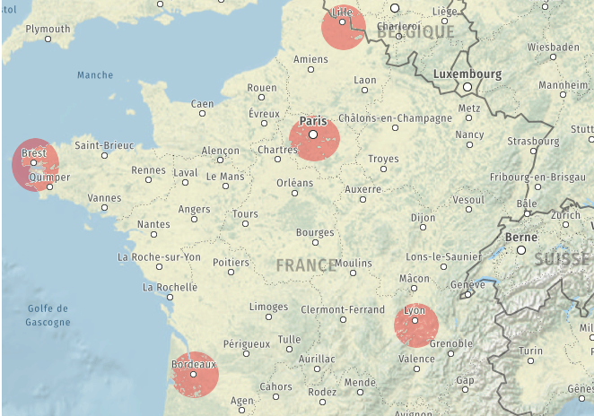
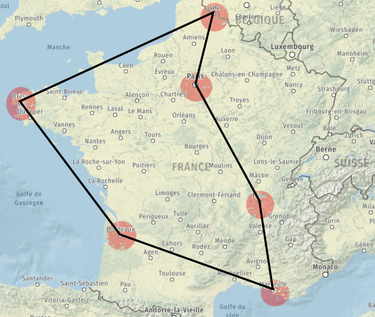

<style>
    :root {
    --color-background: #91A3B0 !important;
	--color-foreground: black !important;
    --color-background-paginate : rgba(128,128,128,0.05);
    --color-highlight-hover :  #FAF0E6 ;
    font-size: 1.75rem;
    border:10px;
    padding: 40px;
    }
h1 {
  /* background-color: rgb(161, 161, 172);
  color:white;*/
  font-family: @@font_name@@;
  font-size: 3rem;
  text-align:center;
}
h2 {
  background-color: rgb(70, 70, 77);
  color:white;
  font-family: @@font_name@@;
  font-size: 2.25rem;
}
h3 {
    color: brown;
    font-size: 1.75rem;
}

code 
{
  background: #778899;
  color:white;
}
blockquote {
  background: #ffedcc;
  border-left: 15px solid #d1bf9d;
  margin: 1.5em 15px;
  padding: 0.5em 15px;
}
blockquote:before{
  content: unset;
}
blockquote:after{
  content: unset;
}

img[alt~="center"]{
  display: block;
  margin: 0 auto;
}
</style>

<!-- footer: Contenu sous Licence Creative Commons BY-SA-->
<!-- backgroundColor: #F2F3F4 -->

# Les algorithmes gloutons


---

## Problème d’optimisation : Le voyageur
    
### Enoncé du problème

> Imaginons le problème suivant : 
vous devez organiser la tournée de votre commercial. Il doit passer dans toutes les villes sous sa responsabilité (une fois uniquement) et revenir à son point de départ (Lille pour notre exemple). 
Pour limiter les frais, il faut définir le trajet le moins long au total.

Nous allons nous limiter à 5 villes uniquement ici.

---



---

Voici le tableau des distances :

| | **Brest** | **Bordeaux** | **Lille** | **Lyon** | **Paris** |
|:-----------:|:------------:|:------------: | :------------:| :------------:| :------------: |
| **Brest** | - | 598 | 708 | 872 | 572 |
| **Bordeaux** | 598 | - | 802 | 520 | 554 |
| **Lille** | 708 | 802 | - | 650 | 225 |
| **Lyon** | 872 | 520 | 650 | - | 465 |
| **Paris** | 572 | 554 | 225 | 465 | - |


> **Question 1 :**  
    Partons de Lille. 
    - Combien de destinations différentes peut-on choisir ?  
    - Combien de "chemin" possible ?

---

Le problème se ramène à trouver un ordre de visite des quatre villes pour lequel la somme des distance données par ce tableau est aussi petite que possible.    
Une manière simple d'aborder le problème consiste à énumérer tous les cas possibles et calculer la distance  correspondante pour chacun des cas.  

---
### Résolution du problème par la force brute

> **Question 2 : Résolution par force brute**
    Traiter le problème en faisant tous les cas de figure, à résumer dans un tableau et donner l'itinéraire le plus court
    
Afficher tous les chemin avec la distance totale  

1.  Lille  -> ...   -> ...-> ...-> ...-> Lille     avec une distance totale de  ... km   
2.  Lille -> ...   -> ...-> ...-> ...-> Lille     avec une distance totale de  ... km  
3.  Lille -> ...   -> ...-> ...-> ...-> Lille     avec une distance totale de  ... km  
4.  Lille -> ...   -> ...-> ...-> ...-> Lille     avec une distance totale de  ... km  
5.  Lille -> ...   -> ...-> ...-> ...-> Lille     avec une distance totale de  ... km  
6.  Lille -> ...   -> ...-> ...-> ...-> Lille     avec une distance totale de  ... km  
7.  Lille -> ...   -> ...-> ...-> ...-> Lille     avec une distance totale de  ... km  
8.  Lille -> ...   -> ...-> ...-> ...-> Lille     avec une distance totale de  ... km  
9.  Lille -> ...   -> ...-> ...-> ...-> Lille     avec une distance totale de  ... km  
10.  Lille -> ...   -> ...-> ...-> ...-> Lille     avec une distance totale de  ... km  
11.  Lille -> ...   -> ...-> ...-> ...-> Lille     avec une distance totale de  ... km  
12.  Lille -> ...   -> ...-> ...-> ...-> Lille     avec une distance totale de  ... km  

---

*Remarque*  
Les douze itinéraires correspondent chacun à l'un des douze itinéraire emprunté dans le sens inverse.

> **Question 3 :**
    Répondre au problème : quel est le trajet optimal. ?

---
### Limite de cette méthode 

> **Question 4 :**
    Reprenons le même problème en rajoutant Marseille.


---
> **Question 5 :**
    Dans ce cas, avec 6 villes, combien de cas faut-il étudier ? Qu'en pensez-vous ?

---
**Réponse au problème :**
> Le plus petit trajet sera réalisé avec le parcours suivant (dans un sens ou dans l'autre) :  
Lille -> Paris -> Lyon -> Marseille -> Bordeaux -> Brest -> Lille en 3 000 km




---

Cette technique (répertorier tous les cas de figure et faire une étude exhaustive) n'est pas possible à grande échelle.  
Déterminer le nombre d'itinéraires possibles :

* 4 villes (hors ville de départ) on a : ... itinéraires possibles.  
* 10 villes (hors ville de départ), nombre d'itinéraires à tester : .......  
* 13 villes (hors ville de départ), nombre d'itinéraires à tester : .....  
* 20 villes (hors ville de départ), nombre de parcours à tester :  .....   

---

> Correction
    - 4 villes (hors ville de départ) on a : $\dfrac{4 \times 3 \times 2 \times 1}{2}= 12$ itinéraires possibles. 
    - 10 villes (hors ville de départ), nombre d'itinéraires à tester : $\dfrac{10 \times 9 \times 8 \times 7 \cdots \times 2 \times, 1}{2}=$ 1 714 400
    - 13 villes (hors ville de départ), nombre d'itinéraires à tester : $\dfrac{13 \times 12 \cdots \times 2 \times, 1}{2}=$ 3 113 510 400
    - 20 villes (hors ville de départ), nombre de parcours à tester :  $\dfrac{20 \times 19 \times 18 \times 17 \cdots \times 2 \times, 1}{2}=$ 1 216 451 004 088 320 000  

---

> Face à de tels problèmes d'optimisation impossible à explorer exhaustivement, il peut être utile de connaître des algorithmes donnant rapidement une réponse qui, sans être nécessairement optimale, resterait bonne.

**La méthode gloutonne** que l'on va abordée dans ce TP donne une approche simple pour concevoir de tels algorithmes souvent approximatifs mais rapides.

---

## Algorithmes Gloutons

Nous avons vu que la force brute ne permet pas de résoudre (en un temps raisonnable) le problème du voyageur de commerce lorsqu'on augmente le nombre de villes.

Maintenant que vous avez manipulé ce problème et vu à quel point il est complexe à résoudre, nous allons voir comment faire autrement.

> **_Remarque_** : **greedy algorithms** en anglais, l'adjectif "greedy" signifiant avare/glouton.

Les **_algorithmes gloutons_** sont utilisés pour répondre à des **_problèmes d'optimisation_**, c'est-à-dire des problèmes algorithmiques dans lesquels l'objectif est de trouver une solution " la meilleure possible " selon un critère, parmi un ensemble de solutions également valides mais potentiellement moins avantageuses.  

---
Le contexte général d'un tel problème d'optimisation est donc le suivant :  

* on considère  un problème possédant un très grand nombre de solutions  
* on dispose d'une fonction mathématique évaluant la qualité de chaque solution  
* on cherche une solution qui soit bonne, voire meilleure.  

Les algorithmes gloutons s'appliquent lorsque de plus :  

* la recherche d'une solution peut se ramener à une succession de choix qui produisent et précisent petit à petit une solution partielle  
* on dispose d'une fonction mathématique évaluant la qualité de chaque solution partielle (dont on attend qu'elle soit cohérente avec la fonction d'évaluation des solutions complètes).  

---

 
>  Le **_principe d'un algorithme glouton_** est le suivant :  
    - résoudre un problème étape par étape  
    - à chaque étape, faire le choix optimal de moindre coût (de meilleur gain)  

Le choix effectué à chaque étape n'est jamais remis en cause, ce qui fait que cette stratégie permet d'aboutir rapidement à une solution au problème de départ. C'est en ce sens que l'adjectif greedy (glouton/avare) caractérise ces algorithmes : ils terminent rapidement (glouton) sans fournir beaucoup d'efforts (avare).

---
## Résolution approchée du problème du voyageur

### Appliquons la méthode gloutonne à notre problème de voyageur
Le problème peut se résumer à « quelle sera ma prochaine étape ».


**Méthode gloutonne :**  
partant de la ville de départ, aller à la ville la plus proche, puis la ville la plus proche non visitée etc...

---
> **Question 6 :**
    Mettez en oeuvre cette méthode en partant de Lille.

**_Réponse_** :  
Notre voyage fera donc **.........** kilomètres.  
L’itinéraire ainsi obtenu est plus long que le circuit minimal de **........** kilomètres vu en introduction, mais reste loin des assez nombreuses mauvaises solutions. Et surtout, nous n’avons analysé qu’un unique itinéraire !


### Mise en oeuvre : Python - [Capytale](https://capytale2.ac-paris.fr/web/c/1352-489284)

---
**Principe du Programme :** 

+ Les villes sont individuellement sous forme de dictionnaires avec les autres villes en clé et les distances correspondantes en durees. Un autre dictionnaire est créé pour regrouper l’ensemble des villes :


```python
''' Nous créons un dictionnaire les_villes qui va contenir des dictionnaires pour stocker les
distances entre villes '''

brest = {'Bordeaux':598, 'Lille':708, 'Lyon':872, 'Marseille':1130, 'Paris':572}
bordeaux = {'Brest':598, 'Lille':802, 'Lyon':520, 'Marseille':637, 'Paris':554}
lille = {'Brest':708, 'Bordeaux':802, 'Lyon':650, 'Marseille':1002, 'Paris':225}
lyon = {'Brest':872, 'Bordeaux':520, 'Lille':650, 'Marseille':367, 'Paris':465}
marseille = {'Brest':1130, 'Bordeaux':637, 'Lille':1002, 'Lyon':367, 'Paris':777}
paris = {'Brest':572, 'Bordeaux':554, 'Lille':225, 'Lyon':465, 'Marseille':777}
les_villes = {'Brest':brest, 'Bordeaux':bordeaux, 'Lille':lille, 'Lyon':lyon, 'Marseille':marseille, 'Paris':paris}

```

---
* Une fonction `plus_proche_voisin(ville,les_villes_voisines,Non_Visitees)`, qui renvoie le nom de la ville non encore visitée la plus proche ainsi que la distance correspondante.


```python
def plus_proche_voisin(ville,les_villes_voisines,Non_Visitees):
       pass

ville='Lille'
print(plus_proche_voisin(ville,les_villes[ville],les_villes.keys()))

```

---
* Une fonction principal `trajet` qui prend en paramètre la ville de départ,le dictionnaire des villes à visiter.


```python
def trajet(depart,avisitees):
    Nvisitees=....  #on crée un tableau avec les villes à visiter
    taille=len(avisitees)             
    ville=depart                                  
    parcours=[depart]  # le parcours débute par la ville choisie
    distance=0         # au départ la distance aprcourue est 0 
    for i in range(.....):
        ...........   #on enleve la ville déja visitée de la liste
        
        ville,dist=plus_proche_voisin(ville,avisitees[ville],Nvisitees) #on appelle la fonction plus proche voisin
        
        distance....    #la distance parcourue augment de la distance entre les deux villes
        
        parcours.append(ville)  # On ajoute la ville ainsi visitée dans le tableau parcours
        
        print(f"ville suivante {ville} avec une distance de {dist} km soit une distance totale {distance} km")
    
    ..... #la boucle est finie, on rajoute la ville de départ qui devient la ville de fin pour terminer la boucle.
    
    distance+=les_villes[ville][depart]  #on ajoute la dernière distance à parcourir pour retourner à la ville de départ
    
    print(f"ville suivante {ville} avec une distance de {dist} km soit une distance totale {distance} km")
    
    return parcours,distance
    
print(trajet('Lyon',les_villes))

```

---
Tester ce code avec d'autres villes de départ.

### Qualité de l’approximation  

* La solution donnée par l’algorithme glouton n’est pas nécessairement optimale. Peut-on néanmoins s’attendre à un certain niveau de qualité ?
* Si oui, ce niveau de qualité attendu est-il garanti, c’est-à-dire respecte même dans le pire des scénarios ?
* Ou bien est-il seulement hautement probable, c’est-à-dire généralement respecté mais avec des exceptions ?

Les réponses à ces questions dépendent fortement du problème considéré.  
Pour notre problème du voyageur, ii a été démontré que lorsque le nombre de villes devient grand, le rapport entre la. solution gloutonne et la solution optimale est dans le pire des cas proportionnel **au logarithme du nombre de villes**.


[Voir une simulation](http://lycee.stanislas.info.free.fr/Algorithme/Glouton/Glouton.html)

---
### Version force brute (programme à titre indicatif)

```python
# Cette variable va contenir la plus petite distance trouvée par comparaison.
# Initialement j'y place donc une très grande valeur.
meilleur = 1E999

# Nous créons un dictionnaire les_villes qui va contenir des dictionnaires pour stocker les distances entre villes
brest = {'Bordeaux':598, 'Lille':708, 'Lyon':872, 'Marseille':1130, 'Paris':572}
bordeaux = {'Brest':598, 'Lille':802, 'Lyon':520, 'Marseille':637, 'Paris':572}
lille = {'Brest':708, 'Bordeaux':802, 'Lyon':650, 'Marseille':1002, 'Paris':225}
lyon = {'Brest':872, 'Bordeaux':520, 'Lille':650, 'Marseille':367, 'Paris':465}
marseille = {'Brest':1130, 'Bordeaux':637, 'Lille':1002, 'Lyon':367, 'Paris':777}
paris = {'Brest':572, 'Bordeaux':554, 'Lille':225, 'Lyon':465, 'Marseille':777}

les_villes = {'Brest':brest, 'Bordeaux':bordeaux, 'Lille':lille, 'Lyon':lyon, 'Marseille':marseille, 'Paris':paris}

# Nous créons un premier tableau qui va contenir les noms des villes
villes1 = [ville for ville in les_villes.keys()]
ville1 = villes1[0] # on choisit 'Brest' comme "point de départ" du chemin fermé

# On crée le second tableau contenant toutes les villes, sauf Brest.
villes2 = villes1.copy() # On copie le tableau précédent
villes2.remove(ville1) # on enlève le premier choix ('Brest')

for ville2 in villes2 :

    villes3 = villes2.copy() # On copie le tableau précédent
    villes3.remove(ville2) # On enlève le choix qui vient d'être fait

    for ville3 in villes3 :

        villes4 = villes3.copy() # On copie le tableau précédent
        villes4.remove(ville3) # on enlève le choix de ville qui vient d'être fait

        for ville4 in villes4 :

            villes5 = villes4.copy()
            villes5.remove(ville4)

            for ville5 in villes5 :

                villes6 = villes5.copy()
                villes6.remove(ville5)
                ville6 = villes6[0]

                distance = les_villes[ville1][ville2] # distance entre ville 1 et 2
                distance = distance + les_villes[ville2][ville3] # + distance entre ville 2 et 3
                distance = distance + les_villes[ville3][ville4]
                distance = distance + les_villes[ville4][ville5]
                distance = distance + les_villes[ville5][ville6]
                distance = distance + les_villes[ville6][ville1] # + distance pour repartir au départ
                if distance < meilleur : # Si ce choix de villes est meilleur en terme de distance
                    meilleur = distance # On remplace meilleur par cette valeur
                    itineraire = f"{ville1}-{ville2}-{ville3}-{ville4}-{ville5}-{ville6}" # On crée un string contenant l'itinéraire qu'on vient de séléctionner pour le moment

# On affiche le résultat
print(f"{itineraire} en {meilleur} km")
```

---
## Problème : Rendu de monnaie

Nous allons étudier un problème d'optimisation classique : le problème du rendu de monnaie de manière optimale. On cherche à rendre la monnaie avec un nombre minimal de pièces et billets.

Voici notre système de monnaie (exprimé en euros) :  

* Pièces : 0,01 ; 0,02 ; 0,05 ; 0,1 ; 0,2 ; 1 ; 2  
* Billets : 5 ; 10 ; 20 ; 50 ; 100 ; 200; 500  

On cherche par exemple à rendre 53 euros.  
On peut dans un tableau énumérer quelques solutions possibles et choisir celle qui minimise le nombre de pièces et de billets.

---

| **Rendus de monnaie**| **Nombre de pièces et de billets**|  
| :----------: |:----------:|  
|5 300 $\times$ 0.01 | 5 300| 
|53 $\times$ 1 | 53| 
|5 $\times$ 10 + 1 $\times$ 2 + 1 $\times$ 1| 7| 
|2 $\times$ 20 + 3 $\times$ 5 + 1 $\times$ 2 | 6| 
|1 $\times$ 50 + 1 $\times$ 2 + 1 $\times$ 1 |3| 


L'utilisation de **ce type de méthode** est **très coûteux en temps de calcul** car il faut explorer toutes les possibilités.

---

## L'algorithme glouton


On procède étape par étape en faisant, à chaque étape, le meilleur choix possible. On ne remet jamais en cause les choix faits aux étapes passées. Dans notre cas nous allons rendre la monnaie en commençant par la pièce ou le billet avec la plus grande duree possible (en restant inférieur à la somme à rendre).  
 Cela correspond à notre dernière ligne de tableau ($1 \times 50 + 1 \times 1 + 1 \times 2$€).   
On recommence ainsi jusqu'à obtenir une duree nulle.   
On note :  

- systeme : liste des pièces et des billets  
- somme : montant à obtenir  
- somme_restante : montant qui reste à rendre  
- monnaie : liste qui contient les durees rendues  

---

```
1. initialiser monnaie à une liste vide  
2. initialiser la somme_restante à somme  
3. tant que somme_restante > 0 :  
    * On choisit la plus grande duree dans systeme inférieure à somme_restante  
    * on ajoute cette duree à monnaie  
    * on ajoute cette duree à somme_restante  
4. renvoyer monnaie  
```

Reprenons notre exemple avec `somme= 53` et `systeme= [0.01,0.02,0.05,0.1,0.2,1,2,5,10,20,50]`.

Voici la liste des étapes :

| **Initialisation**| **monnaie=[ ]**|  **somme_restante=53** |
| :----------: |:----------:| :----------:|  
|étape 1 | monnaie=$[50]$|somme_restante=3 | 
|étape 2 | monnaie=$[50,2]$| somme_restante=1 | 
|étape 3| monnaie=$[50,2,1]$| somme_restante=0 | 


---

Notre solution dépend du nombre de pièces et de billets disponibles. Si nous sommes limités sur certaines pièces et/ou certains billets, les résultats seront différents.


> **Exercice 1 :**
    Traiter l'exercice précédent avec pour système S = $[1,2,5,50,100]$ et pour somme : 127 €.

---
## Solution et solution optimale

Pourquoi notre système monétaire ne possède pas de pièces ou de billets de 7 € ?

Si notre système possédait un billet ou une pièce de 7 €, l'algorithme glouton ne serait plus optimal.  
Prenons un montant de 14 €. L'algorithme glouton donne le rendu suivant 14=10+2+2 alors que le rendu optimal est 14=7×2.  

Il existe des conditions sur le système pour que l'algorithme glouton soit optimal. Si le sujet vous intéresse, vous pouvez faire des recherches.

---
## Une solution optimale locale  

Un algorithme glouton permet de trouver solution optimale locale mais pas toujours une solution optimale globale.

Reprenons notre exemple de rendu monnaie avec : S = $[1,2,20,50,100]$ et somme= 63.  
L'algorithme glouton donne comme résultat : monnaie=$[50,2,2,2,2,2,2,1]$  

La solution optimale globale est pourtant : monnaie =  $[20,20,20,2,1]$    
Prenons maintenant l'exemple suivant : S=$[2,5,10,20,50,100]$ et somme=21.   
L'algorithme glouton ne va pas trouver de solution, alors qu'il existe au moins une solution locale : monnaie= $[5,5,5,2,2,2]$

---
> **Exercice 2 :**  
    1. Chercher une autre solution optimale locale meilleure que la précédente.  
    2. Faire une trace d'exécution de ces exemples.  


> **Remarque :** Dans le système de pièces Européen, l'algorithme glouton donne toujours une solution optimale.

---
## Implémentation de l'algorithme glouton [Capytale](https://capytale2.ac-paris.fr/web/c/1352-489284)

> **Exercice 3 :**
    Programmer cet algorithme en langage python. Programmer une fonction rendu_monnaie_glouton(systeme,somme) qui possède comme paramètres  
    - un système de pièces et de billets sous forme de liste de nombres ;  
    - une somme à rendre   
    Cette fonction renvoie une liste de nombres qui caractérise la monnaie à rendre. Vous pouvez prendre comme jeu de test l'exemple de présentation.  
    Il faudra penser à gérer le fait que l'algorithme ne trouve pas de solution dans certains cas.
    Quelques aides :  
    - penser à trier par ordre décroissant la liste des pièces et billets.  
    - penser à gérer l'absence de solution globale.

---
### Version 1 : avec uniquement des entiers - Epreuve pratique de BAC.

La fonction `rendu_monnaie_centimes` prend en paramètres deux nombres entiers
positifs `s_due` et` s_versee` et elle permet de procéder au rendu de monnaie de la
différence `s_versee – s_due` pour des achats effectués avec le système de pièces de
la zone Euro. On utilise pour cela un algorithme qui commence par rendre le maximum de
pièces de plus grandes valeurs et ainsi de suite. La fonction renvoie la liste des pièces qui
composent le rendu.

Toutes les sommes sont exprimées en centimes d’euros. Les valeurs possibles pour les
pièces sont donc `[1, 2, 5, 10, 20, 50, 100, 200]`.

Ainsi, l’instruction `rendu_monnaie_centimes(452, 500)`
renverra
`[20, 20, 5, 2, 1]`.

En effet, la somme à rendre est de `48` centimes soit `20 + 20 + 5 + 2 + 1`.

---
Le code de la fonction est donné ci-dessous :

```python linenums='1'
def rendu_monnaie_centimes(s_due, s_versee):
    pieces = [1, 2, 5, 10, 20, 50, 100, 200]
    rendu = ...
    a_rendre = ...
    i = len(pieces) - 1
    while a_rendre > ... :
        if pieces[i] <= a_rendre :
            rendu.append(...)
            a_rendre = ...
        else :
            i = ...
    return rendu
```

Compléter ce code pour qu'il donne :
```python
>>> rendu_monnaie_centimes(700,700)
[]
>>> rendu_monnaie_centimes(112,500)
[200, 100, 50, 20, 10, 5, 2, 1]
```

---
### Version 2 : Avec les centimes

```python
euros = [100, 50, 20, 10, 5, 2, 1, 0.50, 0.20, 0.10, 0.05, 0.02,0.01]


def rendu_monnaie_glouton(s, pieces):
    """Renvoie la solution gloutonne du rendu de monnaie d'une somme s entière et positive.
    Le tableau pieces contient les valeurs des pièces à disposition dans l'ordre décroissant."""
    solution = []
    i = 0 # position de la première pièce à tester (la plus grande)
    while ... and ...: # tant qu'il reste de l'argent à rendre et que toutes les pièces n'ont pas été testées
        valeur = ... # on prend la pièce d'indice i
        if valeur <= ...: # s'il est possible de rendre la pièce
            solution.append(...) # on l'ajoute à solution
            s = ... # et on déduit sa valeur de la somme à rendre
        else:
            i = i + 1 # sinon on passe à la pièce immédiatement inférieure
    if s>0 and s <=0.01:
        solution.append(pieces[len(pieces)-1])
    return solution

    
print(rendu_monnaie_glouton(147.35, euros))
```

---
## Le problème du sac à dos _(Knapsack Problem)_


### Problème :  

> Le problème est celui-ci : vous disposez d'un sac d'une contenance limitée (sur le dessin ci-dessus, 15kg) et vous souhaitez maximiser la duree totale des  objets que vous mettez dans votre sac. Evidemment, la somme de leur masse ne doit pas dépasser 15 kg.

---
Ce problème (de la catégorie des problème dits d'_analyse combinatoire_) malgré sa simplicité est **un problème majeur** d'optimisation. 

Actuellement :

*   On sait trouver LA meilleure solution, mais en explorant toutes les combinaisons une par une. Cette méthode par **force brute** est inapplicable si beaucoup d'objets sont en jeu.  
*   On sait facilement trouver une _bonne_ solution, mais pas forcément la meilleure, par exemple en adoptant une stratégie gloutonne.  
* On ne sait pas trouver facilement (en temps polynomial) la meilleure solution. Si vous y arrivez, [1 Million de $](https://www.claymath.org/millennium-problems/p-vs-np-problem){.target="_blank"} sont pour vous.  

---

### Retour sur le problème du sac à dos

On considère un sac de 40 kg et les objets suivants :

| objet  |  A  |  B  |  C  |  D  |  E  |  F  |
|:------:|:---:|:---:|:---:|:---:|:---:|:---:|
|  masse |  13 |  12 |  8  |  10 |  14 |  18 |
| valeur | 700 | 500 | 200 | 300 | 600 | 800 |

Quels objets faut-il prendre ?

- Stratégie 1 : prendre toujours l'objet de plus grande valeur n'excédant pas la capacité restante (il faut trier préalablement par valeur décroissante)
- Stratégie 2 : prendre toujours l'objet de plus faible masse (il faut trier préalablement par masse croissante)
 - Stratégie 3 : prendre toujours l'objet de plus grand rapport $\frac{valeur}{masse}$ n'excédant pas la capacité restante (il faut trier préalablement par rapport $\frac{valeur}{masse}$ décroissant)

---
**Stratégie gloutonne : avec la stratégie 3**

- on va classer les objets dans l'ordre décroissant de leur taux de valeur (taux de valeur = valeur / masse). Ainsi le premier élément de la liste sera celui ayant le meilleur rapport valeur/masse.  
- on prend le premier élément de la liste, puis le deuxième, etc., tant que le sac peut encore les contenir.  


```python
objets = [["A", 13, 700], ["B", 12, 500], ["C", 8, 200], ["D", 10, 300], ["E", 14, 600], ["F", 18, 800]]
poids_max=40
```

---
> **Question 1 :**
    Construire une fonction `ratio(objet)` qui renvoie le rapport $\dfrac{valeur}{masse}$

```python
def ratio(objet):
    # renvoie le rapport prix/poids d'un objet
    pass
```

---
> **Question 2 :**
    Trier les objets dans l'odre décroissant des rapports.

```python
objets_tries = sorted(...)
>>> objets_tries
    [['A', 13, 700],
    ['F', 18, 800],
    ['E', 14, 600],
    ['B', 12, 500],
    ['D', 10, 300],
    ['C', 8, 200]]
```

---
**Calcul de la solution, par méthode gloutonne**

> **Question 3 :**
    Compléter le programme : 
```python linenums='1'
objets  = [["A", 13, 700], ["B", 12, 500], ["C", 8, 200], ["D", 10, 300], ["E", 14, 600], ["F", 18, 800]]

objets_tries = sorted(objets, key = ratio, reverse = True)

poids_max = 40
poids_sac = 0

butin = []

for objet in objets:
    poids_objet = objet[1]
    if poids_objet + poids_sac < ... :
        butin.append(...)
        poids_sac += poids_objet

```
---

```python
>>> butin
    ['A', 'F', 'C']
```

---

Il faut donc choisir la combinaison A, F, C. Elle est bien valide (poids 39) et rapporte 1700.

**Question** (toujours la même) :  

L'algorithme glouton nous a-t-il donné la solution **optimale** ?  
Nous allons pour cela avoir recours à la force brute pour tester toutes les combinaisons possibles.

---
### Force brute 

- Il faut créer une liste de mots binaires qui vont correspondre à chaque combinaison. Par exemple, '101001' signifiera qu'on prend les objets A, C et F.
Cette liste est de taille $2^n$, où $n$ est le nombre d'objets. C'est cela qui pose problème : avec 80 objets, on obtient une liste à traiter qui contient plus de $10^{24}$ objets, soit de l'ordre de grandeur du nombre d'étoiles dans l'Univers observable, ou de gouttes d'eau dans la mer, ou du nombre de grains de sables au Sahara... (voir [https://fr.wikipedia.org/wiki/Ordres_de_grandeur_de_nombres](https://fr.wikipedia.org/wiki/Ordres_de_grandeur_de_nombres) )  
- Une fois cette liste établie, il suffit de parcourir chaque élément et de calculer le poids total et la duree totale correspondante. Si le poids total dépasse le poids autorisé, on met la duree à 0 car cette combinaison ne nous intéresse pas.  
- Il ne reste qu'à chercher la duree maximale et regarder la combinaison à laquelle elle correspond.  

---

```python
objets  = [["A", 13, 700], ["B", 12, 500], ["C", 8, 200], ["D", 10, 300], ["E", 14, 600], ["F", 18, 800]]
poids_max = 40
```

#### La liste de tous les mots possibles

```python
combinaisons = []
for i in range(2**len(objets)):
    k = bin(i)[2:]
    s = '0'*(len(objets)-len(k)) + k
    combinaisons.append(s)
```

La liste `combinaisons` contient bien les 64 mots possibles ($2^6=64$) :


```python
>>> combinaisons
    ['000000',
     '000001',
     '000010',
     ...etc

```

---
```python linenums='1'
durees = [] 
poids = []
for comb in combinaisons :
    poids_comb = 0
    duree = 0
    for i in range(len(objets)): 
        if comb[i] == '1':
            poids_comb += objets[i][1]
            duree += objets[i][2]
    if poids_comb > poids_max :
        duree = 0
    durees.append(duree)
    poids.append(poids_comb)

duree_max = max(durees)
meilleure_comb = combinaisons[durees.index(duree_max)]
poids_comb = poids[durees.index(duree_max)]

mot_sol = ""
for k in range(len(meilleure_comb)) :
    if meilleure_comb[k] == '1' :
        mot_sol += objets[k][0]
    
```
---
```python
>>> mot_sol
  'ABE'
```

re-Damned ! La force brute a mis en évidence une combinaison **meilleure que celle donnée par l'algorithme glouton**. 

En effet la combinaison A-B-E est bien valide (poids total 39) et rapporte 1800, donc 100 de mieux que la solution gloutonne.

Par contre, la force brute est inenvisageable pour si le nombre d'objets est grand, alors que la stratégie gloutonne reste très rapide.

---
## Conclusion 

La stratégie gloutonne donne très rapidement des solutions **satisfaisantes** mais **pas forcément optimales**. Pour beaucoup de problèmes (dont le problème du sac à dos), la recherche d'une solution optimale sans passer par la force brute semble impossible (mais n'est pas démontrée).  
Dans ce cas-là, la stratégie gloutonne peut être employée pour avoir vite et bien une solution convenable, même si peut-être non optimale. On dit que la stratégie gloutonne est une **heuristique** de résolution. On sait que ce n'est pas forcément optimal, mais faute de mieux, on s'en contente...


---
