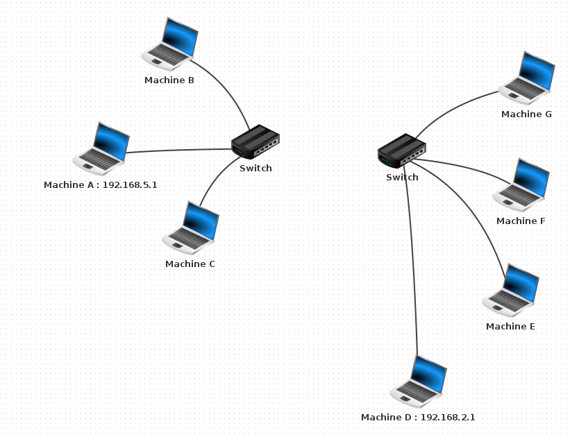
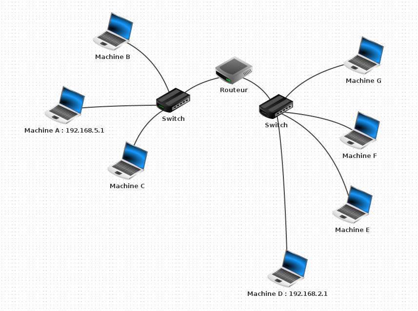
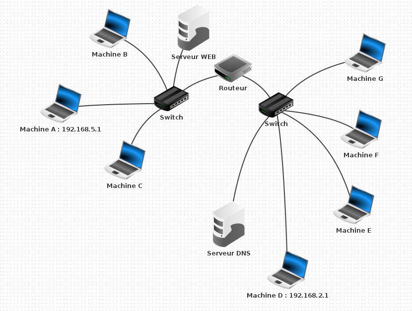

<table  style="background-color: #CD7F32; width:100%;">
    <thead>
        <tr>
            <th style="text-align:center;border:solid;border-width:1px;font-size:16pt;width:70%;">Devoir Surveillé : Construction et paramétrage d'un réseau</th>
            <th style="text-align:center;border:solid;border-width:1px;font-size:12pt;width:30%">Thème 3 : Architecture matérielle</th>
        </tr>
                    <tr>
            <th style="text-align:center;border:solid;border-width:1px;font-size:16pt;width:70%;"></th>
            <th style="text-align:center;border:solid;border-width:1px;font-size:12pt;width:30%">DEVOIR</th>
        </tr>
    </thead>
</table>

# Premier réseau local

!!! fabquestion "Question 1" 
    Créer le réseau local ci-dessous : 

{:.center width=250px}

!!! fabquestion "Question 2" 
    Paramétrer les marchine B et C pour qu'elles apartiennent au même réseau que la machine A sachant que son adresse IP est `192.168.5.1` et son masque de sous réseau est 255.255.255.0

!!! fabquestion "Question 3" 
    Vérifier que vos 3 machines communiquent bien.  
   

# Un deuxième sous-réseau 

!!! fabquestion "Question 4"
    Rajouter un deuxième sous-réseau de la manière suivante (penser à bien renommer les switchs) comme ci-dessous :

{:.center width=500px}

!!! fabquestion "Question 5"
    Paramétrer toutes les machines présentes sur ce sous-réseau sachant que la machine D a pour adresse IP `192.168.2.1` et pour masque de sous-réseau 255.255.255.0  
    Vérifier que les machines communiquent entre-elles

On rajoute un routeur R1 comme ci-dessous : 

{:.center width=500px}

!!! fabquestion "Question 6"
    Paramétrer le routeur R1 correctement afin de créer une passerelle entre les deux sous-réseaux. Dans l'onglet général, sélectionner « Routage automatique ».  
    
!!! fabquestion "Question 7"
    Tester que vos divers machines communiquent bien entre elles et entre les sous-réseaux..

# Rajout d'un serveur WEB et d'un serveur DNS

On rajoute un serveur web et un serveur DNS comme ci-dessous : 

{:.center width=500px}

!!! fabquestion "Question 8"
    
    - Connecter un ordinateur au Switch A   
    - Paramétrer ce serveur  
    - Installer dessus un Serveur web et démarrer-le.   
    - Tester votre paramétrage


!!! fabquestion "Question 9"
    
    - Rajouter un serveur DNS minimal, qui n'aura dans son annuaire un seul site. Il faut pour cela raccorder une nouvelle machine, et installer dessus un serveur DNS.  
    - Parametrer ce serveur  
    - Sur ce serveur DNS, associons l'adresse ```http://www.vivelansi.fr```  à l'adresse IP du serveur web.  
 
# Questions de cours

!!! fabquestion "Question 10"
    Ecrire sur votre copie la commande permettant de tester si deux machine sont sur le même réseau et communique entre elles.

!!! fabquestion "Question 11"
    Donner la différence entre un hub et un switch

!!! fabquestion "Question 12"

    On considére trois machines A, B, C d'IP respectives ```192.168.129.10```, ```192.168.135.200``` et ```192.168.145.1```, configurées avec un masque de sous-réseau égal à ```255.255.248.0```.  

    |                        | machine A      | machine B       | machine C     |
    |------------------------|----------------|-----------------|---------------|
    | IP                     | 192.168.129.10 | 192.168.145.1 | 192.168.135.200 |
    | M                      | 255.255.248.0  |  255.255.248.0  | 255.255.248.0 |
    | Adresse réseau :IP & M |                |                 |               |

    Déterminer quelles machines sont sur le même réseau.


