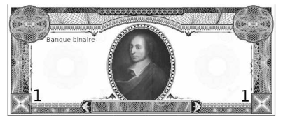
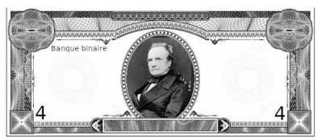
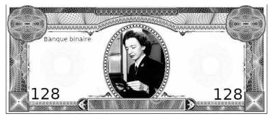

---
title : Codage des entiers positifs en base b
subtitle: Thème 1 - Représentation de données - Types et valeurs de bases
author : Première NSI
numbersections: true
fontsize: 10pt
geometry:
- top=20mm
- left=20mm
- right=20mm
- heightrounded    
--- 

Thème 1 - Représentation des données - Types et valeurs de bases
===

<table  class="greenTable">
        <tr >
            <th width="20%"; style="background-color: #3B444B;color:white;text-align:center;border:none;font-size:40pt;">
            05
            </th>
            <th  width="80%"; style="text-align:center;border:none;font-size:25pt;">Ecriture d'un entier positif dans une base b</th>
        </tr>
</table>
<br>

{{ initexo(0) }}

!!! progNSI "Programme 1ère"
    |Contenus|Capacités attendues|Commentaires|
    |:---:|:---:|:---:|
    |Ecriture d'un entier positif dans une base $b \geq 2$| Passer de la représentation d'une base à l'autre|Les bases 2, 10 et 16 sont privilégiées|

## Activité : Compter avec des 0 et des 1

C'est décidé : nous allons changer de monnaie ! Fini les euros nous comptons désormais en Bin dont le symbole est $\mathbb(B)$. De tous nouveaux billets de banque ont été émis, vous en voyez la liste i-dessous :

{width=35%}{width=35%}  

{width=35%}{width=35%}  

{width=35%}{width=35%}  

{width=35%}{width=35%}


!!! exo "{{ exercice() }}"
        On suppose qu'on ne dispose que d'un seul exemplaire de chaque billet.  

        1. Peut-on réunir exactement le somme de 73 B ? Comment ?  
        2. Même question pour 155 B.  
        3. Même question pour 218 B.  

!!! exo "{{ exercice() }}"
        Pour simpliflier l'écriture d'une somme contenant au maximum un seul de ces billets, on propose d'utiliser le tableau suivant.  
        Dans la colonne du billet on indique 1 si le billet est utilisé et 0 sinon.  
        Recopier et compléter le tableau ci-dessous.  

|  | 1B       | 2B    | 4B | 8B   | 16B   | 32B | 64B   | 128B |
|:---:|:---:|:---:|:---:|:---:|:---:|:---:|:---:|:---:|
|148| | | | | | | | |
|42| | | | | | | | |
|237| | | | | | | | |
|219| | | | | | | | |
|   | 0| 0| 0| 0| 0| 1| 1| 1|
|   | 1| 0| 1| 0| 0| 1| 0| 0|
|   | 0| 1| 1| 1| 0| 0| 0| 1|
|   | 1| 0| 1| 1| 0| 1| 0| 0|


!!! exo "{{ exercice() }}"  
    1. Quelle somme maximale peut-on réunir en utilisant au maximum un seul de Ces billets ?  
    2. Peut-on réunir n'importe quelle somme (jusqu'à la somme maximale) ? Expliquer.  
    3. Les valeurs de Ces billets n'ont pas été Choisies au hasard, à votre avis quel doit être le montant du billet suivant ? Pourquoi ?  
    4. Dans le tableau Ci-dessus, que peut-on dire des nombres pour lesquels le billet 1 $\mathbb(B)$ n'est pas utilisé ?  
    5. Proposer une méthode pour trouver les billets à utiliser pour une somme donnée.


## Écriture d'un entier dans une base

> Le monde se divise en 2 catégories : ceux qui comprennent le binaire et ceux qui ne le comprennent pas.

### Le système décimal

Depuis la préhistoire, l'Homme a besoin de compter. Sa première idée:

{: .center width=50%} 

Pas très pratique... Heureusement, il en eut rapidemennt une autre, beaucoup plus efficace: regrouper les bâtons en paquets.

{: .center width=50%} 


Des paquets de 5 et surtout de 10. Pourquoi 10 ? 

Pour écrire les nombres, regroupés en paquets de 10, il a donc fallu inventer 10 chiffres pour compter les unités (en-dessous du paquet): 0, 1, 2, 3, 4, 5, 6, 7, 8, 9.

Et le nombre 10 ne signifie ni plus ni moins que 1 paquet et 0 unité.

Ensuite, on fait un paquet de paquets, la centaine (100, c'est à dire $10 \times 10 = 10^2$), puis un paquet de centaines, le millier (1000, c'est-à-dire $10\times 10\times10=10^3$), et ainsi de suite.

Au final, si on écrit le nombre 2022 on sait que c'est:

- **2** mille, c'est-à-dire $2\times 10^3$ ;
- **0** centaine, c'est-à-dire $0\times 10^2$ ;
- **2** dizaines, c'est-à-dire $2\times 10^1$;
- **2** unité, c'est-à-dire $2\times 10^0$.

Et bien entendu, $2022 = 2\times 10^3 + 0\times 10^2+ 2\times 10^1 +2\times 10^0$

> La position de chaque chiffre dans l'écriture du nombre correspond à la puissance de 10 par laquelle on le multiplie.


### Notion de base

!!! abstract "Écriture d'un entier en base $b$"
    - Choisir une base, c'est choisir la «taille» du paquet, et donc le nombre de chiffres dont on aura besoin: en base $b$, il y a $b$ chiffres.

    - Dans notre système décimal, la base est $b=10$.

    - La position de chaque chiffre correspond à la puissance de $b$ par laquelle on le multiplie.

    - On précisera la base (si différente de 10) en indice en fin du nombre. Par exemple, le nombre $312_5$ est écrit en base 5.

!!! note "Exemples"
        $$\begin{array}{rl}
        312_5 &= 3\times 5^2 + 1\times 5^1 + 2\times 5^0 \\
        &= 3\times 25+1\times 5+2\times 1  \\
        &= 82
        \end{array}
        $$
                
        $$\begin{array}{rl}
        25072_8 &= 2\times 8^4 + 5\times 8^3+0\times 8^2+7\times 8^1+2\times 8^0 \\
        &= 2\times 4096 + 5\times 512 + 7\times 8 + 2\times 1  \\
        &= 10810
        \end{array}
        $$

### Le système binaire (base 2)

!!! abstract "Le binaire"
    
    - Le binaire, c'est le système de comptage des ordinateurs. Pourquoi le binaire et pas le décimal comme les humains ?  
    - Un ordinateur est composé de circuits électroniques et de composants électriques, alimentés par un signal électrique : 1, il y a du courant, 0, il n'y en a pas. Le plus simple pour compter est donc d'utiliser un système en base 2 (le binaire) car on peut représenter ses deux valeurs possibles (0 et 1).  (voir vidéo suivante).
    - Le système binaire est le système de numération de base $b=2$.  
    - Il utilise donc seulement deux chiffres, 0 et 1, appelés **bits** (contraction de l'anglais binary digit).  Le nombre 10101 occupe 5 rangs. On dit qu'il s'écrit sur 5 bits
    - Un regroupement de 8 bits est appelé un **octet**.  


??? video "Vidéo"
    <p align="center">
    <iframe width="560" height="315" src="https://www.youtube.com/embed/VRdp_vaNRoY" title="YouTube video player" frameborder="0" allow="accelerometer; autoplay; clipboard-write; encrypted-media; gyroscope; picture-in-picture" allowfullscreen></iframe>
    </p>


!!! exo "{{ exercice() }}"
    === "Enoncé"
        1. Combien de valeurs peut-on coder avec 1 bit ?  
        2. Combien de valeurs peut-on coder avec 2 bits ?  
        3. Combien de valeurs peut-on coder avec 3 bits ?  
        4. Combien de valeurs peut-on coder avec n bits ?
    === "Correction"
        1. Sur 1 bit : on peut code 2 valeurs.  
        2. Sur 2 bits : on peut code 4 valeurs (soit $2^2$).  
        3. Sur 3 bits : on peut code 8 valeurs (soit $2^3$).  
        4. Sur n bits : on peut code $2^n$ valeurs.  
        


!!! info "Binaire → Décimal"
        Il est utile de connaître alors les puissances de 2 pour convertir rapidement de l'écriture binaire vers l'écriture décimale.

        {: .center width=50%} 

        Par exemple $10110101_2=128+32+16+4+1=181$.
    
!!! info "Décimal → Binaire Méthode 1"
        
        - On peut utiliser l'algorithme de soustraction: on soustrait du nombre la plus grande puissance de 2 possible, et on recommence...

        - On utilise l'algorithme de divisions: on effectue les divisions successives du nombre par 2. L'écriture en binaire est donnée par les restes lus de bas en haut.

        {: .center} 

!!! info "Décimal → Binaire Méthode 2"
        - On peut utiliser un tableau.  Par exemple pour 217  

        |$2^7$  |$2^6$  |$2^5$  |$2^4$  |$2^3$  |$2^2$  |$2^1$  |$2^0$  |
        |:---:|:---:|:---:|:---:|:---:|:---:|:---:|:---:|
        |128  |64   |32   |16   |8    |4    |2    | 1   |
        |1    |1    |0    |1    |1    |0    |0    | 1    |
        |217-128=89 |89-64=25   |25   |25-16=9   |9-8=1    |1    |1    | 1-1=0   |


!!! info "Décimal →  Base quelconque"
        Les deux algorithmes de soustraction et de divisions fonctionnent également pour la conversion du décimal vers n'importe quelle autre base.


!!! example "{{ exercice() }}"
    Écrire 96,196,119 et 168 en binaire avec cette méthode.


### Le système hexadécimal (base 16)

!!! abstract "L'hexadécimal"
    - Le système hexadécimal est le système de numération de base $b=16$.
    
    - Il utilise donc 16 chiffres : 0, 1, 2, 3, 4, 5, 6, 7, 8, 9, A, B, C, D, E, F.

    - Bien qu'il nécessite plus de chiffres, ce système donne des écritures plus courtes et particulièrement pratique du fait que 16 est une puissance de 2 : la conversion entre les systèmes binaire et hexadécimal se fait sans calcul, uniquement par regroupement de 4 bits.


!!! info "Couleurs"
    Le système hexadécimal est en particulier un mode de code informatique des couleurs.

    En effet une couleur (codage RGB) est composée de 3 valeurs correspondant aux composantes rouge, verte et bleue, et chacune de ces valeurs est un entier compris entre 0 et 255, c'est-à-dire entre 0 et FF en hexadécimal: on peut les écrire avec seulement deux chiffres.

    {align=right} 

    Par exemple, la couleur rouge ci-contre a pour composantes (178, 26, 15), ce qui donne en hexadécimal : (B2, 1A, 0F), qu'on écrit en général de façon *concaténée* B21A0F et souvent précédée d'un #.


### Exercices

#### À la main

!!! exo "{{ exercice() }}"
    === "Enoncé" 
        Convertir de la base mentionnée vers la base 10 (système décimal).

        **Attention, il y a un piège...**

        1. $131_6$  
        2. $420_5$  
        3. $1515_8$  
        4. $716_4$  
        5. $321_4$  
    === "Correction"  
        1. $131_6$ :  $1 \times 6^2 + 3 \times 6^1 + 1 =55$     
        2. $420_5$  :  $4 \times 5^2 + 2 \times 6^1 + 0 =110$  
        3. $1515_8$  :  $1 \times 8^3 + 5 \times 8^2 + 1 \times 5^1 + 5 =845$  
        4. $716_4$  :  Impossible  les chiffres ne peuvent pas dépasser 3 dans une base 4.  
        5. $321_4$  :  $3 \times 4^2 + 2 \times 4^1 + 1 =57$    

!!! exo "{{ exercice() }}"
    === "Enconcé"
        Convertir les écritures décimales vers la base mentionnée.
    
        1. 47 en base 5  
        2. 92 en base 4  
    === "Correction" 
        1. $47 =  142_5$
        2. $92= 1130_4


!!! exo "{{ exercice() }}"
    === "Enoncé"
        Convertir du binaire vers le décimal.

        1. 1010  
        2. 101110  
        3. 10001101  
        4. 11111111  
        5. 101011001  

    === "Correction"
        1. $1010_2 = 1 \times 2^3 + 0 \times 2^2 + 1 \times 2^1 + 0 =10$  
        2. $101110 _2 = 1 \times 2^5 + 0 \times 2^4 + 1 \times 2^3 + 1 \times 2^2 + 1 \times 2^1 + 0 =32+8+4+2=44$  
        3. $10001101_2 = 1 \times 2^7 + 0 \times 2^6 + 0 \times 2^5 + 0 \times 2^4 + 1 \times 2^3 + 1 \times 2^2 + 0 \times 2^1 + 1 =140$  
        4. $11111111_2 = 1 \times 2^7 + 1 \times 2^6 + 1 \times 2^5 + 1 \times 2^4 + 1 \times 2^3 + 1 \times 2^2 + 1 \times 2^1 + 1 =255$  
        5. $101011001_2 = 1 \times 2^8 + 1 \times 2^6 + 1 \times 2^4 + 1 \times 2^3 + 1 =345$  

!!! exo "{{ exercice() }}"
    === "Enoncé"
        Convertir du décimal vers le binaire.

        1. 17  
        2. 34  
        3. 68  
        4. 100  
        5. 200  

        Que remarquez-vous quand on passe de l'écriture binaire d'un nombre à celle de son double?

    === "Correction"
        1. $17=10001_2$  
        2. $34=100010_2$  
        3. $68=1000100_2$  
        4. $100=1100100_2$  
        5. $200=11001000_2$  


!!! exo "{{ exercice() }}"
    === "Enoncé"
        1. Vérifier la conversion de la couleur rouge donnée en exemple à la section précédente.

        2. Convertir les écritures hexadécimales en décimal: 99, D7, 1B8, ABC.

        3. Comment s'écrit la couleur blanche en code hexadécimal?
    === "Correction"
        1. Voir cours  
        2. $99_{16}=9 \times 16^1 + 9 = 153$  
        $D7_{16}=13 \times 16^1 + 7 = 215$  
        $1B8_{16}= 1 \times 16 ^2 + 11 \times 16^1 + 8 = 440$   
        $ABC_{16}=10 \times 16^2 + 11 \times 16^1 + 12 = 2748$  

!!! exo "{{ exercice() }}"
    === "Enoncé" 
        Convertir les écritures décimales en hexadécimal.

        1. 45  
        2. 72  
        3. 421  
    === "Correction"
        Par divisions successives par 16, on obtient :  

        1. $45 =2D_{16}$  
        2. $72=48_{16}$  
        3. $421=1A5_{16}$  

!!! exo "{{ exercice() }}"
    === "Enoncée"
        C’est en $11110010000_2$ qu’a été démontré le théorème fondamental de l’informatique. Exprimer ce nombre en base dix
    === "Correction" 
        On obtient 1936

!!! exo "{{ exercice() }}"
    === "Enoncé"
        Convertir les nombres suivants en base 10 :  
    
        1. $(1B7)_{16}$  
        2. $(ABE)_{16}$  
        3. $(A320)_{16}$  
    === "Correction"

        1. $(1B7)_{16}=1 \times 16^2 + 11 \times 16^1 + 7 = 439$  

        2. $(ABE)_{16}=10 \times 16^2 + 11 \times 16^1 + 14 = 2750$  

        3. $(A320)_{16}=10 \times 16^3 + 3 \times 16^2 + 2 \times 16^1 + 0 = 41760$  


!!! exo "{{ exercice() }}"
	=== "Conversion Binaire → Hexadécimal"
		- On regroupe les bits par paquets de 4 (quitte à ajouter des 0 pour compléter).
		- On convertit chaque paquet en chiffre hexadécimal.
		- On concatène les chiffres
		
		Par exemple, $11111100101_2 = \underbrace{0111}_{7} \underbrace{1110}_{14=\text{E}_{16}} \underbrace{0101}_{5} = 7\text{E}5_{16}$	
		
	=== "Conversion Hexadécimal  → Binaire"
		On fait la même chose dans l'autre sens.
		
	=== "Application"
		
		1. Convertir $101101_2$ puis $10011011111_2$ en base 16.
		2. Convertir $8\text{D}_{16}$ puis $1\text{CA}7_{16}$ en binaire.
	

!!! exo "{{ exercice() }}"  
    === "Conversion Binaire → Hexadécimal"
        Convertir les nombres binaires suivants en hexadécimal  

        **1.** $(01001101)_2$  
        **2.** $(100110000111)_2$  
        **3.** $(101110101100)_2$  
    
    === "Correction 1"
        En regroupant par paquet de 4 :  

        **1.** $(01001101)_2 = 0100\, 1101_2$ or  $0100_2$ correspond à 4 soit $4_{16}$ et  $1101_2$ correspond à 8+4+1=13 soit $D_{16}$  
        d'où =$(01001101)_2 = 4D_{16}$   
        **2.** $(100110000111)_2 = 1001 \, 1000\, 0111_2$ donc  $(100110000111)_2=987_{16}$  
        **3.** $(101110101100)_2 = 1011\, 1010 \,1100_2$  donc $(101110101100)_2=BAC_{16}$  

    === "Conversion Hexadécimal  → Binaire"
        Convertir en binaire les nombres suivant :  
        **1.** $(FABE51)_{16}$   
        **2.** $(59A75)_{16}$  

    === "Correction 2"
        **1.** $F_{16}=1111_2 \, A_{16}=1010_2 \, B_{16}=1011_2 \, E_{16}=1110_2 \, 5_{16}=0101_2 \, 1_{16}=0001_2$, d'où   
        $(FABE51)_{16}=111110101011111001010001_2$     
        **2.** $5_{16}=0101_2 \, 9_{16}=1001_2 \, A_{16}=1010_2 \, 7_{16}=0111_2 \, 5_{16}=0101_2$, d'où   
        $(59A75)_{16}=01011001101001110101_2$ 

#### Avec Python

??? info "Fonctions de conversion"
	Pour convertir un entier écrit en décimal vers le binaire ou l'hexadécimal, on peut utiliser les fonctions `bin` et `hex`, qui renvoient des chaînes de caractères.

	```python
	>>> bin(2021)
	'0b11111100101'
	>>> hex(2021)
	'0x7e5'
	>>>
	```

	Les préfixes `0b` et `0x` indiquent que les écritures sont respectivement en base 2  et en base 16.


	Réciproquement, pour convertir l'écriture d'un nombre écrit en base $b$ vers le décimal, on utilise la fonction `int` en passant en arguments l'écriture en chaîne de caractères et la base.

	```python
	>>> int('11111100101', 2)
	2021
	>>> int('7e5', 16)
	2021
	>>>
	```

!!! exo "{{ exercice() }}"
	Utilisez ces fonctions pour vérifier vos résultats des exercices précédents.

    {{ terminal() }}
    

## Integer Overflow  

!!! objectif "Enoncé du problème"
    Dans une usine, sur une machine qui fabrique en moyenne 200 pièces par jour, un compteur stocké sur un octet affiche le nombre de pièces produites. quand un technicien récupère les pièces fabriquées, il vérifie que le nombre est conforme, puis appuie sur un bouton pour remettre le compteur à zéro. Un jour le compteur affiche 21 alors que 277 pièces ont été produites. Il appelle le numéro d’assistance pour signaler que le compteur ne fonction plus. On lui répond que c’est normal et qu’une mise à jour sera effectuée prochainement pour corriger ce défaut.  
    Essayons d’expliquer ce qui est arrivé !

!!! exo "{{ exercice() }}"
    === "Enoncé"
        **1.** Donner l’écriture binaire de $277_{10}$.  
        **2.** Sachant qu’un octet est composé de 8 bits, compléter un octet avec le nombre obtenu ?  
        Que remarquez-vous ?  
        **3.**  Expliquer alors le résultat 21 qui apparaît sur le compteur.  

    === "Correction"  
        **1.** Ecriture binaire de $277_{10}=100010101_2$.  
        **2.** Sur un octet $277_{10}=00010101_2$. Il y a un dépassement et donc il manque le premier 1.          
        **3.**  Le résultat obtenu est donc $00010101_2= 16 + 4 + 1 = 21$

!!! savoir "A retenir"
    Si le nombre de bits obtenu est inférieur à n, on rajoute des 0 pour parvenir à n bits. S’il n’y a pas assez de bits disponibles, on dit que la capacité d’écriture est insuffisante (on parle d’overflow).


!!! objectif "Enoncé du problème"  
    Combien de bits faut-il pour représenter un nombre entier en binaire ?  

    Pour évaluer le nombre de bits minimum nécessaires à l’écriture en base 2 d’un entier positif, il faut trouver la plus petite puissance de 2 qui soit strictement supérieure à l’entier à écrire.  

    Exemple : comme $2^8$ = 256 et $2^9$ = 512, $2^8 \leq 277 < 2^9$ donc 9 bits sont nécessaires pour écrire l’entier 277.  

    **1.** Combien de bits minimum sont nécessaires pour stocker les entiers 1047 et 65 512 ?  
    **2.** Remplir le tableau suivant avec les tailles fréquentes des entiers en binaire et généralisation.

    |Nombre d’octets utilisés | 1 | 2 | 4 | 8 | n |
    |:---:|:---:|:---:|:---:|:---:|:---:|
    |Nombre de bits utilisés|8||||
    |Nombre d’entiers positifs qu’on peut stocker|$2^8 = 256$||||
    |Plus grand entier positif que l’on peut stocker|$2^8 - 1 =255$||||


## Addition en binaire  


Voyons maintenant comment on ajoute des nombres exprimés en base deux

{:.center width=50%}


!!! exo "{{ exercice() }}"
    Faites les additions suivantes :

    **1.** A=1101+10  
    **2.** B=101001+101  
    **3.** C=10101010+1011  
    **4.** D=1110101+10101  