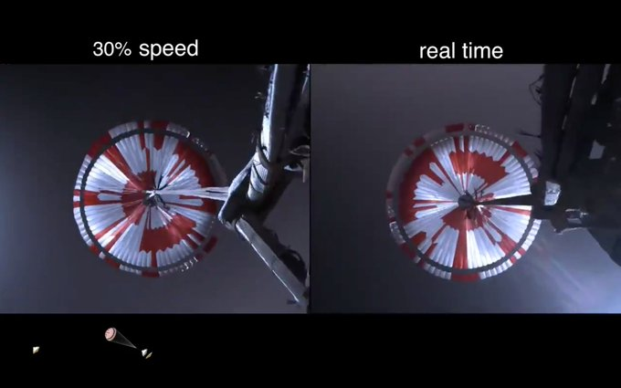
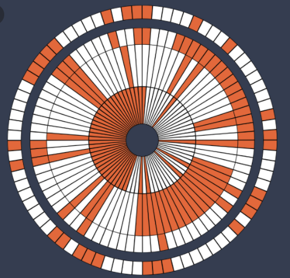
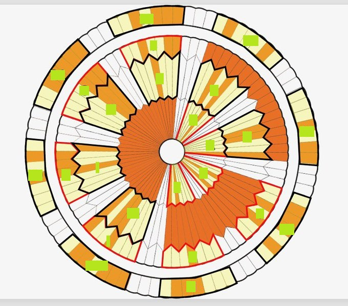

---
title : Perseverance
subtitle: Thème 1 - Représentation de données - Types et valeurs de bases
author : Première NSI
numbersections: true
fontsize: 10pt
geometry:
- top=20mm
- left=20mm
- right=20mm
- heightrounded    
--- 

Thème 1 - Représentation des données - Types et valeurs de bases
===

{{ initexo(0) }}

<table  class="greenTable">
        <tr >
            <th width="20%"; style="background-color: #3B444B;color:white;text-align:center;border:none;font-size:40pt;">
            06
            </th>
            <th  width="80%"; style="text-align:center;border:none;font-size:25pt;">Le message secret de Perseverance</th>
        </tr>
</table>
<br>

{:.center width=50%}

## Le message secret de Perseverance

Lors de sa descente vers la planète Mars le 18/02/2021, le rover Perseverance de la Nasa a freiné sa chute grâce à un parachute qui a intrigué quelques internautes du forum Reddit.

{: .center}

Vidéo du déploiement du parachute :

<p align="center">
<iframe width="790" height="444" src="https://www.youtube.com/embed/4czjS9h4Fpg" title="YouTube video player" frameborder="0" allow="accelerometer; autoplay; clipboard-write; encrypted-media; gyroscope; picture-in-picture" allowfullscreen></iframe>
</p>


## Mais comment ce message est-il encodé ?

Si vous observez bien la conception du parachute, vous verrez qu’il est constitué de colonnes verticales, entièrement blanches, entièrement rouges, ou blanches et rouges.



Source : NASA


### Dans la peau du premier décodeur du message (aucun indication)

On peut schématiser le parachute sous cette forme : 

{:.center}


??? tip "Indication 1 : "
    Le codage est sur 10 bits.

    - Essayez de décomposer les zones décrites.  
    - Que peuvent représenter les couleurs blanches, rouges ?  
    - Les colonnes verticales peuvent être découpées en cercle de diamètres différents. Trouvez en combien de cercles le parachute est constitué.

??? tip "Indication 2 : "
    + A partir du shéma ci dessous, Positionnez les valeurs binaires dans chaques des cases du parachute.  

    {:.center width=60%}

??? tip "Indication 3 : "
    Les zones blanches et rouge se décomposent comme ceci :

    {: .center}

    - Le tout premier secteur contenant un message est le secteur sur lequel est écrite la lettre D, qui est effectivement la signification de ce secteur. C'est en l'observant bien que vous comprendrez le codage qui a été utilisé.
    - Les autres secteurs sont marqués de points d'interrogation : c'est à vous de découvrir ce qu'ils cachent.
    - La phrase mystère s'obtiendra en tournant en spirale depuis la lettre D, dans le sens horaire.
    - La dernière couronne (la plus à l'extérieur) est un peu particulière, mais n'en disons pas plus...

### À vous !


Un grand bravo aux brillants _redditors_ ```u/rdtwt1``` et ```u/tend0g```.


### Faites votre propre parachute ! 

[https://sjwarner.github.io/perseverance-parachute-generator/?](https://sjwarner.github.io/perseverance-parachute-generator/?)


#### Sources (attention spoiler) ne pas consulter avant  d'avoir fin le TP (Merci§) :  

- [Le monde](https://www.lemonde.fr/pixels/article/2021/02/23/des-internautes-dechiffrent-un-message-cache-dans-le-parachute-du-rover-de-la-nasa-sur-mars_6070952_4408996.html)
- [reddit](https://www.reddit.com/r/nasa/comments/lpy2fa/does_the_parachute_for_perseverance_have_some/goedts0/)  
- [twitter](https://twitter.com/steltzner/status/1364076615932645379)  

