




{{ titre_chapitre(num,titre,theme,niveau)}}

{{ initexo(0) }}


| Contenus | Capacités Attendues | Commentaires |
|:-:|:-:|:-:|
|Valeurs booléennes : 0,1.<br/>Opérateurs booléens : and, or, not.<br/>Expressions booléennes | Dresser la table d’une expression booléenne. | Le ou exclusif (xor) est évoqué.<br/>Quelques applications directes comme l’addition binaire sont présentées.<br/>L’attention des élèves est attirée sur le caractère séquentiel de certains opérateurs booléens. |


## Repères historiques

{:.center}


En 1847, le  britannique  *George BOOLE* :gb: inventa un formalisme permettant d'écrire des raisonnements logiques : l'algèbre de Boole. La notion même d'informatique n'existait pas à l'époque, même si les calculs étaient déjà automatisés (penser à la Pascaline de 1642).

Bien plus tard, en  1938, les travaux de l'américain *Claude  SHANNON* :us: prouva  que des  circuits  électriques peuvent  résoudre tous  les  problèmes  que l'algèbre  de  Boole peut elle-même résoudre.  Pendant la deuxième guerre mondiale, les travaux  d'*Alan  TURING* :gb: puis de *John VON NEUMANN* :us: :hu: poseront définitivement les bases de l'informatique moderne.

## Algèbre de Boole

L'algèbre de Boole définit des opérations dans un ensemble
qui ne contient que **deux éléments** notés **0 et 1**, ou bien **FAUX et VRAI** ,ou encore **False** et **True** (en Python)

Les opérations fondamentales sont :

- la *conjonction* ("ET") 
- la *disjonction* ("OU") 
- la *négation* ("NON").

Dans  toute la  suite,  `x` et  `y` désigneront  des  *Booléens* (éléments  d'une
algèbre de Boole) quelconques, `F` désignera FAUX et `V` désignera VRAI.

_______
## Opérateurs Booléens & Opérandes

### Qu'est-ce qu'un Opérateur ?

De manière générale et intuitive, un **Opérateur** est un concept (plutôt mathématique) qui **opère**/agit sur des données en entrée, appelées **Opérandes**, et qui renvoie en sortie un (unique) résultat (dépendant usuellement des données en entrée).  
Au sens mathématique, un **Opérateur** $\otimes$ (par exemple) peut donc être vu comme une **fonction** $f$ (par exemple) **mais les notations pour la valeur de sortie ne sont pas exactement les mêmes**.  

### Opérateurs Booléens

Dans ce contexte, Un **Opérateur Booléen** ou **Opérateur Logique**, correspond au cas particulier où :

* les données en entrée sont des **booléens** (Vrai/True/$1$ ou False/Faux/$0$)
* Le résultat en sortie est également un **booléen**

!!! def "Opérateur Booléens / Logiques & Opérandes"
    Un **Opérateur Booléen**, ou **Opérateur Logique**, est une *fonction logique* $f$ qui :

    * prend **en entrée** un ou plusieurs booléens/bits (appelés **Opérandes**), et
    * produit **en sortie** un (unique) booléen/bit de résultat

L'équivalent au sens mathématique d'un opérateur booléen/logique, serait une fonction dite **fonction booléenne** ou ** fonction logique**, càd une fonction qui reçoit en entrée un/des booléens/bits ($0$ ou $1$) et qui renvoie en sortie un unique booléen/bit ($0$ ou $1$).

!!! exp "L'Opérateur Booléen de la Négation"
    L'Opérateur booléen qui consiste à renvoyer en sortie systématiquement le contraire de ce que l'on a reçu en entrée, est appelé l'**Opérateur de la Négation** :

    * `Vrai` en entrée renvoie `Faux` en sortie
    * `Faux` en entrée renvoie `Vrai` en sortie

## Fonctions Booléennes/Logiques & Tables de Vérité

### Définition

!!! def "Fonctions Booléennes/Logiques & Tables de Vérité"
    Les **fonctions booléennes** / **fonctions logiques**, sont des fonctions qui prennent en entrée un ou plusieurs bits/valeurs booléennes, et qui produisent en résultat de sortie un unique bit/valeur booléenne. Elles peuvent donc se représenter par une **Table de Vérité**.

### Exemples

#### Fonction Booléenne à 2 entrées

Une fonction booléenne $f$ avec $2$ entrées $x$, $y$, sera entièrement définie par une **Table de Vérité** de $2^2=4$ lignes. En effet, il existe $4$ manières d'arranger deux variables $x$ et $y$ prenant chacune des valeurs booléennes ($0$ ou $1$) données en entrée :  
<center>$00$, $01$, $10$ ou bien $11$</center>
Chaque valeur $f(x,y)$ étant ou bien un $0$, ou bien un $1$.

| $x$ | $y$ | $f(x,y)$<br/>($1$ bit) |
|:-:|:-:|:-:|
| $0$ | $0$ | $f(0,0)$ |
| $0$ | $1$ | $f(0,1)$ |
| $1$ | $0$ | $f(1,0)$ |
| $1$ | $1$ | $f(1,0)$ |

!!! ex
    1. Un videur de boîte de nuit a reçu comme consigne de ne laisser passer que les personnes suivant le dress code suivant :

        * une chemise ($x$)
        * ET un pantalon ($y$)

        Établir la Table de Vérité correspondant à cette situation :

        | $x$<br/>(Chemise) | $y$<br/>(Pantalon) | $f(x,y)$<br/>($1$ bit)<br/>(Puis-je entrer ?) |
        |:-:|:-:|:-:|
        | $0$ | $0$ |  |
        | $0$ | $1$ |  |
        | $1$ | $0$ |  |
        | $1$ | $1$ |  |

        ???- corr
            | $x$<br/>(Chemise) | $y$<br/>(Pantalon) | $f(x,y)$<br/>($1$ bit)<br/>(Puis-je entrer ?) |
            |:-:|:-:|:-:|
            | $0$ | $0$ | $0$ |
            | $0$ | $1$ | $0$ |
            | $1$ | $0$ | $0$ |
            | $1$ | $1$ | $1$ |

    1. Le dress code a changé :

        * une chemise ($x$)
        * OU un pantalon ($y$)

        Établir la Table de Vérité correspondant à cette situation :

        | $x$<br/>(Chemise) | $y$<br/>(Pantalon) | $f(x,y)$<br/>($1$ bit)<br/>(Puis-je entrer ?) |
        |:-:|:-:|:-:|
        | $0$ | $0$ |  |
        | $0$ | $1$ |  |
        | $1$ | $0$ |  |
        | $1$ | $1$ |  |

        ???- corr
            | $x$<br/>(Chemise) | $y$<br/>(Pantalon) | $f(x,y)$<br/>($1$ bit)<br/>(Puis-je entrer ?) |
            |:-:|:-:|:-:|
            | $0$ | $0$ | $0$ |
            | $0$ | $1$ | $1$ |
            | $1$ | $0$ | $1$ |
            | $1$ | $1$ | $1$ |

#### Fonction Booléenne à 3 entrées

Une fonction booléenne $f$ avec 3 entrées $x$, $y$ et $z$, sera entièrement définie par une **Table de Vérité** de $2^3=8$ lignes. En effet, il existe $8$ manières d'arranger trois variables $x$, $y$ et $z$ prenant chacune des valeurs booléennes ($0$ ou $1$) données en entrée :  
<center>$000$, $001$, $010$, $011$, $100$, $101$, $110$ ou bien $111$</center>
Chaque valeur $f(x,y,z)$ étant ou bien un $0$, ou bien un $1$.

| $x$ | $y$ | $z$ | $f(x,y,z)$<br/>($1$ bit) |
|:-:|:-:|:-:|:-:|
| $0$ | $0$ | $0$ | $f(0,0,0)$ |
| $0$ | $0$ | $1$ | $f(0,0,1)$ |
| $0$ | $1$ | $0$ | $f(0,1,0)$ |
| $0$ | $1$ | $1$ | $f(0,1,1)$ |
| $1$ | $0$ | $0$ | $f(1,0,0)$ |
| $1$ | $0$ | $1$ | $f(1,0,1)$ |
| $1$ | $1$ | $0$ | $f(1,1,0)$ |
| $1$ | $1$ | $1$ | $f(1,1,1)$ |

!!! ex
    1. Un videur de boîte de nuit a reçu comme consigne de ne laisser passer que les personnes suivant le dress code suivant :

        * une chemise ($x$)
        * ET (un pantalon $y$ OU une jupe $z$)

        Établir la Table de Vérité correspondant à cette situation :

        | $x$<br/>(Chemise) | $y$<br/>(Pantalon) | $z$<br/>(Jupe) | $f(x,y,z)$<br/>($1$ bit)<br/>(Puis-je entrer ?) |
        |:-:|:-:|:-:|:-:|
        | $0$ | $0$ | $0$ | |
        | $0$ | $0$ | $1$ | |
        | $0$ | $1$ | $0$ | |
        | $0$ | $1$ | $1$ | |
        | $1$ | $0$ | $0$ | |
        | $1$ | $0$ | $1$ | |
        | $1$ | $1$ | $0$ | |
        | $1$ | $1$ | $1$ | |

        ???- corr
            | $x$<br/>(Chemise) | $y$<br/>(Pantalon) | $z$<br/>(Jupe) | $f(x,y,z)$<br/>($1$ bit)<br/>(Puis-je entrer ?) |
            |:-:|:-:|:-:|:-:|
            | $0$ | $0$ | $0$ | $0$ |
            | $0$ | $0$ | $1$ | $0$ |
            | $0$ | $1$ | $0$ | $0$ |
            | $0$ | $1$ | $1$ | $0$ |
            | $1$ | $0$ | $0$ | $0$ |
            | $1$ | $0$ | $1$ | $1$ |
            | $1$ | $1$ | $0$ | $1$ |
            | $1$ | $1$ | $1$ | $1$ |

    1. Le dress code a changé :

        * Pantalon Obligatoire pour tout le monde
        * une chemise ($x$) ET des Chaussures ($z$) (avec éventuellement un maillot en dessous)
        * OU (pas de chemise, mais avec maillot ($y$) ET Sans Chaussures)

        Établir la Table de Vérité correspondant à cette situation :

        | $x$<br/>(Chemise) | $y$<br/>(Maillot) | $z$<br/>(Chaussures) | $f(x,y,z)$<br/>($1$ bit)<br/>(Puis-je entrer ?) |
        |:-:|:-:|:-:|:-:|
        | $0$ | $0$ | $0$ | |
        | $0$ | $0$ | $1$ | |
        | $0$ | $1$ | $0$ | |
        | $0$ | $1$ | $1$ | |
        | $1$ | $0$ | $0$ | |
        | $1$ | $0$ | $1$ | |
        | $1$ | $1$ | $0$ | |
        | $1$ | $1$ | $1$ | |

        ???- corr
            | $x$<br/>(Chemise) | $y$<br/>(Maillot) | $z$<br/>(Chaussures) | $f(x,y,z)$<br/>($1$ bit)<br/>(Puis-je entrer ?) |
            |:-:|:-:|:-:|:-:|
            | $0$ | $0$ | $0$ | $0$ |
            | $0$ | $0$ | $1$ | $0$ |
            | $0$ | $1$ | $0$ | $1$ |
            | $0$ | $1$ | $1$ | $0$ |
            | $1$ | $0$ | $0$ | $0$ |
            | $1$ | $0$ | $1$ | $1$ |
            | $1$ | $1$ | $0$ | $0$ |
            | $1$ | $1$ | $1$ | $1$ |

#### Fonction Booléenne à $n$ entrées

!!! pte "Nombres de Lignes d'une Table de Vérité"
    Une Table de Vérité d'une fonction booléenne avec $n$ bits en entrée (le nombre total de colonnes, sauf la dernière colonne du résultat), aura besoin de <enc>$2^n$</enc> lignes (correspondant aux $2^n$ combinaisons possibles avec les $n$ bits en entrée).


## Portes Logiques

!!! def
    Une **Porte Logique** :fr: / **Logic Gate** :gb: est une implémentation matérielle d'un **Opérateur Booléen**, càd un **circuit électronique élémentaire** implémentant la même fonctionnalité précise et distincte, que l'opérateur booléen correspondant.

Il existe plusieurs Portes Logiques, chacune d'entre elles ayant des fonctionnalités basiques, précises et distinctes. Ces Portes Logiques sont donc des circuits (électroniques) qui :

* acceptent en **entrée** un ou des **signaux logiques** ($0$ ou $1$) présentés à leurs entrées sous forme de tensions.  
* renvoie en **sortie** un signal logique ($0$ ou $1$)

!!! def "Circuits Combinatoires"
    Ce type de circuits électroniques, dont la sortie ne dépend QUE des valeurs booléennes/bits en entrée est appelé un **circuit combinatoire**

Ce cours traite principalement de quelques circuits combinatoires classiques.

!!! exp
    Un simple transistor permet de réaliser le circuit électronique élémentaire appelé **Porte Logique NOT (NON)** ou **Porte Logique de la Négation**, ou **Inverseur**.

Voici les caractéristiques des **portes logiques les plus usuelles**.

## Porte NOT ( NON ) / Inverseur

### Définition

!!! def
    La Porte Logique **NOT (NON)**, ou **Inverseur**, ou Opérateur de **Négation**, est défini par la phrase suivante : 

    <center><enc>La sortie est VRAI si et seulement si l'unique entrée est FAUX</enc></center>


### Circuits et Schémas

La Porte NOT est implantée par un simple transistor : c'est la plus simple de toutes les portes, et c'est la seule **porte logique unaire** (avec une seule entrée/opérande)

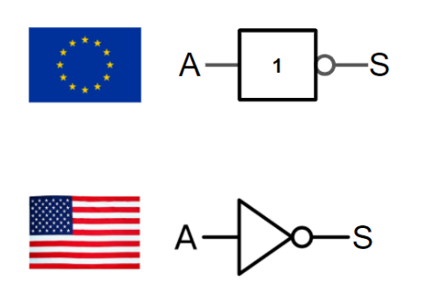{.center width=250px}


!!! not "NOT"
    - symbole usuel : ~  
    - français : NON  
    - anglais (et Python) : `not`  
    - notation logique :  $\neg$  
    - notation mathématique :  $\overline{x}$  

### Table de Vérité

La Porte NOT n'admet qu'un seul bit en entrée (A) et les résultats de son unique sortie (S) sont résumés dans sa **Table de Vérité:**


!!! jeretiens "Table de vérité de NOT :heart:"
    | $A$  | $S=not$ $A=\overline{A} =$ ~ $A$ |
    |:-:|:-:|
    | $0$ | $1$ |
    | $1$ | $0$ |

#### Exemples en Python


```python
>>> n = 20
>>> not(n % 10 == 0)
False
```

## Porte AND ( ET ) / Conjonction

### Définition

!!! def
    La Porte Logique **AND (ET)**, ou Opérateur de **Conjonction**, est défini par la phrase suivante :

    <center><enc>La sortie est VRAI si et seulement si l'une ET l'autre entrées sont VRAI (simultanément)  
    $\Leftrightarrow$ les deux entrées sont VRAI (simultanément)</enc></center>

### Circuits et Schémas

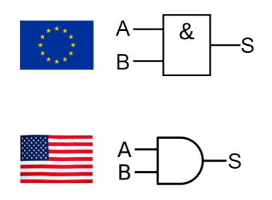{.center width=250px}

!!! not "AND"
    - symbole usuel : & (appelé _esperluette_ en français et _ampersand_ en anglais)  
    - français : ET  
    - anglais (et Python) : `and`  
    - notation logique : $\wedge$  
    - notation mathématique :  `.`  


### Table de Vérité

La Porte AND (ET) admet deux valeurs en entrée (notées $A$ et $B$), et une unique valeur de Sortie ($S$).

!!! jeretiens "Table de vérité de AND :heart:"
    | $A$  | $B$ | $S=A$ $and$ $B$ <br/>$=A$ & $B$  |
    |:-:|:-:| :-:|
    | $0$  | $0$ | $0$ |
    | $0$  | $1$ | $0$ |
    | $1$  | $0$ | $0$ |
    | $1$  | $1$ | $1$ |

<iframe style="width: 100%; height: 300px; border: 0" src="https://logic.modulo-info.ch/?mode=tryout&data=N4IgbiBcAsA0IHMCGAXApgZygbVCgngA5pQgCCAcgCIjyED2Wk2AzCwAywCMArOwLrwAlgDscAJk7iugkPQCuKKOPEBfWaJygGTbOI7dJGgCbKW8MEgA2UdqtjbGEg1wAcA4acji44a7fV4BSVmR11odk5eDxAhL3EeQJAAdyEAJ0wcPXMjWD04aUE9cVgE-n5VIA"></iframe>

#### Exemples en Python


```python
>>> n = 20
>>> (n % 10 == 0) and (n % 7 == 0)
False
>>> (n % 4 == 0) and (n % 5 == 0)
True
```

#### L'évaluation paresseuse
Pouvez-vous prévoir le résultat du code ci-dessous ?


```python
>>> (n % 4 == 0) and (n % 0 == 0)
    ---------------------------------------------------------------------------

    ZeroDivisionError                         Traceback (most recent call last)

    <ipython-input-3-d8a98dcba9be> in <module>
    ----> 1 (n % 4 == 0) and (n % 0 == 0)
    

    ZeroDivisionError: integer division or modulo by zero
```

Évidemment, la division par 0 provoque une erreur.  
Mais observez maintenant ce code :


```python
>>> (n % 7 == 0) and (n % 0 == 0)
False
```

On appelle **évaluation paresseuse** le fait que l'interpréteur Python s'arrête dès que sa décision est prise : comme le premier booléen vaut False et que la conjonction `and` est appelée, il n'est pas nécessaire d'évaluer le deuxième booléen. 


## Porte OR ( OU ) / Disjonction

### Définition

!!! def
    La Porte Logique **OR (OU)**, ou Opérateur de **Disjonction**, est défini par la phrase suivante :

    <center><enc>La sortie est VRAI si et seulement si l'une OU l'autre des entrées est VRAI  
    $\Leftrightarrow$ au moins l'une des entrées est VRAI</enc></center>

### Circuits et Schémas

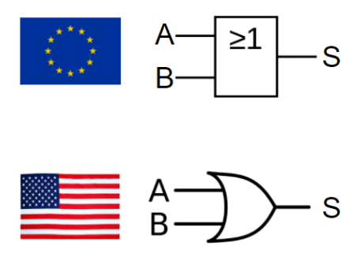{.center width=250px}


!!! not "OR"
    - symbole usuel : | appelé _pipe_ en anglais  
    - français : OU  
    - anglais (et Python) : `or`  
    - notation logique : $\vee$  
    - notation mathématique :  $+$  

### Table de Vérité

La Porte OR (OU) admet deux valeurs en entrée (notées $A$ et $B$), et une unique valeur de Sortie ($S$).

!!! jeretiens "Table de vérité de OR :heart:"
    | $A$  | $B$ | $S=A$ $or$ $B$ |
    |:-:|:-:| :-:|
    | $0$  | $0$ | $0$ |
    | $0$  | $1$ | $1$ |
    | $1$  | $0$ | $1$ |
    | $1$  | $1$ | $1$ |

<iframe style="width: 100%; height: 300px; border: 0" src="https://logic.modulo-info.ch/?mode=tryout&data=N4IgbiBcAsA0IEsB2UDaoAOB7AzmgTAMwAMsAjPsQLrwIAmUR8YAhgDZTEC+smuBJcgA5qtBpHxxw7TlxogsAVwAuaPnkipoxUmQCsoxOPx658AOYtlAUw3oQygJ4ZrUEAHkASiHjY7hQX1DZAIANlh8AHZ5JVUJITMQAHcEACdbNFR8IQi9GizCCND8yQjoqi4gA"></iframe>

#### Exemples en Python


```python
>>> n = 20
>>> (n % 10 == 0) or (n % 7 == 0)
True
>>> (n % 4 == 0) or (n % 5 == 0)
True
>>> (n % 7 == 0) or (n % 3 == 0)
False
```


#### L'évaluation paresseuse (retour)
Pouvez-vous prévoir le résultat du code ci-dessous ?


```python
>>> (n % 5 == 0) or (n % 0 == 0)
```


## Porte NAND ( NON-ET )

### Définition

!!! def
    La Porte Logique **NAND (NOT-AND / NON-ET)**, ou Opérateur de **Négation de la Conjonction**, est défini par la phrase suivante :

    <center><enc>La sortie est VRAI si et seulement si PAS TOUTES les entrées ne sont VRAI (simultanément)  
    $\Leftrightarrow$ au plus une des entrées est VRAI  
    $\Leftrightarrow$ au moins une des entrées est FAUX</enc></center>

### Circuits et Schémas

Deux transistors en série constituent une porte NAND / NOT-AND / NON-ET.

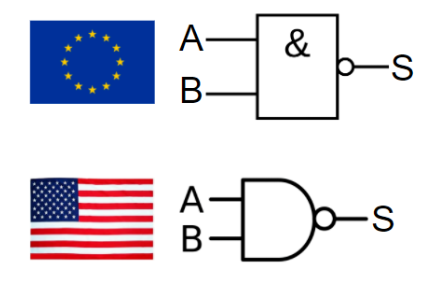{.center width=250px}


!!! not "NAND"
    On note $S=A$ $nand$ $B=\overline{A\land B}=\overline{A.B}=$ ~ $(A$ & $B)=A \uparrow B$

### Table de Vérité

La Porte NAND (NON-ET) admet deux valeurs en entrée (notées $A$ et $B$), et une unique valeur de Sortie ($S$).

!!! abstract "Table de vérité de NAND :heart:"
    | $A$  | $B$ | $S=A$ $nand$ $B$ <br/>$=A \uparrow B$  |
    |:-:|:-:| :-:|
    | $0$  | $0$ | $1$ |
    | $0$  | $1$ | $1$ |
    | $1$  | $0$ | $1$ |
    | $1$  | $1$ | $0$ |

<iframe style="width: 100%; height: 260px; border: 0" src="https://logic.modulo-info.ch/?mode=tryout&data=N4IgbiBcAsA0IHMCGAXApgZygbVCgngA5pQgByAgmQCIjyED2Wk2ATAJwAMsAjAMycAuvACWAOxwdYA4SAYBXFFD48AvrPE5QjZth5denIaIAmy1vDBIANlE6rY2pjn3ceANmMgRZyHz6WNnbq8ApKLE66fJ68MqbK0CEgAO4iAE6YONh8FhzC2QFx2TzS0IKCqkA"></iframe>

### Universalité

!!! pte "NAND est Universelle"
    La Porte Logique NAND (NON ET) est dite **universelle** / **complète**, ce qui veut dire qu'elle permet de reconstituer (à elle seule) toutes les autres portes logiques.

C'est une propriété très importante car, le circuit électronique CMOS de la fonction NAND étant des plus simples, la fonction NAND sert souvent de « brique de base » à des circuits intégrés beaucoup plus complexes.

!!! ex "Universalité de NAND ($\uparrow$)"
    Grâce à des Tables de Vérité, montrer les égalités suivantes :  

    ||
    |:-:|
    | $\neg A = A\uparrow A$ |
    | $A$ & $B = (A\uparrow B)\uparrow (A\uparrow B)$ |
    | $A$ or $B = (A\uparrow A)\uparrow (B\uparrow B)$ |

 

## Porte NOR ( NON-OU )

### Définition

!!! def
    La Porte Logique **NOR (NOT-OR / NON-OU)**, ou Opérateur de **Négation de la Disjonction**, ou *NI/NI*, est défini par la phrase suivante :

    <center><enc>La sortie est VRAI si et seulement si AUCUNE des entrées n'est VRAI  
    $\Leftrightarrow$ les deux entrées sont FAUX  
    $\Leftrightarrow$ NI l'une NI l'autre des entrées n'est VRAI</enc></center>

### Circuits et Schémas

Deux transistors en parallèles constituent une porte NOR / NOT-OR / NON-OU.

{.center width=250px}

!!! not "NOR"
    On note $S =  A$ $nor$ $B=A \downarrow B$

### Table de Vérité

La Porte NOR (NON-OU) admet deux valeurs en entrée (notées $A$ et $B$), et une unique valeur de Sortie ($S$).

!!! abstract "Table de vérité de NOR :heart:"
    | $A$  | $B$ | $S=A$ $nor$ $B$ <br/>$=A \downarrow B$  |
    |:-:|:-:| :-:|
    | $0$  | $0$ | $1$ |
    | $0$  | $1$ | $0$ |
    | $1$  | $0$ | $0$ |
    | $1$  | $1$ | $0$ |

<iframe style="width: 100%; height: 310px; border: 0" src="https://logic.modulo-info.ch/?mode=tryout&data=N4IgbiBcAsA0IHMCGAXApgZygbVCgngA5pQgByA8gEojyED2Wk200ADLAIwBsbAuvACWAOxzROsaACYBIegFcUUaAGYAvrIVLmoBk2wBWThx78hAE2XQNQ0TpB6cK9lwCcZkIMswD8MEgAbKDY1WF1GJxdOKQ8vZW4-QOCbEAB3QQAnTBwWFUloARZfaULoBPE+PjUgA"></iframe>

### Universalité

!!! pte "NOR est Universelle"
    La Porte Logique NOR (NON OU) est dite **universelle** / **complète**, ce qui veut dire qu'elle permet de reconstituer (à elle seule) toutes les autres portes logiques.

## Porte XOR (OU EXCLUSIF) / Différence

### Définition

!!! def
    La Porte Logique **XOR (Exclusive OR / OU EXCLUSIF)**, ou Opérateur de **Différence**, ou Opérateur de **Disjonction Exclusive**, est défini par la phrase suivante :

    <center><enc>La sortie est VRAI si et seulement si les entrées NE sont PAS égales entre elles  
    $\Leftrightarrow$ L'une des entrées EXCLUSIVEMENT est VRAI (pas les deux)</enc></center>

### Circuits et Schéma

{.center width=250px}

!!! not "XOR"
    On note $S= A$ $xor$ $B = A\oplus B$ = $A$ ^ $B$

### Table de Vérité

La Porte XOR (OU EXCLUSIF) admet deux valeurs en entrée (notées $A$ et $B$), et une unique valeur de Sortie ($S$).

!!! abstract "Table de vérité de XOR :heart:"
    | $A$  | $B$ | $S=A$ $xor$ $B$<br/>$A\oplus B$ |
    |:-:|:-:|:-:|
    | $0$ |$0$ | $0$ |
    | $0$ |$1$ | $1$ |
    | $1$ |$0$ | $1$ |
    | $1$ |$1$ | $0$ |

<iframe style="width: 100%; height: 310px; border: 0" src="https://logic.modulo-info.ch/?mode=tryout&data=N4IgbiBcAsA0IHMCGAXApgZygbVCgngA5pQgAaA8gEojyED2Wk20ATAAywCMAbOwLrwAlgDscAZgCsscT0Eh6AVxRRxAdgC+8pSuagGTFgE5OvAcIAmqgBxbhYvSAMSupjvKFXI4o-DBIAGyh2DVh9RhdTEw8vaE5wQOC7EAB3IQAnTBxsdRlrQRzfKQK4mTl+DSA"></iframe>


!!! exo 
    1. Écrire la table de vérité de la loi définie par :  
    $f(A,B) =$ (not A and B ) or (A and not B )  
    Table de vérité  
    | $A$  | $B$ | $ (not A and B ) or (A and not B )|
    |:-:|:-:|:-:|
    | $0$ |$0$ | $\,$ | 
    | $0$ |$1$ | $\,$ | 
    | $1$ |$0$ | $\,$ | 
    | $1$ |$1$ | $\,$ |   
    2. Concevoir un circuit qui, étant données deux entrées A et B, donne en sortie la valeur A xor B , en utilisant seulement des portes Non, Et, Ou.

!!! info "Application en électricité domestique."
    Une application utilisée de l’opérateur logique XOR en électricité domestique est dans les salles où une ampoule peut être allumée ou éteinte par deux interrupteurs placés près de deux entrées. Chacun des deux interrupteurs peut soit allumer ou éteindre l’ampoule quelle que soit la position de l’autre interrupteur. Pour obtenir une telle fonctionnalité, on doit brancher les deux interrupteurs afin de former un opérateur XOR. C’est le montage dit « va-et-vient ».

### Propriétés

!!! ex "Table de Vérité"
    1. Remplir la Table de Vérité Suivante :

        | $A$  | $B$ | $A \lor B$ | $\neg (A \land B)$ | $(A \lor B)\land (\neg (A \land B))$ |
        |:-:|:-:|:-:|:-:|:-:|
        | $0$ |$0$ | $\,$ | $\,$ | $\,$ |
        | $0$ |$1$ | $\,$ | $\,$ | $\,$ |
        | $1$ |$0$ | $\,$ | $\,$ | $\,$ |
        | $1$ |$1$ | $\,$ | $\,$ | $\,$ |
    
    1. Que constatez-vous ?


Construire les circuits correpondants pour tester vos réponses :   

<iframe style="width: 100%; height: 550px; border: 0" src="https://logic.modulo-info.ch/?mode=design&data=N4IgbiBcAsC+Q"></iframe>

### Applications du XOR

#### En Cryptographie

Le XOR joue un rôle fondamental en Cryptographie car il possède une propriété très intéressante : 
$(x \oplus y) \oplus y=x$

Si $x$ est un message et $y$ une clé de chiffrage, alors $x\oplus y$ est le message chiffré.
Mais en refaisant un XOR du message chiffré avec la clé $y$, on retrouve donc le message $x$ initial.
En pratique, cette méthode est souvent utilisée avec une clé $y$ à usage unique, càd avec la **technique du masque jetable**.


{{ aff_cours(num) }}

## QCM

{{qcm_chapitre(num)}}

## EXERCICES

!!! exo "Établir des tables de vérité"
    === "Enoncé"
        Écrire les tables de vérité des expressions booléennes suivantes :

        1. NOT(A) AND B  
        2. B OR (A AND B  
        3. A AND (A OR B)  
        4. (NOT(A) AND B) OR (A AND C)  

    === "Solution 1"  

        | $A$  | $B$ | $NOT(A)$ | $NOT(A)$ AND $B$|
        |:-:|:-:|:-:|:-:|
        | $0$ |$0$ | $1$ | $0$ |
        | $0$ |$1$ | $1$ | $1$ |
        | $1$ |$0$ | $0$ | $0$ |
        | $1$ |$1$ | $0$ | $0$ |

    === "Solution 2"  

        | $A$  | $B$ | $A$ AND $B$ | $B$ OR ($A$ AND $B$)|
        |:-:|:-:|:-:|:-:|
        | $0$ |$0$ | $0$ | $0$ |
        | $0$ |$1$ | $0$ | $1$ |
        | $1$ |$0$ | $0$ | $0$ |
        | $1$ |$1$ | $1$ | $1$ |  

    === "Solution 3"  

        | $A$  | $B$ | $A$ OR $B$ | $A$ AND ($A$ OR $B$)|
        |:-:|:-:|:-:|:-:|
        | $0$ |$0$ | $0$ | $0$ |
        | $0$ |$1$ | $1$ | $0$ |
        | $1$ |$0$ | $1$ | $1$ |
        | $1$ |$1$ | $1$ | $1$ |

    === "Solution 4"

        | $A$  | $B$ | $C$| $NOT(A)$ | $S_1=NOT(A)$ AND $B$|$S_2=A$ AND $C$|$S_1$ OR $S2$|
        |:-:|:-:|:-:|:-:|:-:|:-:|:-:|
        | $0$ |$0$ | $0$ | $1$ | $0$ | $0$ | $0$ |
        | $0$ |$0$ | $1$ | $1$ | $0$ | $0$ | $0$ |
        | $0$ |$1$ | $0$ | $1$ | $1$ | $0$ | $1$ |
        | $0$ |$1$ | $1$ | $1$ | $1$ | $0$ | $1$ |
        | $0$ |$0$ | $0$ | $0$ | $0$ | $0$ | $0$ |
        | $1$ |$0$ | $1$ | $0$ | $0$ | $1$ | $1$ |
        | $1$ |$1$ | $0$ | $0$ | $0$ | $0$ | $0$ |
        | $1$ |$1$ | $1$ | $0$ | $0$ | $1$ | $1$ |

Construire les circuits correpondants pour tester vos réponses :   

<iframe style="width: 100%; height: 550px; border: 0" src="https://logic.modulo-info.ch/?mode=design&data=N4IgbiBcAsC+Q"></iframe>

!!! exo "Équivalence d'expressions booléennes"
    === "Enoncé"  
        1. Montrer que (a AND b) = NOT(NOT(a) OR NOT(b))  
        2. Montrer que (a OR b) = NOT(NOT(a) AND NOT(b))

        Deux expressions booléennes sont équivalentes si leurs tables de vérité le sont.

        Autrement dit, si pour toutes les entrées des tables de vérité, l'ensemble des valeurs de sorties de ces mêmes tables sont équivalentes alors les expressions booléennes sont équivalentes.

    === "Solution 1"

        | $A$  | $B$ | $A$ AND $B$ | $NOT(A)$ | $NOT(B)$ |$NOT(A)$ OR $NOT(B)$| $NOT(NOT(A)$ OR $NOT(B)$)|
        |:-:|:-:|:-:|:-:|:-:|:-:|:-:|
        | $0$ |$0$ | $0$ | $1$ | $1$ | $1$ | $0$ |
        | $0$ |$1$ | $0$ | $1$ | $0$ | $1$ | $0$ |
        | $1$ |$0$ | $0$ | $0$ | $1$ | $1$ | $0$ |
        | $1$ |$1$ | $1$ | $0$ | $0$ | $0$ | $1$ |

    === "Solution 2"

        | $A$  | $B$ | $A$ OR $B$ | $NOT(A)$ | $NOT(B)$ |$NOT(A)$ AND $NOT(B)$| $NOT(NOT(A)$ AND $NOT(B)$)|
        |:-:|:-:|:-:|:-:|:-:|:-:|:-:|
        | $0$ |$0$ | $0$ | $1$ | $1$ | $1$ | $0$ |
        | $0$ |$1$ | $1$ | $1$ | $0$ | $0$ | $1$ |
        | $1$ |$0$ | $1$ | $0$ | $1$ | $0$ | $1$ |
        | $1$ |$1$ | $1$ | $0$ | $0$ | $0$ | $1$ |


!!! exo 
    On considère le circuit logique ci-dessous.  

    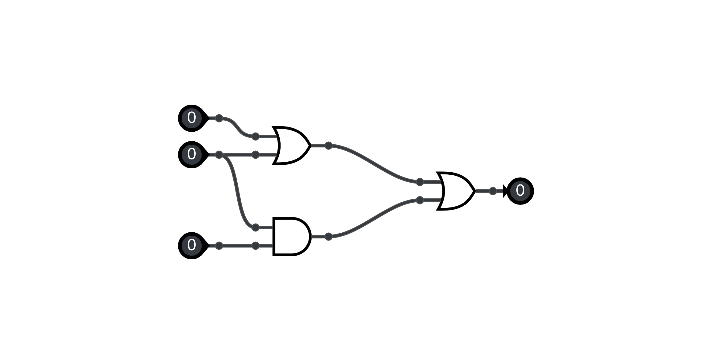

    1. Donner l’expression booléenne de S (la sortie) en fonction des variables A, B et C (dans cet ordre sur le schéma).   
    2. Compléter la table de vérité ci-dessous.

    | $A$  | $B$ | $C$| $S$ |
    |:-:|:-:|:-:|:-:|
    | $0$ |$0$ | $0$ |  |
    | $0$ |$0$ | $1$ |  |
    | $0$ |$1$ | $0$ |  |
    | $0$ |$1$ | $1$ |  |
    | $0$ |$0$ | $0$ |  |
    | $1$ |$0$ | $1$ |  |
    | $1$ |$1$ | $0$ |  |
    | $1$ |$1$ | $1$ |  |

!!! exo 
    On considère le circuit logique suivant.  

    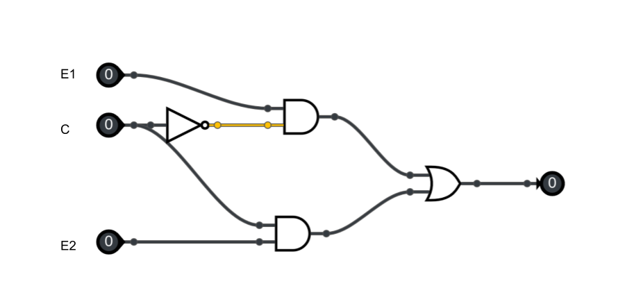  

    1. Donner l’expression de Out en fonction de E1, E2 et C.  
    2. Compléter le tableau de vérité de ce circuit.

    | $C$  | $E1$ | $E2$| $S$ |
    |:-:|:-:|:-:|:-:|
    | $0$ |$0$ | $0$ |  |
    | $0$ |$0$ | $1$ |  |
    | $0$ |$1$ | $0$ |  |
    | $0$ |$1$ | $1$ |  |
    | $0$ |$0$ | $0$ |  |
    | $1$ |$0$ | $1$ |  |
    | $1$ |$1$ | $0$ |  |
    | $1$ |$1$ | $1$ |  |

    !!! info "Remarque"
        Le circuit étudié est appelé multiplexeur à 2 entrées.
        Selon la valeur de la commande (C ), il permet de reproduire en sortie (Out) :  
        - le signal E 1 si C est à 0.  
        - le signal E 2 si C est à 1.  

!!! exo "Circuit MUX-4 (difficile)"
    On considère un multiplexeur à 4 entrées, dont le circuit est représenté ci-dessous.  

    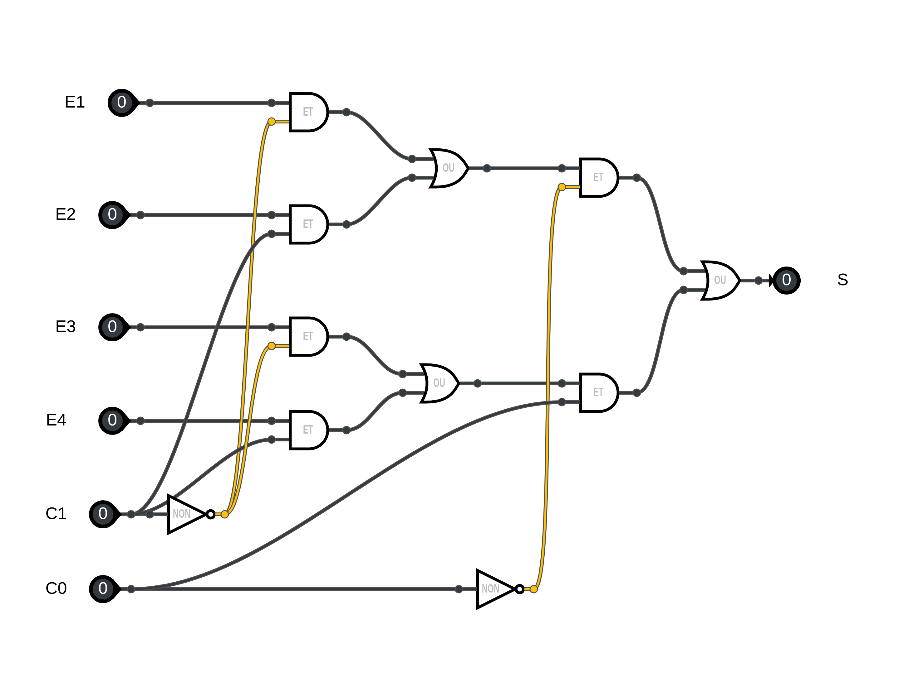   

    1. Par analyse du circuit, déterminer l’expression booléenne de Out en fonction des entrées E1, E2, E3, E4 et des commandes C0 et C1.  
    On peut par exemple ci-dessous vérifier quelle est la l’entrée reproduite en sortie selon les valeurs de C0 et C1.   

    <iframe style="width: 100%; height: 550px; border: 0" src="https://logic.modulo-info.ch/?mode=design&data=N4IgbiBcAsC+Q"></iframe>

    2. Quelles sont les valeurs des commandes C0 et C1 qui permettent de sélectionner en sortie (Out) :  
    - l’entrée E 1 ?  
    - l’entrée E 2 ?  
    - l’entrée E 3 ?  
    - l’entrée E 4 ?  

    !!! info "Remarque"
        Le circuit étudié est appelé multiplexeur à 4 entrées.
        Selon la valeur des commandes C0 et C1, il permet de reproduire en sortie (Out) le signal E1, E2, E3 ou E4 . Voir la dernière question de l’exercice.


!!! exo "Le demi-additionneur (half adder)"
    Le circuit étudié, appelé demi-additionneur, permet d’additionner deux bits A et B.  
    Il comporte deux sorties C et S qui représentent deux expressions booléennes.  

    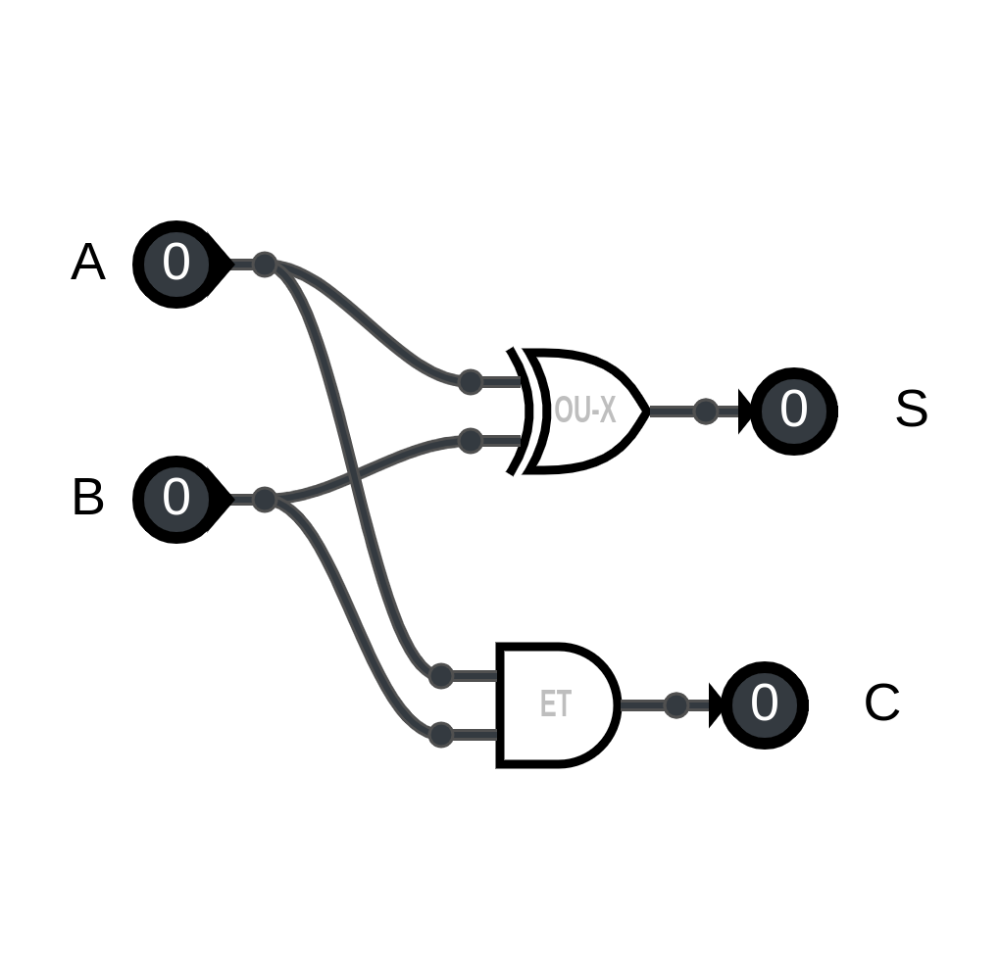{width=350px}

    1. Donner les expressions booléennes de C et S en fonction de A et B .  
    2. Compléter la table de vérité de C et S.  
    
    Table de vérité : S 

    | $A$  | $B$ | $S$ |
    |:-:|:-:|:-:|
    | $0$ |$0$ |  |
    | $0$ |$1$ |  |
    | $1$ |$0$ |  |
    | $1$ |$1$ |  |

        
    Table de vérité : c 

    | $A$  | $B$ | $C$ |
    |:-:|:-:|:-:|
    | $0$ |$0$ |  |
    | $0$ |$1$ |  |
    | $1$ |$0$ |  |
    | $1$ |$1$ |  |

    3. Quel est le rôle des sorties C et S dans la fonction du circuit ?
    
    ??? info "Remarque"
        Le choix de la lettre C vient du fait qu’en anglais, " retenue " se dit "carry" .

!!! exo "additionneur"
    En pratique, une addition binaire est une suite d’additions sur 1 bit. Néanmoins, il faut connaître la retenue pour enchaîner ces additions. On réalise alors le circuit ci-dessous, appelé additionneur complet.  
    Il comporte deux sorties Cout , S et trois entrées, le bit A, le bit B et la retenue précédente Cin  

    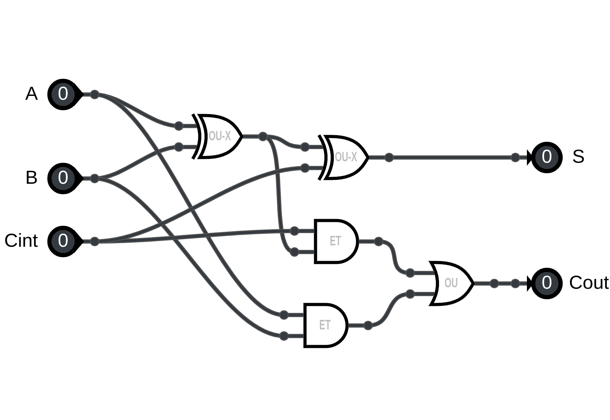{width=550px}

    1. Réaliser ce circuit ci-dessous.   

    <iframe style="width: 100%; height: 550px; border: 0" src="https://logic.modulo-info.ch/?mode=design&data=N4IgbiBcAsC+Q"></iframe>  
    
    2. Compléter la table de vérité ci-dessous.  

    | $Cin$  | $A$ | $B$| $Cout$ | $S$|
    |:-:|:-:|:-:|:-:|:-:|
    | $0$ |$0$ | $0$ | $1$ | $0$ |
    | $0$ |$0$ | $1$ | $1$ | $0$ |
    | $0$ |$1$ | $0$ | $1$ | $1$ |
    | $0$ |$1$ | $1$ | $1$ | $1$ |
    | $0$ |$0$ | $0$ | $0$ | $0$ |
    | $1$ |$0$ | $1$ | $0$ | $0$ |
    | $1$ |$1$ | $0$ | $0$ | $0$ |
    | $1$ |$1$ | $1$ | $0$ | $0$ |

!!! exo
    Calculer les opérations suivantes :

    ```python
      1011011
    & 1010101
    ----------
    

      1011011
    | 1010101
    ----------
    

      1011011
    ^ 1010101
    ----------
    
    ```

    ??? corr "solution"
        ```python
          1011011
        & 1010101
        ----------
          1010001
        
          1011011
        | 1010101
        ----------
          1011111
        
          1011011
        ^ 1010101
        ----------
          0001110
        ```

!!! exo "Opérateurs ET, OU, OU EXCLUSIF en Python :python:"
    Les opérateurs `&`, `|` et `^` sont utilisables directement en Python
    Testez-les syntaxes suivantes et vérifier les résultats :

    ```python
    # calcul A
    >>> 12 & 7
    4
    ```


    ```python
    # calcul B
    >>> 12 | 7
    15
    ```

    ```python
    # calcul C
    >>> 12 ^ 5
    9
    ```

    ???- corr
        Pour comprendre ces résultats, il faut travailler en binaire. Voici les mêmes calculs :

        ```python
        # calcul A
        >>> bin(0b1100 & 0b111)
            '0b100'
        ```

        ```python
        # calcul B
        >>> bin(0b1100 | 0b111)
        '0b1111'
        ```

        ```python
        # calcul C
        >>> bin(0b1100 ^ 0b111)
            '0b1011'
        ```

           

!!! exo "DIFFICILE - La Clé Endommagée, :sk-copyleft: [PyDéfis par Snarkturne](https://pydefis.callicode.fr/defis/MasqueJetable/txt)"
    Vous avez été récemment contacté par un de vos amis agent secret. Un message codé vous a été remis, sous la forme d'une liste de nombres. Ce code a été obtenu en utilisant la [méthode du masque jetable](https://fr.wikipedia.org/wiki/Masque_jetable). Voici comment l'appliquer.

    Pour chiffrer le texte "RENDEZVOUSICI" avec la clé [106, 204, 99, 53, 152, 30, 68, 27, 100, 249, 40, 94, 223], on effectue des opérations «ou exclusif» entre le code ASCII des lettres du texte et le nombre correspondant dans la clé.

    Les codes ASCII de R, E et N sont respectivement 82, 69 et 78 ([Page Ascii sur Wikipédia](https://fr.wikipedia.org/wiki/American_Standard_Code_for_Information_Interchange)). En conséquence, le premier nombre du message chiffré sera le résultat d'un ou exclusif entre 106 et 82 c'est à dire 56 ([Page Xor sur Wikipédia](https://fr.wikipedia.org/wiki/Fonction_OU_exclusif)). Le deuxième nombre sera un ou exclusif entre 204 et 69 (on trouve 137) et le troisième entre 99 et 78 (on trouve 45). En procédant ainsi pour les 13 caractères, on obtient le message chiffré : [56, 137, 45, 113, 221, 68, 18, 84, 49, 170, 97, 29, 150]

    L'opération de déchiffrement est identique. Un ou exclusif entre le premier nombre du message chiffré et le premier nombre de la clé redonne 82, qui est le code ASCII de R. Un ou exclusif entre le second nombre du message chiffré et le second nombre de la clé donne 68, le code ASCII de E...

    On peut donc chiffrer et déchiffrer tant qu'on connaît la bonne suite de nombre qui constitue la clé. La clé est très longue : aussi longue que le message à chiffrer (c'est une des caractéristiques de la méthode du masque jetable). Malheureusement pour vous, bien que conserviez habituellement très précieusement les fichiers de clés, celui-ci a été endommagé (cyber attaque ?). Un spécialiste [forensic](https://fr.wikipedia.org/wiki/Informatique_l%C3%A9gale) a néanmoins pu analyser le disque défectueux et récupérer une portion de la clé :

    ```python
    cle = [141, 78, 245, 94, 220, 246, 225, 56, 170, 28, 138, 174, 121, 18, 108, 209, 133, 205, 202, 94, 176, 15, 4, 66, 96, 4, 86, 131, 222, 175, 249, 145, 133, 88, 83, 103, 67, 252, 80, 143]
    ```

    Et le message à déchiffrer est le suivant :

    ```python
    msg = [160,68,222,209,99,2,242,45,250,206,141,103,170,129,122,115,207,169,145,242, 251,76,141,47,1,160,168,235,189,239,19,197,191,37,154,15,52,154,75,29, 21,25,56,242,251,100,68,30,81,48,207,62,99,118,221,96,75,151,158,146, 198,236,27,231,140,80,215,36,65,148,238,85,224,211,214,148,52,1,139,86,92,81,192,0,6,174,214,254,146,157,77,38,87,138,131,57,225,173,107,159,151,105,253,25,140,60,22,70,38,60,228,85,20,255,232,109,158,180,238,161,46,44,72,83,190,236,87,183,246,235,37,250,213,232,5,195,210,189,113,68,8,77,118,232,51,47,134,100,127,225,226,184,204,29,65,150,52,103,94,118,114,182,125,60,134,92,31,63,99,234,193,47,68,238,29,236,3,139,208,106,12,114,98,164,228,56,124,14,237,157,80,172,35,20,3,224,149,210,142,235,43,180,27,243,143,123,97,97,12,251,159,234,209,83,232,245,187,245,210,180,132,128,99,108,42,198,28,9,139,214,105,68,227,30,20,153,240,39,77,111,243,40,147,239,207,82,228,139,146,138,135,119,64,101,165,238,188,138,102,126,89,43,129,250,202,83,65,123,232,235,25,131,172,76,79,236,7,225,115,204,240,187,147,200,168,77,182,73,9,182,148,35,29,199,171,114,189,153,225,198,150,200,151,150,74,195,17,218,148,104,220,201,213,230,158,91,100,39,193,108,244,55,228,183,50,168,11,119,49,157,226,206,54,229,58,239,106,187,101,103,242,181,161,235,254,55,100,105,204,89,255,132,117,212,25,80,124,178,179,18,200,214,85,141,111,148,204,141,134,187,134,222,166,54,2,230,5,11,240,57,204,76,191,229,35,179,42,103,89,205,172,201,12,210,172,99,135,247,63,104,207,45,222,6,95,193,20,49,25,24,28,93,250,91,44,15,136,86,220,186,245,83,227,38,83,250,133,141,202,224,203,22,155,39,58,84,224,41,13,161,124,231,156,226,66,240,1,120,151,98,51,163,227,87,6,88,153,71,13,124,132,202,2,38,156,53,182,23,92,211,172,251,218,32,75,188,224,132,6,103,83,165,26,68,106,101,253,109,239,140,103,72,180,93,44,32,47,203,251,142,164,62,6,200,28,180,18,144,191,164,117,239,82,222,230,56,80,37,133,208,136,134,31,243,64,72,13,39,74,19,205,145,250,170,213,192,27,26,35,6,174,31,193,209,96,142,180,53,143,29,246,22,6,60,23,33,218,62,115,189,164,108,7,31,77,106,158,208,218,68,14,65,234,88,88,138,107,156,53,68,144,5,231,199,187,46,58,98,186,69,201,94,126,35,177,192,190,80,177,191,244,142,168,133,144,149,87,0,173,173,205,121,43,208,225,11,87,118,24,5,15,105,35,80,6,104,33,133,112,69,68,169,128,137,155,147,131,62,211,131,51,246,4,192,9,158,117,27,127,255,89,249,54,185,50,42,251,191,165,61,111,6,39,50,129,105,74,115,174,178,116,247,174,111,241,59,140,240,218,171,81,127,128,224,224,43,212,174,186,53,24,173,145,118,61,5,30,27,208,143,104,149,174,204,43,2,121,25,65,41,41,225,112,82,137,189,74,96,11,53,16,227,106,96,209,239,14,160,173,216,136,88,188,159,109,86,31,255,7,121,177,69,239,253,161,194,120,89,77,154,138,145,82,184,56,232,159,93,176,233,254,124,153,44,246,106,47,10,72,225,93,43,222,25,21,255,69,252,60,8,116,158,58,116,53,209,19,253,64,144,174,147,217,44,103,185,242,61,27,65,117,141,150,94,34,227,147,255,68,246,168,155,83,166,171,225,44,80,32,110,197,61,72,28,166,1,181,58,55,148,187,254,123,51,157,221,50,224,131,241,86,35,157,170,247,86,184,59,158,116,85,45,200,199,146,161,3,150,125,240,102,159,160,160,83,30,63,131,114,86,221,194,178,238,33,208,106,197,204]

    ```

    Vous avez donc à votre disposition une portion de clé notée `cle`, et l'intégralité du message chiffré noté `msg`, qui vous est donné en entrée du problème.  
    Avec ces éléments, saurez-vous déterminer le lieu du rendez-vous fixé par votre ami ? 


!!! exo "Exercice BAC - Terminale"

L’objectif de l’exercice est d’étudier une méthode de cryptage d’une chaîne de caractères à l’aide du codage ASCII et de la fonction logique XOR. 

!!! question "Question 1"
    Le nombre 65, donné ici en écriture décimale, s’écrit 01000001 en notation binaire.  
    En détaillant la méthode utilisée, donner l’écriture binaire du nombre 89.  
    
!!! question "Question 2"
    La fonction logique OU EXCLUSIF, appelée XOR et représentée par le symbole  $\oplus$, fournit une sortie égale à 1 si l’une ou l’autre des deux entrées vaut 1 mais pas les deux.  
    On donne ci-dessous la table de vérité de la fonction XOR.  
    
    | $E_1$  | $E_2$ | $E_1 \oplus E_2$ |
    |:-:|:-:|:-:|
    | $0$ |$0$ | $0$ |
    | $0$ |$1$ | $1$ |
    | $1$ |$0$ | $1$ |
    | $1$ |$1$ | $0$ |  

    Si on applique cette fonction à un nombre codé en binaire, elle opère bit à bit. $1100 \oplus 1010 = 0110$.  
    **Poser et calculer** l’opération : $11001110 \oplus 01101011$  

!!! question "Question 3"
    On donne, ci-dessous, un extrait de la table ASCII qui permet d’encoder les caractères de A à Z.  On peut alors considérer l’opération XOR entre deux caractères en effectuant le XOR entre les codes ASCII des deux caractères.  
    Par exemple : 'F'  XOR 'S' sera le résultat de $01000110 \oplus 01010011$.   

    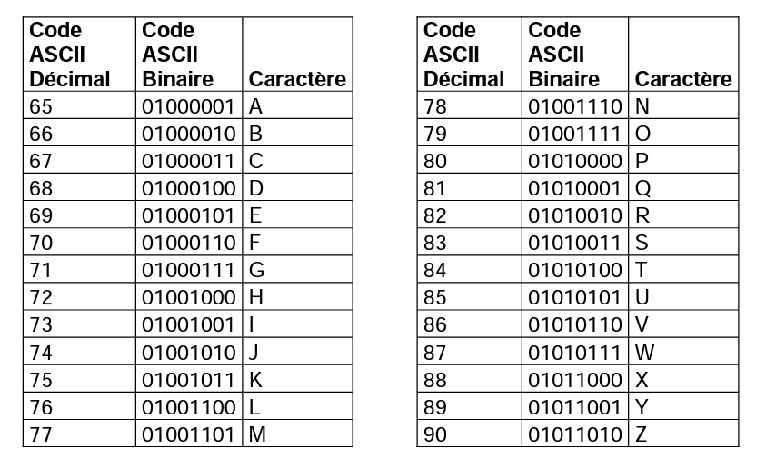

    On souhaite mettre au point une méthode de cryptage à l’aide de la fonction XOR. Pour cela, on dispose d’un message à crypter et d’une clé de cryptage de même longueur que ce message. Le message et la clé sont composés uniquement des caractères du tableau ci-dessus et on applique la fonction XOR caractère par caractère entre les lettres du message à crypter et les lettres de la clé de cryptage.   

    Par exemple, voici le cryptage du mot ALPHA à l’aide de la clé YAKYA : 
    
    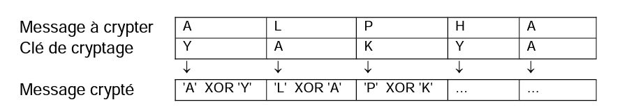
    
    **Ecrire** une fonction `xor_crypt(message, cle)` qui prend en paramètres deux chaînes de caractères et qui renvoie la liste des entiers correspondant au message crypté.    
    
    ??? tip "Aide"
        - On pourra utiliser la fonction native du langage Python `ord(c)` qui prend en paramètre un caractère c et qui renvoie un nombre représentant le code ASCII du caractère c.  
        - On considère également que l’on dispose d’une fonction écrite `xor(n1,n2)` qui prend en paramètre deux nombres $n1$ et $n2$ et qui renvoie le résultat de  $n1 \oplus n2$.  
    
    ??? tip "Fonction à trou"
        ```python
        def xor_crypt(message,cle):
            liste = []
            for i in range(...):
                code_caractere = ...
                code_cle = ord(cle[i])
                code_caractere_crypte = xor(code_caractere,code_cle)
                liste.append(....)
            return liste
        ```
!!! question  "Question 4"
    On souhaite maintenant générer une clé de la taille du message à partir d’un mot quelconque.  
    On considère que le mot choisi est plus court que le message, il faut donc le reproduire un certain nombre de fois pour créer une clé de la même longueur que le message.   
    Par exemple, si le mot choisi est YAK pour crypter le message ALPHABET, la clé sera YAKYAKYA.  
    Créer une fonction `generer_cle(mot,n)` qui renvoie la clé de longueur `n` à partir de la chaîne de caractères `mot`. 
    
    ??? tip "aide" 
        ```python
        def genere_cle(mot,n):
            nb_fois = n ... len(mot)
            reste = n ... len(mot)
            cle = nb_fois * mot
            for i in range(...):
                cle += ...
            return cle

        ```

!!! question "Question 5"
    **Recopier** et **compléter** la table de vérité de $(E1 \oplus E_2$.  

    | $E_1$  | $E_2$ | $E_1 \oplus E_2$ | $(E_1 \oplus E_2) \oplus E_2$|
    |:-:|:-:|:-:|:-:|
    | $0$ |$0$ | $0$ |  |
    | $0$ |$1$ | $1$ |  |
    | $1$ |$0$ | $1$ |  |
    | $1$ |$1$ | $0$ |  |
    
    A l’aide de ce résultat, proposer une démarche pour décrypter un message crypté.  