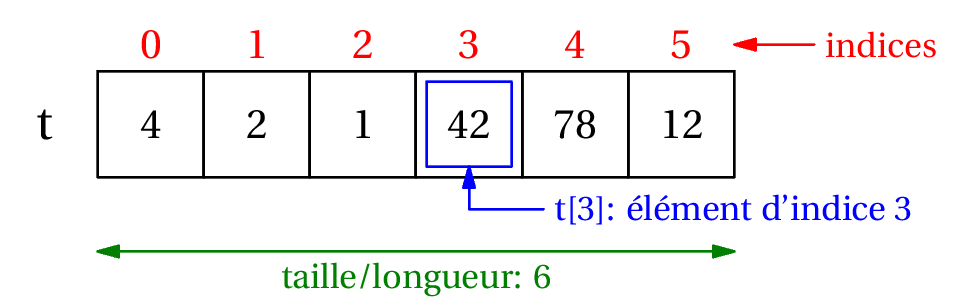







{{ titre_chapitre(num,titre,theme,niveau)}}

{{ initexo(0) }}


## Notion de tableau, indices 


En informatique (comme ailleurs...), un tableau permet de stocker de façon structurée plusieurs valeurs, en général de même type.

!!! note "Remarque :"
    même si Python l'autorise, il n'y a pas beaucoup de situations où on va créer un tableau avec des valeurs de types différents.

Voici comment on se représente traditionnellement un tableau de 6 entiers, avec des cases (ou cellules):

{:.center width=80%}

Bien entendu, il faut stocker ce tableau dans un variable et lui donner un nom. Appelons-le `t`. Ce tableau est **ordonné**, le premier élément est 4, le deuxième est 2, et le dernier est 12.

On repère chaque élément du tableau par sa position, le numéro de la case, qu'on appelle **indice**.

{:.center width=75%}

Généralement, on utilise la notation `t[i]` pour désigner l'élement d'indice `i` du tableau `t`. Par exemple, dans notre exemple, `t[3]` contient la valeur 42.

Enfin la **taille** ou **longueur** d'un tableau est le nombre d'éléments qu'il contient. Ici le tableau `t` a une taille égale à 6.

## Les tableaux en Python

    

!!! warning "ATTENTION :"
    Dans la suite nous allons employer le terme «**tableau**». Pour parler de ces «tableaux» les concepteurs de Python ont choisi d'utiliser le terme de «**list**» («liste» en français).  
    Pour éviter toute confusion, notamment par rapport à des notions qui seront abordées en terminale, le choix a été fait d'employer «tableau» à la place de «liste» (dans la documentation vous rencontrerez le terme «list», cela ne devra pas vous pertuber)

 
**Les tableaux** sont des séquences, ils **sont modifiables** (on parle d'**objets «mutables»**).

En Python, on implémente le type abstrait de tableau par le type `list`.  
On définit un tableau avec des **crochets** et on sépare ses éléments par des **virgules**. Par abus de langage on parle de liste plutôt que de tableau


### &#x2712; Déclaration d'une liste ou d'un tableau


!!! exemples

    ```python
    famille = ["Bart", "Lisa", "Maggie"] 
    print(famille)
    ['Bart', 'Lisa', 'Maggie']
    ```


!!! note "Remarques :"

    - Même si cela n'a ici un grand intérêt, les éléments d'une liste peuvent donc être de types différents : ici, tous les éléments de ma liste sont des chaînes de caractères (`str`), mais la liste `["Bart", 5, "Lisa", "Maggie"]` est aussi une liste valide.

    - Une liste **vide** se déclarera avec ```[]```.


    ```python
    copies_corrigees = []
    ```

Nous verrons plus tard qu'il est fréquent dans les exercices de partir d'une liste vide et d'ajouter progressivement des éléments.

### &#x2712; Accés aux élèments d'une liste


On accède à un élément d'une liste en mettant entre crochets l'indice de l'élément (qui commence à **zéro**).


```python
>>>famille[0]
'Bart'
```

```python
>>>famille[2]
'Maggie'
```

```python
>>>famille[3]

Traceback (most recent call last):
  File "<input>", line 1, in <module>
IndexError: list index out of range
```

!!! note "Remarques :"

    - Un indice qui dépasse la valeur  `longueur de la liste -1` provoquera donc une erreur `list index out of range`. C'est une erreur **très fréquente** lorsqu'on manipule des listes.


    - Il est par contre possible d'utiliser des indices **négatifs**. On utilise par exemple très souvent l'indice -1 pour accéder au dernier élément de la liste, sans avoir à connaître la longueur de celle-ci :


    ```python
    >>>famille[-1]
    'Maggie'
    ```


### &#x2712; Longueur d'une liste


La longueur d'une liste sera donnée par la fonction `len()`, qui renvoie donc un nombre entier positif ou nul.


```python
>>>len(famille)
3
```
- Le dernier élément d'une liste ```maliste``` (non vide) sera donc toujours l'élément d'indice ```len(maliste)-1```.


```python
>>>famille[len(famille) - 1]
'Maggie'
```

```python
>>>famille[len(famille)]
Traceback (most recent call last):
   File "<input>", line 1, in <module>
IndexError: list index out of range
```

### &#x2712; Parcours des éléments d'une liste


Il existe principalement deux méthodes pour parcourir une liste: par ses éléments ou par les indices. Mais dans les deux cas on utilise une boucle `for`.

!!! method  "Parcours «par éléments»" 

    C'est la méthode la plus naturelle, celle déjà vue lors de la présentation de la boucle ```for```. Nous allons simplement *itérer* sur les éléments de la liste.  
    On l'a déjà rencontré sur la boucle `for`:


    ```python
    famille = ["Bart", "Lisa", "Maggie"]

    for membre in famille:
        print(membre)
    
    Bart
    Lisa
    Maggie
    ```


!!! note "Remarque :"

    - Penser à donner un nom signifiant à la variable qui parcourt la liste. Il aurait par exemple été très maladroit d'écrire 


    ```python
    for k in famille:
        print(k)

    Bart
    Lisa
    Maggie
    ```


    En effet le nom de variable ```k``` est habituellement utilisé pour les nombres (les indices, les compteurs...).

!!! exo 
    Après un référendum, la liste ```urne``` contient uniquement des ```'oui'``` ou des ```'non'```.  
    Déterminer le pourcentage de `oui` de ce référendum.


    ```python
    urne = ['oui', 'non', 'non', 'oui', 'oui', 'oui', 'non', 'oui', 'oui', 'oui', 'non', 'oui', 'non', 'non', 'oui', 'non', 'non', 'oui', 'oui', 'oui', 'oui', 'non', 'non', 'oui', 'non', 'oui', 'non', 'non', 'non', 'oui', 'oui', 'oui', 'oui', 'non', 'oui', 'non', 'non', 'oui', 'non', 'non', 'oui', 'non', 'non', 'non', 'non', 'non', 'non', 'non', 'oui', 'non', 'non', 'oui', 'oui', 'non', 'oui', 'oui', 'oui', 'oui', 'oui', 'oui', 'non', 'non', 'oui', 'oui', 'oui', 'oui', 'non', 'non', 'non', 'oui', 'oui', 'oui', 'non', 'non', 'non', 'non', 'oui', 'non', 'non', 'non', 'non', 'non', 'non', 'non', 'non', 'oui', 'non', 'oui', 'non', 'non', 'oui', 'oui', 'non', 'non', 'non', 'oui', 'oui', 'non', 'oui', 'oui', 'non', 'non', 'oui', 'oui', 'oui', 'non', 'oui', 'non', 'oui', 'oui', 'oui', 'oui', 'oui', 'non', 'non', 'non', 'non', 'oui', 'oui', 'oui', 'non', 'oui', 'non', 'oui', 'oui', 'oui', 'oui', 'oui', 'non', 'non', 'oui', 'non', 'non', 'non', 'non', 'non', 'non', 'oui', 'non', 'non', 'oui', 'non', 'non', 'oui', 'non', 'non', 'oui', 'oui', 'oui', 'oui', 'oui', 'oui', 'non', 'oui']
    ```

!!! jeretiens "Avantages et inconvénients du Parcours par élément"

    ```python
        for membre in famille:
            print(membre)
    ```

    **Les avantages** :

    - la simplicité : un code plus facile à écrire, avec un nom de variable explicite.
    - la sécurité  : pas de risque d'```index out of range``` !

    **Les inconvénients** :

    - méthode rudimentaire : lorsqu'on est «positionné» sur un élément, il n'est pas possible d'accéder au précédent ou au suivant. (et c'est parfois utile).
    - on n'accéde pas à la position (indice) de l'élément.
    - on ne peut pas modifier l'élément sur lequel on est positionné :


    ```python
    lst = [1, 2, 3]
    for nb in lst:
        nb = nb * 2 # (1)
        
    lst 

    [1, 2, 3]
    ```


1. On veut multiplier par 2 chaque élément de la liste
2. La liste ```lst``` n'a pas changé...

!!! method  "Parcours «par indice»"

    Chaque élément étant accessible par son indice (de ```0``` à   ```len(liste) - 1``` ), il suffit de faire parcourir à une variable ```i``` l'ensemble des entiers de ```0``` à   ```len(liste) - 1```, par l'instruction ```range(len(liste))``` :


    ```python
    famille = ["Bart", "Lisa", "Maggie"]

    for i in range(len(famille)):
        print(famille[i])
    
    Bart
    Lisa
    Maggie
    ```


    **Bonne habitude à prendre** : nommer sa variable d'indice ```i```, ```j```, ```k``` ou ```indice``` mais pas autre chose !  

!!! jeretiens "Avantages et inconvénients du Parcours par indice"

    ```python
        for i in range(len(famille)):
            print(famille[i])
    ```

    **Les avantages**  :

    - le contrôle : en parcourant par indice, on peut s'arrêter où on veut, on peut accéder au suivant/précédent...
    - pour les tableaux à deux dimensions, on retrouve la désignation classique d'un élément par numéro de ligne / numéro de colonne.

    **Les inconvénients** :

    - la complexité : il faut connaître le nombre d'éléments de la liste (ou le récupérer par la fonction ```len()``` )
    - le risque d'erreur : encore et toujours le ```index out of range```...

!!! exo 

    On donne la liste :
    ```python
    lst = [3, 1, 4, 1, 5, 9]
    ```

    En utilisant un parcours **par indice** :
            
    1. Afficher les éléments de cette liste.  
    2. Afficher les éléments de cette liste **dans l'ordre inverse** (en commençant par 9)


!!! exo 
    Trouvez le nombre qui est **exactement à la même place** dans la liste `list1` et dans la liste `list2`, sachant que :

    - les deux listes ont la même taille  
    - vous n'avez droit qu'à une seule boucle ```for```. 


    ```python
    list1 = [8468, 4560, 3941, 3328, 7, 9910, 9208, 8400, 6502, 1076, 5921, 6720, 948, 9561, 7391, 7745, 9007, 9707, 4370, 9636, 5265, 2638, 8919, 7814, 5142, 1060, 6971, 4065, 4629, 4490, 2480, 9180, 5623, 6600, 1764, 9846, 7605, 8271, 4681, 2818, 832, 5280, 3170, 8965, 4332, 3198, 9454, 2025, 2373, 4067]

    list2 = [9093, 2559, 9664, 8075, 4525, 5847, 67, 8932, 5049, 5241, 5886, 1393, 9413, 8872, 2560, 4636, 9004, 7586, 1461, 350, 2627, 2187, 7778, 8933, 351, 7097, 356, 4110, 1393, 4864, 1088, 3904, 5623, 8040, 7273, 1114, 4394, 4108, 7123, 8001, 5715, 7215, 7460, 5829, 9513, 1256, 4052, 1585, 1608, 3941]
    ```


!!! exo 

    Dans la liste 

    ```python
    lst = [2428970, 1518306, 4971405, 1690994, 7918102, 4030834, 8830131, 7514856, 7903128, 6307569, 6624056, 5260490, 6447835, 4598783, 9108626, 5045240, 4128269, 4460134, 2497873, 5076659, 8104003, 7604887, 7451976, 4136924, 5691945, 8726293, 7855592, 3562473, 8849129, 6488474, 5303587, 2606124, 5484044, 4559758, 7592232, 2211406, 9974334, 7988936, 7582946, 7668748, 1799997, 3837917, 3196209, 7064342, 2543765, 1182013, 7253381, 1153735, 1037391, 4375946, 4445821, 5965587, 6001887, 4162629, 5235783, 8716582, 4901175, 5445422, 1120005, 8332321, 7075046, 2194175, 5557300, 2887907, 5103214, 2520744, 5104399, 2065665, 3035703, 7890213, 1758301, 3407982, 1355453, 4896338, 7979392, 9671602, 9690721, 7423779, 7423780, 3080825, 6785783, 3836837, 7310931, 1857470, 3492507, 2823231, 1492310, 1911148, 9620515, 5564910, 7009452, 7464745, 9608747, 7267383, 6939140, 6556578, 3592267, 8135497, 4881660, 5346884, 6859150]
    ```

    se cachent deux nombres consécutifs. Pouvez-vous les trouver ?


### &#x2712; Modification d'une liste

En Python, les objets de type `list` sont modifiables (on emploie le mot *mutable*). Et c'est souvent une bonne chose, car des listes peuvent évoluer après leur création. 

!!! jeretiens "Modification d'un élément existant"

    On modifie un élément du tableau par simple affectation, en écrasant sa valeur avec la nouvelle.


    ```python
    famille = ["Bart", "Lisa", "Maggie"]
    famille[0] = "Bartholomew" # oui, c'est son vrai nom
    print(famille)
    
    ['Bartholomew', 'Lisa', 'Maggie']
    ```


!!! jeretiens "Ajout d'un élement à la fin d'une liste : la méthode **append()**"

    On modifie un élément du tableau par simple affectation, en écrasant sa valeur avec la nouvelle.

    ```python
    famille = ["Bart", "Lisa", "Maggie"]
    famille.append("Milhouse")
    print(famille  )

    ['Bart', 'Lisa', 'Maggie', 'Milhouse']
    ```


!!! note "Remarques :"

    - La méthode `append()` rajoute donc un élément **à la fin** de la liste.  
    - Dans **beaucoup** d'exercices, on part d'une liste vide ```[]``` que l'on remplit peu à peu avec des ```append()```.  
    - *(HP)* Il est possible d'insérer un élément à la position ```i``` avec la méthode ```insert``` :


    ```python
    famille = ["Bart", "Lisa", "Maggie"]
    famille.insert(1, "Nelson") # on insère à la position 1
    print(famille)

    ['Bart', 'Nelson', 'Lisa', 'Maggie']
    ```


!!! exo 
    Construire une liste contenant tous les nombres inférieurs à 100 qui sont divisibles par 7.


!!! jeretiens "Suppression d'un élément d'une liste par la méthode **remove()**"

    ```python
    famille = ['Bart', 'Nelson', 'Lisa', 'Maggie']
    famille.remove("Nelson")
    print(famille)
    
    ['Bart', 'Lisa', 'Maggie']
    ```

!!! note "Remarques :"

    - Attention, ```remove``` n'enlève que la *première occurrence* de l'élément désigné. S'il y en a d'autres après, elles resteront dans la liste :


    ```python
    lst = [3, 1, 4, 5, 1, 9, 4]
    lst.remove(4)
    print(lst)

    [3, 1, 5, 1, 9, 4]
    ```


    - Si l'élément à supprimer n'est pas trouvé, un message d'erreur est renvoyé :


    ```python
    lst = [3, 1, 4, 5, 1, 9]
    lst.remove(2)
    ```

        Traceback (most recent call last):
        File "<input>", line 2, in <module>
        ValueError: list.remove(x): x not in list


### &#x2712; Exercices

!!! exo 

    On considère la liste 
            
    ```python
    temp = [11, 28, -16, -18, -10, 16, 10, 16, 2, 7, 23, 22, -4, -2, 19, 16, 22, -8, 18, -14, 29, -1, 16, 22, -5, 6, 2, -4, 9, -17, -13, 22, 14, 24, 22, -9, -18, -9, 25, -11, 17, 17, 25, -10, 2, -18, 29, 14, -16, 7]
    ```

    Construire la liste `temp_pos` qui ne contient que les éléments positifs de `temp`.

!!! exo "Exercice 7. BNS - EP"

    Programmer la fonction `recherche(tab: list, n: int) -> int`, prenant en paramètre un tableau non vide `tab` (type `list`) d'entiers et un entier `n`, et qui renvoie l'indice de la dernière occurrence de l'élément cherché. Si l'élément n'est pas présent, la fonction renvoie la longueur du tableau.

    Exemples :

    ```python 
    >>> recherche([5, 3],1)
    2
    >>> recherche([2,4],2)
    0
    >>> recherche([2,3,5,2,4],2)
    3
    ```


!!! exo 
    On considère la liste ```lst = [51, 52, 66, 91, 92, 82, 65, 53, 86, 42, 79, 95]```. Seuls les nombres entre 60 et 90 ont une signification : ce sont des codes ASCII (récupérables par la fonction ```chr``` ).   
    Créer une liste ```sol``` qui contient les lettres correspondants aux nombres ayant une signification.


    ```python
    lst = [51, 52, 66, 91, 92, 82, 65, 53, 86, 42, 79, 95]
    ```
