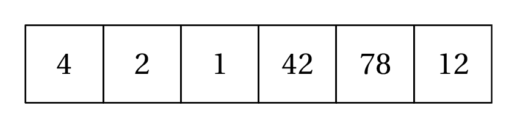
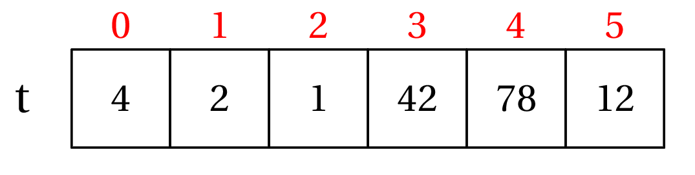
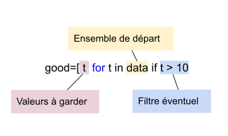
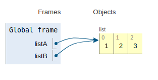

---
title : Les Listes en Python
subtitle: Thème 2 - Types construits
author : Première NSI
numbersections: true
fontsize: 10pt
geometry:
- top=20mm
- left=20mm
- right=20mm
- heightrounded    
--- 


Thème 2 - Types construits
===

{{ initexo(0) }}
{{ initexple(0) }}

<table  class="blueTable">
        <tr >
            <th width="20%"; style="background-color: #3B444B;color:white;text-align:center;border:none;font-size:40pt;">
            00
            </th>
            <th  width="80%"; style="text-align:center;color:white;border:none;font-size:25pt;">Les Listes en Python</th>
        </tr>
</table>
<br>


{:.center}

!!! progNSI "Programme Première"
    |Contenus|Capacités attendues|Commentaires|
    |:---|:---|:---|
    |Tableau indexé, tableau donné en compréhension  |Lire et modifier les éléments d’un tableau grâce à leurs index. Construire un tableau par compréhension. Utiliser des tableaux de tableaux pour représenter des matrices : notation a `[i][j]`. Itérer sur les éléments d’un tableau. | Seuls les tableaux dont les éléments sont du même type sont présentés. Aucune connaissance des tranches (slices) n’est exigible. L’aspect dynamique des tableaux de Python n’est pas évoqué. Python identifie listes et tableaux. Il n’est pas fait référence aux tableaux de la bibliothèque NumPy. |


## Notion de tableau, indices

En informatique (comme ailleurs...), un tableau permet de stocker de façon structurée plusieurs valeurs, en général de même type[^1].

[^1]: même si Python l'autorise, il n'y a pas beaucoup de situations où on va créer un tableau avec des valeurs de types différents.

Voici comment on se représente traditionnellement un tableau de 6 entiers, avec des cases (ou cellules):

{: .center width=50%} 

Bien entendu, il faut stocker ce tableau dans un variable et lui donner un nom. Appelons-le `t`. Ce tableau est **ordonné**, le premier élément est 4, le deuxième est 2, et le dernier est 12.

On repère chaque élément du tableau par sa position, le numéro de la case, qu'on appelle **indice**.

{: .center width=50%} 

Généralement, on utilise la notation `t[i]` pour désigner l'élement d'indice `i` du tableau `t`. Par exemple, dans notre exemple, `t[3]` contient la valeur 42.

Enfin la **taille** d'un tableau est le nombre d'éléments qu'il contient. Ici le tableau `t` a une taille égale à 6.


## Tableau et liste de Python

!!! voc "Le type `list`"
    En Python, on implémente le type abstrait de tableau par le type `list`. On définit un tableau avec des **crochets** et on sépare ses éléments par des **virgules**. Par abus de langage on parle de liste plutôt que de tableau[^2].

    Une liste vide se déclarera par `[]`.

    [^2]: en fait la liste est un autre type abstrait de données en informatique. Python identifie un peu les deux. C'est un peu plus compliqué en réalité, mais c'est une autre histoire...

### Déclaration d'une liste

!!! example "{{ exemple() }}"
    ```python
    >>> t = [4, 2, 1, 42, 78, 12]
    >>> type(t)
    <class 'list'>
    >>> famille = ["Bart", "Lisa", "Maggie"] # (1)
    >>> type(famille)
    <class 'list'>
    ```
    1. Nous prendrons souvent l'exemple de la famille Simpsons.


- Une liste **vide** se déclarera avec ```[]```.
```python
>>> copies_corrigees = []
``` 
Nous verrons plus tard qu'il est fréquent dans les exercices de partir d'une liste vide et d'ajouter progressivement des éléments.


###  Accès aux éléments d'une liste

!!! example "{{ exemple() }}"
    ```python
    >>> t = [4, 2, 1, 42, 78, 12]
    >>> t[3]
    42
    >>> t[-1]
    12
    >>> famille = ["Bart", "Lisa", "Maggie"] # (1)
    >>> famille[0]
    'Bart'
    >>> famille[1]
    'Lisa'
    >>> famille[2]
    'Maggie'
    >>> famille[3]
    Traceback (most recent call last):
    File "<pyshell>", line 1, in <module>
    IndexError: list index out of range
    ```


**Remarques :**

- Un indice qui dépasse la valeur  `longueur de la liste -1` provoquera donc une erreur `list index out of range`. C'est une erreur **très fréquente** lorsqu'on manipule des listes.


- Il est par contre possible d'utiliser des indices **négatifs**. On utilise par exemple très souvent l'indice -1 pour accéder au dernier élément de la liste, sans avoir à connaître la longueur de celle-ci :

```python
>>> famille[-1]
'Maggie'
```

### Longueur d'une liste

!!! example "{{ exemple() }}"
    La longueur d'une liste sera donnée par la fonction `len()`, qui renvoie donc un nombre entier positif ou nul.
    ```python
    >>> len(famille)
    3
    ```

**Remarques :**

- La liste vide a pour longueur 0 :
```python
>>> len([])
0
```
- Le dernier élément d'une liste ```maliste``` (non vide) sera donc toujours l'élément d'indice ```len(maliste)-1```.
```python
>>> famille[len(famille) - 1]
'Maggie'
```
- Comme indiqué précédemment, ce dernier élément est aussi accessible par l'indice -1.


**Remarques bis**:

- on obtient la taille d'une liste avec la fonction `len`;
- un indice supérieur à `len(t) - 1` provoque une erreur `IndexError: list index out of range` (en dehors de la liste);
- on peut utiliser les indices négatifs: en particulier l'indice -1 permet d'accèder facilement au **dernier** élement.


## Parcours des éléments d'une liste :star: :star: :star:


Il existe principalement deux méthodes pour parcourir une liste :  
- par ses éléments   
- par les indices.   
Mais dans les deux cas on utilise une boucle `for`.   
Ces deux méthodes sont à maîtriser impérativement.


### Parcours «par éléments»

C'est la méthode la plus naturelle, celle déjà vue lors de la présentation de la boucle ```for```. Nous allons simplement *itérer* sur les éléments de la liste.

!!! example "{{ exemple() }}"
    Le code :
    ```python linenums='1'
    famille = ["Bart", "Lisa", "Maggie"]

    for membre in famille:
        print(membre)
    ```
    renverra :
    ```python
    Bart
    Lisa
    Maggie
    ```

**Remarque :**

- Penser à donner un nom signifiant à la variable qui parcourt la liste. Il aurait par exemple été très maladroit d'écrire 
```python
for k in famille:
    print(k)
```
En effet le nom de variable ```k``` est habituellement utilisé pour les nombres (les indices, les compteurs...).


!!! example "{{ exercice() }}"
    === "Énoncé"
        Après un référendum, la liste ```urne``` contient uniquement des ```'oui'``` ou des ```'non'```.
        Déterminer le vainqueur de ce référendum.


        ```python
        urne = ['oui', 'non', 'non', 'oui', 'oui', 'oui', 'non', 'oui', 'oui', 'oui', 'non', 'oui', 'non', 'non', 'oui', 'non', 'non', 'oui', 'oui', 'oui', 'oui', 'non', 'non', 'oui', 'non', 'oui', 'non', 'non', 'non', 'oui', 'oui', 'oui', 'oui', 'non', 'oui', 'non', 'non', 'oui', 'non', 'non', 'oui', 'non', 'non', 'non', 'non', 'non', 'non', 'non', 'oui', 'non', 'non', 'oui', 'oui', 'non', 'oui', 'oui', 'oui', 'oui', 'oui', 'oui', 'non', 'non', 'oui', 'oui', 'oui', 'oui', 'non', 'non', 'non', 'oui', 'oui', 'oui', 'non', 'non', 'non', 'non', 'oui', 'non', 'non', 'non', 'non', 'non', 'non', 'non', 'non', 'oui', 'non', 'oui', 'non', 'non', 'oui', 'oui', 'non', 'non', 'non', 'oui', 'oui', 'non', 'oui', 'oui', 'non', 'non', 'oui', 'oui', 'oui', 'non', 'oui', 'non', 'oui', 'oui', 'oui', 'oui', 'oui', 'non', 'non', 'non', 'non', 'oui', 'oui', 'oui', 'non', 'oui', 'non', 'oui', 'oui', 'oui', 'oui', 'oui', 'non', 'non', 'oui', 'non', 'non', 'non', 'non', 'non', 'non', 'oui', 'non', 'non', 'oui', 'non', 'non', 'oui', 'non', 'non', 'oui', 'oui', 'oui', 'oui', 'oui', 'oui', 'non', 'oui']
        ``` 
    === "Correction"
        {{ correction(True,
        "
        ```python linenums='1'
        urne = ['oui', 'non', 'non', 'oui', 'oui', 'oui', 'non', 'oui', 'oui', 'oui', 'non', 'oui', 'non', 'non', 'oui', 'non', 'non', 'oui', 'oui', 'oui', 'oui', 'non', 'non', 'oui', 'non', 'oui', 'non', 'non', 'non', 'oui', 'oui', 'oui', 'oui', 'non', 'oui', 'non', 'non', 'oui', 'non', 'non', 'oui', 'non', 'non', 'non', 'non', 'non', 'non', 'non', 'oui', 'non', 'non', 'oui', 'oui', 'non', 'oui', 'oui', 'oui', 'oui', 'oui', 'oui', 'non', 'non', 'oui', 'oui', 'oui', 'oui', 'non', 'non', 'non', 'oui', 'oui', 'oui', 'non', 'non', 'non', 'non', 'oui', 'non', 'non', 'non', 'non', 'non', 'non', 'non', 'non', 'oui', 'non', 'oui', 'non', 'non', 'oui', 'oui', 'non', 'non', 'non', 'oui', 'oui', 'non', 'oui', 'oui', 'non', 'non', 'oui', 'oui', 'oui', 'non', 'oui', 'non', 'oui', 'oui', 'oui', 'oui', 'oui', 'non', 'non', 'non', 'non', 'oui', 'oui', 'oui', 'non', 'oui', 'non', 'oui', 'oui', 'oui', 'oui', 'oui', 'non', 'non', 'oui', 'non', 'non', 'non', 'non', 'non', 'non', 'oui', 'non', 'non', 'oui', 'non', 'non', 'oui', 'non', 'non', 'oui', 'oui', 'oui', 'oui', 'oui', 'oui', 'non', 'oui']

        nb_oui = 0
        for vote in urne:
            if vote == 'oui':
                nb_oui += 1
        print('pourcentage de oui', 100*nb_oui/len(urne), '%')
        ```
        "
        ) }}

### Parcours «par indice»

Chaque élément étant accessible par son indice (de ```0``` à   ```len(liste) - 1``` ), il suffit de faire parcourir à une variable ```i``` l'ensemble des entiers de ```0``` à   ```len(liste) - 1```, par l'instruction ```range(len(liste))``` :


!!! example "{{ exemple() }}"
    Le code :
    ```python linenums='1'
    famille = ["Bart", "Lisa", "Maggie"]

    for i in range(len(famille)):
        print(famille[i])
    ```
    renverra :
    ```python
    Bart
    Lisa
    Maggie
    ```

:warning: **Bonne habitude à prendre** : nommer sa variable d'indice ```i```, ```j```, ```k``` ou ```indice``` mais pas autre chose !  


### Avantages et inconvénients de chaque méthode

#### Parcours par élément 

```python
    for membre in famille:
        print(membre)
```

**Les avantages** :+1:

- la simplicité : un code plus facile à écrire, avec un nom de variable explicite.
- la sécurité  : pas de risque d'```index out of range``` !

**Les inconvénients** :-1:

- méthode rudimentaire : lorsqu'on est «positionné» sur un élément, il n'est pas possible d'accéder au précédent ou au suivant. (et c'est parfois utile).
- on n'a pas accès à l'indice correspondant à la valeur.
- on ne peut pas modifier l'élément sur lequel on est positionné :

```python
>>> lst = [1, 2, 3]
>>> for nb in lst:
        nb = nb * 2 # (1)
    
>>> lst 
[1, 2, 3] # (2)
```

1. On veut multiplier par 2 chaque élément de la liste
2. La liste ```lst``` n'a pas changé...


####
 Parcours par indice 

```python
    for i in range(len(famille)):
        print(famille[i])
```

**Les avantages**  :+1:

- le contrôle : en parcourant par indice, on peut s'arrêter où on veut, on peut accéder au suivant/précédent...
- pour les tableaux à deux dimensions, on retrouve la désignation classique d'un élément par numéro de ligne / numéro de colonne.

**Les inconvénients** :-1:

- la complexité : il faut connaître le nombre d'éléments de la liste (ou le récupérer par la fonction ```len()``` )
- le risque d'erreur : encore et toujours le ```index out of range```...


!!! exo "{{ exercice() }}"
    === "Énoncé"
        On donne la liste :
        ```python
        lst = [3, 1, 4, 1, 5, 9]
        ```
        En utilisant un parcours **par indice** :
        
        1. Afficher les éléments de cette liste.
        2. Afficher les éléments de cette liste **dans l'ordre inverse** (en commençant par 9)

    === "Correction :heart:"
        {{ correction(True,
        "
        ```python linenums='1'
        lst = [3, 1, 4, 1, 5, 9]

        for i in range(len(lst)-1, -1, -1):
            print(lst[i])


        ```
        "
        ) }}

!!! exo "{{ exercice() }}"
    === "Énoncé"
        Trouvez le nombre qui est **exactement à la même place** dans la liste `list1` et dans la liste `list2`, sachant que :

        - les deux listes ont la même taille
        - vous n'avez droit qu'à une seule boucle ```for```. 

        ```python
        list1 = [8468, 4560, 3941, 3328, 7, 9910, 9208, 8400, 6502, 1076, 5921, 6720, 948, 9561, 7391, 7745, 9007, 9707, 4370, 9636, 5265, 2638, 8919, 7814, 5142, 1060, 6971, 4065, 4629, 4490, 2480, 9180, 5623, 6600, 1764, 9846, 7605, 8271, 4681, 2818, 832, 5280, 3170, 8965, 4332, 3198, 9454, 2025, 2373, 4067]
        list2 = [9093, 2559, 9664, 8075, 4525, 5847, 67, 8932, 5049, 5241, 5886, 1393, 9413, 8872, 2560, 4636, 9004, 7586, 1461, 350, 2627, 2187, 7778, 8933, 351, 7097, 356, 4110, 1393, 4864, 1088, 3904, 5623, 8040, 7273, 1114, 4394, 4108, 7123, 8001, 5715, 7215, 7460, 5829, 9513, 1256, 4052, 1585, 1608, 3941]
        ```
        
    === "Correction"
        {{ correction(True,
        "
        ```python linenums='1'
        list1 = [8468, 4560, 3941, 3328, 7, 9910, 9208, 8400, 6502, 1076, 5921, 6720, 948, 9561, 7391, 7745, 9007, 9707, 4370, 9636, 5265, 2638, 8919, 7814, 5142, 1060, 6971, 4065, 4629, 4490, 2480, 9180, 5623, 6600, 1764, 9846, 7605, 8271, 4681, 2818, 832, 5280, 3170, 8965, 4332, 3198, 9454, 2025, 2373, 4067]
        list2 = [9093, 2559, 9664, 8075, 4525, 5847, 67, 8932, 5049, 5241, 5886, 1393, 9413, 8872, 2560, 4636, 9004, 7586, 1461, 350, 2627, 2187, 7778, 8933, 351, 7097, 356, 4110, 1393, 4864, 1088, 3904, 5623, 8040, 7273, 1114, 4394, 4108, 7123, 8001, 5715, 7215, 7460, 5829, 9513, 1256, 4052, 1585, 1608, 3941]

        for i in range(len(list1)):
            if list1[i] == list2[i]:
                print(list1[i])
        ```
        "
        ) }}

!!! example "{{ exercice() }}"
    === "Énoncé"
        Dans la liste 

        ```python
        lst = [2428970, 1518306, 4971405, 1690994, 7918102, 4030834, 8830131, 7514856, 7903128, 6307569, 6624056, 5260490, 6447835, 4598783, 9108626, 5045240, 4128269, 4460134, 2497873, 5076659, 8104003, 7604887, 7451976, 4136924, 5691945, 8726293, 7855592, 3562473, 8849129, 6488474, 5303587, 2606124, 5484044, 4559758, 7592232, 2211406, 9974334, 7988936, 7582946, 7668748, 1799997, 3837917, 3196209, 7064342, 2543765, 1182013, 7253381, 1153735, 1037391, 4375946, 4445821, 5965587, 6001887, 4162629, 5235783, 8716582, 4901175, 5445422, 1120005, 8332321, 7075046, 2194175, 5557300, 2887907, 5103214, 2520744, 5104399, 2065665, 3035703, 7890213, 1758301, 3407982, 1355453, 4896338, 7979392, 9671602, 9690721, 7423779, 7423780, 3080825, 6785783, 3836837, 7310931, 1857470, 3492507, 2823231, 1492310, 1911148, 9620515, 5564910, 7009452, 7464745, 9608747, 7267383, 6939140, 6556578, 3592267, 8135497, 4881660, 5346884, 6859150]

        ```
        se cachent deux nombres consécutifs. Pouvez-vous les trouver ?

    === "Correction"
        ```python linenums='1'
        lst = [2428970, 1518306, 4971405, 1690994, 7918102, 4030834, 8830131, 7514856, 7903128, 6307569, 6624056, 5260490, 6447835, 4598783, 9108626, 5045240, 4128269, 4460134, 2497873, 5076659, 8104003, 7604887, 7451976, 4136924, 5691945, 8726293, 7855592, 3562473, 8849129, 6488474, 5303587, 2606124, 5484044, 4559758, 7592232, 2211406, 9974334, 7988936, 7582946, 7668748, 1799997, 3837917, 3196209, 7064342, 2543765, 1182013, 7253381, 1153735, 1037391, 4375946, 4445821, 5965587, 6001887, 4162629, 5235783, 8716582, 4901175, 5445422, 1120005, 8332321, 7075046, 2194175, 5557300, 2887907, 5103214, 2520744, 5104399, 2065665, 3035703, 7890213, 1758301, 3407982, 1355453, 4896338, 7979392, 9671602, 9690721, 7423779, 7423780, 3080825, 6785783, 3836837, 7310931, 1857470, 3492507, 2823231, 1492310, 1911148, 9620515, 5564910, 7009452, 7464745, 9608747, 7267383, 6939140, 6556578, 3592267, 8135497, 4881660, 5346884, 6859150]

        for i in range(len(lst)-1): # Il faut s'arrêter à l'avant-dernier élément de la liste
            if lst[i] + 1 == lst[i+1]:
                print(lst[i], lst[i+1])
        ```


### Création de listes

Jusqu'à présent on a créé des listes en *extension*, c'est-à-dire qu'on a écrit tous les éléments un par un entre crochets. Voici deux autres façons de faire, souvent pratiques et parfois plus rapides lorsque la taille de la liste est grande.

!!! info "Avec une boucle `for` et la méthode `append`"
    On crée une liste vide, puis on lui ajoute élément par élément.

    Création d'une liste contenant les entiers multiples de 3 ou de 5 inférieurs à 100:
    
    ```python linenums='1'
    multiples = []
    for k in range(101):
        if k%3 == 0 or k%5 == 0:
            multiples.append(k)
    ```
!!! info "Construction d'une liste *en compréhension* :star: :star: :star:"
    C'est une grande caractéristique du langage Python (même si ce n'est pas une exclustivité) : la méthode de liste en compréhension propose une manière élégante, rapide et naturelle pour créer des listes.

    **«en compréhension», pourquoi ?**  
    Cette expression vient des mathématiques. On dit qu'on définit un sous-ensemble *par compréhension* lorsqu'on part d'un ensemble plus grand dont on ne garde que les éléments vérifiant une certaine propriété.

!!! example "{{ exemple() }} :heart:"

    Imaginons que nous possédons une liste ```data``` de températures, dont nous ne voulons garder que celles strictement supérieures à 20.

    ```python
    >>> data = [1, 7, 9, 15, 5, 20, 10, 18]
    >>> good = [p for p in tab1 if p > 10]
    >>> good
    [15, 20, 18]
    ```

**Explications :**

{: .center width=60%}

#### le filtre éventuel

C'est lui qui donne tout son sens à cette méthode : il permet de ne garder que certaines valeurs. 
Il est pourtant éventuel : que se passe-t-il s'il n'y a pas de filtre ?

```python
>>> data = [17, 22, 15, 28, 16, 13, 21, 23]
>>> good = [t for t in data]
>>> good
[17, 22, 15, 28, 16, 13, 21, 23]
```
On se retrouve évidemment avec une nouvelle liste qui contient exactement les éléments de la liste de départ, ce qui n'est pas très intéressant.
Pourtant les listes en compréhension *sans filtre* sont très fréquentes, nous le verrons plus loin.


!!! info "Élements identiques"
    Il est souvent pratique d'initialiser une liste de taille donnée, souvent en la remplissant de la même valeur, souvent 0.
    Par exemple, pour produire une liste contenant 26 zéros:

    ```python
    >>> lst = 26 * [0]
    >>> lst
    [0, 0, 0, 0, 0, 0, 0, 0, 0, 0, 0, 0, 0, 0, 0, 0, 0, 0, 0, 0, 0, 0, 0, 0, 0, 0]
    ```


!!! exo "{{ exercice() }}"
    === "Énoncé"
        Construire une liste contenant tous les nombres inférieurs à 100 qui sont divisibles par 7.
    === "Correction"
        {{ correction(True,
        "
        ```python linenums='1'
        lst = []
        for n in range(1, 101):
            if n % 7 == 0:
                lst.append(n)
        ```
        "
        ) }}


!!! example "{{ exercice() }}"
    === "Énoncé" 
        On considère la liste 
        
        ```python
        temp = [11, 28, -16, -18, -10, 16, 10, 16, 2, 7, 23, 22, -4, -2, 19, 16, 22, -8, 18, -14, 29, -1, 16, 22, -5, 6, 2, -4, 9, -17, -13, 22, 14, 24, 22, -9, -18, -9, 25, -11, 17, 17, 25, -10, 2, -18, 29, 14, -16, 7]
        ```

        Construire la liste `temp_pos` qui ne contient que les éléments positifs de `temp`. 
    === "Solution" 
        {{ correction(True, 
        "
        ```python linenums='1'
        temp_pos = []
        for t in temp:
            if t >= 0:
                temp_pos.append(t)
        ```
        "
        ) }}
        ```
        "
        ) }}

!!! example "{{ exercice() }}"
    === "Énoncé"
        On considère la liste ```lst = [51, 52, 66, 91, 92, 82, 65, 53, 86, 42, 79, 95]```. Seuls les nombres entre 60 et 90 ont une signification : ce sont des codes ASCII (récupérables par la fonction ```chr``` ).  
        Créer (en compréhension) une liste ```sol``` qui contient les lettres correspondants aux nombres ayant une signification.
    === "Correction"
        {{ correction(True,
        "
        ```python
        >>> lst = [51, 52, 66, 91, 92, 82, 65, 53, 86, 42, 79, 95]
        >>> decode = [chr(k) for k in lst if k > 60  and k < 90]
        >>> decode
        ['B', 'R', 'A', 'V', 'O']
        ```
        "
        ) }}


### Modification de liste

En Python, les objets de type `list` sont modifiables (on emploie le mot *mutable*). Et c'est souvent une bonne chose, car des listes peuvent évoluer après leur création. 

!!! voc "Modification d'un élément existant"
    On modifie un élément du tableau par simple affectation, en écrasant sa valeur avec la nouvelle.

    ```python 
    >>> famille = ["Bart", "Lisa", "Maggie"]
    >>> famille[0] = "Bartholomew" # oui, c'est son vrai nom
    >>> famille
    ['Bartholomew', 'Lisa', 'Maggie']   
    ```

!!! voc "Ajout d'un élément en fin de liste"
    La méthode `append` permet d'ajouter un élément en fin de liste (et donc d'augmenter la taille de la liste).

    ```python 
    >>> famille = ["Bart", "Lisa", "Maggie"]
    >>> famille.append("Homer")
    >>> famille
    ['Bart', 'Lisa', 'Maggie', 'Homer']  
    ```

!!! voc "Suppression d'un élément"
    La métode `remove` permet de supprimer la **première** occurrence de l'élément (et seulement la première). À condition bien entendu que l'élément soit dans la liste...

    ```python 
    >>> matieres = ["nsi", "maths", "anglais", "français", "maths"]
    >>> matieres.remove("maths")
    >>> matieres
    ["nsi", "anglais", "français", "maths"]
    >>> matieres.remove("espagnol")
    Traceback (most recent call last):
    File "<pyshell>", line 1, in <module>
    ValueError: list.remove(x): x not in list
    ```
    

**Remarques :**

- Attention, ```remove``` n'enlève que la *première occurrence* de l'élément désigné. S'il y en a d'autres après, elles resteront dans la liste :
```python
>>> lst = [3, 1, 4, 5, 1, 9, 4]
>>> lst.remove(4)
>>> lst
[3, 1, 5, 1, 9, 4]
```
- Si l'élément à supprimer n'est pas trouvé, un message d'erreur est renvoyé :
```python
>>> lst = [3, 1, 4, 5, 1, 9]
>>> lst.remove(2)
Traceback (most recent call last):
  File "<pyshell>", line 1, in <module>
ValueError: list.remove(x): x not in list
```


!!! example "{{ exercice() }}"
    === "Énoncé" 
        Dans la liste suivante:
        
        - remplacer `"Loki"` par `"Thor"`
        - ajouter `"Dr. Strange"`
        - supprimer l'intrus.

        ```python
        avengers = ["Black Widow", "Captain America", "Loki", "Iron Man", "Hulk", "Batman", "Hawkeye"]
        ```
        
    === "Solution" 
        {{ correction(True, 
        "
        ```python
        avengers[2] = 'Thor'
        avengers.append('Dr. Strange')
        avengers.remove('Batman')
        ```
        
        "
        ) }}


## Un phénomène inquiétant : la copie de liste (Hors Programme enfin presque ....)


!!! danger "une copie un peu trop parfaite"
    Observez le code ci-dessous, réalisé sans trucage.
    ```python
    >>> listA = [1, 2, 3]
    >>> listB = listA
    >>> listA.append(7)
    >>> listB
    [1, 2, 3, 7]
    >>> listB.append(8)
    >>> listA
    [1, 2, 3, 7, 8]
    ```


Tout se passe comme si les listes  ```listA``` et```listB``` étaient devenus des clones «synchronisés» depuis l'affectation ```listB = listA```.

!!! aide "Analyse grâce à PythonTutor"
    <iframe width="800" height="300" frameborder="0" src="https://pythontutor.com/iframe-embed.html#code=listA%20%3D%20%5B1,%202,%203%5D%0AlistB%20%3D%20listA%0AlistA.append%287%29%0AlistB.append%288%29%0A&codeDivHeight=400&codeDivWidth=350&cumulative=false&curInstr=0&heapPrimitives=nevernest&origin=opt-frontend.js&py=3&rawInputLstJSON=%5B%5D&textReferences=false"> </iframe>


L'illustration de PythonTutor nous donne la clé de l'énigme :
{: .center width=30%}


```listA``` et```listB``` sont en fait **un seul et même objet**.

Comment en avoir le cœur net ? En observant leur adresse-mémoire, disponible grâce à la fonction ```id``` :

```python
>>> id(listA)
140485841327616
>>> id(listB)
140485841327616
```


### Mais alors, comment copier le contenu d'une liste vers une autre sans créer un clone ?

!!! note "Exemple fondateur n°12 :heart:"
    ```python
    >>> listA = [3, 4, 5]
    >>> listB = list(listA)
    ```
    D'autres possibilités existent, comme ```listA.copy()```, ou encore ```listA[::]```...  


!!! example "{{ exercice() }}"
    === "Énoncé"
        Effectuer les tests nécessaires pour prouver que l'exemple précédent a bien produit deux objets différents.
    === "Correction"
        {{ correction(True,
        "
        ```python
        >>> listA = [3, 4, 5]
        >>> listB = list(listA)
        >>> listA.append(9)
        >>> listB
        [3, 4, 5]
        >>> id(listA)
        140157471522368
        >>> id(listB)
        140157465797184
        ```
        "
        ) }}

