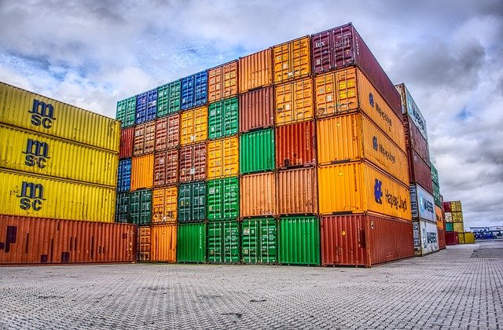

# Thème 2 :  Types construits

À partir des types de bases, on construit des types *conteneurs* qui permettent de stocker différents objets et d'y accéder.

{: .center} 

- 🗹 Listes - Tableaux  
- 🗹 Tuples    
- 🗹 Dictionnaires  
