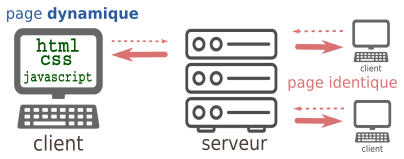







{{ titre_chapitre(num,titre,theme,niveau)}}

{{ initexo(0) }}


Jusqu'à présent, la page web envoyée par le serveur est :

1. identique quel que soit le client;
2. statique après réception sur l'ordinateur du client.

{: .center} 


## Quand le client peut agir sur sa page : exemple avec JavaScript


Le JavaScript va venir régler le problème n°2 : il est possible de fabriquer une page sur laquelle le client va pouvoir agir localement, sans avoir à redemander une nouvelle page au serveur.

Inventé en 1995 par [Brendan Eich](https://fr.wikipedia.org/wiki/Brendan_Eich){:target="_blank"}  pour le navigateur Netscape, le langage JavaScript s'est imposé comme la norme auprès de tous les navigateurs pour apporter de l'interactivité aux pages web.

{:.center}


### **&#x1F4CE; Exemple 1 de couple html / javascript** :

Notre fichier ```index.html``` fait référence, au sein d'une balise ```<script>```, à un fichier externe ```script.js``` qui contiendra notre code JavaScript.   

- fichier ```index.html``` : 
```html
<!DOCTYPE html>
<html>
  <head>
    <meta charset="utf-8">
    <title>un peu d'action</title>
    <link href="style.css" rel="stylesheet" type="text/css" />
  </head>
  <body>
    <script src="script.js"></script>
    <p>
    <h2>Une page web extrêmement dynamique</h2>
    </p>
    <div>

        <label>Changez la couleur d'arrière-plan:</label>

        <button type="button" onclick="choix('#CD9575');">Antique brass</button>

        <button type="button" onclick="choix('#8DB600');">Apple green</button>

        <button type="button" onclick="choix('#9966CC');">Amethyst</button> 
    </div>
    <div>
      <p>
      En JavaScript, le codage de la couleur choisie est :
      </p>
      <p id="resultat"></p>
    </div>
  </body>
</html>
```


- fichier ```script.js``` :
```javascript
function choix(color){
    document.body.style.background = color;
    document.getElementById("resultat").innerHTML="La couleur de fond est : "+color;
}
```


- fichier ```style.css``` :
```css
body
{
    background-color: rgb(117, 96, 96);
}
```

Le résultat de cette page peut être consulté à l'adresse [https://pagejs1.nsimeyroneinc.repl.co](https://pagejs1.nsimeyroneinc.repl.co){:target="_blank" }.

**Commentaires**

- Au sein du bouton déclaré par la balise ```button```, l'attribut  ```onclick``` reçoit le nom d'une fonction déclarée à l'intérieur du fichier ```script.js```, ici la fonction ```choix()```.
- Cette fonction nous permet de modifier à la fois l'aspect esthétique de la page (changement de la couleur de background) mais aussi le contenu de cette page, en faisant afficher le nom de la couleur.

La puissance du JavaScript permet de réaliser aujourd'hui des interfaces utilisateurs très complexes au sein d'un navigateur, équivalentes à celles produites par des logiciels externes (pensez à Discord, par ex.).


### **&#x1F4CE; Exemple 2 de couple html / javascript** :

Il est également possible de modifier le style d’une balise, de modifier la classe (CSS) d’une balise, voici quelques exemples :  

!!! voc "querySelector()"
    La méthode ```querySelector()``` sélectionne le premier élément dans le document correspondant au sélecteur - ou groupe de sélecteurs - spécifié(s), ou null si aucune correspondance n’est trouvée.


- fichier ```index.html``` : 
```html
<!doctype html>

<html lang="fr">
  <head>
    <meta charset="utf-8">
    <title>Le trio</title>
    <link rel="stylesheet" type="text/css"  href="style.css">
  </head>

<body>
  <h1>Le trio : HTML, CSS et JavaScript</h1>
  <p id="monPara">
    Voici une page web qui ne fait pas grand-chose
  </p>

    <button onclick="foncRouge()">Rouge</button>

    <button onclick="foncBlanc()">Blanc sur fond bleu</button>

</body>

<script src="modif.js"></script>
</html>
```


- fichier ```script.js``` :
```javascript
function foncRouge() 
{
document.querySelector("#monPara").classList.remove("blanc");
document.querySelector("#monPara").classList.add("rouge");
}

function foncBlanc() 
{
document.querySelector("#monPara").classList.remove("rouge");
document.querySelector("#monPara").classList.add("blanc");
}
```

- fichier ```style.css``` :  
```css
h1
{
  text-align: center;
}
.rouge 
{
color:red;
font-size:20px;
}
.blanc 
{
  background-color:blue;
color:white;
font-size:25px;
}
```

Le résultat de cette page peut être consulté à l'adresse [https://pagejs2.nsimeyroneinc.repl.co](https://pagejs2.nsimeyroneinc.repl.co){:target="_blank" }.


**Commentaire :**  

Dans l’exemple ci-dessus, nous avons maintenant 2 boutons :

- un clic sur le bouton ```blanc```, permet d’exécuter la fonction ```foncBlanc()```,  
-  un clic sur le bouton ```rouge```, permet d’exécuter la fonction ```foncRouge()```, jusque là, rien de vraiment nouveau.  

La fonction JavaScript ```foncBlanc()``` permet de modifier la classe CSS de la balise ayant pour id `monPara`. Dans un premier temps, la ligne

```javascript
document.querySelector("#monPara").classList.remove("rouge");
```
permet de supprimer l’association entre la balise d’id ```monPara``` et la classe CSS ```rouge``` (si cette association n’existe pas, cette ligne n’a aucun effet).   
Dans un deuxième temps, on associe la classe CSS ```blanc``` avec la balise d’id ```monPara``` avec la ligne

```javascript
document.querySelector("#monPara").classList.add("blanc");
```

### **&#x1F4CE; Exemple 3 de couple html / javascript** :


- fichier ```index.html``` : 
```html
<!DOCTYPE html>
<html>
  <head>
    <meta http-equiv="Content-Type" content="text/html; charset=utf-8" />
    <title>Afficher / Cacher une boite div en javascript</title>

    <link rel="stylesheet" type="text/css"  href="style.css" />
    <script type="text/javascript" src="script.js"></script>
  </head>
<body>
    <div>  Question 1 : </br>
    <span class="bouton" id="bouton_texte" onclick="afficher_cacher('texte');">Afficher la réponse</span>

    <div id="texte" class="texte">
      Texte caché
    </div>
    </div>
    <script type="text/javascript">
    //<!--
        afficher_cacher('texte');
    //-->
    </script>
    </body>
</html>
```


- fichier ```script.js``` :
```javascript
function afficher_cacher(id)
{
    if(document.getElementById(id).style.visibility=="hidden")
    {
        document.getElementById(id).style.visibility="visible";
        document.getElementById('bouton_'+id).innerHTML='Cacher la réponse';
    }
    else
    {
        document.getElementById(id).style.visibility="hidden";
        document.getElementById('bouton_'+id).innerHTML='Afficher la réponse';
    }
    return true;
}
```

- fichier ```style.css``` :  
```css
.bouton
{
    color:#00AAff;
    font-size:18px;
    cursor:pointer;
}
.bouton:hover
{
    text-decoration:None;
}
.texte
{
    border:1px solid #333333;
    background:#eeeeee;
    padding:10px;
    color:#333333;
}
.texte:hover
{
    border:1px solid #000000;
    background:#cccccc;
    color:#000000;
}
```

Le résultat de cette page peut être consulté à l'adresse [https://pagejs3.nsimeyroneinc.repl.co](https://pagejs3.nsimeyroneinc.repl.co){:target="_blank" }.


### **&#x1F4CE; Exemple 4 de couple html / javascript** :


- fichier ```index.html``` : 
```html
<!DOCTYPE html>
<html>
  <head>
    <title>Cours JavaScript</title>
    <meta charset="utf-8">
    <meta name="viewport" content="width=device-width, initial-scale=1,
user-scalable=no">
    <link rel="stylesheet" href="style.css">
  </head>

<body>
  <div>
    <p> Question 1 : Donner l'écriture binaire du nombre décimal 29 </p>
      <button id='R1'>Afficher la réponse</button>
  </div>

  <div id="d1" style="display:None">
    <strong> Réponse :</strong> L'écriture binaire de 29 est : 11101 <br>
      <table>
        <tr>
          <td>puissance de 2 </td>
          <td>64</td><td>32</td><td>16</td><td>8</td><td>4</td><td>2</td><td>1</td>
        </tr>
        <tr>
          <td>Décomposition </td>
          <td>0</td><td>0</td><td>1</td><td>1</td><td>1</td><td>0</td><td>1</td>
        </tr>
        <tr>
          <td>Reste </td>
          <td>29</td><td>29</td><td>13</td><td>5</td><td>1</td><td>1</td><td>0</td>
        </tr>
      </table>
  </div>

  <div>
    <p> Question 2 : Donner l'écriture binaire du nombre décimal 42 </p>
      <button id='R2' >Afficher la réponse</button>
  </div>
  <div id="d2" style="display:None">
    Réponse : L'écriture binaire de 42 est : 101010
  </div>

</body>
  <script language="JavaScript" src="qcm.js"></script>
</html>
```


- fichier ```script.js``` :
```javascript
let d1 = document.getElementById("d1");
function togg1(){
  if(getComputedStyle(d1).display != "none"){
  d1.style.display = "none";
  }
  else {
    d1.style.display = "block";
  }
};

R1.onclick = togg1;
let d2 = document.getElementById("d2");

function togg2(){
  if(getComputedStyle(d2).display != "none"){
  d2.style.display = "none";
  }
  else {
  d2.style.display = "block";
  }
};

R2.onclick = togg2;
```

- fichier ```style.css``` :  
```css
#d1{background-color: #EECC4499;}
#d2{background-color: #44EEAA99;}
table{
  border-collapse: collapse
}
td{
  border: 1px solid black;
  padding: 10px;
}
```

Le résultat de cette page peut être consulté à l'adresse [https://quiz.nsimeyroneinc.repl.co](https://quiz.nsimeyroneinc.repl.co){:target="_blank" }.


### **&#x1F4CE; Exemple 5 de couple html / javascript** :


- fichier ```index.html``` : 
```html
<!DOCTYPE html>
<html>
  <head>
    <title>Cours JavaScript</title>
    <meta charset="utf-8">
    <meta name="viewport" content="width=device-width, initial-scale=1,
user-scalable=no">
    <link rel="stylesheet" href="style.css">
</head>

<body>

<form name="quiz">
<span><b>Question 1 : Quelle est la couleur du cheval blanc d'Henri 4</b></span>
  <br>
<div style="position:absolute;left:300px"><br>
  <textarea name="t1" rows="4" cols="20" >
  </textarea>
</div>
<br>
  <input type="radio" name="q1" value="r1">Brun<br>
  <input type="radio" name="q1" value="r2">Noir<br>
  <input type="radio" name="q1" value="r3">Blanc<br>
  <input type="radio" name="q1" value="r4">Rouge<br>

<br>

<span><b>Question 2 : Qui a gagné la coupe du monde 1998 ?</b><br></span>
<div style="position:absolute;left:300px"><br>
  <textarea name="t2" rows="4" cols="20" >
  </textarea>
</div>
<br>
  <input type="radio" name="q2" value="r1">Le Brésil<br>
  <input type="radio" name="q2" value="r2">L'Argentine<br>
  <input type="radio" name="q2" value="r3">L'Angleterre<br>
  <input type="radio" name="q2" value="r4">La France<br>

<br>
<span><b>Question 3 : Qui a remporté la médaille d'Or de Basket au JO 2021</b><br></span>
<div style="position:absolute;left:300px"><br>
  <textarea name="t3" rows="4" cols="20" >
  </textarea>
</div>
<br>
  <input type="radio" name="q3" value="r1">France<br>
  <input type="radio" name="q3" value="r2">USA<br>
  <input type="radio" name="q3" value="r3">Australie<br>
  <input type="radio" name="q3" value="r4">Serbie<br>

<br>

    <input type="button" value="Score" onClick="getScore(this.form)">
    <input type="reset" value="RAZ"><p>
    Score = <input type=text size=15 name="percentage"><br>
    Réponses correctes :<br>
    <textarea name="solutions" wrap="virtual" rows="4" cols="40"></textarea>
  </form>

</body>
 <script language="JavaScript" src="qcm.js"></script>
</html>
```


- fichier ```script.js``` :
```javascript

var numQues = 3;
var numChoi = 4;

var answers = new Array(3);
var answers_true = new Array(3);
var answers_false = new Array(3);

answers[0] = "r3";
answers_true[0] = "Bravo";
answers_false[0] = "Lit l'énoncé correctement";

answers[1] = "r4";
answers_true[1] = "Bravo";
answers_false[1] = "La France bien sur";

answers[2] = "r2";
answers_true[2] = "Bravo";
answers_false[2] = "Hélas c'est faux, c'est les USA";

function getScore(form) {
  var score = 0;
  var currElt;
  var currSelection;

  for (i=0; i<numQues; i++) {
    currElt = i*(numChoi+1);
    for (j=0; j<numChoi; j++) {
      currSelection = form.elements[currElt + j+1];
      if (currSelection.checked) {
        if (currSelection.value == answers[i]) {
          score++;
          form.elements[currElt].value=answers_true[i];
          break;
        }
        else {
          form.elements[currElt].value=answers_false[i];
        }
      }
    }
  }

  score = Math.round(score/numQues*100);
  form.percentage.value = score + "%";

  var correctAnswers = "";
  for (i=1; i<=numQues; i++) {
    correctAnswers += i + ". " + answers[i-1] + "\r\n";
  }
  form.solutions.value = correctAnswers;

}

```

- fichier ```style.css``` :  
```css
body{ 
  background-color: #a0b6e7;
  }

span{
  background-color: #e7b4a0;
  border-width:2px;
  border-style:outset;
  border-color:black;
  border-radius: 10px;
  padding: 5px;
  }
```

Le résultat de cette page peut être consulté à l'adresse [https://qcmscore.nsimeyroneinc.repl.co](https://qcmscore.nsimeyroneinc.repl.co){:target="_blank" }.


**En savoir plus** 
- le guide JavaScript de la fondation Mozilla : [https://developer.mozilla.org/fr/docs/Web/JavaScript/Guide](https://developer.mozilla.org/fr/docs/Web/JavaScript/Guide)
- le cours d'OpenClassrooms : [https://openclassrooms.com/fr/courses/2984401-apprenez-a-coder-avec-javascript](https://openclassrooms.com/fr/courses/2984401-apprenez-a-coder-avec-javascript)


##### Exercice
- Reprenez votre site et rajoutez du JavaScript pour la rendre dynamique. Faites ce que vous voulez !


