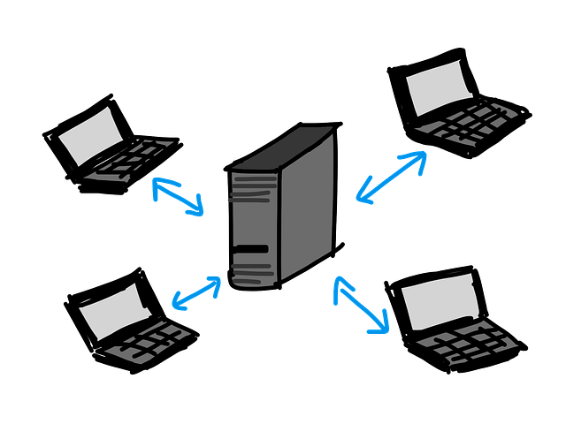

# Thème 4 : Interactions entre l'homme et la machine sur le Web

Lorsqu'on navigue sur le Web, nous interagissons avec une machine distante via des pages, qui gèrent des événements (clics, soumissions de formulaires par exemple) qui doivent être gérés automatiquement.

{: .center} 

- 🗹 Modalités de l'interaction entre l'homme et la machine
- 🗹 Interaction 