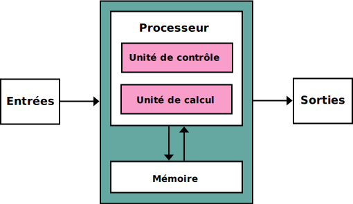

# Thème 5 : Architectures matérielles et systèmes d'exploitation

Les circuits électroniques sont au cœur de toutes les machines informatiques. Les réseaux permettent de transmettre l’information entre machines. Les systèmes d’exploitation gèrent et optimisent l’ensemble des fonctions de la machine, de l’exécution des programmes aux entrées-sorties et à la gestion d’énergie.

- □ Architecture Von Neumann  
- □ Architecture réseau  
- □ Protocoles de communication dans un réseau  
- □ Découverte des commandes Linux   

{align=left}{align=right} 

