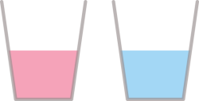

---
title : Les Variables en Python
subtitle: Thème 6 - Programmation
author : Première NSI
numbersections: true
fontsize: 10pt
geometry:
- top=20mm
- left=20mm
- right=20mm
- heightrounded    
--- 


Thème 6 - Langages et programmation
===

{{ initexo(0) }}

<table  class="yellowTable">
        <tr >
            <th width="20%"; style="background-color: #3B444B;color:white;text-align:center;border:none;font-size:40pt;">
            01
            </th>
            <th  width="80%"; style="text-align:center;border:none;font-size:25pt;">Cours : Les Variables en Python</th>
        </tr>
</table>
<br>


{:.center}


## Introduction 

Le langage Python est un langage de programmation objet interprété. Il a été développer par Guido Von Rossum en 1989 à l’Université d’Amsterdam.  

{:.center}

- Python a été créé dansl’optique d’être le plus simple possible à apprendre.  
- Il s’agit d’un langage dit de « haut niveau ».  
- Python est un langage open source. Libre et gratuit, il est supporté, développé et utilisé par une large communauté.  
- Python est une langage multiplateforme : vous érirez le même programme que soyez sous Linux, Mac OS X ou Windows et il pourra être exécuté indifférenment sur l’un de ces systèmes d’exploitation.  
- Python est un langage opérationnel complet : il ne sert pas qu’à apprendre à programmer. De nombreuses applications scientifiques complexes sont développées en Python. A la NASA, au CNRS, chez Google, chez Yahoo, etc ... de nombreux projets sont développés en Python.  

Avec le langage Python il est possible de faire :  

- du calcul scientifique (librairie Numpy)
- des graphiques ( (librairie Mathplotlib)  
- du traitement du son  
- du traitement de l’image (librairie PIL)  
- des applications avec interface graphique GI (librairies Tkinter, PyQt, wxPython, PyGTK, ... )  
- des jeux vidéo en temps réel (librairie Pygame)  
- des applications web (serveur web Zope, framework web Django ; framework JavaScript Pyjama)  
- interfacer des systèmes de gestion de base de données (librairie MySQLdb...)  
- des applications réseaux (framework Twisted)  


## Variables et Affectation 

!!! savoir "A retenir"
    Dans le langage Python, le symbole `=` correspondant à l'affectation (écrite $\leftarrow$ en pseudo-code). 
    Pour affecter la valeur 2 à une variable `a` on écrit simplement `a = 2`.


Ainsi, l'algorithme

```
a ← 3
b ← 2 * a
```

s'écrit en Python de la façon suivante :

```python
a = 3
b = 2 * a
```


```
a = 3
b = 2 * a
print(a)
print(b)
```

    3
    6


!!! exo "{{ exercice() }}"
    Écrivez le programme Python correspondant à l'algorithme ci-dessous. Que valent `N` et `P` après l’exécution de cet algorithme ?  
    
    ```
    N ← 2
    P ← 3
    N ← P + 1
    P ← N
    ```


Les noms de variables sont des noms que vous choisissez vous-même assez librement. Efforcez-vous cependant de bien les choisir :   
- aussi **explicites que possible**, de manière à exprimer clairement ce que la variable est censée contenir.  

Par exemple, des noms de variables tels que altitude, altit ou alt conviennent mieux que x pour exprimer une altitude.

**ATTENTION**  
Il existe des noms réservés :  

|||||||
|:---:|:---:|:---:|:---:|:---:|:---:|  
|and|del|from|None|True|as|
|elif|global|nonlocal|try|assert|else|
|if|not|while|break|except|import|
|or|with|class|False|in|pass|
|yield|continue|finally|is|raise|def|
|for|lambda|return|  


## L'incrémentation d'une variable

!!! voc "Vocabulaire"
    _«Incrémenter»_ une variable signifie l'_augmenter_. 

Imaginons une variable appelée ```compteur```. Au démarrage de notre programme, elle est initialisée à la valeur 0.  
```python
compteur = 0
```

Considérons qu'à un moment du programme, cette variable doit être modifiée, par exemple en lui ajoutant 1.

En Python, cela s'écrira :

- Syntaxe classique  
```python
compteur = compteur + 1
```


- Syntaxe Pythonesque 
```python
compteur += 1
```


```
compteur=0
compteur+=1
print(compteur)
```

    1


!!! fabquestion "{{ exercice() }}"
    Ecrire le code «classique» et le code «Pythonesque» pour l'instruction suivante :  
    On initialise une variable ```capital``` à 1000 et on lui enlève 5%.


## L'échange de variables
    
Après l'incrémentation, une autre technique de base reviendra fréquemment dans nos codes : **l'échange de variables**.

Imaginons les variables suivantes :

```python
>>> a = 3
>>> b = 5
```
Le but est d'échanger les valeurs de ```a``` et de ```b```.

▸ **Méthode naïve**

```python
>>> a = b
>>> b = a
```

Que valent ```a``` et ```b``` maintenant ?

Malheureusement :
```python
>>> a
5
>>> b
5
>
```

La variable ```a``` a été écrasée dès qu'on lui a donné la valeur de la variable ```b```.

Comment la préserver ?

La situation est similaire au problème suivant : comment échanger le contenu de ces deux verres ?

{:.center}

La méthode est évidente : il nous faut un troisième verre.

Nous allons faire de même pour nos variables. Nous allons utiliser une variable **temporaire** (on parle aussi de variable **tampon**) pour conserver la mémoire de la valeur de ```a``` (par exemple) avant que celle-ci ne se fasse écraser :

```python
>>> a = 3
>>> b = 5
>>> temp = a
>>> a = b
>>> b = temp
```

Vous pouvez vérifier maintenant que les valeurs de ```a``` et de ```b``` ont bien été échangées.


&#x1F4CC;  **Syntaxe classique et syntaxe Pythonesque :**  

L'échange de deux variables ```a``` et de ```b``` s'écrit donc :
```python
>>> temp = a
>>> a = b
>>> b = temp
```
Mais il existe aussi une syntaxe particulière à Python, bien plus courte :

```python
>>> a, b = b, a
```


##  Types de variables
    

Pour l'instant, les variables que nous avons manipulées contiennent toutes des nombres entiers.

Sauf les maisons de Poudlard, qui sont des ~~mots~~ chaînes de caractères.

Pour différencier la nature de ce que peut contenir une variable, on parle alors de **type de variable**.

En voici quelques uns, que nous découvrirons au fil de l'année :


!!! info "Types de base :"
    Voici les types Python les plus fréquemment utilisés cette année:

    |Type Python| Traduction | Exemple|
    |:-:|:-:|:-:|
    |`int`|entier|`42`|
    |`float`|flottant (décimal)|`3.1416`|
    |`str`|chaîne de caractères (string)|`"NSI"`|
    |`bool`|booléen (True ou False)|True|
    |`tuple`|p-uplet| `(255, 127, 0)`|
    |`list`|liste|`[0, 1, 2, 3, 4, 5]`|
    |`dict`|dictionnaire|`{'Homer':43, 'Marge':41, 'Bart':12, 'Lisa':10, 'Maggie':4}`|
    |`function`|fonction| `print`|


Comment connaître le type d'une variable ?  
Il suffit dans la console d'utiliser la fonction `type`.


```
a = 1
type(a)
```


    <class 'int'>


## Python et le typage dynamique
    

Jusqu'à présent, nous ne nous sommes pas occupés de préciser à Python le type de notre variable.

```python
a = 3
```

Mais dans certains langages, c'est obligatoire. En C par exemple, il faut écrire :

```C
int a = 3;
```
Cela signifie (pour le langage C) que notre variable ```a``` n'aura pas le droit de contenir autre chose qu'un nombre entier.

Si on écrit ensuite
```C
a = "test";
```

Le compilateur C renverra une erreur : on ne peut pas stocker une chaîne de caractères dans une variable qu'on a créée comme étant de type entier.

Et en Python ?

```python
>>> a = 3
>>> type(a)
<class 'int'>
>>> a = "test"
>>> type(a)
<class 'str'>
```

Python a changé tout seul le type de notre variable, sans intervention. On parle de **typage dynamique**.


## Bonnes pratiques de nommage

### Ce qui est autorisé et ce qui ne l'est pas

Pour nommer correctement une variable, il existe des règles à respecter.

> "Les règles"
  - le nom de la variable peut contenir les caractères suivants :
   - des lettres **non accentuées** (attention, minuscule et majuscule sont des caractères différents)
   - des chiffres (mais pas comme premier caractère)
   - le tiret du bas _ (underscore, tiret du 8)
    
   - le nom de la variable **ne doit pas** commencer par un chiffre
   - le nom de la variable **ne doit pas** contenir d'espace
   - le nom de la variable **ne doit pas** être un mot-clé du langage.

**Liste des mots-clés réservés par Python**

<p align="center">
        <table>
            <tr><td>and</td><td>as </td><td>assert	</td><td>break</td><td>	class</td><td>	continue</td><td>	def</td><td>	del</td></tr> 
            <tr><td>elif</td><td>	else</td><td>	except</td><td> False </td><td> finally	</td><td>for</td><td>	from</td><td>	global  </td></tr>
            <tr> <td> if </td><td>	import</td><td>	in</td><td>	is	</td><td>lambda	</td><td>None </td><td>not </td><td>	or</td></tr>
            <tr><td> pass </td><td>raise</td><td>	return</td><td>	True </td><td>try	</td><td>while</td><td>	with	</td><td>yield </td></tr>
        </table>
        </p>


### Du sens, du sens, du sens

Hormis pour les indices (de boucles, de tableaux...) un nom de variable (dans un programme destiné à être lu, par vous ou quelqu'un d'autre) doit **impérativement avoir du sens** :

```python
# PAS BIEN
if d == 1:
    cep += vm

# BIEN
if date == 1:
    compte_epargne += versement_mensuel
```


**Règle d'or :**  
On ne donne jamais un nom de variable au hasard, on le choisit pour qu'il soit **explicite**.


Oui mais pour donner du sens, il faut souvent plusieurs mots...
La longueur du nom de la variable n'est plus un problème depuis que la grande majorité des IDE proposent la complétion automatique.  
Mais comment former ces longs mots ?


### Syntaxe des noms à rallonge

**Comment accoler des mots**  
- S'il est composé, le nom peut être de la forme:
 - ```snake_case``` : les mots sont séparés par des underscores. Conseillé en Python.  
 - ```camelCase``` : les mots sont séparés par des majuscules mais la 1ère lettre est minuscule. Conseillé en Javascript.  
 - ```PascalCase``` : les mots sont séparés par des majuscules et la 1ère lettre est majuscule. Conseillé en C.  
 - ```kebab-case``` : les mots sont séparés par des tirets courts. Conseillé en HTML - CSS.   

Sans surprise, en Python, nous utiliserons donc le ```snake_case```.


## Exercices


!!! exo "{{ exercice() }}"

    Prédire la valeur affichée après les séquences d'instructions suivantes.
        
    **1.** Séquence 1 :
        
    ~~~python
    >>> a = 5
    >>> a = a + 1
    >>> b = a
    >>> b = b ** 2 - a
    >>> print(b)
    ~~~
        
    **2.** Séquence 2 :
        
    ~~~python
    >>> a = 5
    >>> b = 6
    >>> a = a - b
    >>> b = b + a
    >>> a = b - a
    >>> print(a, b)
    ~~~
        
    **3.** Séquence 3 :
    
    ~~~python
    >>> from random import randint
    >>> a = randint(1, 100)  #entier aléatoire entre 1 et 100
    >>> b = randint(1, 100)  #entier aléatoire entre 1 et 100
    >>> a = a - b
    >>> b = b + a
    >>> a = b - a
    >>> print(a, b)
    ~~~

!!! exo "{{ exercice() }}"

    Le prix d'une matière première est de 873 euros la tonne au début de l'année. Ce prix subit des variations saisonnières : 

    - au premier trimestre il augmente de 347 euros,  
    - au second trimestre il augmente de 25 %,  
    - au troisième trimestre il subit une baisse de 50 %  
    - et enfin il diminue de 100 euros.  
        
    * Compléter le code ci-dessous afin qu'il calcule les valeurs successives de la variable `prix`.  
        
    ~~~python
    prix = 873       #prix au début de l'année
    prix = ....      #prix à la fin du premier trimestre
    prix = ....      #prix à la fin du second trimestre
    prix = ....      #prix à la fin du troisième trimestre
    prix = ....      #prix à la fin de l'année
    print("Prix final :", prix)
    ~~~

!!! exo "{{ exercice() }}"

    La température $f$ en degrés  Fahrenheit s'obtient à partir de la température $c$ en degrés Celsius par la formule de conversion $f=1,8 * c + 32$. 
        
    On veut écrire un programme qui réponde à la __spécification__ suivante : _convertir une mesure de température de l'échelle  Celsius vers l'échelle Fahrenheit._
        
    **1.** Saisir  le code ci-dessous  :
        
    ~~~python
    f = input("Température en degrés Celsius ? "
    d = 1,8 * f + 32
    print("La température en degrés Fahrenheit est de ", d)
    ~~~
        
    **2.** Exécuter le code, on doit obtenir un message d'erreur indiquant une erreur de Syntaxe. Un curseur indique dans le code la position où l'interpréteur Python s'est interrompu dans la lecture du code. Si le curseur est en début de ligne, il faut souvent chercher l'erreur à la fin de la ligne précédente ...
        
    Corriger l'erreur de syntaxe.
        
    **3.** Exécuter de nouveau le code, on doit obtenir un message d'erreur indiquant que Python ne peut réaliser l'opération demandée. On dit que l'interpréteur Python a levé une [exception](https://docs.python.org/3.5/tutorial/errors.html).
        
    ~~~python
    TypeError: can only concatenate str (not "int") to str
    ~~~
        
    **4.** Insérer l'instruction `print(type(f))` en ligne 2, exécuter de nouveau. Que représente la valeur affichée avant le message d'erreur ?
        
    **5.** Remplacer la première instruction par `float(input("Température en degrés Celsius ? "))` puis exécuter. 
        
    Quel est l'effet de la fonction `float` ? Afficher sa documentation dans l'interpréteur avec l'instruction `help(float)`. 
        
    **6.** Si on teste le programme pour une température de 45 degrés Celsisus on doit obtenir l'affichage ci-dessous. 
        
    Est-ce que la spécification du programme est vérifiée ? Corriger le programme.
        
    ~~~python
    Température en degrés Celsius ? 45
    <class 'float'>
    La température en degrés Fahrenheit est de  (1, 392.0)
    ~~~