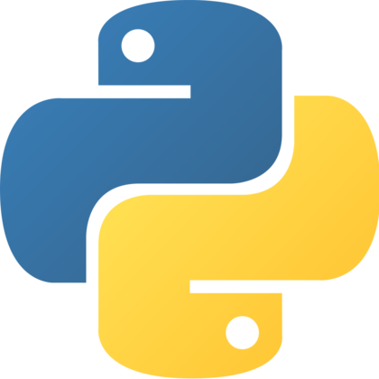
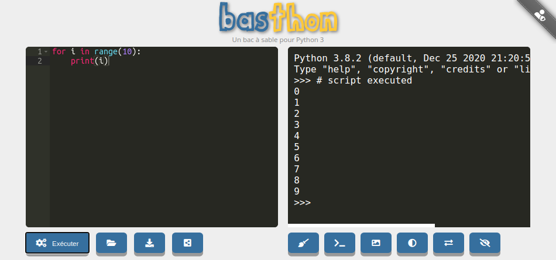
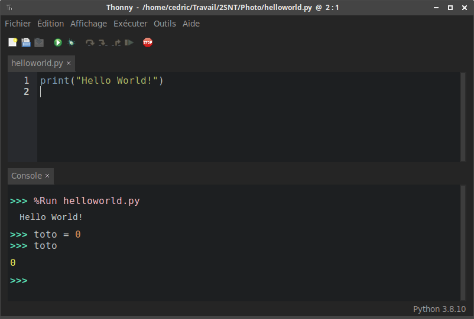




 

{{ titre_chapitre(num,titre,theme,niveau)}}

{:.center}

## Préambule

### Python

{align=right}

Python est un [*langage de programmation*](https://fr.wikipedia.org/wiki/Langage_de_programmation){:target="_blank"} inventé en 1991 par Guido Van Rossum.

Ce langage est un des langages les plus utilisés actuellement (avec le C, le Java, le Javascript ...), notamment dans le monde scientifique.

Il est aussi un des langages de développement de nombreuses applications (Spotify, Instagram, Netflix), des sites Web, de traitement de données,  du noyau Linux... Python fait à peu près tout ce qu'on veut. Sauf le café.

 Il est aussi parfaitement adapté à la découverte de la programmation, de par sa clarté et sa concision (il a aussi bien sûr beaucoup de défauts !).

C'est pourquoi c'est le langage de programmation utilisé au lycée en Mathématiques, en Physique-Chimie, en SNT et bien sûr maintenant en NSI.

Avec le langage Python il est possible de faire :  

- du calcul scientifique (librairie Numpy)
- des graphiques ( (librairie Mathplotlib)  
- du traitement du son  
- du traitement de l’image (librairie PIL)  
- des applications avec interface graphique GI (librairies Tkinter, PyQt, wxPython, PyGTK, ... )  
- des jeux vidéo en temps réel (librairie Pygame)  
- des applications web (serveur web Zope, framework web Django ; framework JavaScript Pyjama)  
- interfacer des systèmes de gestion de base de données (librairie MySQLdb...)  
- des applications réseaux (framework Twisted)  

## Utiliser Python

Pour pouvoir utiliser un langage de programmation, en particulier Python, on a besoin d'un [IDE](https://fr.wikipedia.org/wiki/Environnement_de_d%C3%A9veloppement) (environnement de développement). Il en existe beaucoup...

### En ligne

Rendez-vous sur la page [https://console.basthon.fr/](https://console.basthon.fr/){:target="_blank"} 

<em>Éditeur à gauche, console à droite</em>

### Au lycée / à la maison

Nous utiliserons Capytale, intégré à l'ENT et basé sur basthon.

Nous utiliserons, à l'occasion l'IDE [Spyder](https://www.spyder-ide.org/){:target="_blank"} au lycée ou l'IDE [Thonny](https://thonny.org/){:target="_blank"} qui est assez simple et complet.  
Si vous souhaitez installer Python sur votre PC à la maison, je vous conseille de l'installer.

{: .center .w640}

<em>Éditeur en haut, console en bas</em>

### Ici, sur ce site

Dans certaines activités, vous trouverez une console intégrée. Vous pouvez y entrer des instructions simples:

{{ terminal() }}

Ou bien un mini-IDE intégré:

{{ IDEv() }}