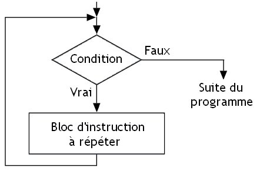

---
title : Les Fonctions en Python
subtitle: Thème 6 - Programmation
author : Première NSI
numbersections: true
fontsize: 10pt
geometry:
- top=20mm
- left=20mm
- right=20mm
- heightrounded    
--- 

Thème 6 - Langages et programmation
===

<table  class="yellowTable">
        <tr >
            <th width="20%"; style="background-color: #3B444B;color:white;text-align:center;border:none;font-size:40pt;">
            04
            </th>
            <th  width="80%"; style="text-align:center;border:none;font-size:25pt;">Les Boucles WHILE en Python</th>
        </tr>
</table>
<br>

{:.center}


##  Boucle WHILE
    
###  &#x2712;  Premiers exemples

À la différence essentielle des boucles `for`, dont on peut savoir à l'avance combien de fois elles vont être exécutées, les boucles `while` sont des boucles dont on ne sort que lorsqu'une condition n'est plus satisfaite. 

Avec donc le risque de rester infiniment bloqué à l'intérieur !  


```python
a = 0
while a < 3:
    print("ok")
    a = a + 1
print("fini")

ok
ok
ok
fini
```

### &#x2712; Syntaxe générale


!!! savoir "A retenir : Écriture d'une boucle while"

    ```python
    while condition:
        instruction1
        instruction2
        ...
        instructionN
    ```



#### La condition

La ```condition``` est un booléen, c'est-à-dire une expression que Python évaluera à ```True``` ou à ```False```.

Exemple de booléens résultant d'une évaluation :  

```python
>>> 1 < 3
True
>>> 5 > 7
False
>>> a = 10
>>> a > 8
True
```

###  &#x2712;  Les pièges ...

#### piège n°1 : ne JAMAIS SORTIR de la boucle


!!! example "Exemple :"
    Le programme suivant :  

    ```python
    a = 0
    while a < 3:
        print("ok")
        a = a + 1
        a = a * 0
    print("ce texte ne s'écrira jamais")
    ```
    va écrire une suite infinie de ```ok``` et ne **jamais s'arrêter**


#### piège n°2 : ne JAMAIS ENTRER dans la boucle

!!! example "Exemple :"  
    Le programme suivant :

    ```python
    a = 0
    while a > 10:
        print("ce texte non plus ne s'écrira jamais")
        a = a + 1
        
    print("fini") 
    ```
    va écrire ```fini``` et s'arrêter.


    ```python
    a = 0
    while a > 10:
        print("ce texte non plus ne s'écrira jamais")
        a = a + 1

    print("fini")
    ```

    fini


La boucle infinie a été présentée comme un danger qu'il faut éviter. 

Pourtant, dans quelques situations, il est d'usage d'enfermer _volontairement_ l'utilisateur dans une boucle infinie.

C'est notamment le cas des codes p5 où la fonction ```draw()``` est une boucle infinie dont on ne sort que lorsqu'un évènement est intercepté (par exemple, le clic sur la fermeture de la fenêtre d'affichage).  
Ou lors de la création d'un jeu....

Observez et exécutez le code suivant :


```python
while True :
    reponse = input("tapez sur la lettre S du clavier pour me sortir de cet enfer : ")
    if reponse == 'S' or reponse == 's':
        break

print("merci, j'étais bloqué dans une boucle infinie")
```

```python
tapez sur la lettre S du clavier pour me sortir de cet enfer : E
tapez sur la lettre S du clavier pour me sortir de cet enfer : S
merci, j'étais bloqué dans une boucle infinie
```

- le début du code : ```while True``` est typique des boucles infinies volontaires. On aurait tout aussi bien pu écrire ```while 3 > 2``` (on rencontre même parfois des ```while 1```)  
- vous avez découvert l'expression ```break``` qui comme son nom l'indique permet de casser la boucle (cela marche pour ```while``` comme pour ```for```) et donc d'en sortir. Son emploi est controversé parmi les puristes de la programmation. Nous dirons juste que c'est une instruction bien pratique.  


##  EXERCICES
    
{{ initexo(0) }}

!!! exo "{{ exercice()}}"
    === "Enoncé"
        Trouver le plus petit nombre entier $n$ tel que $2^n$ soit supérieur à 1 milliard.
    === "Indication : prog. à trou"

        ```python
        n = 1
        while ...:
            print("trop petit")
            n...
        print("trouvé : ",n)
        ```

    === "Correction"
        ```python
        n = 1
        while 2**n<1000000000:
            print("trop petit")
            n+=1
        print("trouvé : ",n)
        ```

{{ IDEv() }}

!!! exo "{{ exercice()}}"
    === "Enoncé"
        Réécrire le programme suivant en utilisant une boucle `while` :  

        ```python
        somme = 0
        for i in range(10):
            somme = somme + i
        print(somme)
        ```
    === "Correction"

        ```python
        somme=0
        n=0
        while n<10:
            somme+=n
            n+=1
        print(somme)
        ```

        45

{{ IDEv() }}


!!! exo "{{ exercice()}} : Dépassement d'un seuil  (Utile en spécialité Mathématiques)"
    === "Exemple" 
        La boucle `while` est souvent utilisée pour déterminer le rang à partir duquel un certain seuil sera dépassé ou atteint.  
        Voci un premier exemple :  
        On dispose d'un capital de 1 000 €, et chaque année, on perçoit 5% d'intérêts et on ajoute 500 € sur le compte.  
        Au bout de combien d'année la valeur du compte dépassera-t-elle les 10 000€ ?  
        Exécuter le progtramme suivant et observer pas à pas les valeurs des variables. 


{{ IDE() }}


```python
def nombreAnnees(capital):              # je crée un fonction nombreAnnees associé au paramétre d'entrée capital
    annee = 0                           # je crée une variable année que j'initialise à 0
    while capital<=10000:               # Je cée une boucle qui sera exécutée tant que capital est inférieur ou égal à 10 000
        capital = capital * 1.05 + 500         # J'augmente la valeur de capital
        print("Capital : ", capital)
        annee += 1                      # J'incrément de 1 la variable annee
        print('Année : ', annee)
    return annee                        # la fonction retourne la valeur de la variable année

nombreAnnees(1000)    # J'exécute la fonction nombreAnnees avec 1000 comme paramètre (correspondant au capital de départ)

```

!!! exo "{{ exercice()}} : Dépassement d'un seuil  (Utile en spécialité Mathématiques)"
    === "A vous"
        La population d'un village de 1000 habitants diminue chaque année de 1%.  
        Ecrire un fonction qui calcule le nombre d'années au bout duquel la population de ce village aura diminué de moitié.


    === "Correction"
        ```python
        def baisse_pop(pop_village):
            annee=0
            pop_finale=pop_village/2
            while pop_village>pop_finale:
                pop_village*=0.99
                annee+=1
            return annee


        pop_village=1000
        baisse_pop(pop_village)
        ```
        69


!!! exo "{{ exercice()}}"
    === "Enoncé"
        Écrire un programme qui invite l'utilisateur à saisir son mot de passe puis affiche le message "Bienvenue" quand il saisit le bon. Le mot de passe est "PIZZA".

    === "Solution 1"
        ```python
        while True:
            msg=input("Entrer votre mot de passe : ")
            if msg=='PIZZA':
                break
        print("Bienvenue")
        ```
    === "Solution 2"
        ```python
        msg=""
        while msg != 'PIZZA':
            msg=input("Entrer votre mot de passe : ")
        print("Bienvenue")
        ```


!!! exo "{{ exercice()}} : Jeu de dé"
    === "Enoncé"
        Compléter le programme suivant permettant d'afficher le nombre de lancers de dé effectué par le joueur pour obtenir un 6 (Remplacer les ... pour répondre aux commentaires associés).
    
        ```python
        from random import*   # Appel de la bibliothèque random pour pouvoir utiliser la fonction aléatoire randin()
 
        x=randint(1,6)     # Simule le lancé du joueur : affecte à la variable x un nombre entier aléatoire compris entre 1 et 6
        n=1                # On affecte à la variable n le nombre de lancers effectués : ici 1 pour le 1er lancer
        ...
        while ... :        # Compléter la condition de la boucle permettant de répondre au sujet de l'exercice  
            x=...            # Simuler un nouveau lancer de dé
            ...              # Afficher le score du dé
            n ...            # Comptabiliser le nombre de lancers effectués depuis le début du jeu
        print(" le joueur a éffectué", n, "lancers pour obtenir un 6")  # Afficher le nombre de lancers pour obtenir un 6

        ```

    === "Correction"
    
        ```python
        from random import*   # Appel de la bibliothèque random pour pouvoir utiliser la fonction aléatoire randin()
 
        x=randint(1,6)     # Simule le lancé du joueur : affecte à la variable x un nombre entier aléatoire compris entre 1 et 6
        n=1                # On affecte à la variable n le nombre de lancers effectués : ici 1 pour le 1er lancer
        print(x)
        while x!=6 :        # Compléter la condition de la boucle permettant de répondre au sujet de l'exercice  
            x=randint(1,6)            # Simuler un nouveau lancer de dé
            print(x)            # Afficher le score du dé
            n+=1            # Comptabiliser le nombre de lancers effectués depuis le début du jeu
        print(" le joueur a éffectué", n, "lancers pour obtenir un 6")  # Afficher le nombre de lancers pour obtenir un 6

        ```


!!! exo "{{ exercice()}} : L'échiquier de Sissa "
    === "Histoire"  
        !!! histoire "histoire"
            La légende se situe 3 000 ans av. J.C.

            Le roi Belkib (Indes) promit une récompense fabuleuse à qui lui proposerait une distraction qui le satisferait.
            Lorsque le sage Sissa, fils du Brahmine Dahir, lui présenta le jeu d'échecs, le souverain, demanda à Sissa ce que celui-ci souhaitait en échange de ce cadeau extraordinaire.

            Sissa demanda au prince de déposer un grain de riz sur la première case, deux sur la deuxième, quatre sur la troisième, et ainsi de suite pour remplir l'échiquier en doublant la quantité de grain à chaque case.   
            Le prince accorda immédiatement cette récompense sans se douter de ce qui allait suivre.

            Son conseiller lui expliqua qu'il venait de précipiter le royaume dans la ruine car les récoltes de l'année ne suffiraient pas à payer Sissa.


            En savoir plus : [histoire](https://materlesmaths.webnode.fr/a4%C3%A8me/legende-sissa/)

    === "Enoncé L'échiquier de Sissa :"

        On place un grain de blé sur la  1ère  case d'un échiquier, deux grains sur la  2ème  case, quatre sur la  3ème  et ainsi de suite en doublant la quantité de grains à chaque case.  
          
        Compléter le programme ci-dessous permettant de déterminer le nombre minimum de cases à remplir afin que le nombre total de grains de blé sur l'échiquier dépasse une quantité Q saisie en entrée.

        ```python
        def sissa(Q):    # je crée un fonction sissa avec comme paramètre d'entrée le nombre de grains souhaité Q
            S = 0 # Je crée une variable S initilisée à 0 permettant de totaliser le nombre de grains de riz
            nb = 0 # Je crée une variable nb initilisée à 0 permettant de connaitre le nombre de case nécessaire
            while S<Q:    # J'indique la condition de la boucle permettantde répondre à l'exercice
                ...    # J'actualise le nombre de case
                S=...     # J'actualise le nombre de grains présents sur l'échiquier
                print('case n°', nb,S)
        
            return(nb)    # La fonction renvoie le nombre de cases nécessaire nb

        sissa(8)    # J'appele la fonction sissa avec la valeur 8. Le programme doit me renvoyer le nombre 4 (= nb de cases nécessaires) 
        ```

    === "Correction" 
        ```python
        def sissa(Q):    # je crée un fonction sissa avec comme paramètre d'entrée le nombre de grains souhaité Q
            S = 0 # Je crée une variable S initilisée à 0 permettant de totaliser le nombre de grains de riz
            nb = 0 # Je crée une variable nb initilisée à 0 permettant de connaitre le nombre de case nécessaire
            while S<Q:    # J'indique la condition de la boucle permettantde répondre à l'exercice
                nb+=1    # J'actualise le nombre de case
                S=S+2**(nb-1)     # J'actualise le nombre de grains présents sur l'échiquier
                print('case n°', nb,S)
        
            return(nb)    # La fonction renvoie le nombre de cases nécessaire nb

        sissa(8)    # J'appele la fonction sissa avec la valeur 8. Le programme doit me renvoyer le nombre 4 (= nb de cases nécessaires) 
        ```

{{ IDE() }}