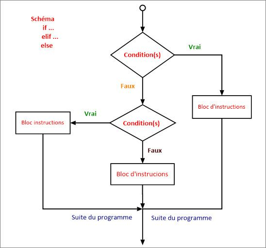




 


{{ titre_chapitre(num,titre,theme,niveau)}}

{:.center width=100px}

{{ initexo(0) }}

## L'instruction conditionnelle IF
    

L'instruction conditionnelle `if` permet de soumettre l'exécution d'instructions à une condition donnée. Cette condition sera une expression booléenne, comme pour la boucle `while`.


### Premiers exemples
Testez les codes suivants (plusieurs fois en variant les valeurs)  en changeant la valeur affectée à la variable `age` et observer les modifications de comportement du programme

&#x2712; L'exemple minimal ci-dessous ne contient que le mot-clé `if`.


```python
age = int(input("Donnes ton age : "))
if age >= 18:
    print("Tu as le droit de vote")

```

&#x2712; La structure qu'on rencontrera le plus souvent est néanmoins la structure `if ... else`


```python
age = int(input("Donnes ton age : "))
if age >= 18:
    print("Tu as le droit de vote")
else:
    print("Désolé, il faudra attendre", 18 - age, "ans avant de pouvoir voter")

```

&#x2712; Imbriquer les `if`


```python
moyenne = 13

if moyenne < 8:
    print("raté")
else:
    if moyenne < 10:
        print("repêchage")
    else:
        if moyenne < 12:
            print("admis")
        else:
            if moyenne < 14:
                print("mention AB")
            else:
                if moyenne < 16:
                    print("mention B")
                else:
                    print("mention TB")

```

### Syntaxe générale


!!! savoir "Écriture d'une instruction conditionnelle `if ... else`"

    ```
    if expression:
        *instructions à effectuer si expression est vraie*
    else:
        *instructions à effectuer sinon, c'est-à-dire si expression est fausse*
    ```

!!! remarque "Remarques :"

    - `expression` doit renvoyer une valeur **booléenne** : une égalité, comparaison, appartenance, etc. ;  
    - il faut terminer la ligne commençant par `if` et `else` par `:` ;  
    - les instructions à effectuer selon l'évaluation d'`expression` doivent être indentées;  
    - le `else` est facultatif (comme au premier exemple);  
    - en cas d'emploi du `else`, aucune expression n'est attendue.  

###  `elif` et les cas multiples

Das les situations où l'on veut effectuer des instructions différentes selon les différentes valeurs prises par une variable, comme dans le troisième exemple, on peut imbriquer les instructions `if` ... `else`.

Mais cela est vite long et peu lisible, et les différents niveaux d'indentation sont parfois piégeux.

Il existe alors une instruction qui contracte `else` et `if` : `elif` (sinon si).


```python
moyenne= 14

if moyenne < 8:
    print("raté")
elif moyenne < 10:
    print("repêchage")
elif moyenne < 12:
    print("admis")
elif moyenne < 14:
    print("mention AB")
elif moyenne < 16:
    print("mention B")
else:
    print("mention TB")

```

## Les Opérateurs de comparaison
    
|Opérateur|Signification|
|:-:|:-:|
|`==`| est égal à|
|`!=`|est différent de|
|`<`|inférieur à|
|`>`|supérieur à|
|`<=`|inférieur ou égal à|
|`>=`|supérieur ou égal à|
|`in`| appartient à|
|`not in`| n'appartient pas à|


```python
>>>a=2
```


```python
>>>a==3
False
```


```python
>>>a==2
True
```

```python
>>>a!=1
True
```

```python
>>>a>2
False
```


```python
>>>a<=2
True
```


```python
>>>'e' in 'abracadabra'
False
```


```python
>>>'a' in 'abracadabra'
True
```


```python
>>>'A' not in 'abracadabra'
True
```


```python
>>>'a' not in 'abracadabra'
False
```

Comme nous le verrons dans le cours sur les booléens, ces conditions peuvent être combinées avec (par exemple) les mots-clés ``` and``` ou ``` or``` :


```python
>>>b=20
>>>b>15 and b<30
True
```

```python
b>2000 or b<30
True
```


!!! savoir "FICHE n°8 : instructions conditionnelles"

    !!! voc "if ... :"

        Lorsque l'on veux **exécuter un bloc d'instruction seulement si une condition est vérifié** :
    
        ```python
        if condition :
            bloc indenté : instructions exécutées seulement si la condition est vérifiée
        suite du programme (non indenté)
        ```
  
    
    !!! voc "if ... else ... :"

        Lorsque l'on veux **exécuter un bloc d'instruction si une condition est vérifié, et un autre sinon** :
    
        ```python
        if condition :
            bloc indenté : instructions exécutées seulement si la condition est True
        else :
            bloc indenté : instructions exécutées si la condition est False

        suite du programme (non indenté)
        ```

    !!! voc "if ... elif ... else ... :"
        Lorsque l'on veux **exécuter un bloc d'instruction différent selon plusieurs cas possibles** :
    
        ```python
        if condition_1 :
            bloc indenté : instructions exécutées seulement si la condition_1 est True. 
            Les autres condition ne seront pas testées.
        elif condition_2 :
            bloc indenté : instructions exécutées seulement si la condition_2 est True, 
            et que la condition_1 est False
        elif condition_3 :
            bloc indenté : instructions exécutées seulement si la condition_3 est True, 
            et que  toutes les conditions précédentes sont  False
        else :
            bloc indenté : instructions exécutées si toutes les conditions sont False

        suite du programme (non indenté)
        ```
    




##  EXERCICES
    

!!! exo "{{ exercice()}}"

    === "Q1"
        Que vaut la valeur finale de la variable b ?  
        ```python
            a = 7
            b = 12
            if a > 5:
                b = b - 4
            if b >= 10:
                b = b + 1
        ``` 

    === "Q2."
        Que vaut la valeur finale de la variable b ?  
        ```python
        a = 7
        b = 12
        if a > 5:
            b = b - 4
        elif b >= 10:
            b = b + 1
        ```

    === "Q3."
        Que vaut la valeur finale de la variable b ?  
        ```python
        a = 7
        b = 12
        if a > 5:
            b = b - 4
        else:
            b = b + 1
        ```

    === "Q4."
        Que vaut la valeur finale de la variable a ?  
        ```python
        a = 10
        if a < 5:
            a = 20
        elif a < 100:
            a = 500
        else:
            a = 0
        ```


!!! exo "{{ exercice()}}"

    Les codes suivants sont-ils valides (on ne demande pas ce qu’ils font) ? S’ils sont invalides, rectifiez les.

    === "Code 1 :"
        ```python
        a = 10
        if a == 5:
        a = 2
        ```

    === "Code 2 :"
        ```python
        a = 10
        elif a == 5:
            a = 2
        ```

    === "Code 3 :"
        ```python
        a = 10
        if a = 5:
            a == 2
        ```

    === "Code 4 :"
        ```python
        a = 10
        if a == 5:
            a = 2
        else a==10:
            a=5
        ```

    === "Correction"

        **Code 1 :**
        ```python
        a = 10
        if a == 5:
            a = 2   # indentation à mettre
        ```

        **Code 2 :**
        ```python
        a = 10
        if a == 5:  #elif ne peut venir qu'aprés un if
            a = 2
        ```

        **Code 3 :**
        ```python
        a = 10
        if a = 5:
            a == 2
        ```

        **Code 4 :**
        ```python
        a = 10
        if a == 5:
            a = 2
        else:      # il n'a pas de condition aprés un else.
            a=5
        ```


!!! exo "{{ exercice()}}"
    Écrire un programme qui demande deux nombres et qui affiche le plus grand des deux.

??? check "Solution"  
    ```python
    def maximum(a,b):
        if a>b:
            return a
        else:
            return b
    ```

!!! exo "{{ exercice()}}"
    L’impôt sur le revenu de Groland est assez simple à calculer :

    - un particulier qui gagne moins de 20.000€ (strictement) de revenus par an doit verser 1€ d’impôt symbolique,  
    - entre 20.000 et 50.000 (strictement) on doit verser 15% d'impôts,  
    - entre 50.000 et 100.000€ (strictement) on doit verser 30% aux impôts,    
    - au dela de 100.000€ de revenus, on doit verser 50% en impôt.   

    Ecrire une fonction `montant(revenue)` qui a comme paramètre le montant des revenus annuels d'un  utilisateur et affiche le montant des impots qu’il doit verser.

    _je précise aux plus naïfs que Groland n’existe pas._

??? check "Solution"
    ```python
    def montant(revenue):
        if revenue <20000:
            return 1
        elif revenue<50000:
            return revenue*0.15
        elif revenue <100000:
            return revenue*0.3
        else:
            return revenue*0.5
    ```


!!! exo "{{ exercice()}}"
    On calcule l'IMC (Indice de Masse Corporelle) par la formule $I = \dfrac{M}{T^2}$ où M est la masse (en kg) d'une personne et T sa taille (en m).  

    Voilà comment comprendre le calcul de votre IMC (la classification de l'OMS) :

    - Moins de 18.5 (strictement): Maigreur - Poids insuffisant et pouvant occasionner certains risques pour la santé.  
    - Entre 18.5 et 25 (strictement) : Idéal - Poids santé qui n'augmente pas les risques pour la santé.  
    - Entre 25 et 30 (strictement) : Surpoids - Excès de poids pouvant occasionner certains risques pour la santé.  
    - Plus de 30 : Obésité - risque accru de développer certaines maladies.  

    1. Écrire un programme qui demande la masse et la taille d'une personne, calcule son IMC et annonce dans quel cas se trouve la personne.  
    2. A transformer sous forme de fonction `IMC(poids,taille)` qui renvoie l'IMC et dans quelle catégorie l'on se trouve sous la forme (imc,'categorie')


??? check "Solution"
    ```python
    def IMC(poids,taille):
        imc=poids/(taille**2)
        if imc<18.5:
            return imc,"Maigreur"
        elif 18.5<=imc<25:
            return imc,"Idéal"
        elif 25<=imc<30:
            return imc,"Surpoids"
        else:
            return imc,"Obésité"
    ```

!!! exo "{{ exercice()}}"
    L'équivalence entre l'âge d'un chien et l'âge humain est donné en procédant ainsi :  

    - lorsque le chien a deux ans ou moins, chaque année compte pour douze années «humaines»
    - lorsque le chien a plus de deux ans, chaque année au delà des des deux premières compte pour six années «humaines».

    Par exemple un chien de cinq ans a un âge «humain» de $2 \times 12 + 3 \times 6 = 42$ ans.

    **Question 1 :** Programmer la fonction `age_humain` qui prend en argument un entier `n` correspondant à l'âge d'un chien et renvoie l'âge humain correspondant.  
    **Question 2 :** En utilisant votre fonction, déterminer quel est l'âge «humain» d'un chien de 7 ans.

??? check "Solution"
    ```python
    def age_humain(n):
        if n <= 2 :
            age = n*12
        else :
            age = 2*12 + (n-2)*6
        return age  

    age_humain(7)
    ```


!!! exo "{{ exercice()}}"
    Programmer la fonction `trier` qui prend en paramètres trois nombres `a, b` et `c` et  - si besoin - intervertit leurs valeurs afin de les renvoyer triées dans l'ordre croissant.

??? check "Solution"
    ```python
    def trier(a,b,c):
        #on intervertit si besoin a et b pour avoir a <= b
        if b < a :
            a, b = b, a
        #on intervertit si besoin b et c pour que c contienne désormais la plus grande des trois valeurs
        if c < b :
            b, c = c, b
        #b ayant peut-être été remplacé par c, on intervertit à nouveau si besoin a et b
        if b < a :
            a, b = b, a        
        return (a, b, c) #les valeurs de a, b, c ont si besoin été échangées entre elles de sorte que a <= b <= c
    ```


!!! exo "{{ exercice()}} : Maximun triplet"
    Programmer la fonction `maximum` qui prend en paramètres trois nombres `a, b` et `c` et renvoie la valeur du plus grand d'entre eux.

??? check "Solution"
    ```python
    def maximum_triplet(a,b,c):
        #premier test pour que maxi soit le maximum de a et b
        if a <= b :
             maxi = b
        else :
             maxi = a
    
        #si c est plus grand que maxi, c'est finalement c la plus grande valeur
        if maxi < c :
            maxi = c
        return maxi
    ```


!!! exo "{{ exercice()}} booléens et conditionnelles - casino"
    *Remarque 1 :* Vous pouvez (et c'est même à cela que ça sert) réutiliser une fonction dans une autre fonction. Ici il faudra y penser pour la dernière fonction à programmer.

    Dans un casino, les machines à sous (voir des images ici : [page wikipédia](https://fr.wikipedia.org/wiki/Machine_%C3%A0_sous) ) comportent trois roues ou trois cylindres mécaniques portant chacun les chiffres de 1 à 9. En faisant tourner ces roues ou cylindres, on peut tirer au hasard un nombre entre 111 et 999 (ne comportant pas de chiffre zéro).  

    Le joueur mise un euro et récupère un gain qui dépend du résultat :  

    - si les trois chiffres sont égaux à sept, le joueur récupère une somme de 333 euros,  
    - sinon, si les trois chiffres sont égaux, le joueur récupère une somme de 33 euros,  
    - sinon, si le chiffre des centaines est égal au chiffre des unités, le joueur récupère une somme de 1 euro,  
    - sinon, si les trois chiffres sont consécutifs dans l'ordre croissant (par exemple 567), le joueur récupère une somme de 15 euros,  
    - sinon il ne récupère rien.  

    *Question 1 :* Compléter la fonction `gain_tirage` qui prend en paramètre trois chiffres `c, d` et `u` correspondant aux chiffres des centaines, des dizaines et des unités et qui renvoie la somme récupérée correspondant à ce tirage.

    *Question 2 :* En utilisant la fonction `gain_tirage` ci-dessus, compléter la fonction `machine_a_sous` ci-dessous afin qu'elle renvoie trois chiffres tirés au hasard ainsi que la somme récupérée correspondante.


??? check "Solution Q1"
    ```python
    def gain_tirage(c, d, u):
        if c == 7 and d == 7 and u == 7:
            somme = 333
        elif c == d and d == u:
            somme = 33
        elif c == u:
            somme = 1
        elif d == c+1 and u == d+1:
            somme = 15
        else:
            somme = 0
        return somme
    
    ```

??? check "Solution Q2"
    ```python
    from random import randint      #on importe la méthode randint depuis le module random

    def machine_a_sous():
        c = randint(1, 9)
        d = randint(1, 9)
        u = randint(1, 9)
        somme = gain_tirage(c, d, u)
        return (c, d, u, somme)
    ```


!!! exo "{{ exercice()}} : meilleur tarif"
    *Remarque :* En python, une fonction peut renvoyer plusieurs valeurs. Pour cela, après le mot clef `return`, mettre les valeurs à renvoyer dans des parenthèses, séparées par des virgules. 

    On considère les tarifs proposés par deux entreprises de location de véhicules pour la location d’un même modèle automobile :

    - Entreprise A : 15 € par jour puis 27 centimes par kilomètre parcouru  
    - Entreprise B : 26 € par jour puis 19 centimes par kilomètre parcouru  

    === "Question 1 :"
         Programmer une fonction `meilleur_tarif` qui :  

        - prend en arguments :  
            - un entier `km` correspondant au nombre de kilomètres à parcourir,  
            - un entier `nbjours` correspondant au nombre de jours de location;  
        - et renvoie :  
            - l'entreprise qui propose le tarif le plus économique,  
            - le tarif avec cette entreprise.
    
        *Remarque :* En cas d'égalité de tarif entre les deux entreprises, on renverra l'entreprise 'AB' (voir dernier test).
    
    === "Question 2 :"
        En utilisant votre fonction, déterminer quel est le meilleur tarif pour parcourir 1250 kilomètres pendant 7 jours.

        

??? check "Solution"
    ```python
    def meilleur_tarif(km, nbjours):
        tarif_a = 15*nbjours + 0.27*km
        tarif_b = 26*nbjours + 0.19*km
        if tarif_a < tarif_b :
            return ('A', tarif_a)                 
        elif tarif_a == tarif_b :
            return ('AB', tarif_a)
        else :
            return ('B', tarif_b)
    
    ```

    ```python
    meilleur_tarif(1250, 7)

    ('B', 419.5)
    ```


