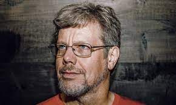
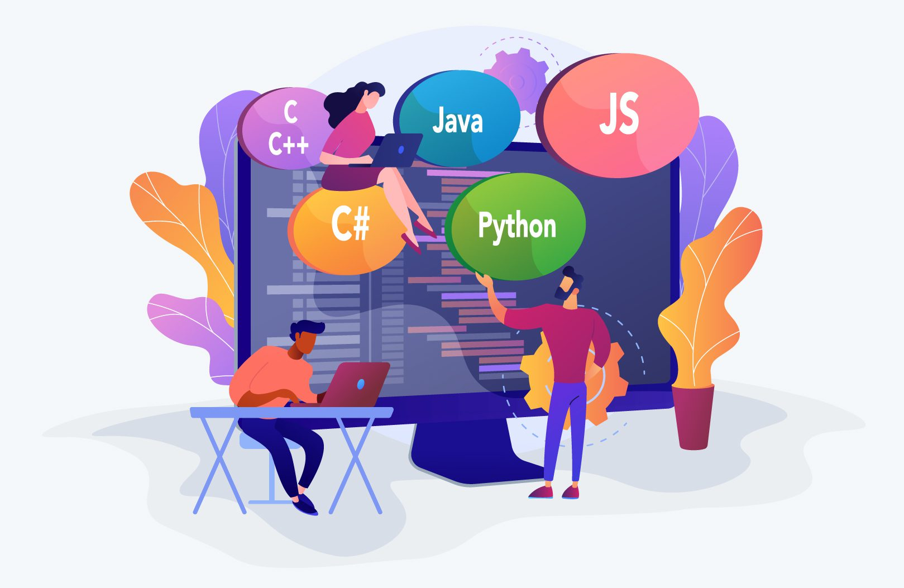

# Thème 6 :  Langages et programmation

!!! history "Histoire de l'informatique"
    {align=left width=150px} 

    {align=right width=100px} 

    [Guido van Rossum](https://fr.wikipedia.org/wiki/Guido_van_Rossum){:target="_blank"}  né le 31 janvier 1956 à Haarlem aux Pays-Bas, est un développeur connu pour être le créateur et leader du projet du langage de programmation Python.

    [Grace Hopper](https://fr.wikipedia.org/wiki/Grace_Hopper){:target="_blank"}  (1906-1992) est une informaticienne américaine, connue pour sa contribution à la conception et à la traduction des premiers langages de programmation, et comme l’une des principales inspiratrices du langage COBOL.

Les langages de programmation permettent de décrire d'une part les structures des données qui seront manipulées par l'appareil informatique, et d'autre part d'indiquer comment sont effectuées les manipulations, selon quels algorithmes. Ils servent de moyens de communication par lesquels le programmeur communique avec l'ordinateur, mais aussi avec d'autres programmeurs...

{: .center}

- 🗹 Variables  
- 🗹 Boucle For  
- 🗹 Boucle While  
- 🗹 Instruction conditionnelle If  
- 🗹 Fonctions  