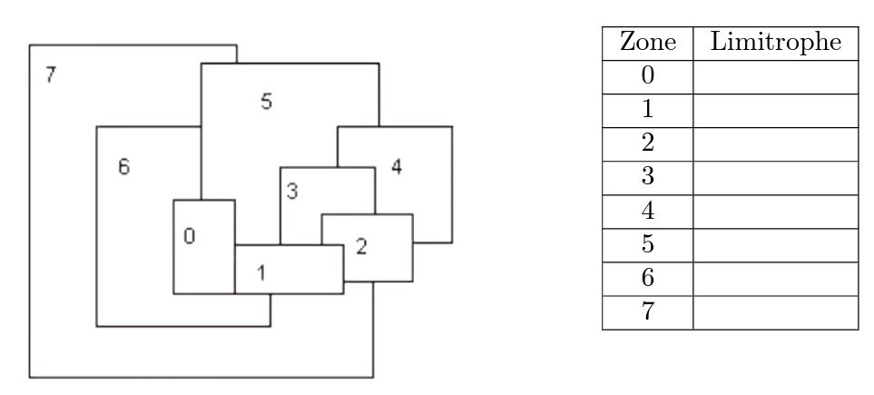




 


{{ titre_chapitre(num,titre,theme,niveau)}}
 
## Activités 

{{ titre_activite("Introduction",[],0) }}

!!! note "Problème d’optimisation : Le voyageur"
    **Enoncé du problème :**  
    Un voyageur souhaite visiter plusieurs villes de France, dans n’importe quel ordre, mais en minimisant la distance parcourue.

{:.center width=75%}

Le tableau suivant donne les distances routières kilométriques entre plusieurs villes de France :

|     |**Clermont-Ferrand**|**La Rochelle**	|**Lille**         |	**Limoges**    |	**Lyon**       |	**Marseille**   |	**Nantes**|	**Paris**|
|:---:|:-----------:|:------------:|:------------: | :------------:| :------------:| :------------: |:------------:| :------------: |
|**La Rochelle**| 462 |     |       |       |       |       |       |   |							
|**Lille**	    | 622 |	688	|       |       |       |       |       |   |					
|**Limoges**    | 173 |	222	|608	|		|       |       |       |   |		
|**Lyon**	    | 165 |	614	|681	|385	|       |       |       |   |			
|**Marseille**  | 413 |	823	|1001	|593	|314	|       |       |   |		
|**Nantes**	    | 534 |	137	|600	|320	|655	|986	|       |   |	
|**Paris**	    | 423 |	472	|225	|392	|466	|775	|385	|   |
|**Toulouse**   | 377 |	421	|894	|290	|467	|404	|585	|678|


**Question 1 :**  

- Départ et arrivée à Clermont-Ferrand,  
- Villes à visiter : Limoges, Lyon, Paris et Toulouse.   

**Q1.a** Combien de "chemin" possible ?  

**Q1.b** Déterminer tous les chemins possibles ainsi que le kilométrage totale.

**Q1.c** Répondre au problème: quel est le trajet optimal ?

Le problème se ramène à trouver un ordre de visite des quatre villes pour lequel la somme des distance données par ce tableau est aussi petite que possible.  
Une manière simple d'aborder le problème consiste à énumérer tous les cas possibles et calculer la distance  correspondante pour chacun des cas.  


**Question 2 :**  
Calculer le nombre de trajets possibles si le voyageur décide de visiter toutes les villes du tableau.  

??? tip
    Cette technique (répertorier tous les cas de figure et faire une étude exhaustive) n'est pas possible à grande échelle.   
    Déterminer le nombre d'itinéraires possibles :

    * 8 villes (hors ville de départ) on a : $\dfrac{8 \times 7 \times 6 \times 5 \times 4 \times 3 \times 2 \times 1}{2}= 20160$ itinéraires possibles.  
    * 10 villes (hors ville de départ), nombre d'itinéraires à tester : $\dfrac{10 \times 9 \times 8 \times 7 \cdots \times 2 \times, 1}{2}=$ 1 714 400  
    * 13 villes (hors ville de départ), nombre d'itinéraires à tester : $\dfrac{13 \times 12 \cdots \times 2 \times, 1}{2}=$ 3 113 510 400  
    * 20 villes (hors ville de départ), nombre de parcours à tester :  $\dfrac{20 \times 19 \times 18 \times 17 \cdots \times 2 \times, 1}{2}=$ 1 216 451 004 088 320 000   
    > Face à de tels problèmes d'optimisation impossible à explorer exhaustivement, il peut être utile de connaître des algorithmes donnant rapidement une réponse qui, sans être nécessairement optimale, resterait bonne.


### Synthèse 

Nous avons vu que la force brute ne permet pas de résoudre (en un temps raisonnable) le problème du voyageur de commerce lorsqu'on augmente le nombre de villes.

Maintenant que vous avez manipulé ce problème et vu à quel point il est complexe à résoudre, nous allons voir comment faire autrement.

!!! jeretiens "A retenir :"
    - Les **algorithmes gloutons** (greedy algorithms) constituent une alternative beaucoup plus simple à programmer, mais dont le résultat n’est pas toujours optimal (sauf dans certaines situations dites canoniques)
    - L’approche gloutonne consiste à construire une solution complète par une succession de choix locaux donnant systématiquement la meilleure solution partielle.  

    Pour résumer, on peut employer un algorithme glouton lorsque :  

    - une solution complète peut être construite en passant par une succession de solutions partielles,  
    - chaque solution partielle est établie en faisant un choix local à partir de la solution partielle précédente,  
    - on dispose d’une fonction permettant d’évaluer la qualité de chaque solution partielle.  

    _Les choix ne sont jamais remis en cause : une fois faits, on ne revient pas dessus. Cela constitue une différence essentielle avec la programmation dynamique qui au lieu de se focaliser sur un seul sous-problème, explore les solutions de tous les sous-problèmes pour les combiner finalement de manière optimale._


Les **algorithmes gloutons** sont utilisés pour répondre à des **_problèmes d'optimisation_**, c'est-à-dire des problèmes algorithmiques dans lesquels l'objectif est de trouver une solution " la meilleure possible " selon un critère, parmi un ensemble de solutions également valides mais potentiellement moins avantageuses.  

Le contexte général d'un tel problème d'optimisation est donc le suivant :  b

* on considère  un problème possédant un très grand nombre de solutions  
* on dispose d'une fonction mathématique évaluant la qualité de chaque solution  
* on cherche une solution qui soit bonne, voire meilleure.  


Les algorithmes gloutons s'appliquent lorsque de plus :
* la recherche d'une solution peut se ramener à une succession de choix qui produisent et précisent petit à petit une solution partielle
* on dispose d'une fonction mathématique évaluant la qualité de chaque solution partielle (dont on attend qu'elle soit cohérente avec la fonction d'évaluation des solutions complètes).


!!! exo "Retour à l'activité"
    Répondre à la question de l'activité en appliquant cet algorithme.

{{ titre_activite("Mise en oeuvre avec Python",[],) }}

{{capytale("6774-1470050")}}

{{ titre_activite("Le problème du sac à dos",[],) }}

Un cambrioleur ne peut emporter que 40 kg sur son dos dans son sac. Il a le choix d'emporter certains des objets suivants :

|         | Poids (masse en kg) | Valeur (prix de revente) |
|---------|:-----:|:------:|
| objet A |   13  |   700  |
| objet B |   12  |   500  |
| objet C |   8   |   200  |
| objet D |   10  |   300  |
| objet E |   14  |   600  |
| objet F |   18  |   800  |

Il va se demander quels objets choisir pour obtenir une valeur totale maximale tout en ne dépassant pas 40 kg.

!!! question "Q1"
    Classer ces objets par valeur décroissante et donner la solution de l'algorithme glouton avec ce critère de classement.

!!! question "Q2"  
    Même question avec un classement par poids croissant.

!!! question "Q3"  
    Même question avec un classement par valeur/poids (valeur massique) décroissant.

!!! question "Q4"  
    A-t-on obtenu la solution optimale ?

### Activité Capytale 

**Activité Capytale :** {{capytale("cd2e-1484556")}}

{{ titre_activite("Rendu de monnaie",[],) }}

!!! note "Présentation du problème"
    Un achat dit en espèces se traduit par un échange de pièces et de billets. Pour simplifier, considérons que les pièces désignent indifféremment les véritables pièces ou les billets.  
    Supposons qu’un achat induise un rendu de monnaie 49 euros.  
    Quelles pièces peuvent être rendues ?  La réponse n’est pas unique :  
    
    - Quatre pièces de 10 euros, 1 pièce de 5euros et deux pièces de 2e uros conviennent.  
    - Mais quarante-neuf pièces de 1 euros conviennent également !  
    
    Si la question est de rendre la monnaie avec un minimum de pièces, la réponse reste simple : c’est la première solution proposée.  
    Toutefois, comment parvient-on à un tel résultat ? Quels choix ont été faits qui optimisent le nombre de pièces rendus ?  
    
Le problème est de rendre la monnaie en un minimum de pièces.  
La solution dépend évidemment du système de monnaie utilisé.  
Considérons le système monétaire européen simplifié où les pièces prennent les valeurs 500, 200, 100, 50, 20, 10, 5, 2 , 1 euros.  
Rendre 49 euros avec un minimum de pièces est un problème d’optimisation.  
En pratique, sans s’en rendre compte généralement, tout individu met en œuvre un algorithme glouton.  
Il choisit d’abord la plus grandeur valeur de monnaie, parmi 1, 2, 5, 10, contenue dans 49 euros. En l’occurrence, quatre fois un pièce de 10 euros. La somme de 9 euros restant à rendre, il choisit une pièce de 5 euros, puis deux pièces de 2 euros.  
Mais cette stratégie gagnante pour la somme de 49 euros l’est-elle pour n’importe quelle somme à rendre ? 

!!! info "Application du paradigme glouton"  


!!! exo
    1. On considère le système monétaire européen systeme = [1, 2, 5, 10, 20, 50, 100, 200, 500]. 
    Quelle est la solution gloutonne pour un rendu de monnaie de 34 euros?   
    de 47 euros ?  
    
    2. On considère le système monétaire systeme = [1, 3, 6, 12, 24, 30]. Quelle est la solution gloutonne pour un rendu de monnaie de 49 euros ? Est-elle optimale ? 
    
    
!!! note "Remarque :" 
    Un système monétaire pour lequel l’algorithme de rendu de monnaie glouton donne toujours un nombre minimal de pièces est dit canonique. Il existe des algorithmes permettant de déterminer si un système monétaire est canonique. 
    
### Activité sur Capytale 

**Activité Capytale :** {{capytale("5726-1484553")}}

## Exercices 

!!! exo "Coloriage de carte"
    On veut colorier une carte en s’assurant que deux zones limitrophes n’ont pas la même couleur avec le minimum de couleurs possible. On choisit de trier les zones par nombres de zones limitrophes, par ordre décroissant. utilisez pour cela le tableau ci-dessous. La méthode gloutonne est le choix de colorier la zone ayant le plus d’adjacent, puis la zone ayant le plus d’adjacent non limitrophe à cette zone et ainsi de suite.

    {:.center width:250px}

    Effectuer le coloriage de cette carte avec cette méthode.

!!! exo "Minimiser somme sur une grille"
    Sur la grille ci-dessous, on part de la case tout à gauche marquée de la lettre D. On souhaite atteindre les cases vides sur la partie droite en se déplaçant de case en case.  

    {:.center width:250px}

    Lorsqu’on est sur une case on peut se déplacer sur une des deux cases voisines situées sur la droite. On note S la somme de toutes les cases traversées.  
    Par exemple on peut effectuer la trajectoire suivante :  
    D – 7 – 5 – 3 – 5 – 7 – 9 – 8 – 9 – 6  qui conduit à S = 59.  
    On cherche à effectuer la trajectoire qui rend la somme S la plus petite possible.  
    
    - Définir une règle de choix qui vous donne une solution respectant les contraintes. Quelle trajectoire et quelle somme S obtenez-vous avec cette règle ?  
    - Est-il optimal ?  
    Sur cette grille, en cherchant bien, la trajectoire optimale donne une somme S=23. Votre algorithme glouton a-t-il trouvé cette trajectoire optimale ?  

    -  Pour obtenir la solution optimale de façon certaine on souhaite trouver toutes les trajectoires possibles et calculer pour chacune d’elles la somme associée.  
    Quel est le nombre de trajectoires au total ?
    

!!! exo "Rendu de monnaie"
    Donner une somme avec le moins de pièces possibles. On veut donner la somme de 14 euros dans les systèmes de pièce suivant :  
    - s1={1; 2; 5; 10} ;   
    - s2={1; 2; 7; 10 } ;  
    - s3={3; 5;7;10 }  
    
    On commence par ordonner les pièces dans l’ordre décroissant: il suffira de choisir les pièces dans l’ordre pour faire un choix optimum local. Compléter les tableaux avec ce choix optimum local. 
    
    - Système 1 
    
    |Pièce |nombre |
    |:---:|:---:|
    |10 | |
    |5 | |
    |2 | |
    |1 | |
    
    
    - Système 2 
    
    |Pièce |nombre |
    |:---:|:---:|
    |10 | |
    |7 | |
    |2 | |
    |1 | |
    
    - Système 3  
    
    |Pièce |nombre |
    |:---:|:---:|
    |10 | |
    |7 | |
    |5 | |
    |3 | |
    
    
    1. Comparer les résultats et commenter.  
    
    2. Ecrire en pseudo-code un algorithme de rendu de monnaie.  
    
    3. Implémenter une fonction rendu monnaie(m, systeme) et la tester pour le système de pièce européen (le billet de plus forte valeur est 500) et pour un montant m donné.   
    
    4. Modifier le code de la fonction `rendu monnaie` pour qu’elle renvoie un dictionnaire où les clés sont les valeurs des pièces rendues et les valeurs le nombre de pièces à rendre.  
    
    Exemple  
    ```python
    >>>rendu_monnaie(14, [10, 5, 2, 1]) 
    {1:0, 2:2,5:0, 10:1}
    ```

!!! exo "Ranger ses affaires"
    On dispose de n objets $x_1,x_2,.....x_n$ ayant chacun une valeur $v_i$ et une masse $m_i$.  
    On possède un sac à dos dans lequel on ne peut mettre qu’une masse maximale M. On veut remplir le sac de fa¸con à ce que la valeur des objets emportés soit maximale.  
    
    **Optimiser le rangement**  
    On prend M=10 kg. Il s’agit de choisir les objets à emporter dans le sac afin maximiser la valeur totale tout en respectant la contrainte du poids maximal. C’est un problème d’optimisation avec contrainte.  
    Considérons les objets suivants et un sac de capacité maximale 10 kg. Quels objets faut-il prendre ? 
    
    |Objet |A |B |C |D | E | F|
    |:---:|:---:|:---:|:---:|:---:|:---:|:---:|
    |masse en kg| 7| 6| 4| 3| 2| 1|
    |valeur en euros |9100 |7200| 4800| 2700|2600|200|
    
    Il y a plusieurs choix possibles :  
    
    - **Stratégie 1** : prendre toujours l’objet de plus grande valeur n’excédant pas la capacité restante (il faut trier préalablement par valeur décroissante)  
    - **Stratégie 2** : prendre toujours l’objet de plus faible masse (il faut trier préalablement par masse croissante)  
    - **Stratégie 3** : prendre toujours l’objet de plus grand rapport $\dfrac{valeur}{masse}$ n’excédant pas la capacité restante (il faut trier préalablement en suivant ce rapport de façon décroissante). 
    
    **Q1.** Tester ces trois stratégies et donner la valeur emportée dans les trois cas.  
    **Q2.** On dispose d’une liste d’objets de masses m = [9, 10, 12, 14, 11, 5, 7, 5, 6, 2] ainsi que de leurs valeurs associées v = [10, 8, 7, 7, 5, 4, 3, 2, 2, 1]. 
    Par exemple, le premier objet d’indice 0 a pour masse 9 kg et pour valeur 10 euros.  
    Programmer un algorithme pour le knapsack problem. Tester le programme pour une masse maximale de 22 kg. 
    
    Bien sûr, pour manipuler plus finement les objets, il faudrait changer les structures de données utilisées en utilisant une seule liste, un dictionnaire ou de la programmation objet pour représenter l’ensemble des objets considérés.


## Approfondissement 

A venir