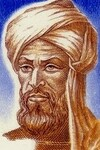
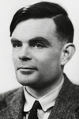

# Thème 7 : Algorithmique

!!! history "Histoire de l'informatique"
    {align=left} 

    {align=right}

    [Al Hwarizmi](https://fr.wikipedia.org/wiki/Al-Khw%C3%A2rizm%C3%AE){:target="_blank"} (~780-850) est un mathématicien persan membre de la [Maison de la sagesse](https://fr.wikipedia.org/wiki/Maison_de_la_sagesse){:target="_blank"} de Bagdad. Ses travaux d'algèbre sur les méthodes de résolution des équations ont donné, par déformation de son nom latinisé, au mot **algorithme**.

    [Alan Turing](https://fr.wikipedia.org/wiki/Alan_Turing){:target="_blank"}  (1912-1954) est un mathématicien britannique, connu pour avoir décrypté la machine Enigma pendant la deuxième guerre mondiale. Ses travaux sur les liens entre algorithme et raisonnement mathématique l'ont conduit à imaginer un procédé de calcul universel, la *machine de Turing*, à l'origine de la conception des ordinateurs.

Tout comme les plus grands chefs conçoivent leurs recettes à partir de recettes de base classiques, on retrouve dans les algorithmes les plus complexes des résolutions de problèmes simples et récurrents: parcourir une liste, trier...

- 🗹 Extremums et moyennes  
- □ Tri par insertion - Tri par sélection  
- □ Dichotomie  
- 🗹 Algorithmes gloutons  
- □ Algorithme KNN  

<!-- {: .center width=640}  -->

<iframe width="640" height="360" src="https://www.youtube.com/embed/AgtOCNCejQ8" title="YouTube video player" frameborder="0" allow="accelerometer; autoplay; clipboard-write; encrypted-media; gyroscope; picture-in-picture" allowfullscreen></iframe>

