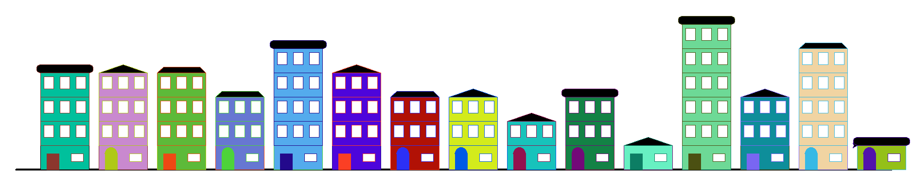
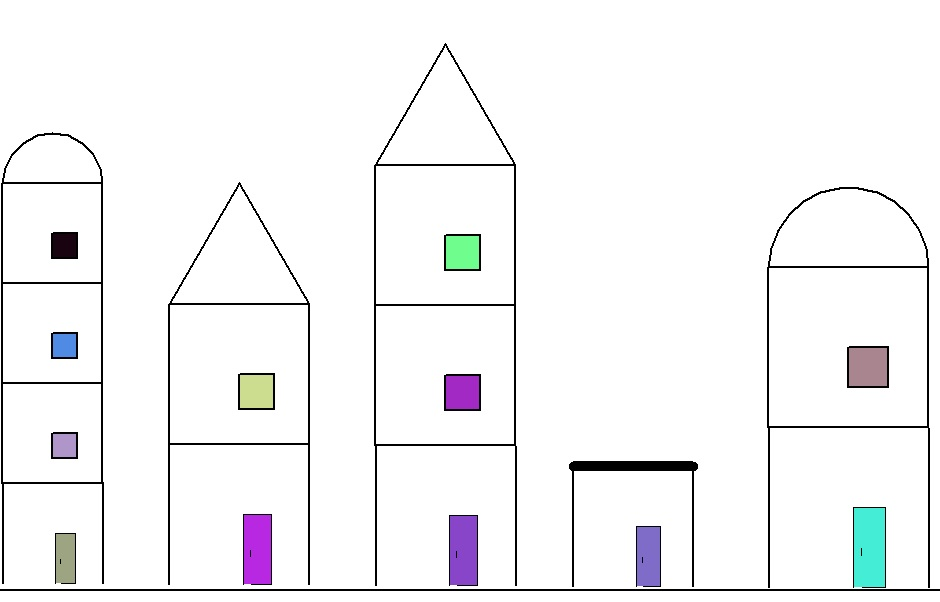
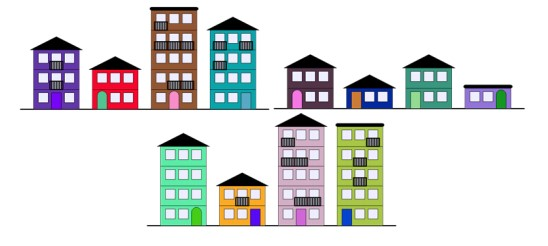
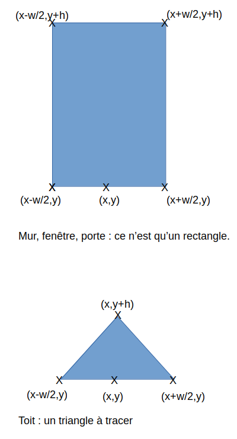
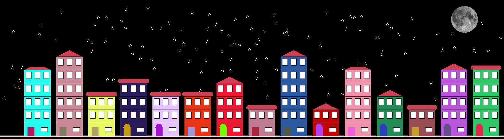







{{ titre_chapitre(num,titre,theme,niveau)}}

{{ initexo(0) }}





!!! objectif "objectif"
    On souhaite écrire un programme qui permet de générer « aléatoirement » le dessin d’une rue d'immeuble.

!!! abstract "Cahier des charges"
    Voici ci-dessous un exemple de ce que devrait donner votre programme lorsque vous le lancerez :

    {:.center width=50%}

    {:.center width=50%}


!!! abstract "Cahier des charges :"
    Pour cela, vous utiliserez le module turtle dont le principe est de suivre dans une fenêtre l’évolution d’une tortue (symbolisée par une flèche) qui suivra vos instructions à la lettre.

    Les contraintes urbanistiques sont les suivantes :

    - les immeubles ont au minimum un rez-de-chaussée et au maximum 4 étages (5 niveaux) ;  
    - les immeubles ont une couleur unique pour toute la façade ;  
    - les rez-de-chaussée n'ont qu'une seule porte ;  
    - Tout le reste est libre et peut donc être « personnalisé ».  

!!! info "Information"
    Les fonctions sont données avec certains paramètres, vous pouvez rajouter un paramètre couleur par exemple...

!!! aide "Aide Construction"
    - Penser à faire un dessin, utiliser des coorodnnées et à utiliser la fonction `goto(x,y)`.  
    {:.center width=35%}
    - Les murs, fenêtres et portes ne sont que des rectangles.  
    - Un immeuble est un assemblage de murs, porte et fenêtres.
    - ...


Pour la couleur, vous avez à votre disposition le code suivant :

```python
from turtle import *
from random import *

def couleur_aleatoire():
    '''Renvoie une chaîne de caractères correspondant à une couleur aléatoire opaque.'''
    s, hexa_chars = "#", "0123456789abcdef"
    for _ in range(6):
        s = s + choice(hexa_chars)
    #s = s + '11'                                      #<---- rajoute de la transparence
    return s
    
```

!!! fabquestion "Question 1"
    Implémenter la fonction `sol(y)` qui trace un trait pour définir le niveau de la rue.

    ```python
    def sol(y):
        '''
        Paramètres
            y : ordonnée du sol du la rue
        '''
    ```

!!! fabquestion "Question 2"
    Implémenter la fonction mur(x,y,w,h) qui permet de tracer les murs d'une maison (un rectangle), vous pouvez rajouter un paramètre couleur.
    
    ```python
    def mur(x,y,w,h):
        '''
        Paramètres
            x, y : coordonnées du centre de la base de rectangle
            w : largeur du rectangle
            h : hauteur du rectangle
        '''
    ```

!!! fabquestion "Question 3"
    Implémenter la fonction fenetre(x,y,w,h) qui permet de tracer une fenêtre

    ```python
    def fenetre(x,y,w,h):
        '''
        Paramètres
            x, y : coordonnées du centre de la base de rectangle
            w : largeur de la fenêtre
            h : hauteur de la fenêtre
        '''
    ```

!!! fabquestion "Question 4"
    Implémenter la fonction `toit(x,y,w,h)` qui permet de tracer un toit (envisager plusieurs modèles).

!!! fabquestion "Question 5"
    Implémenter la fonction `porte(x,y,w,h)` qui permet de tracer une porte (envisager plusieurs modèles).


!!! fabquestion "Question 6"
    Implémenter la fonction `immeuble(x,y,w,h)` qui permet de tracer un immeuble avec un nombre aléatoire d'étage et utilsera les fonctions `toit(x,y,w,h)`, `porte(x,y,w,h)`, `fenetre(x,y,w,h)` et `mur(x,y,w,h)` au minimum .

!!! fabquestion "Question 7"
    Implémenter la fonction `ville()`. La fonction fera appel à `immeuble(x,y,w,h)`

    ```python
    def ville():
        """
        C'est une fonction qui permet de créer une ville avec des batiments 
        de tailles et couleurs differentes. Elle est lancée automatiquement
        """
        
    ```

