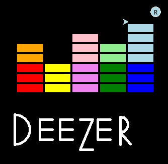
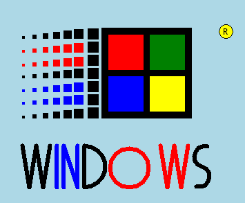






{{ titre_chapitre(num,titre,theme,niveau)}}

{{ initexo(0) }}

!!! objectif
    Nous allons suivre une démarche de projet pour créer un logo numérique à l’aide de python et turtle. (le faire à partir d’un logiciel de traitement d’image serait trop simple ...)

!!! note inline end "Reprise de Deezer"
    

!!! abstract "Cahier des charges :"
    Logo numérique original qui contient :  
    
    • Plusieurs colonnes de rectangles, carrés, polygônes ou de cercles colorés.  
    • Un texte au choix en dessous de ces colonnes .  
    • Des couleurs variés.  
    • Le code est basé sur des fonctions et des boucles pour éviter les répétitions.  

!!! info "Ressources autres"
    [tutoriel turtle](https://turtle-tutorial.readthedocs.io/en/latest/2_draw/draw.html)

## Le « sprint »

!!! note inline end "Windows retro"
    

    
| | | 
|:---:|:---|
|5’ |Répartition des tâches|
|30’ |1ère session de travail|
|5’ |Point d’étape 1 |
||• Mise en commun : qu’est-ce qui marche ? Ne marche pas ? ...|
||• Echange et nouvelle répartition de tâches en fonction des difficultés.|
|30’ |2nde session de travail|
|5’ |Point d’étape 2|
||• Mise en commun : première version.|
||• Elaboration des protocoles de tests|
|20’| 3ème session de travail|
||• Tests et corrections finales|
|5’ |Final|
||• Mise en commun et rendu final|

## CONSEILS

• Description et répartition des tâches précise  

|    |    |    |    |    |  
|:---|:---|:---|:---|:---|
|Description de la tâche| Ordre / Priorité| Temps alloué |Qui ? |Critères de validation|
|... |...| | | |
|... |...| | | |

• Se mettre d’accord sur les noms de variables et les E/S d’éventuels fonctions  
• PDCA (Plan, Do, Check, Act) Imaginer → Tester → Vérifier → Modifier … etc  
• Ne pas oublier de documenter par des commentaires précis.  
• Les différents codes réalisés sont à regrouper dans un même programme.  

## Evaluation

### Fonctionnalités minimales demandées :  

|||||
|:---|:---|:---|:---|
|• Colonne de formes| /2 |• Texte| /2|
|• Formes colorées |/2 |• Couleur de fond |/2|

### Fonctionnalités plus : ( +1pt par fct)

|||||
|:---|:---|:---|:---|
|• Recherches d’images/formes originales||• Autre...||
|• Choix des paramètres du logo à créer||||

### Code :

|||||
|:---|:---|:---|:---|
|• Lisibilité du code, clarté |/2 |• Utilisation de fonctions| /2|
|• Variables explicites |/2 |• Utilisation de boucles for ou while| /2|
|• Commentaires pertinents |/2|||

