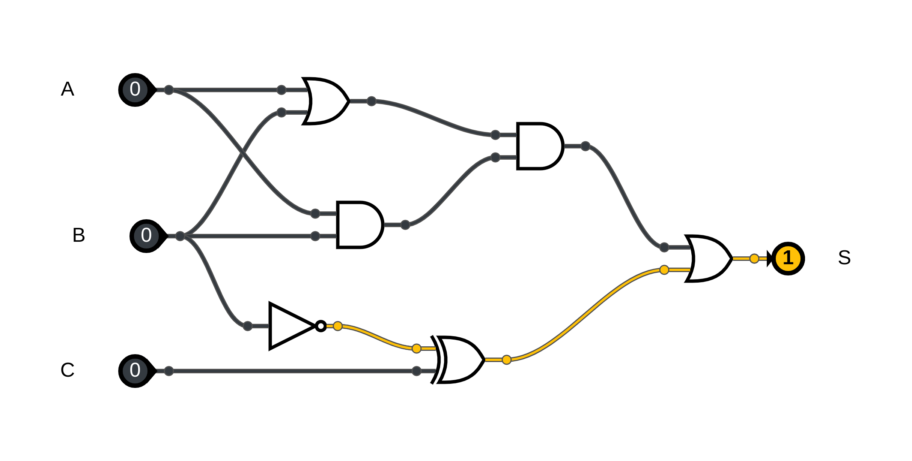
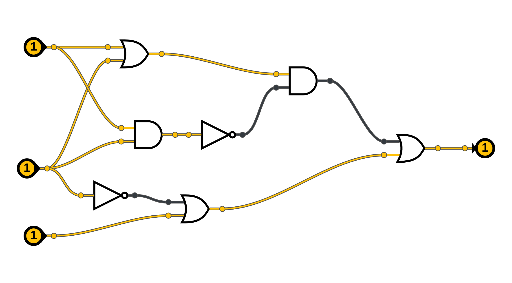






{{ titre_chapitre(num,titre,theme,niveau)}}

{{ initexo(0) }}

## Partie A QCM 

!!! exo QCM

{{qcm_chapitre_devoir(num)}}

## Partie B : Sur feuille 

!!! exo
    Montrer l'égalité suivante : not(A or B) = not(A) and not(B)

!!! exo 
    Donner la table de vérité de : S = (A or B) and ( not(A) or B)  
    Quelle égalité booléenne peut-on déduire ?  

!!! exo 
    Donner la table de vérité de : S = (A and B) or (A and not(C)) or (not(A) and C)

!!! exo 
    Donner la table de vérité de : S = (NOT(A) and B) or (A and C)  

!!! exo 
    Donner la table de vérité de : S = (A nor B) or (A nand B)

!!! exo 
    On donne le schéma ci-dessous, donner son expression et sa table de vérité.

    

## Partie C : sur machine

!!! exo
    Construire le circuit suivant : not(A or B) = not(A) and not(B)

<iframe style="width: 100%; height: 550px; border: 0" src="https://logic.modulo-info.ch/?mode=design&data=N4IgbiBcAsC+Q"></iframe>

!!! exo 
    Construire : S = (A or B) and ( not(A) or B)  

<iframe style="width: 100%; height: 550px; border: 0" src="https://logic.modulo-info.ch/?mode=design&data=N4IgbiBcAsC+Q"></iframe>

!!! exo 
    Construire : S = (NOT(A) and B) or (A and C)  

<iframe style="width: 100%; height: 550px; border: 0" src="https://logic.modulo-info.ch/?mode=design&data=N4IgbiBcAsC+Q"></iframe>

!!! exo 
    Construire : S = (A and B) or (A and not(C)) or (not(A) and C)

<iframe style="width: 100%; height: 550px; border: 0" src="https://logic.modulo-info.ch/?mode=design&data=N4IgbiBcAsC+Q"></iframe>

!!! exo 
    Reproduire le schéma ci-dessous, et donner sa table de vérité.

    

<iframe style="width: 100%; height: 550px; border: 0" src="https://logic.modulo-info.ch/?mode=design&data=N4IgbiBcAsC+Q"></iframe>