<table  style="background-color: #E32636; width:100%;color:white;">
    <thead>
        <tr>
            <th style="text-align:center;border:solid;border-width:1px;font-size:20pt;width:70%;">TD n°12 : Les IMAGES - INTRODUCTION</th>
            <th style="text-align:center;border:solid;border-width:1px;font-size:12pt;width:30%">Thème  : Transversal</th>
        </tr>
          <tr>
            <th style="text-align:center;border:solid;border-width:1px;font-size:15pt;width:70%;"></th>
            <th style="text-align:center;border:solid;border-width:1px;font-size:12pt;width:30%">COURS et EXERCICES</th>
        </tr>
    </thead>
</table>

<blockquote style="background-color: #E32636; border-left: 7px solid rgb(0 0 0);"> 
    <span style="font-size:30px; color:white;"> I. Notion d'images </span></blockquote>

## &#9193; VOCABULAIRE  

- Un carré est appelé pixel (abréviation de picture element, élément d’image).
- Chaque pixel est repéré par ses coordonnées dans un repère dont l’origine est en haut à gauche de l’image :

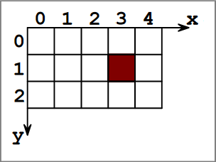{:center}

- Plus la densité de pixels (résolution de l’image) sera élevée, plus l’image sera de bonne qualité mais plus le poids de cette image en octet sera important.
- La taille de l’image indique le nombre de pixels disposés sur la largeur et sur la hauteur.
- Le format de l’image correspond au standard utilisé pour coder l’image. Parmi les formats d’images bitmap les plus connus, on trouve .jpg, .png ou encore .gif.

<blockquote style="background-color: #E32636; border-left: 7px solid rgb(0 0 0);"> 
    <span style="font-size:30px; color:white;"> II. Couleurs d'une image </span></blockquote>

A chaque pixel est associée une couleur, représentée sous la forme d’un code chiffré : on dit que l’image est numérisée.  
Parmi les différents encodages de couleur, on distinguera :    

- Le **noir et blanc** avec un encodage binaire : 0 ou 1 ;  
- Le **monochrome** (aussi appelé «**nuances de gris**») avec un encodage sur une échelle de valeurs de 0 à $n$  
(généralement $n = 255$ pour coder une nuance sur un octet) ;  
- La **couleur** (sans transparence) à partir d’un mélange des trois couleurs Red, Green, Blue (généralement abrégé RGB). Dans ce cas, chacune des trois composantes peut prendre des valeurs de 0 à 255 ce qui permet d’obtenir plus de 16 millions de couleurs (256 x 256 x 256).  

<blockquote style="background-color: #E32636; border-left: 7px solid rgb(0 0 0);"> 
    <span style="font-size:30px; color:white;"> III. Matricielle vs Vectorielle </span></blockquote>


!!! abstract "Matricielle"
    Comme indiquée ci-dessus, une image créée pixel par pixel est appelée image bitmap ou ma-
    tricielle.  

    - **Avantage** : c’est ainsi qu’un appareil photo ou que l’oeil humain voit l’image.  
    - **Inconvénient** : zoomer sur l’image revient à grossir la taille des pixels et donc à voir apparaitre des carrés.  

!!! abstract "Vectorielle"
    Une image créée à l’aide d’une description géométrique des éléments qui la composent est appelée
    image vectorielle. Le format .svg est un format usuel d’image vectorielle.  

    - **Avantage** : zoomer sur l’image revient à changer d’échelle pour la représentation des éléments qui la composent sans corrompre l’esthétique.  
    - **Inconvénient** : il est difficile de modéliser mathématiquement une photo issue de la réalité.

<blockquote style="background-color: #E32636; border-left: 7px solid rgb(0 0 0);"> 
    <span style="font-size:30px; color:white;"> IV. Créer une nouvelle image avec le module PIL </span></blockquote>
    
Le module PIL permet de manipuler un grand nombre de formats d’image. Ce module n’est pas inclus d’office dans Python, il faut télécharger puis installer la bibliothèque pillow si on ne travaille pas dans le noteboook capytale. 

Pour plus d’informations sur les possibilités de ce module, on pourra consulter 
[Le site de référence.  ](https://pillow.readthedocs.io/en/stable/handbook/tutorial.html)  
Cette page présente comment concevoir une nouvelle image avec PIL en construisant ligne par ligne un
programme. On commence par importer le module en en-tête du fichier :

```python
from PIL import Image
```

On pourra sauvegarder les images souhaitées en rajoutant en début de programme :
```python
import basthon
```

et en fin de programme

```python
basthon.download("nom de l'image")
```

## &#9193; Mise en pratique du module PIL

!!! example "Exercice n°1 :"
    Le module PIL permet de créer très facilement l’image représentée ci-contre qui est un rectangle de 100 pixels de largeur et 256 pixels de hauteur, de couleur dégradée du noir (en haut) vers le rouge.  
    Pour créer une nouvelle image, il faut indiquer :  

    - le nom de la variable qui « contiendra » cette image ;
    - l’encodage des couleurs de cette image  

        - ’RGBA’ : couleurs avec gestion de la transparence (4 octets)
        - ’RGB’ : couleurs sans gestion de la transparence
        - ’L’ : nuances de gris
        - ’1’ : noir et blanc
    
    - les dimensions en pixels (largeur et hauteur) de cette image (sous forme de tuple - liste non modifiable).

    **Question**  
    Lancez la celulle suivante. Quelle remarque peut-on faire ?


    ```python
    ##-- - - - Importation des modules - - - - -##
    from PIL import Image

    ##-- - - - Variables et constantes - - - - -##
    largeur = 100
    hauteur = 256
    couleur = 'RGB'

    ##-- - - - - Nouvelle image - - - - - -##
    im = Image.new(couleur, (largeur, hauteur))

    ##-- - - - Fermeture et affichage - - - - -##
    im.save('Degrade.jpg')
    im.show()

    ```

!!! example "Exercice n°2 :"

    Le module PIL permet «d’atteindre» et de modifier directement n’importe quel pixel de l’image grâce à
    ses coordonnées.  
    Les coordonnées d’un pixel de l’image sont sous la forme d’un tuple $(x, y)$.  
    Selon l’encodage des couleurs du fichier, il faudra saisir une valeur entière différente pour le pixel correspondant :  

    - ’RGBA’ : un quadruplet (r, g, b, a) de valeurs comprises entre 0 et 255
    - ’RGB’ : un triplet (r, g, b) de valeurs comprises entre 0 et 255
    - ’L’ : une valeur g comprise entre 0 et 255
    - 1’ : une valeur nb comprise entre 0 et 1

    **Question :**  
    Compléter le programme précédent afin d’obtenir l’image d’un rectangle de 100 pixels
    de largeur et 256 pixels de hauteur, de couleur dégradée du noir (en haut) vers le rouge.

    


    ```python
    ##-- - - - Importation des modules - - - - -##
    from PIL import Image
    ##-- - - - Variables et constantes - - - - -##
    largeur = 100
    hauteur = 256
    couleur = 'RGB'
    ##-- - - - - Nouvelle image - - - - - -##
    im = Image.new(couleur, (largeur, hauteur))
    for x in range(......):
        for y in range(.......):
            im.putpixel((x, y), (.....,.....,....)) # Composante R en fonction de la hauteur
    ##-- - - - Fermeture et affichage - - - - -##
    im.save('Degrade.jpg')
    im.show()
    ```

!!! example "Exercice n°3 :"
    Créer une image représentant le drapeaux suivant :

    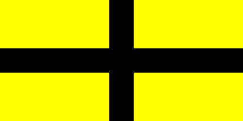{.:center}


    ```python
    ##-- - - - Importation des modules - - - - -##
    from PIL import Image
    ##-- - - - Variables et constantes - - - - -##
    largeur = 500
    hauteur = 250
    couleur = 'RGB'

    ##-- - - - - Nouvelle image - - - - - -##
    im = Image.new(couleur, (largeur, hauteur),(255,255,0))  # on crée une image jaune
    for x in range(......):
        for y in range(.......):
            im.putpixel((x, y), (.....,.....,....)) 

    for x in range(......):
        for y in range(.......):
            im.putpixel((x, y), (.....,.....,....)) 

            
            
            
    ##-- - - - Fermeture et affichage - - - - -##
    im.save('image1.jpg')
    im.show()
    ```

!!! example "Exercice n°4 :"
    Écrire un code Python pour dessiner le drapeau de la Norvège.

    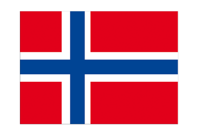


    ```python

    ```

!!! example "Exercice n°5 : Avec des maths - Approfondissement "
    Vous allez tracer le drapeu de l'Union Jack

    

    Dessiner en diagonale


    ```python
    import matplotlib.pyplot as plt
    from PIL import Image

    #Creation d'une image blanche RGB 10x10
    dessin5=Image.new("RGB",(600,400),(0,0,102))
    # Definitions des couleurs
    blanc = (255, 255, 255)
    #On parcourt tous les pixels de l'image:
    for col in range(0,600): 
        for ligne in range(0,400):
            if ligne >= 0.67*col - 50 and ligne <= 0.67*col + 50:
                dessin5.putpixel((col,ligne),blanc)
    plt.imshow(dessin5)
    plt.show()
    plt.close()
    dessin5.show()
    ```

    !!! aide "Explication :"
        1. Sur le graphique, placer les points A(0; 0) et B(600; 400).
        2. Calculer le coefficient directeur de la droite (AB) :
        3. Combien vaut son ordonnée à l’origine? 
        4. En déduire une équation de la droite (AB) :
        5. Tracer en vert la droite d’équation : $y = 0,67x − 50$
        6. Tracer en vert la droite d’équation : $y = 0,67x + 50$


    Vous l’avez remarqué ! **Les ordonnées vont de haut en bas ici**. Ce n’est pas le cas en Maths!

    **Étude de la seconde diagonale :**  

    6. Sur le résultat, placer les points C(0; 400) et D(600; 0).
    7. Calculer le coefficient directeur de la droite (CD). 
    8. Combien vaut son ordonnée à l’origine ? 
    9. En déduire une équation de la droite (CD).
    10. Quelles sont les conditions pour dessiner la deuxième bande blanche entourant la seconde diagonale : 
    ```python
    if ligne >= ............. and ligne <= .................:
        dessin5.putpixel((col,ligne),blanc)
    ```    
    11. Compléter le code Python pour dessiner l’Union Jack. (Commencer par les bandes en diagonale)


    ```python

    ```

    7 Pour les plus rapides, dessiner en Python le drapeau des Seychelles :
    (Commencer par déterminer les équations des droites en jeu.)

    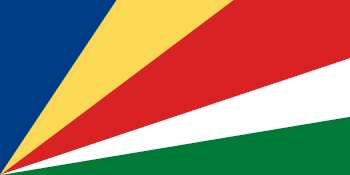


    ```python

    ```

<blockquote style="background-color: #E32636; border-left: 7px solid rgb(0 0 0);"> 
    <span style="font-size:30px; color:white;"> V. Modifier des images avec le module PIL </span></blockquote>
    

## &#9193; Ouvrir un fichier image


Pour ouvrir un fichier image au format .jpg (par exemple) située dans le répertoire courant, on utilise :
```python
im = Image.open('perroquetmulticolore.jpg')
```

Afin d’être “manipulée”, cette image est affectée à la variable nommée `im` dans le programme. 

## &#9193; Obtenir des informations sur cette image

Une fois le fichier ouvert, on peut connaître et utiliser :

- L’encodage des couleurs du fichier : ’RGBA’ (couleurs avec gestion de la transparence), ’RGB’, ’L’ (gris) ou ’1’ (noir et blanc).

```python
couleur = im.mode
print("L'encodage des couleurs est ", couleur)
```

Les dimensions de l’image (en pixels) sous forme d’un tuple (liste non modifiable (largeur, hauteur)) :  

```python
l, h = im.size
print(f'largeur : {l} et hauteur : {h}')   
```

Les composantes couleur du pixel de coordonnées (x, y) dans l’image. L’illustration ci-dessous présente comment PIL « lit » une image. 


Les coordonnées du pixel rouge de cette image sont donc (3, 1) : à nouveau, c’est un tuple (il doit être entouré de parenthèses...).

```python
x, y = 120, 120 # Coordonnées choisies au hasard
triplet = im.getpixel((x, y))
print("Ce pixel a pour composantes : ", triplet)
```

**Remarque importante**

Dans le cas d’une image encodée en ’RGB’, triplet prend pour valeur le triplet d’entier (r, v, b) correspondant aux composantes couleurs du pixels de coordonnées x en colonne et y en ligne. Par conséquent, 

- Ou bien on récupère l’intégralité du triplet puis on récupère les composantes r,v,b une à une avec les instructions
```python
triplet = im.getpixel((x, y))
r = triplet[0]
v = triplet[1]
b = triplet[2]
```
- Ou bien on récupère directement composante par composante avec l’instruction
```python
r, v, b = im.getpixel((x, y))
```


```python
from PIL import Image
issoire = Image.open('issoire_tour_horloge.jpg')

couleur = issoire.mode
print(f"L'encodage des couleurs est {couleur}")

l, h = issoire.size
print(f'largeur : {l} et hauteur : {h}')

issoire.show()
```

### &#9193; Pour éclaircir une image, on peut augmenter de 50% les composantes couleurs de chaque pixel.


```python
def eclaircissement(im_originale):
    """
    fonction qui renvoie l'image im_originale éclaircie
    """
        
    # récupération des dimensions de l'image originale
    L,H = im_originale.size
    
    # création d'une image vierge, de même format et même dimension que l'image initiale
    im_modifiee = Image.new( mode=im_originale.mode , size=(L,H) )
    
    # ouverture de l'accès aux pixels des deux images 
    pix_origine = im_originale.load()
    pix_modifie = im_modifiee.load()
    
    # on parcourt tous les pixels des images
    for x in range(L):
        for y in range(H):
            R,G,B = pix_origine[x,y] #récupération des composantes R,G,B du pixel original
            
            R = int(R*1.5)
            G = int(G*1.5)
            B = int(B*1.5)
            
            pix_modifie[x,y] = R,G,B #écriture des composantes R,G,B du pixel modifié
    
    # on renvoie l'image modifiée
    return im_modifiee


```


```python
eclaircissement(issoire)
```

### &#9193; Pour assombrir une image, on peut diminuer de 50% les composantes couleurs de l'image d'origine.<br>

!!! example "Question 1 :" 
    Écrire une fonction Python <mark>assombrissement</mark> qui permet d'assombrir une image, puis tester cette fonction.<br>
    !!! aide 
        On pourra commencer par effectuer un copier/coller de la fonction <mark>eclaircissement</mark> puis l'adapter.


    ```python
    # Ecrire ici la fonction assombrissement

    ```


    ```python
    # Tester ici un appel à la fonction assombrissement

    ```

### &#9193; Filtre  
Le principe du filtre rouge consiste à conserver les composantes rouges des pixels de l'image et à remplacer les autres par $0$.  

!!! example "Question 2"
    a. Écrire une fonction Python <mark>filtre_R</mark> qui applique le filtre rouge à une image, puis tester cette fonction.<br>


    ```python
    # Écrire ici la fonction filtre_R

    ```


    ```python
    # Tester ici un appel à la fonction filtre_R

    ```

    b. Écrire sur le même principe des fonctions Python <mark>filtre_G</mark> et <mark>filtre_B</mark> pour les filtres vert et bleu.


    ```python
    # Écrire ici la fonction filtre_G

    ```


    ```python
    # Tester ici un appel à la fonction filtre_G

    ```


    ```python
    # Écrire ici la fonction filtre_B


    ```


    ```python
    # Tester ici un appel à la fonction filtre_B


    ```

!!! example "Question 3 : Niveau de gris"
    Dans cette question, on souhaite convertir une image couleur en image en niveau de gris.<br>
    En RGB, on obtient un pixel en niveau de gris lorsque ses 3 composantes couleur sont égales.<br><br>
    a. Une première méthode consiste à remplacer chacune des composantes couleur d'un pixel par la moyenne des trois composantes initiales.<br>
    Écrire une fonction Python <mark>gris_rapide</mark> qui effectue cette conversion.<br>
    Tester cette fonction.


    ```python
    # Écrire ici la fonction gris_rapide

    ```


    ```python
    # Tester ici un appel à la fonction gris_rapide

    ```

    b. La perception des composantes couleur par l'oeil humain diffère selon ces couleurs.<br>
    Ainsi, l'organisme CIE (Commission Internationale de l'Éclairage) préconise la méthode suivante pour convertir une image en niveau de gris :<br>

    !!! info "Conversion en niveau de gris :"  

        On attribue à chaque composante couleur la valeur obtenue en additionnant : 

        - 21,25% de la valeur de la composante rouge initiale;  
        - 71,54% de la valeur de la composante verte;  
        - 7,21% de la valeur de la composante bleue.


    Écrire une fonction Python <mark>gris_precis</mark> qui réalise cette conversion.


    ```python
    # Écrire ici la fonction gris_precis

    ```


    ```python
    # Tester ici un appel à la fonction gris_precis


    ```

!!! example "Question 4."
    Pour obtenir le négatif d'une image, on remplace chaque composante de chaque pixel par la différence entre 255 et cette composante initiale.  

    Écrire une fonction Python <mark>negatif</mark> qui renvoie le négatif d'une image.


    ```python
    # Écrire ici la fonction negatif

    ```


    ```python
    # Tester ici un appel à la fonction negatif


    ```

!!! example "Question 5"
    Dans cette question, on souhaite convertir l'image en noir et blanc (sans niveaux de gris).  

    a. Rappeler les codes R,G,B correspondant respectivement au noir et au blanc.  
    b. On décide qu'un pixel sera blanc si et seulement si la moyenne de ses composantes initiales est supérieure ou égale à 128.  
    Ecrire une fonction Python <mark>NB</mark> qui réalise cette transformation.  


    ```python
    # Écrire ici la fonction NB


    ```


    ```python
    # Tester ici un appel à la fonction NB

    ```

!!! example "Question 6."
    Pourriez vous écrire un programme qui change la couleur du rouge à lèvre de cette dame.

    


    ```python
    from PIL import Image
    red = Image.open('redn.jpg')

    couleur = red.mode
    print(f"L'encodage des couleurs est {couleur}")

    l, h = red.size
    print(f'largeur : {l} et hauteur : {h}')

    red.show()
    ```

        L'encodage des couleurs est RGB
        largeur : 400 et hauteur : 239


<blockquote style="background-color: #E32636; border-left: 7px solid rgb(0 0 0);"> 
    <span style="font-size:30px; color:white;"> VI. Incrustation sur fond vert </span></blockquote>

Le procédé d’incrustation sur fond vert consiste à remplacer tous les pixels de l’image sur fond vert dont la composante verte est « dominante » par rapport aux deux autres par les pixels de l’image du fond à incruster.<br>


### &#9193; On souhaite réaliser l'incrustation sur fond vert de la façon suivante :


- On fixe des coefficients de seuils $C_R=1,3$ et $C_B=1,3$.  
- Pour chaque pixel de l’image sur fond vert, si ses composantes $R$, $G$, $B$ vérifient $G>C_R\times R$ et $G>C_B\times B$, alors on récupère le pixel du paysage, sinon on conserve le pixel de l'image sur fond vert.   


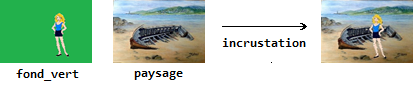{:.center}


!!! exameple 
    a. Écrire la fonction Python <mark>incrustation</mark> qui convient.

    On utilisera les images : 
    - personnage_test.jpg
    - paysage_test.jpg


    ```python
    # Écrire ici la fonction incrustation


    ```

    b. Tester la fonction <mark>incrustation</mark> avec les photos suivantes : personnage_test.jpg et paysage_test.jpg.  
    Si nécessaire, on pourra modifier les valeurs des coefficients de seuil $C_R$ et $C_B$.


    ```python
    # Tester ici la fonction incrustation


    ```

<blockquote style="background-color: #E32636; border-left: 7px solid rgb(0 0 0);"> 
    <span style="font-size:30px; color:white;"> VII. Réaliser des montages et transformations d'images </span></blockquote>


##  &#9193;  Exercice : Bordure 
!!! example "Bordure"
    Programmer une fonction def bordure(im,coul) qui crée une bordure de couleur autour de votre image.


    ```python

    ```

##  &#9193;  Exercice : Andy Warhol
!!! example "Andy Warhol"
    Maintenant testez le code qui permet de coller l’image de pomme dans une image de fond :


    ```python

    from PIL.Image import *
    # On ouvre l ' image de pomme
    im = open("pomme.jpg")
    # On récupère la dé finition de l ' image de pomme
    (L, H) = im.size
    couleur = im.mode
    # Je crée une nouvelle image pouvant contenir 4 fois l ' image de pomme
    fond = new(couleur, (L * 2, H * 2))
    # Je colle l ' image en (0, 0) ( coin en haut à gauche)
    fond.paste(image, (0, 0))
    fond.save("resultat2.jpg", "JPEG")
    fond.show()
    ```

    Maintenant modifiez ce code pour obtenir l’image suivante :

    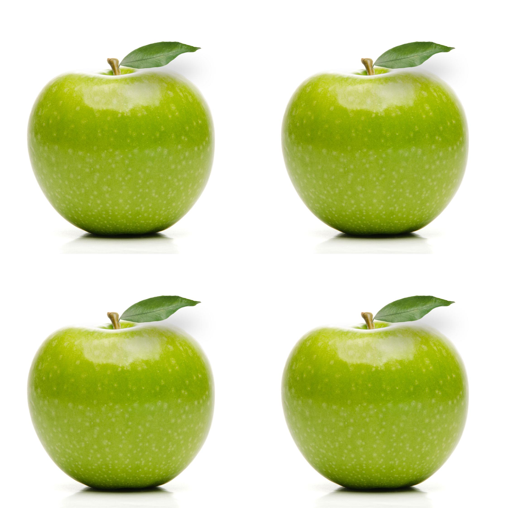{:.center width=250px}


    ```python

    ```

    puis en réutilisant tout ce que vous avez vu dans ce TP, écrivez un programme permettant d’obtenir
    l’image suivante :

    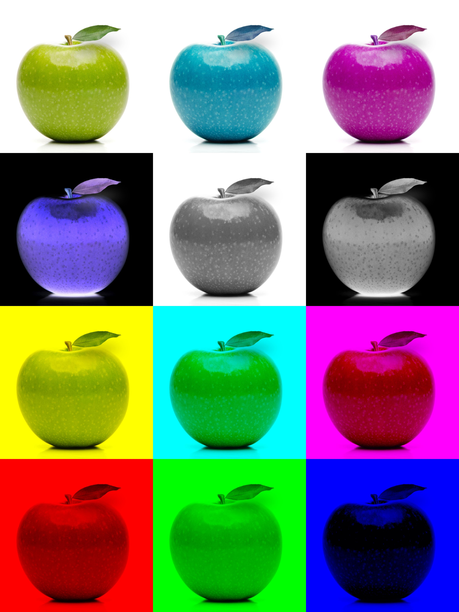{:.center width=350px}


    ```python

    ```

##  &#9193;   Exercice : Symétrie  
!!! example "Symétrie"
    Créer une fonction qui affiche une image ou la partie de droite est remplacée par sa symétrie. (A tester avec une photo d’identité pour voir la symétrie de votre visage)


    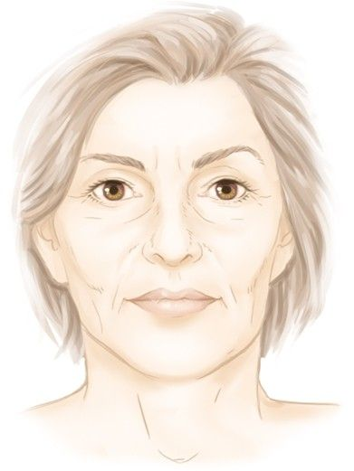{:.center width=350px} - > 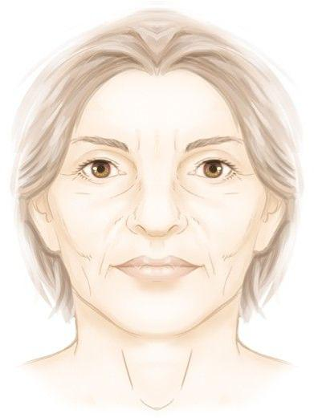{:.center width=350px}


    ```python

    ```

##  &#9193;   A vous de jouer
!!! example "A vous de jouer"
    Voici quelques exemples de transformation possibles : 
    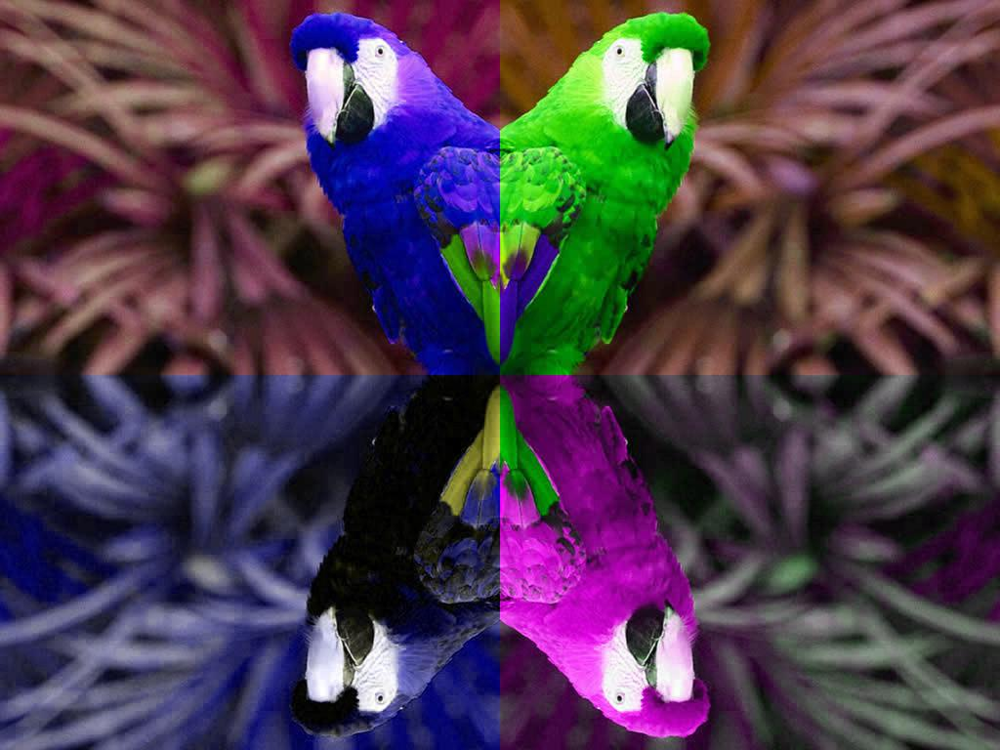{:.center width=350px} 

    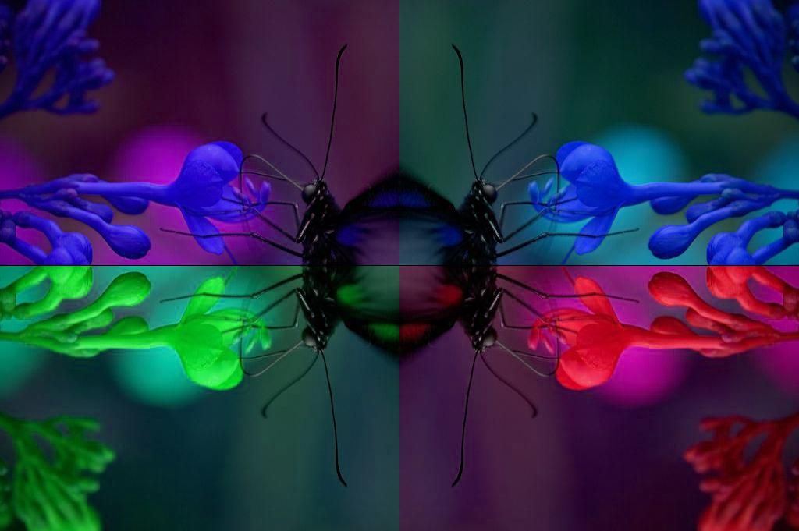{:.center width=350px} 


    ```python

    ```
