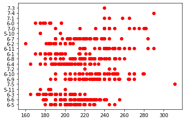
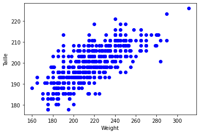
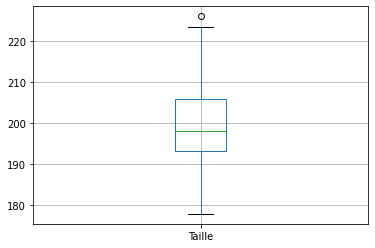
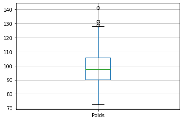

<table  class="blueTable">
        <tr>
            <th>
            Thème 3 : Traitement des données
            </th>
        </tr>
</table>
<br>
<table  class="blueTable">
        <tr >
            <th width="20%"; style="background-color: #3B444B;color:white;text-align:center;border:none;font-size:40pt;">
            20
            </th>
            <th  width="80%"; style="text-align:center;border:none;font-size:25pt;">Manipulation de fichiers CSV avec la bibliothèque Pandas</th>
        </tr>
</table>
<br>


|Contenus| Capacités attendues | Commentaires|
|:---|:---|:---|
|Tri d'une table| Trier une table suivant une colonne | Une fonction de tri intégrée au système ou à une bibliothèque peut être  utilisée.| 


Le module `csv` utilisé précédemment se contente de lire les données structurées. Il ne fait aucun effort particulier pour analyser les données. Nous nous en sommes aperçus lorsqu'il a fallu convertir par `int()` toutes les valeurs numériques, qui étaient interprétées comme des chaînes de caractères.  
La bibliothèque `pandas` est par contre spécialement conçue pour l'analyse des données (*data analysis*) : elle est donc naturellement bien plus performante.

Nous allons utiliser une base de données sur les joueurs NBA.


```python
import pandas as pd #import du module pandas, abrégé classiquement par "pd"
```


```python
df = pd.read_csv('data/players.csv', encoding = 'utf-8')
```

La variable est nommée classiquement `df` pour *dataframe* (que l'on peut traduire par *table de données*)

# Premiers renseignements sur les fichiers de données  

Que contient la variable `df`?


```python
df
```


<div>
<style scoped>
    .dataframe tbody tr th:only-of-type {
        vertical-align: middle;
    }

    .dataframe tbody tr th {
        vertical-align: top;
    }

    .dataframe thead th {
        text-align: right;
    }
</style>
<table border="1" class="dataframe">
  <thead>
    <tr style="text-align: right;">
      <th></th>
      <th>Name</th>
      <th>Position</th>
      <th>Team</th>
      <th>Age</th>
      <th>Height</th>
      <th>Height_i</th>
      <th>Weight</th>
      <th>College</th>
      <th>Salary</th>
      <th>Points</th>
      <th>Rebounds</th>
      <th>Assists</th>
    </tr>
  </thead>
  <tbody>
    <tr>
      <th>0</th>
      <td>Juhann Begarin</td>
      <td>SG</td>
      <td>Boston Celtics</td>
      <td>19</td>
      <td>6' 5"</td>
      <td>6-5</td>
      <td>185</td>
      <td>NaN</td>
      <td>NaN</td>
      <td>NaN</td>
      <td>NaN</td>
      <td>NaN</td>
    </tr>
    <tr>
      <th>1</th>
      <td>Jaylen Brown</td>
      <td>SG</td>
      <td>Boston Celtics</td>
      <td>24</td>
      <td>6' 6"</td>
      <td>6-6</td>
      <td>223</td>
      <td>California</td>
      <td>26758928.0</td>
      <td>24.7</td>
      <td>6.0</td>
      <td>3.4</td>
    </tr>
    <tr>
      <th>2</th>
      <td>Kris Dunn</td>
      <td>PG</td>
      <td>Boston Celtics</td>
      <td>27</td>
      <td>6' 3"</td>
      <td>6-3</td>
      <td>205</td>
      <td>Providence</td>
      <td>5005350.0</td>
      <td>1.3</td>
      <td>1.5</td>
      <td>0.5</td>
    </tr>
    <tr>
      <th>3</th>
      <td>Carsen Edwards</td>
      <td>PG</td>
      <td>Boston Celtics</td>
      <td>23</td>
      <td>5' 11"</td>
      <td>5-11</td>
      <td>200</td>
      <td>Purdue</td>
      <td>1782621.0</td>
      <td>4.0</td>
      <td>0.8</td>
      <td>0.5</td>
    </tr>
    <tr>
      <th>4</th>
      <td>Tacko Fall</td>
      <td>C</td>
      <td>Boston Celtics</td>
      <td>25</td>
      <td>7' 5"</td>
      <td>7-5</td>
      <td>311</td>
      <td>UCF</td>
      <td>NaN</td>
      <td>2.5</td>
      <td>2.7</td>
      <td>0.2</td>
    </tr>
    <tr>
      <th>...</th>
      <td>...</td>
      <td>...</td>
      <td>...</td>
      <td>...</td>
      <td>...</td>
      <td>...</td>
      <td>...</td>
      <td>...</td>
      <td>...</td>
      <td>...</td>
      <td>...</td>
      <td>...</td>
    </tr>
    <tr>
      <th>553</th>
      <td>Juwan Morgan</td>
      <td>SF</td>
      <td>Utah Jazz</td>
      <td>24</td>
      <td>6' 7"</td>
      <td>6-7</td>
      <td>232</td>
      <td>Indiana</td>
      <td>NaN</td>
      <td>1.2</td>
      <td>1.0</td>
      <td>0.3</td>
    </tr>
    <tr>
      <th>554</th>
      <td>Royce O'Neale</td>
      <td>PF</td>
      <td>Utah Jazz</td>
      <td>28</td>
      <td>6' 4"</td>
      <td>6-4</td>
      <td>226</td>
      <td>Baylor</td>
      <td>8800000.0</td>
      <td>7.0</td>
      <td>6.8</td>
      <td>2.5</td>
    </tr>
    <tr>
      <th>555</th>
      <td>Olumiye Oni</td>
      <td>SG</td>
      <td>Utah Jazz</td>
      <td>24</td>
      <td>6' 5"</td>
      <td>6-5</td>
      <td>206</td>
      <td>Yale</td>
      <td>1782621.0</td>
      <td>NaN</td>
      <td>NaN</td>
      <td>NaN</td>
    </tr>
    <tr>
      <th>556</th>
      <td>Eric Paschall</td>
      <td>F</td>
      <td>Utah Jazz</td>
      <td>24</td>
      <td>6' 6"</td>
      <td>6-6</td>
      <td>255</td>
      <td>Villanova</td>
      <td>1782621.0</td>
      <td>9.5</td>
      <td>3.2</td>
      <td>1.3</td>
    </tr>
    <tr>
      <th>557</th>
      <td>Hassan Whiteside</td>
      <td>C</td>
      <td>Utah Jazz</td>
      <td>32</td>
      <td>7' 0"</td>
      <td>7-0</td>
      <td>265</td>
      <td>Marshall</td>
      <td>1669178.0</td>
      <td>8.1</td>
      <td>6.0</td>
      <td>0.6</td>
    </tr>
  </tbody>
</table>
<p>558 rows × 12 columns</p>
</div>


Les données sont présentées dans l'ordre originel du fichier.  

&#x27A1; Il est possible d'avoir uniquement les premières lignes du fichier avec la commande `head()` et les dernières du fichier avec la commande `tail()`. Ces commandes peuvent recevoir en paramètre un nombre entier.


```python
df.head()
```


<div>
<style scoped>
    .dataframe tbody tr th:only-of-type {
        vertical-align: middle;
    }

    .dataframe tbody tr th {
        vertical-align: top;
    }

    .dataframe thead th {
        text-align: right;
    }
</style>
<table border="1" class="dataframe">
  <thead>
    <tr style="text-align: right;">
      <th></th>
      <th>Name</th>
      <th>Position</th>
      <th>Team</th>
      <th>Age</th>
      <th>Height</th>
      <th>Height_i</th>
      <th>Weight</th>
      <th>College</th>
      <th>Salary</th>
      <th>Points</th>
      <th>Rebounds</th>
      <th>Assists</th>
    </tr>
  </thead>
  <tbody>
    <tr>
      <th>0</th>
      <td>Juhann Begarin</td>
      <td>SG</td>
      <td>Boston Celtics</td>
      <td>19</td>
      <td>6' 5"</td>
      <td>6-5</td>
      <td>185</td>
      <td>NaN</td>
      <td>NaN</td>
      <td>NaN</td>
      <td>NaN</td>
      <td>NaN</td>
    </tr>
    <tr>
      <th>1</th>
      <td>Jaylen Brown</td>
      <td>SG</td>
      <td>Boston Celtics</td>
      <td>24</td>
      <td>6' 6"</td>
      <td>6-6</td>
      <td>223</td>
      <td>California</td>
      <td>26758928.0</td>
      <td>24.7</td>
      <td>6.0</td>
      <td>3.4</td>
    </tr>
    <tr>
      <th>2</th>
      <td>Kris Dunn</td>
      <td>PG</td>
      <td>Boston Celtics</td>
      <td>27</td>
      <td>6' 3"</td>
      <td>6-3</td>
      <td>205</td>
      <td>Providence</td>
      <td>5005350.0</td>
      <td>1.3</td>
      <td>1.5</td>
      <td>0.5</td>
    </tr>
    <tr>
      <th>3</th>
      <td>Carsen Edwards</td>
      <td>PG</td>
      <td>Boston Celtics</td>
      <td>23</td>
      <td>5' 11"</td>
      <td>5-11</td>
      <td>200</td>
      <td>Purdue</td>
      <td>1782621.0</td>
      <td>4.0</td>
      <td>0.8</td>
      <td>0.5</td>
    </tr>
    <tr>
      <th>4</th>
      <td>Tacko Fall</td>
      <td>C</td>
      <td>Boston Celtics</td>
      <td>25</td>
      <td>7' 5"</td>
      <td>7-5</td>
      <td>311</td>
      <td>UCF</td>
      <td>NaN</td>
      <td>2.5</td>
      <td>2.7</td>
      <td>0.2</td>
    </tr>
  </tbody>
</table>
</div>


```python
df.tail()
```


<div>
<style scoped>
    .dataframe tbody tr th:only-of-type {
        vertical-align: middle;
    }

    .dataframe tbody tr th {
        vertical-align: top;
    }

    .dataframe thead th {
        text-align: right;
    }
</style>
<table border="1" class="dataframe">
  <thead>
    <tr style="text-align: right;">
      <th></th>
      <th>Name</th>
      <th>Position</th>
      <th>Team</th>
      <th>Age</th>
      <th>Height</th>
      <th>Height_i</th>
      <th>Weight</th>
      <th>College</th>
      <th>Salary</th>
      <th>Points</th>
      <th>Rebounds</th>
      <th>Assists</th>
    </tr>
  </thead>
  <tbody>
    <tr>
      <th>553</th>
      <td>Juwan Morgan</td>
      <td>SF</td>
      <td>Utah Jazz</td>
      <td>24</td>
      <td>6' 7"</td>
      <td>6-7</td>
      <td>232</td>
      <td>Indiana</td>
      <td>NaN</td>
      <td>1.2</td>
      <td>1.0</td>
      <td>0.3</td>
    </tr>
    <tr>
      <th>554</th>
      <td>Royce O'Neale</td>
      <td>PF</td>
      <td>Utah Jazz</td>
      <td>28</td>
      <td>6' 4"</td>
      <td>6-4</td>
      <td>226</td>
      <td>Baylor</td>
      <td>8800000.0</td>
      <td>7.0</td>
      <td>6.8</td>
      <td>2.5</td>
    </tr>
    <tr>
      <th>555</th>
      <td>Olumiye Oni</td>
      <td>SG</td>
      <td>Utah Jazz</td>
      <td>24</td>
      <td>6' 5"</td>
      <td>6-5</td>
      <td>206</td>
      <td>Yale</td>
      <td>1782621.0</td>
      <td>NaN</td>
      <td>NaN</td>
      <td>NaN</td>
    </tr>
    <tr>
      <th>556</th>
      <td>Eric Paschall</td>
      <td>F</td>
      <td>Utah Jazz</td>
      <td>24</td>
      <td>6' 6"</td>
      <td>6-6</td>
      <td>255</td>
      <td>Villanova</td>
      <td>1782621.0</td>
      <td>9.5</td>
      <td>3.2</td>
      <td>1.3</td>
    </tr>
    <tr>
      <th>557</th>
      <td>Hassan Whiteside</td>
      <td>C</td>
      <td>Utah Jazz</td>
      <td>32</td>
      <td>7' 0"</td>
      <td>7-0</td>
      <td>265</td>
      <td>Marshall</td>
      <td>1669178.0</td>
      <td>8.1</td>
      <td>6.0</td>
      <td>0.6</td>
    </tr>
  </tbody>
</table>
</div>


```python
df.head(3)
```


<div>
<style scoped>
    .dataframe tbody tr th:only-of-type {
        vertical-align: middle;
    }

    .dataframe tbody tr th {
        vertical-align: top;
    }

    .dataframe thead th {
        text-align: right;
    }
</style>
<table border="1" class="dataframe">
  <thead>
    <tr style="text-align: right;">
      <th></th>
      <th>Name</th>
      <th>Position</th>
      <th>Team</th>
      <th>Age</th>
      <th>Height</th>
      <th>Height_i</th>
      <th>Weight</th>
      <th>College</th>
      <th>Salary</th>
      <th>Points</th>
      <th>Rebounds</th>
      <th>Assists</th>
    </tr>
  </thead>
  <tbody>
    <tr>
      <th>0</th>
      <td>Juhann Begarin</td>
      <td>SG</td>
      <td>Boston Celtics</td>
      <td>19</td>
      <td>6' 5"</td>
      <td>6-5</td>
      <td>185</td>
      <td>NaN</td>
      <td>NaN</td>
      <td>NaN</td>
      <td>NaN</td>
      <td>NaN</td>
    </tr>
    <tr>
      <th>1</th>
      <td>Jaylen Brown</td>
      <td>SG</td>
      <td>Boston Celtics</td>
      <td>24</td>
      <td>6' 6"</td>
      <td>6-6</td>
      <td>223</td>
      <td>California</td>
      <td>26758928.0</td>
      <td>24.7</td>
      <td>6.0</td>
      <td>3.4</td>
    </tr>
    <tr>
      <th>2</th>
      <td>Kris Dunn</td>
      <td>PG</td>
      <td>Boston Celtics</td>
      <td>27</td>
      <td>6' 3"</td>
      <td>6-3</td>
      <td>205</td>
      <td>Providence</td>
      <td>5005350.0</td>
      <td>1.3</td>
      <td>1.5</td>
      <td>0.5</td>
    </tr>
  </tbody>
</table>
</div>


```python
df.tail(5)
```


<div>
<style scoped>
    .dataframe tbody tr th:only-of-type {
        vertical-align: middle;
    }

    .dataframe tbody tr th {
        vertical-align: top;
    }

    .dataframe thead th {
        text-align: right;
    }
</style>
<table border="1" class="dataframe">
  <thead>
    <tr style="text-align: right;">
      <th></th>
      <th>Name</th>
      <th>Position</th>
      <th>Team</th>
      <th>Age</th>
      <th>Height</th>
      <th>Height_i</th>
      <th>Weight</th>
      <th>College</th>
      <th>Salary</th>
      <th>Points</th>
      <th>Rebounds</th>
      <th>Assists</th>
    </tr>
  </thead>
  <tbody>
    <tr>
      <th>553</th>
      <td>Juwan Morgan</td>
      <td>SF</td>
      <td>Utah Jazz</td>
      <td>24</td>
      <td>6' 7"</td>
      <td>6-7</td>
      <td>232</td>
      <td>Indiana</td>
      <td>NaN</td>
      <td>1.2</td>
      <td>1.0</td>
      <td>0.3</td>
    </tr>
    <tr>
      <th>554</th>
      <td>Royce O'Neale</td>
      <td>PF</td>
      <td>Utah Jazz</td>
      <td>28</td>
      <td>6' 4"</td>
      <td>6-4</td>
      <td>226</td>
      <td>Baylor</td>
      <td>8800000.0</td>
      <td>7.0</td>
      <td>6.8</td>
      <td>2.5</td>
    </tr>
    <tr>
      <th>555</th>
      <td>Olumiye Oni</td>
      <td>SG</td>
      <td>Utah Jazz</td>
      <td>24</td>
      <td>6' 5"</td>
      <td>6-5</td>
      <td>206</td>
      <td>Yale</td>
      <td>1782621.0</td>
      <td>NaN</td>
      <td>NaN</td>
      <td>NaN</td>
    </tr>
    <tr>
      <th>556</th>
      <td>Eric Paschall</td>
      <td>F</td>
      <td>Utah Jazz</td>
      <td>24</td>
      <td>6' 6"</td>
      <td>6-6</td>
      <td>255</td>
      <td>Villanova</td>
      <td>1782621.0</td>
      <td>9.5</td>
      <td>3.2</td>
      <td>1.3</td>
    </tr>
    <tr>
      <th>557</th>
      <td>Hassan Whiteside</td>
      <td>C</td>
      <td>Utah Jazz</td>
      <td>32</td>
      <td>7' 0"</td>
      <td>7-0</td>
      <td>265</td>
      <td>Marshall</td>
      <td>1669178.0</td>
      <td>8.1</td>
      <td>6.0</td>
      <td>0.6</td>
    </tr>
  </tbody>
</table>
</div>


&#x27A1; Pour avoir des renseignements globaux sur la structure de notre fichier, on peut utiliser la commande `df.info()`


```python
df.info()
```

    <class 'pandas.core.frame.DataFrame'>
    RangeIndex: 558 entries, 0 to 557
    Data columns (total 12 columns):
     #   Column    Non-Null Count  Dtype  
    ---  ------    --------------  -----  
     0   Name      558 non-null    object 
     1   Position  558 non-null    object 
     2   Team      558 non-null    object 
     3   Age       558 non-null    int64  
     4   Height    558 non-null    object 
     5   Height_i  558 non-null    object 
     6   Weight    558 non-null    int64  
     7   College   485 non-null    object 
     8   Salary    445 non-null    float64
     9   Points    476 non-null    float64
     10  Rebounds  476 non-null    float64
     11  Assists   476 non-null    float64
    dtypes: float64(4), int64(2), object(6)
    memory usage: 52.4+ KB


# Extraction de colonnes

## Pour accéder aux information d'une colonne

### Filter les lignes en appliquant une condition aux colonnes à l'aide de  `.loc` 

&#x27A1; Pour faire afficher une colonne de données :


```python
df.loc[:,"Salary"]
```


    0             NaN
    1      26758928.0
    2       5005350.0
    3       1782621.0
    4             NaN
              ...    
    553           NaN
    554     8800000.0
    555     1782621.0
    556     1782621.0
    557     1669178.0
    Name: Salary, Length: 558, dtype: float64


&#x27A1;  On peut rajouter une contrainte avec, par exemple; uniquement les 10 premiers de la liste


```python
df.loc[:10,"Salary"]  # les 10 premiers salaires dans la liste
```


    0            NaN
    1     26758928.0
    2      5005350.0
    3      1782621.0
    4            NaN
    5      1782621.0
    6     27000000.0
    7      1669178.0
    8            NaN
    9      3804360.0
    10     3631200.0
    Name: Salary, dtype: float64


```python
df.loc[:10]  # les 10 premiers dans la liste
```


<div>
<style scoped>
    .dataframe tbody tr th:only-of-type {
        vertical-align: middle;
    }

    .dataframe tbody tr th {
        vertical-align: top;
    }

    .dataframe thead th {
        text-align: right;
    }
</style>
<table border="1" class="dataframe">
  <thead>
    <tr style="text-align: right;">
      <th></th>
      <th>Name</th>
      <th>Position</th>
      <th>Team</th>
      <th>Age</th>
      <th>Height</th>
      <th>Height_i</th>
      <th>Weight</th>
      <th>College</th>
      <th>Salary</th>
      <th>Points</th>
      <th>Rebounds</th>
      <th>Assists</th>
    </tr>
  </thead>
  <tbody>
    <tr>
      <th>0</th>
      <td>Juhann Begarin</td>
      <td>SG</td>
      <td>Boston Celtics</td>
      <td>19</td>
      <td>6' 5"</td>
      <td>6-5</td>
      <td>185</td>
      <td>NaN</td>
      <td>NaN</td>
      <td>NaN</td>
      <td>NaN</td>
      <td>NaN</td>
    </tr>
    <tr>
      <th>1</th>
      <td>Jaylen Brown</td>
      <td>SG</td>
      <td>Boston Celtics</td>
      <td>24</td>
      <td>6' 6"</td>
      <td>6-6</td>
      <td>223</td>
      <td>California</td>
      <td>26758928.0</td>
      <td>24.7</td>
      <td>6.0</td>
      <td>3.4</td>
    </tr>
    <tr>
      <th>2</th>
      <td>Kris Dunn</td>
      <td>PG</td>
      <td>Boston Celtics</td>
      <td>27</td>
      <td>6' 3"</td>
      <td>6-3</td>
      <td>205</td>
      <td>Providence</td>
      <td>5005350.0</td>
      <td>1.3</td>
      <td>1.5</td>
      <td>0.5</td>
    </tr>
    <tr>
      <th>3</th>
      <td>Carsen Edwards</td>
      <td>PG</td>
      <td>Boston Celtics</td>
      <td>23</td>
      <td>5' 11"</td>
      <td>5-11</td>
      <td>200</td>
      <td>Purdue</td>
      <td>1782621.0</td>
      <td>4.0</td>
      <td>0.8</td>
      <td>0.5</td>
    </tr>
    <tr>
      <th>4</th>
      <td>Tacko Fall</td>
      <td>C</td>
      <td>Boston Celtics</td>
      <td>25</td>
      <td>7' 5"</td>
      <td>7-5</td>
      <td>311</td>
      <td>UCF</td>
      <td>NaN</td>
      <td>2.5</td>
      <td>2.7</td>
      <td>0.2</td>
    </tr>
    <tr>
      <th>5</th>
      <td>Bruno Fernando</td>
      <td>F</td>
      <td>Boston Celtics</td>
      <td>23</td>
      <td>6' 9"</td>
      <td>6-9</td>
      <td>240</td>
      <td>Maryland</td>
      <td>1782621.0</td>
      <td>1.5</td>
      <td>2.4</td>
      <td>0.3</td>
    </tr>
    <tr>
      <th>6</th>
      <td>Al Horford</td>
      <td>C</td>
      <td>Boston Celtics</td>
      <td>35</td>
      <td>6' 9"</td>
      <td>6-9</td>
      <td>240</td>
      <td>Florida</td>
      <td>27000000.0</td>
      <td>14.2</td>
      <td>6.7</td>
      <td>3.4</td>
    </tr>
    <tr>
      <th>7</th>
      <td>Enes Kanter</td>
      <td>C</td>
      <td>Boston Celtics</td>
      <td>29</td>
      <td>6' 10"</td>
      <td>6-10</td>
      <td>250</td>
      <td>Kentucky</td>
      <td>1669178.0</td>
      <td>11.2</td>
      <td>11.0</td>
      <td>1.2</td>
    </tr>
    <tr>
      <th>8</th>
      <td>Luke Kornet</td>
      <td>C</td>
      <td>Boston Celtics</td>
      <td>26</td>
      <td>7' 2"</td>
      <td>7-2</td>
      <td>250</td>
      <td>Vanderbilt</td>
      <td>NaN</td>
      <td>3.4</td>
      <td>2.2</td>
      <td>0.8</td>
    </tr>
    <tr>
      <th>9</th>
      <td>Romeo Langford</td>
      <td>SG</td>
      <td>Boston Celtics</td>
      <td>21</td>
      <td>6' 4"</td>
      <td>6-4</td>
      <td>216</td>
      <td>Indiana</td>
      <td>3804360.0</td>
      <td>3.1</td>
      <td>1.9</td>
      <td>0.7</td>
    </tr>
    <tr>
      <th>10</th>
      <td>Aaron Nesmith</td>
      <td>SF</td>
      <td>Boston Celtics</td>
      <td>21</td>
      <td>6' 5"</td>
      <td>6-5</td>
      <td>215</td>
      <td>Vanderbilt</td>
      <td>3631200.0</td>
      <td>4.7</td>
      <td>2.8</td>
      <td>0.5</td>
    </tr>
  </tbody>
</table>
</div>


**&#x1F58B; A vous**  
Faite apparaitre la colonne correspondant au âge des joueurs, puis faite apparaitre les 15 premiers de la liste.


```python
df.loc[:,"Age"]  # les 15 premiers dans la liste
```


    0      19
    1      24
    2      27
    3      23
    4      25
           ..
    553    24
    554    28
    555    24
    556    24
    557    32
    Name: Age, Length: 558, dtype: int64


```python
df.loc[:15,["Age",'Name']]  # les 15 premiers dans la liste
```


<div>
<style scoped>
    .dataframe tbody tr th:only-of-type {
        vertical-align: middle;
    }

    .dataframe tbody tr th {
        vertical-align: top;
    }

    .dataframe thead th {
        text-align: right;
    }
</style>
<table border="1" class="dataframe">
  <thead>
    <tr style="text-align: right;">
      <th></th>
      <th>Age</th>
      <th>Name</th>
    </tr>
  </thead>
  <tbody>
    <tr>
      <th>0</th>
      <td>19</td>
      <td>Juhann Begarin</td>
    </tr>
    <tr>
      <th>1</th>
      <td>24</td>
      <td>Jaylen Brown</td>
    </tr>
    <tr>
      <th>2</th>
      <td>27</td>
      <td>Kris Dunn</td>
    </tr>
    <tr>
      <th>3</th>
      <td>23</td>
      <td>Carsen Edwards</td>
    </tr>
    <tr>
      <th>4</th>
      <td>25</td>
      <td>Tacko Fall</td>
    </tr>
    <tr>
      <th>5</th>
      <td>23</td>
      <td>Bruno Fernando</td>
    </tr>
    <tr>
      <th>6</th>
      <td>35</td>
      <td>Al Horford</td>
    </tr>
    <tr>
      <th>7</th>
      <td>29</td>
      <td>Enes Kanter</td>
    </tr>
    <tr>
      <th>8</th>
      <td>26</td>
      <td>Luke Kornet</td>
    </tr>
    <tr>
      <th>9</th>
      <td>21</td>
      <td>Romeo Langford</td>
    </tr>
    <tr>
      <th>10</th>
      <td>21</td>
      <td>Aaron Nesmith</td>
    </tr>
    <tr>
      <th>11</th>
      <td>26</td>
      <td>Jabari Parker</td>
    </tr>
    <tr>
      <th>12</th>
      <td>23</td>
      <td>Payton Pritchard</td>
    </tr>
    <tr>
      <th>13</th>
      <td>27</td>
      <td>Josh Richardson</td>
    </tr>
    <tr>
      <th>14</th>
      <td>27</td>
      <td>Dennis Schroder</td>
    </tr>
    <tr>
      <th>15</th>
      <td>27</td>
      <td>Marcus Smart</td>
    </tr>
  </tbody>
</table>
</div>


&#x27A1; Pour accéder à une fiche particulière de joueur avec sa position, on peut utiliser la fonction `loc()` :


```python
test1=df.loc[45,['Name','Position']]
test1
```


    Name        RJ Barrett
    Position            SG
    Name: 45, dtype: object


### Extraire des informations selon des critères  `loc()`

&#x27A1; Cette méthode nécessite de savoir la position du joueur voulu, pour accéder à un joueur avec son nom : 


```python
df.loc[df['Name']=='Kevin Durant']   # ou df.loc[df.Name=='Kevin Durant']
```


<div>
<style scoped>
    .dataframe tbody tr th:only-of-type {
        vertical-align: middle;
    }

    .dataframe tbody tr th {
        vertical-align: top;
    }

    .dataframe thead th {
        text-align: right;
    }
</style>
<table border="1" class="dataframe">
  <thead>
    <tr style="text-align: right;">
      <th></th>
      <th>Name</th>
      <th>Position</th>
      <th>Team</th>
      <th>Age</th>
      <th>Height</th>
      <th>Height_i</th>
      <th>Weight</th>
      <th>College</th>
      <th>Salary</th>
      <th>Points</th>
      <th>Rebounds</th>
      <th>Assists</th>
    </tr>
  </thead>
  <tbody>
    <tr>
      <th>25</th>
      <td>Kevin Durant</td>
      <td>PF</td>
      <td>Brooklyn Nets</td>
      <td>32</td>
      <td>6' 10"</td>
      <td>6-10</td>
      <td>240</td>
      <td>Texas</td>
      <td>42018900.0</td>
      <td>26.9</td>
      <td>7.1</td>
      <td>5.6</td>
    </tr>
  </tbody>
</table>
</div>


&#x27A1; Pour accéder à des données avec une contrainte (Joueurs touchant plus de 40 millions de dollars par an):


```python
df.loc[df['Salary']>=40000000]   # ou df.loc[df.Salary>=40000000]
```


<div>
<style scoped>
    .dataframe tbody tr th:only-of-type {
        vertical-align: middle;
    }

    .dataframe tbody tr th {
        vertical-align: top;
    }

    .dataframe thead th {
        text-align: right;
    }
</style>
<table border="1" class="dataframe">
  <thead>
    <tr style="text-align: right;">
      <th></th>
      <th>Name</th>
      <th>Position</th>
      <th>Team</th>
      <th>Age</th>
      <th>Height</th>
      <th>Height_i</th>
      <th>Weight</th>
      <th>College</th>
      <th>Salary</th>
      <th>Points</th>
      <th>Rebounds</th>
      <th>Assists</th>
    </tr>
  </thead>
  <tbody>
    <tr>
      <th>25</th>
      <td>Kevin Durant</td>
      <td>PF</td>
      <td>Brooklyn Nets</td>
      <td>32</td>
      <td>6' 10"</td>
      <td>6-10</td>
      <td>240</td>
      <td>Texas</td>
      <td>42018900.0</td>
      <td>26.9</td>
      <td>7.1</td>
      <td>5.6</td>
    </tr>
    <tr>
      <th>29</th>
      <td>James Harden</td>
      <td>SG</td>
      <td>Brooklyn Nets</td>
      <td>32</td>
      <td>6' 5"</td>
      <td>6-5</td>
      <td>220</td>
      <td>Arizona State</td>
      <td>44310840.0</td>
      <td>24.6</td>
      <td>7.9</td>
      <td>10.8</td>
    </tr>
    <tr>
      <th>287</th>
      <td>Stephen Curry</td>
      <td>PG</td>
      <td>Golden State Warriors</td>
      <td>33</td>
      <td>6' 3"</td>
      <td>6-3</td>
      <td>185</td>
      <td>Davidson</td>
      <td>45780966.0</td>
      <td>32.0</td>
      <td>5.5</td>
      <td>5.8</td>
    </tr>
    <tr>
      <th>331</th>
      <td>LeBron James</td>
      <td>SF</td>
      <td>Los Angeles Lakers</td>
      <td>36</td>
      <td>6' 9"</td>
      <td>6-9</td>
      <td>250</td>
      <td>NaN</td>
      <td>41180544.0</td>
      <td>25.0</td>
      <td>7.7</td>
      <td>7.8</td>
    </tr>
    <tr>
      <th>336</th>
      <td>Russell Westbrook</td>
      <td>PG</td>
      <td>Los Angeles Lakers</td>
      <td>32</td>
      <td>6' 3"</td>
      <td>6-3</td>
      <td>200</td>
      <td>UCLA</td>
      <td>44211146.0</td>
      <td>22.2</td>
      <td>11.5</td>
      <td>11.7</td>
    </tr>
    <tr>
      <th>408</th>
      <td>John Wall</td>
      <td>PG</td>
      <td>Houston Rockets</td>
      <td>31</td>
      <td>6' 3"</td>
      <td>6-3</td>
      <td>210</td>
      <td>Kentucky</td>
      <td>44310840.0</td>
      <td>20.6</td>
      <td>3.2</td>
      <td>6.9</td>
    </tr>
  </tbody>
</table>
</div>


```python
df.loc[df.Salary>=40000000]
```


<div>
<style scoped>
    .dataframe tbody tr th:only-of-type {
        vertical-align: middle;
    }

    .dataframe tbody tr th {
        vertical-align: top;
    }

    .dataframe thead th {
        text-align: right;
    }
</style>
<table border="1" class="dataframe">
  <thead>
    <tr style="text-align: right;">
      <th></th>
      <th>Name</th>
      <th>Position</th>
      <th>Team</th>
      <th>Age</th>
      <th>Height</th>
      <th>Height_i</th>
      <th>Weight</th>
      <th>College</th>
      <th>Salary</th>
      <th>Points</th>
      <th>Rebounds</th>
      <th>Assists</th>
    </tr>
  </thead>
  <tbody>
    <tr>
      <th>25</th>
      <td>Kevin Durant</td>
      <td>PF</td>
      <td>Brooklyn Nets</td>
      <td>32</td>
      <td>6' 10"</td>
      <td>6-10</td>
      <td>240</td>
      <td>Texas</td>
      <td>42018900.0</td>
      <td>26.9</td>
      <td>7.1</td>
      <td>5.6</td>
    </tr>
    <tr>
      <th>29</th>
      <td>James Harden</td>
      <td>SG</td>
      <td>Brooklyn Nets</td>
      <td>32</td>
      <td>6' 5"</td>
      <td>6-5</td>
      <td>220</td>
      <td>Arizona State</td>
      <td>44310840.0</td>
      <td>24.6</td>
      <td>7.9</td>
      <td>10.8</td>
    </tr>
    <tr>
      <th>287</th>
      <td>Stephen Curry</td>
      <td>PG</td>
      <td>Golden State Warriors</td>
      <td>33</td>
      <td>6' 3"</td>
      <td>6-3</td>
      <td>185</td>
      <td>Davidson</td>
      <td>45780966.0</td>
      <td>32.0</td>
      <td>5.5</td>
      <td>5.8</td>
    </tr>
    <tr>
      <th>331</th>
      <td>LeBron James</td>
      <td>SF</td>
      <td>Los Angeles Lakers</td>
      <td>36</td>
      <td>6' 9"</td>
      <td>6-9</td>
      <td>250</td>
      <td>NaN</td>
      <td>41180544.0</td>
      <td>25.0</td>
      <td>7.7</td>
      <td>7.8</td>
    </tr>
    <tr>
      <th>336</th>
      <td>Russell Westbrook</td>
      <td>PG</td>
      <td>Los Angeles Lakers</td>
      <td>32</td>
      <td>6' 3"</td>
      <td>6-3</td>
      <td>200</td>
      <td>UCLA</td>
      <td>44211146.0</td>
      <td>22.2</td>
      <td>11.5</td>
      <td>11.7</td>
    </tr>
    <tr>
      <th>408</th>
      <td>John Wall</td>
      <td>PG</td>
      <td>Houston Rockets</td>
      <td>31</td>
      <td>6' 3"</td>
      <td>6-3</td>
      <td>210</td>
      <td>Kentucky</td>
      <td>44310840.0</td>
      <td>20.6</td>
      <td>3.2</td>
      <td>6.9</td>
    </tr>
  </tbody>
</table>
</div>


**&#x1F58B; A vous**  
Donner les joueurs marquant plus de 25 points par match.


```python
df.loc[df['Points']>=25]
```


<div>
<style scoped>
    .dataframe tbody tr th:only-of-type {
        vertical-align: middle;
    }

    .dataframe tbody tr th {
        vertical-align: top;
    }

    .dataframe thead th {
        text-align: right;
    }
</style>
<table border="1" class="dataframe">
  <thead>
    <tr style="text-align: right;">
      <th></th>
      <th>Name</th>
      <th>Position</th>
      <th>Team</th>
      <th>Age</th>
      <th>Height</th>
      <th>Height_i</th>
      <th>Weight</th>
      <th>College</th>
      <th>Salary</th>
      <th>Points</th>
      <th>Rebounds</th>
      <th>Assists</th>
    </tr>
  </thead>
  <tbody>
    <tr>
      <th>16</th>
      <td>Jayson Tatum</td>
      <td>SF</td>
      <td>Boston Celtics</td>
      <td>23</td>
      <td>6' 8"</td>
      <td>6-8</td>
      <td>210</td>
      <td>Duke</td>
      <td>28103500.0</td>
      <td>26.4</td>
      <td>7.4</td>
      <td>4.3</td>
    </tr>
    <tr>
      <th>25</th>
      <td>Kevin Durant</td>
      <td>PF</td>
      <td>Brooklyn Nets</td>
      <td>32</td>
      <td>6' 10"</td>
      <td>6-10</td>
      <td>240</td>
      <td>Texas</td>
      <td>42018900.0</td>
      <td>26.9</td>
      <td>7.1</td>
      <td>5.6</td>
    </tr>
    <tr>
      <th>31</th>
      <td>Kyrie Irving</td>
      <td>PG</td>
      <td>Brooklyn Nets</td>
      <td>29</td>
      <td>6' 2"</td>
      <td>6-2</td>
      <td>195</td>
      <td>Duke</td>
      <td>35328700.0</td>
      <td>26.9</td>
      <td>4.8</td>
      <td>6.0</td>
    </tr>
    <tr>
      <th>69</th>
      <td>Joel Embiid</td>
      <td>C</td>
      <td>Philadelphia Sixers</td>
      <td>27</td>
      <td>7' 0"</td>
      <td>7-0</td>
      <td>280</td>
      <td>Kansas</td>
      <td>31579390.0</td>
      <td>28.5</td>
      <td>10.6</td>
      <td>2.8</td>
    </tr>
    <tr>
      <th>113</th>
      <td>Zach LaVine</td>
      <td>SG</td>
      <td>Chicago Bulls</td>
      <td>26</td>
      <td>6' 5"</td>
      <td>6-5</td>
      <td>200</td>
      <td>UCLA</td>
      <td>19500000.0</td>
      <td>27.4</td>
      <td>5.0</td>
      <td>4.9</td>
    </tr>
    <tr>
      <th>171</th>
      <td>Giannis Antetokounmpo</td>
      <td>PF</td>
      <td>Milwaukee Bucks</td>
      <td>26</td>
      <td>6' 11"</td>
      <td>6-11</td>
      <td>242</td>
      <td>NaN</td>
      <td>39344970.0</td>
      <td>28.1</td>
      <td>11.0</td>
      <td>5.9</td>
    </tr>
    <tr>
      <th>206</th>
      <td>Trae Young</td>
      <td>PG</td>
      <td>Atlanta Hawks</td>
      <td>22</td>
      <td>6' 1"</td>
      <td>6-1</td>
      <td>180</td>
      <td>Oklahoma</td>
      <td>8326471.0</td>
      <td>25.3</td>
      <td>3.9</td>
      <td>9.4</td>
    </tr>
    <tr>
      <th>267</th>
      <td>Bradley Beal</td>
      <td>SG</td>
      <td>Washington Wizards</td>
      <td>28</td>
      <td>6' 3"</td>
      <td>6-3</td>
      <td>207</td>
      <td>Florida</td>
      <td>33724200.0</td>
      <td>31.3</td>
      <td>4.7</td>
      <td>4.4</td>
    </tr>
    <tr>
      <th>287</th>
      <td>Stephen Curry</td>
      <td>PG</td>
      <td>Golden State Warriors</td>
      <td>33</td>
      <td>6' 3"</td>
      <td>6-3</td>
      <td>185</td>
      <td>Davidson</td>
      <td>45780966.0</td>
      <td>32.0</td>
      <td>5.5</td>
      <td>5.8</td>
    </tr>
    <tr>
      <th>331</th>
      <td>LeBron James</td>
      <td>SF</td>
      <td>Los Angeles Lakers</td>
      <td>36</td>
      <td>6' 9"</td>
      <td>6-9</td>
      <td>250</td>
      <td>NaN</td>
      <td>41180544.0</td>
      <td>25.0</td>
      <td>7.7</td>
      <td>7.8</td>
    </tr>
    <tr>
      <th>338</th>
      <td>Devin Booker</td>
      <td>SG</td>
      <td>Phoenix Suns</td>
      <td>24</td>
      <td>6' 5"</td>
      <td>6-5</td>
      <td>206</td>
      <td>Kentucky</td>
      <td>31650600.0</td>
      <td>25.6</td>
      <td>4.2</td>
      <td>4.3</td>
    </tr>
    <tr>
      <th>357</th>
      <td>De'Aaron Fox</td>
      <td>PG</td>
      <td>Sacremento Kings</td>
      <td>23</td>
      <td>6' 3"</td>
      <td>6-3</td>
      <td>185</td>
      <td>Kentucky</td>
      <td>28103550.0</td>
      <td>25.2</td>
      <td>3.5</td>
      <td>7.2</td>
    </tr>
    <tr>
      <th>378</th>
      <td>Luka Doncic</td>
      <td>PG</td>
      <td>Dallas Mavericks</td>
      <td>22</td>
      <td>6' 7"</td>
      <td>6-7</td>
      <td>230</td>
      <td>NaN</td>
      <td>10174391.0</td>
      <td>27.7</td>
      <td>8.0</td>
      <td>8.6</td>
    </tr>
    <tr>
      <th>449</th>
      <td>Zion Williamson</td>
      <td>PF</td>
      <td>New Orleans Pelicans</td>
      <td>21</td>
      <td>6' 7"</td>
      <td>6-7</td>
      <td>284</td>
      <td>Duke</td>
      <td>10733400.0</td>
      <td>27.0</td>
      <td>7.2</td>
      <td>3.7</td>
    </tr>
    <tr>
      <th>480</th>
      <td>Nikola Jokic</td>
      <td>C</td>
      <td>Denver Nuggets</td>
      <td>26</td>
      <td>6' 11"</td>
      <td>6-11</td>
      <td>284</td>
      <td>NaN</td>
      <td>31579390.0</td>
      <td>26.4</td>
      <td>10.8</td>
      <td>8.3</td>
    </tr>
    <tr>
      <th>529</th>
      <td>Damian Lillard</td>
      <td>PG</td>
      <td>Portland Trail Blazers</td>
      <td>31</td>
      <td>6' 2"</td>
      <td>6-2</td>
      <td>195</td>
      <td>Weber State</td>
      <td>39344900.0</td>
      <td>28.8</td>
      <td>4.2</td>
      <td>7.5</td>
    </tr>
    <tr>
      <th>552</th>
      <td>Donovan Mitchell</td>
      <td>SG</td>
      <td>Utah Jazz</td>
      <td>25</td>
      <td>6' 1"</td>
      <td>6-1</td>
      <td>215</td>
      <td>Louisville</td>
      <td>28103500.0</td>
      <td>26.4</td>
      <td>4.4</td>
      <td>5.2</td>
    </tr>
  </tbody>
</table>
</div>


```python
df.loc[df.Points>=25]
```


<div>
<style scoped>
    .dataframe tbody tr th:only-of-type {
        vertical-align: middle;
    }

    .dataframe tbody tr th {
        vertical-align: top;
    }

    .dataframe thead th {
        text-align: right;
    }
</style>
<table border="1" class="dataframe">
  <thead>
    <tr style="text-align: right;">
      <th></th>
      <th>Name</th>
      <th>Position</th>
      <th>Team</th>
      <th>Age</th>
      <th>Height</th>
      <th>Height_i</th>
      <th>Weight</th>
      <th>College</th>
      <th>Salary</th>
      <th>Points</th>
      <th>Rebounds</th>
      <th>Assists</th>
    </tr>
  </thead>
  <tbody>
    <tr>
      <th>16</th>
      <td>Jayson Tatum</td>
      <td>SF</td>
      <td>Boston Celtics</td>
      <td>23</td>
      <td>6' 8"</td>
      <td>6-8</td>
      <td>210</td>
      <td>Duke</td>
      <td>28103500.0</td>
      <td>26.4</td>
      <td>7.4</td>
      <td>4.3</td>
    </tr>
    <tr>
      <th>25</th>
      <td>Kevin Durant</td>
      <td>PF</td>
      <td>Brooklyn Nets</td>
      <td>32</td>
      <td>6' 10"</td>
      <td>6-10</td>
      <td>240</td>
      <td>Texas</td>
      <td>42018900.0</td>
      <td>26.9</td>
      <td>7.1</td>
      <td>5.6</td>
    </tr>
    <tr>
      <th>31</th>
      <td>Kyrie Irving</td>
      <td>PG</td>
      <td>Brooklyn Nets</td>
      <td>29</td>
      <td>6' 2"</td>
      <td>6-2</td>
      <td>195</td>
      <td>Duke</td>
      <td>35328700.0</td>
      <td>26.9</td>
      <td>4.8</td>
      <td>6.0</td>
    </tr>
    <tr>
      <th>69</th>
      <td>Joel Embiid</td>
      <td>C</td>
      <td>Philadelphia Sixers</td>
      <td>27</td>
      <td>7' 0"</td>
      <td>7-0</td>
      <td>280</td>
      <td>Kansas</td>
      <td>31579390.0</td>
      <td>28.5</td>
      <td>10.6</td>
      <td>2.8</td>
    </tr>
    <tr>
      <th>113</th>
      <td>Zach LaVine</td>
      <td>SG</td>
      <td>Chicago Bulls</td>
      <td>26</td>
      <td>6' 5"</td>
      <td>6-5</td>
      <td>200</td>
      <td>UCLA</td>
      <td>19500000.0</td>
      <td>27.4</td>
      <td>5.0</td>
      <td>4.9</td>
    </tr>
    <tr>
      <th>171</th>
      <td>Giannis Antetokounmpo</td>
      <td>PF</td>
      <td>Milwaukee Bucks</td>
      <td>26</td>
      <td>6' 11"</td>
      <td>6-11</td>
      <td>242</td>
      <td>NaN</td>
      <td>39344970.0</td>
      <td>28.1</td>
      <td>11.0</td>
      <td>5.9</td>
    </tr>
    <tr>
      <th>206</th>
      <td>Trae Young</td>
      <td>PG</td>
      <td>Atlanta Hawks</td>
      <td>22</td>
      <td>6' 1"</td>
      <td>6-1</td>
      <td>180</td>
      <td>Oklahoma</td>
      <td>8326471.0</td>
      <td>25.3</td>
      <td>3.9</td>
      <td>9.4</td>
    </tr>
    <tr>
      <th>267</th>
      <td>Bradley Beal</td>
      <td>SG</td>
      <td>Washington Wizards</td>
      <td>28</td>
      <td>6' 3"</td>
      <td>6-3</td>
      <td>207</td>
      <td>Florida</td>
      <td>33724200.0</td>
      <td>31.3</td>
      <td>4.7</td>
      <td>4.4</td>
    </tr>
    <tr>
      <th>287</th>
      <td>Stephen Curry</td>
      <td>PG</td>
      <td>Golden State Warriors</td>
      <td>33</td>
      <td>6' 3"</td>
      <td>6-3</td>
      <td>185</td>
      <td>Davidson</td>
      <td>45780966.0</td>
      <td>32.0</td>
      <td>5.5</td>
      <td>5.8</td>
    </tr>
    <tr>
      <th>331</th>
      <td>LeBron James</td>
      <td>SF</td>
      <td>Los Angeles Lakers</td>
      <td>36</td>
      <td>6' 9"</td>
      <td>6-9</td>
      <td>250</td>
      <td>NaN</td>
      <td>41180544.0</td>
      <td>25.0</td>
      <td>7.7</td>
      <td>7.8</td>
    </tr>
    <tr>
      <th>338</th>
      <td>Devin Booker</td>
      <td>SG</td>
      <td>Phoenix Suns</td>
      <td>24</td>
      <td>6' 5"</td>
      <td>6-5</td>
      <td>206</td>
      <td>Kentucky</td>
      <td>31650600.0</td>
      <td>25.6</td>
      <td>4.2</td>
      <td>4.3</td>
    </tr>
    <tr>
      <th>357</th>
      <td>De'Aaron Fox</td>
      <td>PG</td>
      <td>Sacremento Kings</td>
      <td>23</td>
      <td>6' 3"</td>
      <td>6-3</td>
      <td>185</td>
      <td>Kentucky</td>
      <td>28103550.0</td>
      <td>25.2</td>
      <td>3.5</td>
      <td>7.2</td>
    </tr>
    <tr>
      <th>378</th>
      <td>Luka Doncic</td>
      <td>PG</td>
      <td>Dallas Mavericks</td>
      <td>22</td>
      <td>6' 7"</td>
      <td>6-7</td>
      <td>230</td>
      <td>NaN</td>
      <td>10174391.0</td>
      <td>27.7</td>
      <td>8.0</td>
      <td>8.6</td>
    </tr>
    <tr>
      <th>449</th>
      <td>Zion Williamson</td>
      <td>PF</td>
      <td>New Orleans Pelicans</td>
      <td>21</td>
      <td>6' 7"</td>
      <td>6-7</td>
      <td>284</td>
      <td>Duke</td>
      <td>10733400.0</td>
      <td>27.0</td>
      <td>7.2</td>
      <td>3.7</td>
    </tr>
    <tr>
      <th>480</th>
      <td>Nikola Jokic</td>
      <td>C</td>
      <td>Denver Nuggets</td>
      <td>26</td>
      <td>6' 11"</td>
      <td>6-11</td>
      <td>284</td>
      <td>NaN</td>
      <td>31579390.0</td>
      <td>26.4</td>
      <td>10.8</td>
      <td>8.3</td>
    </tr>
    <tr>
      <th>529</th>
      <td>Damian Lillard</td>
      <td>PG</td>
      <td>Portland Trail Blazers</td>
      <td>31</td>
      <td>6' 2"</td>
      <td>6-2</td>
      <td>195</td>
      <td>Weber State</td>
      <td>39344900.0</td>
      <td>28.8</td>
      <td>4.2</td>
      <td>7.5</td>
    </tr>
    <tr>
      <th>552</th>
      <td>Donovan Mitchell</td>
      <td>SG</td>
      <td>Utah Jazz</td>
      <td>25</td>
      <td>6' 1"</td>
      <td>6-1</td>
      <td>215</td>
      <td>Louisville</td>
      <td>28103500.0</td>
      <td>26.4</td>
      <td>4.4</td>
      <td>5.2</td>
    </tr>
  </tbody>
</table>
</div>


**&#x1F58B; A vous**  
Donner les joueurs provenant du collège du Kentuchy.


```python
df.loc[df.College=='Kentucky']
```


<div>
<style scoped>
    .dataframe tbody tr th:only-of-type {
        vertical-align: middle;
    }

    .dataframe tbody tr th {
        vertical-align: top;
    }

    .dataframe thead th {
        text-align: right;
    }
</style>
<table border="1" class="dataframe">
  <thead>
    <tr style="text-align: right;">
      <th></th>
      <th>Name</th>
      <th>Position</th>
      <th>Team</th>
      <th>Age</th>
      <th>Height</th>
      <th>Height_i</th>
      <th>Weight</th>
      <th>College</th>
      <th>Salary</th>
      <th>Points</th>
      <th>Rebounds</th>
      <th>Assists</th>
    </tr>
  </thead>
  <tbody>
    <tr>
      <th>7</th>
      <td>Enes Kanter</td>
      <td>C</td>
      <td>Boston Celtics</td>
      <td>29</td>
      <td>6' 10"</td>
      <td>6-10</td>
      <td>250</td>
      <td>Kentucky</td>
      <td>1669178.0</td>
      <td>11.2</td>
      <td>11.0</td>
      <td>1.2</td>
    </tr>
    <tr>
      <th>51</th>
      <td>Kevin Knox II</td>
      <td>SF</td>
      <td>New York Knicks</td>
      <td>22</td>
      <td>6' 7"</td>
      <td>6-7</td>
      <td>215</td>
      <td>Kentucky</td>
      <td>5845979.0</td>
      <td>3.9</td>
      <td>1.5</td>
      <td>0.5</td>
    </tr>
    <tr>
      <th>53</th>
      <td>Nerlens Noel</td>
      <td>C</td>
      <td>New York Knicks</td>
      <td>27</td>
      <td>6' 11"</td>
      <td>6-11</td>
      <td>220</td>
      <td>Kentucky</td>
      <td>8000000.0</td>
      <td>5.1</td>
      <td>6.4</td>
      <td>0.7</td>
    </tr>
    <tr>
      <th>57</th>
      <td>Immanuel Quickley</td>
      <td>SG</td>
      <td>New York Knicks</td>
      <td>22</td>
      <td>6' 3"</td>
      <td>6-3</td>
      <td>190</td>
      <td>Kentucky</td>
      <td>2210640.0</td>
      <td>11.4</td>
      <td>2.1</td>
      <td>2.0</td>
    </tr>
    <tr>
      <th>58</th>
      <td>Julius Randle</td>
      <td>PF</td>
      <td>New York Knicks</td>
      <td>26</td>
      <td>6' 8"</td>
      <td>6-8</td>
      <td>250</td>
      <td>Kentucky</td>
      <td>21780000.0</td>
      <td>24.1</td>
      <td>10.2</td>
      <td>6.0</td>
    </tr>
    <tr>
      <th>75</th>
      <td>Tyrese Maxey</td>
      <td>PG</td>
      <td>Philadelphia Sixers</td>
      <td>20</td>
      <td>6' 2"</td>
      <td>6-2</td>
      <td>200</td>
      <td>Kentucky</td>
      <td>2602920.0</td>
      <td>8.0</td>
      <td>1.7</td>
      <td>2.0</td>
    </tr>
    <tr>
      <th>136</th>
      <td>Hamidou Diallo</td>
      <td>SG</td>
      <td>Detroit Pistons</td>
      <td>23</td>
      <td>6' 5"</td>
      <td>6-5</td>
      <td>202</td>
      <td>Kentucky</td>
      <td>5200000.0</td>
      <td>11.6</td>
      <td>5.2</td>
      <td>1.9</td>
    </tr>
    <tr>
      <th>146</th>
      <td>Trey Lyles</td>
      <td>PF</td>
      <td>Detroit Pistons</td>
      <td>25</td>
      <td>6' 9"</td>
      <td>6-9</td>
      <td>234</td>
      <td>Kentucky</td>
      <td>2500000.0</td>
      <td>5.0</td>
      <td>3.7</td>
      <td>0.6</td>
    </tr>
    <tr>
      <th>158</th>
      <td>Isaiah Jackson</td>
      <td>PF</td>
      <td>Indiana Pacers</td>
      <td>19</td>
      <td>6' 10"</td>
      <td>6-10</td>
      <td>205</td>
      <td>Kentucky</td>
      <td>2451240.0</td>
      <td>NaN</td>
      <td>NaN</td>
      <td>NaN</td>
    </tr>
    <tr>
      <th>222</th>
      <td>Nick Richards</td>
      <td>C</td>
      <td>Charlotte Hornets</td>
      <td>23</td>
      <td>7' 0"</td>
      <td>7-0</td>
      <td>245</td>
      <td>Kentucky</td>
      <td>1517981.0</td>
      <td>0.8</td>
      <td>0.6</td>
      <td>0.1</td>
    </tr>
    <tr>
      <th>227</th>
      <td>P.J. Washington</td>
      <td>PF</td>
      <td>Charlotte Hornets</td>
      <td>23</td>
      <td>6' 7"</td>
      <td>6-7</td>
      <td>230</td>
      <td>Kentucky</td>
      <td>4215120.0</td>
      <td>12.9</td>
      <td>6.5</td>
      <td>2.5</td>
    </tr>
    <tr>
      <th>228</th>
      <td>Bam Adebayo</td>
      <td>C</td>
      <td>Miami Heat</td>
      <td>24</td>
      <td>6' 9"</td>
      <td>6-9</td>
      <td>255</td>
      <td>Kentucky</td>
      <td>28103500.0</td>
      <td>18.7</td>
      <td>9.0</td>
      <td>5.4</td>
    </tr>
    <tr>
      <th>233</th>
      <td>Tyler Herro</td>
      <td>PG</td>
      <td>Miami Heat</td>
      <td>21</td>
      <td>6' 5"</td>
      <td>6-5</td>
      <td>195</td>
      <td>Kentucky</td>
      <td>4004280.0</td>
      <td>15.1</td>
      <td>5.0</td>
      <td>3.4</td>
    </tr>
    <tr>
      <th>295</th>
      <td>Mychal Mulder</td>
      <td>SG</td>
      <td>Golden State Warriors</td>
      <td>27</td>
      <td>6' 3"</td>
      <td>6-3</td>
      <td>184</td>
      <td>Kentucky</td>
      <td>1782621.0</td>
      <td>5.6</td>
      <td>1.0</td>
      <td>0.4</td>
    </tr>
    <tr>
      <th>304</th>
      <td>Eric Bledsoe</td>
      <td>SG</td>
      <td>Los Angeles Clippers</td>
      <td>31</td>
      <td>6' 1"</td>
      <td>6-1</td>
      <td>214</td>
      <td>Kentucky</td>
      <td>18125000.0</td>
      <td>12.2</td>
      <td>3.4</td>
      <td>3.8</td>
    </tr>
    <tr>
      <th>306</th>
      <td>DeMarcus Cousins</td>
      <td>C</td>
      <td>Los Angeles Clippers</td>
      <td>31</td>
      <td>6' 10"</td>
      <td>6-10</td>
      <td>270</td>
      <td>Kentucky</td>
      <td>NaN</td>
      <td>8.9</td>
      <td>6.4</td>
      <td>1.9</td>
    </tr>
    <tr>
      <th>316</th>
      <td>Patrick Patterson</td>
      <td>PF</td>
      <td>Los Angeles Clippers</td>
      <td>32</td>
      <td>6' 8"</td>
      <td>6-8</td>
      <td>235</td>
      <td>Kentucky</td>
      <td>NaN</td>
      <td>5.2</td>
      <td>2.0</td>
      <td>0.8</td>
    </tr>
    <tr>
      <th>326</th>
      <td>Anthony Davis</td>
      <td>PF</td>
      <td>Los Angeles Lakers</td>
      <td>28</td>
      <td>6' 10"</td>
      <td>6-10</td>
      <td>253</td>
      <td>Kentucky</td>
      <td>35361360.0</td>
      <td>21.8</td>
      <td>7.9</td>
      <td>3.1</td>
    </tr>
    <tr>
      <th>333</th>
      <td>Malik Monk</td>
      <td>SG</td>
      <td>Los Angeles Lakers</td>
      <td>23</td>
      <td>6' 3"</td>
      <td>6-3</td>
      <td>200</td>
      <td>Kentucky</td>
      <td>1669178.0</td>
      <td>11.7</td>
      <td>2.4</td>
      <td>2.1</td>
    </tr>
    <tr>
      <th>335</th>
      <td>Rajon Rondo</td>
      <td>PG</td>
      <td>Los Angeles Lakers</td>
      <td>35</td>
      <td>6' 1"</td>
      <td>6-1</td>
      <td>180</td>
      <td>Kentucky</td>
      <td>1669178.0</td>
      <td>5.4</td>
      <td>2.4</td>
      <td>4.4</td>
    </tr>
    <tr>
      <th>338</th>
      <td>Devin Booker</td>
      <td>SG</td>
      <td>Phoenix Suns</td>
      <td>24</td>
      <td>6' 5"</td>
      <td>6-5</td>
      <td>206</td>
      <td>Kentucky</td>
      <td>31650600.0</td>
      <td>25.6</td>
      <td>4.2</td>
      <td>4.3</td>
    </tr>
    <tr>
      <th>357</th>
      <td>De'Aaron Fox</td>
      <td>PG</td>
      <td>Sacremento Kings</td>
      <td>23</td>
      <td>6' 3"</td>
      <td>6-3</td>
      <td>185</td>
      <td>Kentucky</td>
      <td>28103550.0</td>
      <td>25.2</td>
      <td>3.5</td>
      <td>7.2</td>
    </tr>
    <tr>
      <th>377</th>
      <td>Willie Cauley-Stein</td>
      <td>C</td>
      <td>Dallas Mavericks</td>
      <td>28</td>
      <td>7' 0"</td>
      <td>7-0</td>
      <td>240</td>
      <td>Kentucky</td>
      <td>4100000.0</td>
      <td>5.3</td>
      <td>4.5</td>
      <td>0.7</td>
    </tr>
    <tr>
      <th>408</th>
      <td>John Wall</td>
      <td>PG</td>
      <td>Houston Rockets</td>
      <td>31</td>
      <td>6' 3"</td>
      <td>6-3</td>
      <td>210</td>
      <td>Kentucky</td>
      <td>44310840.0</td>
      <td>20.6</td>
      <td>3.2</td>
      <td>6.9</td>
    </tr>
    <tr>
      <th>434</th>
      <td>Wenyen Gabriel</td>
      <td>PF</td>
      <td>New Orleans Pelicans</td>
      <td>24</td>
      <td>6' 9"</td>
      <td>6-9</td>
      <td>205</td>
      <td>Kentucky</td>
      <td>1762796.0</td>
      <td>3.4</td>
      <td>2.6</td>
      <td>0.5</td>
    </tr>
    <tr>
      <th>456</th>
      <td>Keldon Johnson</td>
      <td>SF</td>
      <td>San Antonio Spurs</td>
      <td>21</td>
      <td>6' 5"</td>
      <td>6-5</td>
      <td>220</td>
      <td>Kentucky</td>
      <td>2145720.0</td>
      <td>12.8</td>
      <td>6.0</td>
      <td>1.8</td>
    </tr>
    <tr>
      <th>482</th>
      <td>Jamal Murray</td>
      <td>PG</td>
      <td>Denver Nuggets</td>
      <td>24</td>
      <td>6' 3"</td>
      <td>6-3</td>
      <td>215</td>
      <td>Kentucky</td>
      <td>29467800.0</td>
      <td>21.2</td>
      <td>4.0</td>
      <td>4.8</td>
    </tr>
    <tr>
      <th>499</th>
      <td>Karl-Anthony Towns</td>
      <td>C</td>
      <td>Minnesota Timberwolves</td>
      <td>25</td>
      <td>6' 11"</td>
      <td>6-11</td>
      <td>248</td>
      <td>Kentucky</td>
      <td>31650600.0</td>
      <td>24.8</td>
      <td>10.6</td>
      <td>4.5</td>
    </tr>
    <tr>
      <th>500</th>
      <td>Jarred Vanderbilt</td>
      <td>PF</td>
      <td>Minnesota Timberwolves</td>
      <td>22</td>
      <td>6' 9"</td>
      <td>6-9</td>
      <td>214</td>
      <td>Kentucky</td>
      <td>NaN</td>
      <td>5.4</td>
      <td>5.8</td>
      <td>1.2</td>
    </tr>
    <tr>
      <th>508</th>
      <td>Shai Gilgeous-Alexander</td>
      <td>SG</td>
      <td>Oklahoma City Thunder</td>
      <td>23</td>
      <td>6' 6"</td>
      <td>6-6</td>
      <td>180</td>
      <td>Kentucky</td>
      <td>5495532.0</td>
      <td>23.7</td>
      <td>4.7</td>
      <td>5.9</td>
    </tr>
  </tbody>
</table>
</div>


### Opération classique : Moyenne, maximum et minimum

&#x27A1; On peut calculer la moyenne des salaires : 


```python
df["Salary"].mean()   # ou df.Salary.mean()
```


    8813695.5752809


&#x27A1; le maximum


```python
df["Salary"].max()
```


    45780966.0


&#x27A1; le minimum


```python
df["Salary"].min()
```


    925258.0


### Filtrer les lignes avec des indices en utilisant `iloc`

&#x27A1; On peut également faire afficher le salaire max et le nom du joueur correspondant :


```python
result = df[df["Salary"].max() == df["Salary"]][["Name","Points","Age",'Salary']].iloc[0]  # 0 signifie qu'on affiche le premier joueur correspondant à la condition
print(result)
```

    Name      Stephen Curry
    Points             32.0
    Age                  33
    Salary       45780966.0
    Name: 287, dtype: object


**&#x1F58B; A vous**  
Faire afficher uniquement le nom des joueurs gagnant plus de 40 millions de dollars par saison.


```python
df[df["Salary"]>40000000]["Name"].iloc[:]


```


    25          Kevin Durant
    29          James Harden
    287        Stephen Curry
    331         LeBron James
    336    Russell Westbrook
    408            John Wall
    Name: Name, dtype: object


**&#x1F58B; A vous**  
Faites de même pour faire apparaitre le nom du joueur ayant le salaire minimum.


```python
result = df[df["Salary"].min() == df["Salary"]]["Name"].iloc[0]  # 0 signifie qu'on affiche le premier joueur correspondant à la condition
result
```


    'Miles McBride'


**&#x1F58B; A vous**  
Faire apparaitre le poste et le club de Kemba Walker


```python
df[df["Name"] == "Kemba Walker"][["Name",'Team']].iloc[0] 

```


    Name       Kemba Walker
    Team    New York Knicks
    Name: 64, dtype: object


**&#x1F58B; A vous**  
Faire apparaitre le plus grand joueur


```python
df[df["Height"].max() == df["Height"]][["Name","Height"]].iloc[:]  # 0 signifie qu'on affiche le premier joueur correspondant à la condition

```


<div>
<style scoped>
    .dataframe tbody tr th:only-of-type {
        vertical-align: middle;
    }

    .dataframe tbody tr th {
        vertical-align: top;
    }

    .dataframe thead th {
        text-align: right;
    }
</style>
<table border="1" class="dataframe">
  <thead>
    <tr style="text-align: right;">
      <th></th>
      <th>Name</th>
      <th>Height</th>
    </tr>
  </thead>
  <tbody>
    <tr>
      <th>4</th>
      <td>Tacko Fall</td>
      <td>7' 5"</td>
    </tr>
  </tbody>
</table>
</div>


**&#x1F58B; A vous**  
Faire apparaitre le plus petit joueur


```python
df[df["Height"].min() == df["Height"]][["Name","Height"]].iloc[:]  # 0 signifie qu'on affiche le premier joueur correspondant à la condition

```


<div>
<style scoped>
    .dataframe tbody tr th:only-of-type {
        vertical-align: middle;
    }

    .dataframe tbody tr th {
        vertical-align: top;
    }

    .dataframe thead th {
        text-align: right;
    }
</style>
<table border="1" class="dataframe">
  <thead>
    <tr style="text-align: right;">
      <th></th>
      <th>Name</th>
      <th>Height</th>
    </tr>
  </thead>
  <tbody>
    <tr>
      <th>50</th>
      <td>Jared Harper</td>
      <td>5' 10"</td>
    </tr>
    <tr>
      <th>471</th>
      <td>Facundo Campazzo</td>
      <td>5' 10"</td>
    </tr>
    <tr>
      <th>478</th>
      <td>Markus Howard</td>
      <td>5' 10"</td>
    </tr>
  </tbody>
</table>
</div>


**&#x1F58B; A vous**  
Faire apparaitre le meilleur rebondeur


```python
df[df["Rebounds"].max() == df["Rebounds"]][["Name","Rebounds",'Salary']].iloc[:]  # 0 signifie qu'on affiche le premier joueur correspondant à la condition

```


<div>
<style scoped>
    .dataframe tbody tr th:only-of-type {
        vertical-align: middle;
    }

    .dataframe tbody tr th {
        vertical-align: top;
    }

    .dataframe thead th {
        text-align: right;
    }
</style>
<table border="1" class="dataframe">
  <thead>
    <tr style="text-align: right;">
      <th></th>
      <th>Name</th>
      <th>Rebounds</th>
      <th>Salary</th>
    </tr>
  </thead>
  <tbody>
    <tr>
      <th>191</th>
      <td>Clint Capela</td>
      <td>14.3</td>
      <td>18603448.0</td>
    </tr>
  </tbody>
</table>
</div>


**&#x1F58B; A vous**   
Donner le nom du meilleur marqueur ainsi que sa moyenne de points


```python
df[df["Points"].max() == df["Points"]][["Name","Points"]].iloc[:]  # 0 signifie qu'on affiche le premier joueur correspondant à la condition

```


<div>
<style scoped>
    .dataframe tbody tr th:only-of-type {
        vertical-align: middle;
    }

    .dataframe tbody tr th {
        vertical-align: top;
    }

    .dataframe thead th {
        text-align: right;
    }
</style>
<table border="1" class="dataframe">
  <thead>
    <tr style="text-align: right;">
      <th></th>
      <th>Name</th>
      <th>Points</th>
    </tr>
  </thead>
  <tbody>
    <tr>
      <th>287</th>
      <td>Stephen Curry</td>
      <td>32.0</td>
    </tr>
  </tbody>
</table>
</div>


**&#x1F58B; A vous**   
Donner les joueurs des Brooklyn Nets


```python
df[df["Team"] == "Brooklyn Nets"][["Team","Name","Salary",'Points','Rebounds','Assists']].iloc[:]

```


<div>
<style scoped>
    .dataframe tbody tr th:only-of-type {
        vertical-align: middle;
    }

    .dataframe tbody tr th {
        vertical-align: top;
    }

    .dataframe thead th {
        text-align: right;
    }
</style>
<table border="1" class="dataframe">
  <thead>
    <tr style="text-align: right;">
      <th></th>
      <th>Team</th>
      <th>Name</th>
      <th>Salary</th>
      <th>Points</th>
      <th>Rebounds</th>
      <th>Assists</th>
    </tr>
  </thead>
  <tbody>
    <tr>
      <th>19</th>
      <td>Brooklyn Nets</td>
      <td>LaMarcus Aldridge</td>
      <td>NaN</td>
      <td>13.5</td>
      <td>4.5</td>
      <td>1.9</td>
    </tr>
    <tr>
      <th>20</th>
      <td>Brooklyn Nets</td>
      <td>DeAndre' Bembry</td>
      <td>1669178.0</td>
      <td>5.7</td>
      <td>2.9</td>
      <td>2.1</td>
    </tr>
    <tr>
      <th>21</th>
      <td>Brooklyn Nets</td>
      <td>Bruce Brown</td>
      <td>4736102.0</td>
      <td>8.8</td>
      <td>5.4</td>
      <td>1.6</td>
    </tr>
    <tr>
      <th>22</th>
      <td>Brooklyn Nets</td>
      <td>Jevon Carter</td>
      <td>3650000.0</td>
      <td>4.1</td>
      <td>1.5</td>
      <td>1.2</td>
    </tr>
    <tr>
      <th>23</th>
      <td>Brooklyn Nets</td>
      <td>Nicolas Claxton</td>
      <td>1782621.0</td>
      <td>6.6</td>
      <td>5.2</td>
      <td>0.9</td>
    </tr>
    <tr>
      <th>24</th>
      <td>Brooklyn Nets</td>
      <td>Sekou Doumbouya</td>
      <td>3613680.0</td>
      <td>5.1</td>
      <td>2.6</td>
      <td>0.8</td>
    </tr>
    <tr>
      <th>25</th>
      <td>Brooklyn Nets</td>
      <td>Kevin Durant</td>
      <td>42018900.0</td>
      <td>26.9</td>
      <td>7.1</td>
      <td>5.6</td>
    </tr>
    <tr>
      <th>26</th>
      <td>Brooklyn Nets</td>
      <td>Kessler Edwards</td>
      <td>NaN</td>
      <td>NaN</td>
      <td>NaN</td>
      <td>NaN</td>
    </tr>
    <tr>
      <th>27</th>
      <td>Brooklyn Nets</td>
      <td>RaiQuan Gray</td>
      <td>NaN</td>
      <td>NaN</td>
      <td>NaN</td>
      <td>NaN</td>
    </tr>
    <tr>
      <th>28</th>
      <td>Brooklyn Nets</td>
      <td>Blake Griffin</td>
      <td>1669178.0</td>
      <td>11.0</td>
      <td>4.9</td>
      <td>3.0</td>
    </tr>
    <tr>
      <th>29</th>
      <td>Brooklyn Nets</td>
      <td>James Harden</td>
      <td>44310840.0</td>
      <td>24.6</td>
      <td>7.9</td>
      <td>10.8</td>
    </tr>
    <tr>
      <th>30</th>
      <td>Brooklyn Nets</td>
      <td>Joe Harris</td>
      <td>17357143.0</td>
      <td>14.1</td>
      <td>3.6</td>
      <td>1.9</td>
    </tr>
    <tr>
      <th>31</th>
      <td>Brooklyn Nets</td>
      <td>Kyrie Irving</td>
      <td>35328700.0</td>
      <td>26.9</td>
      <td>4.8</td>
      <td>6.0</td>
    </tr>
    <tr>
      <th>32</th>
      <td>Brooklyn Nets</td>
      <td>Mike James</td>
      <td>NaN</td>
      <td>7.7</td>
      <td>2.5</td>
      <td>4.2</td>
    </tr>
    <tr>
      <th>33</th>
      <td>Brooklyn Nets</td>
      <td>Alize Johnson</td>
      <td>1762796.0</td>
      <td>5.2</td>
      <td>5.0</td>
      <td>0.8</td>
    </tr>
    <tr>
      <th>34</th>
      <td>Brooklyn Nets</td>
      <td>James Johnson</td>
      <td>1669178.0</td>
      <td>7.2</td>
      <td>3.5</td>
      <td>1.9</td>
    </tr>
    <tr>
      <th>35</th>
      <td>Brooklyn Nets</td>
      <td>Tyler Johnson</td>
      <td>NaN</td>
      <td>5.4</td>
      <td>2.0</td>
      <td>1.2</td>
    </tr>
    <tr>
      <th>36</th>
      <td>Brooklyn Nets</td>
      <td>Timothe Luwawu-Cabarrot</td>
      <td>NaN</td>
      <td>6.4</td>
      <td>2.2</td>
      <td>1.2</td>
    </tr>
    <tr>
      <th>37</th>
      <td>Brooklyn Nets</td>
      <td>Patty Mills</td>
      <td>5890000.0</td>
      <td>10.8</td>
      <td>1.7</td>
      <td>2.4</td>
    </tr>
    <tr>
      <th>38</th>
      <td>Brooklyn Nets</td>
      <td>Paul Millsap</td>
      <td>NaN</td>
      <td>9.0</td>
      <td>4.7</td>
      <td>1.8</td>
    </tr>
    <tr>
      <th>39</th>
      <td>Brooklyn Nets</td>
      <td>Jahlil Okafor</td>
      <td>2130023.0</td>
      <td>5.4</td>
      <td>2.4</td>
      <td>0.5</td>
    </tr>
    <tr>
      <th>40</th>
      <td>Brooklyn Nets</td>
      <td>Reggie Perry</td>
      <td>NaN</td>
      <td>3.0</td>
      <td>2.8</td>
      <td>0.5</td>
    </tr>
    <tr>
      <th>41</th>
      <td>Brooklyn Nets</td>
      <td>Day'Ron Sharpe</td>
      <td>2009040.0</td>
      <td>NaN</td>
      <td>NaN</td>
      <td>NaN</td>
    </tr>
    <tr>
      <th>42</th>
      <td>Brooklyn Nets</td>
      <td>Cameron Thomas</td>
      <td>2036280.0</td>
      <td>NaN</td>
      <td>NaN</td>
      <td>NaN</td>
    </tr>
    <tr>
      <th>43</th>
      <td>Brooklyn Nets</td>
      <td>Marcus Zegarowski</td>
      <td>NaN</td>
      <td>NaN</td>
      <td>NaN</td>
      <td>NaN</td>
    </tr>
  </tbody>
</table>
</div>


&#x27A1;  On peut regrouper les informations selon un critère


```python
position_mean = df.groupby(["Position"]).mean()
result = position_mean[["Salary","Age","Points"]]
result = result.round(2)
print(result)
```

                   Salary    Age  Points
    Position                            
    C          8456428.80  26.02    9.44
    F          2560251.89  24.75    5.57
    G          8980619.71  24.93    8.62
    PF         8111010.82  25.72    8.54
    PG        11215125.14  25.74   11.04
    SF         8850135.80  25.72    9.60
    SG         8193987.70  24.99   10.23


**&#x1F58B; A vous**   
Regrouper les joueurs en fonction de leur age : donner Salaires, points, rebond, assist


```python
age_mean = df.groupby(["Age"]).mean()
result = age_mean[["Salary","Points","Rebounds","Assists"]]
result = result.round(2)
print(result)
```

              Salary  Points  Rebounds  Assists
    Age                                        
    18    4356240.00     NaN       NaN      NaN
    19    3491814.67    8.20      4.70     2.20
    20    4223284.71    7.21      3.17     1.74
    21    3406872.79    8.25      3.35     1.65
    22    4192325.67    9.10      3.25     1.82
    23    6774844.88    8.78      3.71     1.73
    24    7277468.36    8.63      3.19     1.60
    25    8694282.25    8.58      3.55     1.95
    26   11202414.08   10.50      4.34     2.26
    27   10732572.84   11.47      4.47     2.52
    28    8559695.57    9.56      4.08     1.72
    29   13234492.09   11.36      4.54     2.53
    30   12910878.62   10.27      4.48     2.46
    31   23352115.06   13.32      4.71     3.90
    32   16003671.33   12.35      4.54     3.26
    33   12974515.94   10.61      3.74     2.54
    34    5556392.67    7.32      2.54     1.62
    35   10663609.33   10.66      4.43     3.11
    36   14575452.17   10.92      4.98     3.29
    37    1669178.00    8.40      2.70     1.67
    41    1669178.00    4.00      1.00     0.00


# Création de graphique


```python

import matplotlib.pyplot as plt
plt.close()
X = df['Weight']
Y = df['Height_i']

plt.plot(X,Y,'ro') # r pour red, o pour un cercle. voir https://matplotlib.org/api/markers_api.html
plt.show()
```


    

    


# Rajout d'une colonne  

&#x27A1;  Afin de pouvoir trier les joueurs suivant de nouveaux critères, nous allons rajouter un champ pour chaque joueur.   

Prenons un exemple stupide : fabriquons un nouveau champ `'Taille en cm'` qui contiendra la taille des joueurs aprés conversion en cm. 
Ceci se fera simplement par :


```python
conversions = [30.48, 2.54]

df['Taille'] = df['Height_i'].str.split('-').apply(pd.Series).astype(int).dot(conversions)
```


```python
df
```


<div>
<style scoped>
    .dataframe tbody tr th:only-of-type {
        vertical-align: middle;
    }

    .dataframe tbody tr th {
        vertical-align: top;
    }

    .dataframe thead th {
        text-align: right;
    }
</style>
<table border="1" class="dataframe">
  <thead>
    <tr style="text-align: right;">
      <th></th>
      <th>Name</th>
      <th>Position</th>
      <th>Team</th>
      <th>Age</th>
      <th>Height</th>
      <th>Height_i</th>
      <th>Weight</th>
      <th>College</th>
      <th>Salary</th>
      <th>Points</th>
      <th>Rebounds</th>
      <th>Assists</th>
      <th>Taille</th>
    </tr>
  </thead>
  <tbody>
    <tr>
      <th>0</th>
      <td>Juhann Begarin</td>
      <td>SG</td>
      <td>Boston Celtics</td>
      <td>19</td>
      <td>6' 5"</td>
      <td>6-5</td>
      <td>185</td>
      <td>NaN</td>
      <td>NaN</td>
      <td>NaN</td>
      <td>NaN</td>
      <td>NaN</td>
      <td>195.58</td>
    </tr>
    <tr>
      <th>1</th>
      <td>Jaylen Brown</td>
      <td>SG</td>
      <td>Boston Celtics</td>
      <td>24</td>
      <td>6' 6"</td>
      <td>6-6</td>
      <td>223</td>
      <td>California</td>
      <td>26758928.0</td>
      <td>24.7</td>
      <td>6.0</td>
      <td>3.4</td>
      <td>198.12</td>
    </tr>
    <tr>
      <th>2</th>
      <td>Kris Dunn</td>
      <td>PG</td>
      <td>Boston Celtics</td>
      <td>27</td>
      <td>6' 3"</td>
      <td>6-3</td>
      <td>205</td>
      <td>Providence</td>
      <td>5005350.0</td>
      <td>1.3</td>
      <td>1.5</td>
      <td>0.5</td>
      <td>190.50</td>
    </tr>
    <tr>
      <th>3</th>
      <td>Carsen Edwards</td>
      <td>PG</td>
      <td>Boston Celtics</td>
      <td>23</td>
      <td>5' 11"</td>
      <td>5-11</td>
      <td>200</td>
      <td>Purdue</td>
      <td>1782621.0</td>
      <td>4.0</td>
      <td>0.8</td>
      <td>0.5</td>
      <td>180.34</td>
    </tr>
    <tr>
      <th>4</th>
      <td>Tacko Fall</td>
      <td>C</td>
      <td>Boston Celtics</td>
      <td>25</td>
      <td>7' 5"</td>
      <td>7-5</td>
      <td>311</td>
      <td>UCF</td>
      <td>NaN</td>
      <td>2.5</td>
      <td>2.7</td>
      <td>0.2</td>
      <td>226.06</td>
    </tr>
    <tr>
      <th>...</th>
      <td>...</td>
      <td>...</td>
      <td>...</td>
      <td>...</td>
      <td>...</td>
      <td>...</td>
      <td>...</td>
      <td>...</td>
      <td>...</td>
      <td>...</td>
      <td>...</td>
      <td>...</td>
      <td>...</td>
    </tr>
    <tr>
      <th>553</th>
      <td>Juwan Morgan</td>
      <td>SF</td>
      <td>Utah Jazz</td>
      <td>24</td>
      <td>6' 7"</td>
      <td>6-7</td>
      <td>232</td>
      <td>Indiana</td>
      <td>NaN</td>
      <td>1.2</td>
      <td>1.0</td>
      <td>0.3</td>
      <td>200.66</td>
    </tr>
    <tr>
      <th>554</th>
      <td>Royce O'Neale</td>
      <td>PF</td>
      <td>Utah Jazz</td>
      <td>28</td>
      <td>6' 4"</td>
      <td>6-4</td>
      <td>226</td>
      <td>Baylor</td>
      <td>8800000.0</td>
      <td>7.0</td>
      <td>6.8</td>
      <td>2.5</td>
      <td>193.04</td>
    </tr>
    <tr>
      <th>555</th>
      <td>Olumiye Oni</td>
      <td>SG</td>
      <td>Utah Jazz</td>
      <td>24</td>
      <td>6' 5"</td>
      <td>6-5</td>
      <td>206</td>
      <td>Yale</td>
      <td>1782621.0</td>
      <td>NaN</td>
      <td>NaN</td>
      <td>NaN</td>
      <td>195.58</td>
    </tr>
    <tr>
      <th>556</th>
      <td>Eric Paschall</td>
      <td>F</td>
      <td>Utah Jazz</td>
      <td>24</td>
      <td>6' 6"</td>
      <td>6-6</td>
      <td>255</td>
      <td>Villanova</td>
      <td>1782621.0</td>
      <td>9.5</td>
      <td>3.2</td>
      <td>1.3</td>
      <td>198.12</td>
    </tr>
    <tr>
      <th>557</th>
      <td>Hassan Whiteside</td>
      <td>C</td>
      <td>Utah Jazz</td>
      <td>32</td>
      <td>7' 0"</td>
      <td>7-0</td>
      <td>265</td>
      <td>Marshall</td>
      <td>1669178.0</td>
      <td>8.1</td>
      <td>6.0</td>
      <td>0.6</td>
      <td>213.36</td>
    </tr>
  </tbody>
</table>
<p>558 rows × 13 columns</p>
</div>


```python
import matplotlib.pyplot as plt
plt.close()
X = df['Weight']
Y = df['Taille']


plt.plot(X,Y,'bo') # r pour red, o pour un cercle. voir https://matplotlib.org/api/markers_api.html
plt.xlabel('Weight')
plt.ylabel("Taille")
plt.show()
```


    

    


&#x27A1;  L'interprétation numérique permet à `pandas` d'analyser automatiquement les données, avec notamment la fonction `describe()`.


```python
df['Taille'].describe()
```


    count    558.000000
    mean     199.153297
    std        8.334137
    min      177.800000
    25%      193.040000
    50%      198.120000
    75%      205.740000
    max      226.060000
    Name: Taille, dtype: float64


```python
plt.close()

b=df.boxplot(column=['Taille'])
b.plot()
plt.show()

```


    

    


**&#x1F58B; A vous**   
Déterminer la taille moyenne d'un joueur NBA


```python
df['Taille'].mean()
```


    199.15329749103944


**&#x1F58B; A vous**   
Déterminer les plus petits joueurs NBA ainsi que leurs moyennes de points


```python
df[df["Taille"].min()==df['Taille']][['Name','Taille','Points']].iloc[:]
```


<div>
<style scoped>
    .dataframe tbody tr th:only-of-type {
        vertical-align: middle;
    }

    .dataframe tbody tr th {
        vertical-align: top;
    }

    .dataframe thead th {
        text-align: right;
    }
</style>
<table border="1" class="dataframe">
  <thead>
    <tr style="text-align: right;">
      <th></th>
      <th>Name</th>
      <th>Taille</th>
      <th>Points</th>
    </tr>
  </thead>
  <tbody>
    <tr>
      <th>50</th>
      <td>Jared Harper</td>
      <td>177.8</td>
      <td>0.4</td>
    </tr>
    <tr>
      <th>471</th>
      <td>Facundo Campazzo</td>
      <td>177.8</td>
      <td>6.1</td>
    </tr>
    <tr>
      <th>478</th>
      <td>Markus Howard</td>
      <td>177.8</td>
      <td>2.8</td>
    </tr>
  </tbody>
</table>
</div>


```python
df[df['Name']=='Jared Harper']
```


<div>
<style scoped>
    .dataframe tbody tr th:only-of-type {
        vertical-align: middle;
    }

    .dataframe tbody tr th {
        vertical-align: top;
    }

    .dataframe thead th {
        text-align: right;
    }
</style>
<table border="1" class="dataframe">
  <thead>
    <tr style="text-align: right;">
      <th></th>
      <th>Name</th>
      <th>Position</th>
      <th>Team</th>
      <th>Age</th>
      <th>Height</th>
      <th>Height_i</th>
      <th>Weight</th>
      <th>College</th>
      <th>Salary</th>
      <th>Points</th>
      <th>Rebounds</th>
      <th>Assists</th>
      <th>Taille</th>
    </tr>
  </thead>
  <tbody>
    <tr>
      <th>50</th>
      <td>Jared Harper</td>
      <td>PG</td>
      <td>New York Knicks</td>
      <td>23</td>
      <td>5' 10"</td>
      <td>5-10</td>
      <td>175</td>
      <td>Auburn</td>
      <td>NaN</td>
      <td>0.4</td>
      <td>0.3</td>
      <td>0.1</td>
      <td>177.8</td>
    </tr>
  </tbody>
</table>
</div>


**&#x1F58B; A vous**   
Convertir le poid en kg.


```python
df['Poids']=df['Weight']/2.2046
```


```python
df
```


<div>
<style scoped>
    .dataframe tbody tr th:only-of-type {
        vertical-align: middle;
    }

    .dataframe tbody tr th {
        vertical-align: top;
    }

    .dataframe thead th {
        text-align: right;
    }
</style>
<table border="1" class="dataframe">
  <thead>
    <tr style="text-align: right;">
      <th></th>
      <th>Name</th>
      <th>Position</th>
      <th>Team</th>
      <th>Age</th>
      <th>Height</th>
      <th>Height_i</th>
      <th>Weight</th>
      <th>College</th>
      <th>Salary</th>
      <th>Points</th>
      <th>Rebounds</th>
      <th>Assists</th>
      <th>Taille</th>
      <th>Poids</th>
    </tr>
  </thead>
  <tbody>
    <tr>
      <th>0</th>
      <td>Juhann Begarin</td>
      <td>SG</td>
      <td>Boston Celtics</td>
      <td>19</td>
      <td>6' 5"</td>
      <td>6-5</td>
      <td>185</td>
      <td>NaN</td>
      <td>NaN</td>
      <td>NaN</td>
      <td>NaN</td>
      <td>NaN</td>
      <td>195.58</td>
      <td>83.915450</td>
    </tr>
    <tr>
      <th>1</th>
      <td>Jaylen Brown</td>
      <td>SG</td>
      <td>Boston Celtics</td>
      <td>24</td>
      <td>6' 6"</td>
      <td>6-6</td>
      <td>223</td>
      <td>California</td>
      <td>26758928.0</td>
      <td>24.7</td>
      <td>6.0</td>
      <td>3.4</td>
      <td>198.12</td>
      <td>101.152136</td>
    </tr>
    <tr>
      <th>2</th>
      <td>Kris Dunn</td>
      <td>PG</td>
      <td>Boston Celtics</td>
      <td>27</td>
      <td>6' 3"</td>
      <td>6-3</td>
      <td>205</td>
      <td>Providence</td>
      <td>5005350.0</td>
      <td>1.3</td>
      <td>1.5</td>
      <td>0.5</td>
      <td>190.50</td>
      <td>92.987390</td>
    </tr>
    <tr>
      <th>3</th>
      <td>Carsen Edwards</td>
      <td>PG</td>
      <td>Boston Celtics</td>
      <td>23</td>
      <td>5' 11"</td>
      <td>5-11</td>
      <td>200</td>
      <td>Purdue</td>
      <td>1782621.0</td>
      <td>4.0</td>
      <td>0.8</td>
      <td>0.5</td>
      <td>180.34</td>
      <td>90.719405</td>
    </tr>
    <tr>
      <th>4</th>
      <td>Tacko Fall</td>
      <td>C</td>
      <td>Boston Celtics</td>
      <td>25</td>
      <td>7' 5"</td>
      <td>7-5</td>
      <td>311</td>
      <td>UCF</td>
      <td>NaN</td>
      <td>2.5</td>
      <td>2.7</td>
      <td>0.2</td>
      <td>226.06</td>
      <td>141.068675</td>
    </tr>
    <tr>
      <th>...</th>
      <td>...</td>
      <td>...</td>
      <td>...</td>
      <td>...</td>
      <td>...</td>
      <td>...</td>
      <td>...</td>
      <td>...</td>
      <td>...</td>
      <td>...</td>
      <td>...</td>
      <td>...</td>
      <td>...</td>
      <td>...</td>
    </tr>
    <tr>
      <th>553</th>
      <td>Juwan Morgan</td>
      <td>SF</td>
      <td>Utah Jazz</td>
      <td>24</td>
      <td>6' 7"</td>
      <td>6-7</td>
      <td>232</td>
      <td>Indiana</td>
      <td>NaN</td>
      <td>1.2</td>
      <td>1.0</td>
      <td>0.3</td>
      <td>200.66</td>
      <td>105.234510</td>
    </tr>
    <tr>
      <th>554</th>
      <td>Royce O'Neale</td>
      <td>PF</td>
      <td>Utah Jazz</td>
      <td>28</td>
      <td>6' 4"</td>
      <td>6-4</td>
      <td>226</td>
      <td>Baylor</td>
      <td>8800000.0</td>
      <td>7.0</td>
      <td>6.8</td>
      <td>2.5</td>
      <td>193.04</td>
      <td>102.512928</td>
    </tr>
    <tr>
      <th>555</th>
      <td>Olumiye Oni</td>
      <td>SG</td>
      <td>Utah Jazz</td>
      <td>24</td>
      <td>6' 5"</td>
      <td>6-5</td>
      <td>206</td>
      <td>Yale</td>
      <td>1782621.0</td>
      <td>NaN</td>
      <td>NaN</td>
      <td>NaN</td>
      <td>195.58</td>
      <td>93.440987</td>
    </tr>
    <tr>
      <th>556</th>
      <td>Eric Paschall</td>
      <td>F</td>
      <td>Utah Jazz</td>
      <td>24</td>
      <td>6' 6"</td>
      <td>6-6</td>
      <td>255</td>
      <td>Villanova</td>
      <td>1782621.0</td>
      <td>9.5</td>
      <td>3.2</td>
      <td>1.3</td>
      <td>198.12</td>
      <td>115.667241</td>
    </tr>
    <tr>
      <th>557</th>
      <td>Hassan Whiteside</td>
      <td>C</td>
      <td>Utah Jazz</td>
      <td>32</td>
      <td>7' 0"</td>
      <td>7-0</td>
      <td>265</td>
      <td>Marshall</td>
      <td>1669178.0</td>
      <td>8.1</td>
      <td>6.0</td>
      <td>0.6</td>
      <td>213.36</td>
      <td>120.203211</td>
    </tr>
  </tbody>
</table>
<p>558 rows × 14 columns</p>
</div>


**&#x1F58B; A vous**   
Faire afficher la répartition des poids (Voir plus haut)


```python
df['Poids'].describe()
```


    count    558.000000
    mean      98.050931
    std       11.146597
    min       72.575524
    25%       90.379207
    50%       97.523360
    75%      105.688107
    max      141.068675
    Name: Poids, dtype: float64


```python
plt.close()

b=df.boxplot(column=['Poids'])
b.plot()
plt.show()

```


    

    


&#x27A1; Trier les joueurs par ordre décroissant de poids


```python
p=df.sort_values(by=['Poids'], ascending = False)
p
```


<div>
<style scoped>
    .dataframe tbody tr th:only-of-type {
        vertical-align: middle;
    }

    .dataframe tbody tr th {
        vertical-align: top;
    }

    .dataframe thead th {
        text-align: right;
    }
</style>
<table border="1" class="dataframe">
  <thead>
    <tr style="text-align: right;">
      <th></th>
      <th>Name</th>
      <th>Position</th>
      <th>Team</th>
      <th>Age</th>
      <th>Height</th>
      <th>Height_i</th>
      <th>Weight</th>
      <th>College</th>
      <th>Salary</th>
      <th>Points</th>
      <th>Rebounds</th>
      <th>Assists</th>
      <th>Taille</th>
      <th>Poids</th>
    </tr>
  </thead>
  <tbody>
    <tr>
      <th>4</th>
      <td>Tacko Fall</td>
      <td>C</td>
      <td>Boston Celtics</td>
      <td>25</td>
      <td>7' 5"</td>
      <td>7-5</td>
      <td>311</td>
      <td>UCF</td>
      <td>NaN</td>
      <td>2.5</td>
      <td>2.7</td>
      <td>0.2</td>
      <td>226.06</td>
      <td>141.068675</td>
    </tr>
    <tr>
      <th>383</th>
      <td>Boban Marjanovic</td>
      <td>C</td>
      <td>Dallas Mavericks</td>
      <td>33</td>
      <td>7' 4"</td>
      <td>7-4</td>
      <td>290</td>
      <td>NaN</td>
      <td>3500000.0</td>
      <td>4.7</td>
      <td>3.9</td>
      <td>0.3</td>
      <td>223.52</td>
      <td>131.543137</td>
    </tr>
    <tr>
      <th>534</th>
      <td>Jusuf Nurkic</td>
      <td>C</td>
      <td>Portland Trail Blazers</td>
      <td>27</td>
      <td>6' 11"</td>
      <td>6-11</td>
      <td>290</td>
      <td>NaN</td>
      <td>12000000.0</td>
      <td>11.5</td>
      <td>9.0</td>
      <td>3.4</td>
      <td>210.82</td>
      <td>131.543137</td>
    </tr>
    <tr>
      <th>449</th>
      <td>Zion Williamson</td>
      <td>PF</td>
      <td>New Orleans Pelicans</td>
      <td>21</td>
      <td>6' 7"</td>
      <td>6-7</td>
      <td>284</td>
      <td>Duke</td>
      <td>10733400.0</td>
      <td>27.0</td>
      <td>7.2</td>
      <td>3.7</td>
      <td>200.66</td>
      <td>128.821555</td>
    </tr>
    <tr>
      <th>480</th>
      <td>Nikola Jokic</td>
      <td>C</td>
      <td>Denver Nuggets</td>
      <td>26</td>
      <td>6' 11"</td>
      <td>6-11</td>
      <td>284</td>
      <td>NaN</td>
      <td>31579390.0</td>
      <td>26.4</td>
      <td>10.8</td>
      <td>8.3</td>
      <td>210.82</td>
      <td>128.821555</td>
    </tr>
    <tr>
      <th>...</th>
      <td>...</td>
      <td>...</td>
      <td>...</td>
      <td>...</td>
      <td>...</td>
      <td>...</td>
      <td>...</td>
      <td>...</td>
      <td>...</td>
      <td>...</td>
      <td>...</td>
      <td>...</td>
      <td>...</td>
      <td>...</td>
    </tr>
    <tr>
      <th>418</th>
      <td>Tim Frazier</td>
      <td>PG</td>
      <td>Memphis Grizzlies</td>
      <td>30</td>
      <td>6' 0"</td>
      <td>6-0</td>
      <td>170</td>
      <td>Penn State</td>
      <td>NaN</td>
      <td>1.6</td>
      <td>1.6</td>
      <td>3.2</td>
      <td>182.88</td>
      <td>77.111494</td>
    </tr>
    <tr>
      <th>441</th>
      <td>Kira Lewis Jr.</td>
      <td>PG</td>
      <td>New Orleans Pelicans</td>
      <td>20</td>
      <td>6' 1"</td>
      <td>6-1</td>
      <td>170</td>
      <td>Alabama</td>
      <td>3822240.0</td>
      <td>6.4</td>
      <td>1.3</td>
      <td>2.3</td>
      <td>185.42</td>
      <td>77.111494</td>
    </tr>
    <tr>
      <th>479</th>
      <td>Nah'Shon Hyland</td>
      <td>PG</td>
      <td>Denver Nuggets</td>
      <td>20</td>
      <td>6' 3"</td>
      <td>6-3</td>
      <td>165</td>
      <td>Virginia Commonwealth</td>
      <td>2096880.0</td>
      <td>NaN</td>
      <td>NaN</td>
      <td>NaN</td>
      <td>190.50</td>
      <td>74.843509</td>
    </tr>
    <tr>
      <th>73</th>
      <td>Isaiah Joe</td>
      <td>SG</td>
      <td>Philadelphia Sixers</td>
      <td>22</td>
      <td>6' 4"</td>
      <td>6-4</td>
      <td>165</td>
      <td>Arkansas</td>
      <td>1517981.0</td>
      <td>3.7</td>
      <td>0.9</td>
      <td>0.5</td>
      <td>193.04</td>
      <td>74.843509</td>
    </tr>
    <tr>
      <th>389</th>
      <td>Tyrell Terry</td>
      <td>PG</td>
      <td>Dallas Mavericks</td>
      <td>20</td>
      <td>6' 2"</td>
      <td>6-2</td>
      <td>160</td>
      <td>Stanford</td>
      <td>1517981.0</td>
      <td>1.0</td>
      <td>0.5</td>
      <td>0.5</td>
      <td>187.96</td>
      <td>72.575524</td>
    </tr>
  </tbody>
</table>
<p>558 rows × 14 columns</p>
</div>


**&#x1F58B; A vous**  
Faire de même pour la taille, les scoreurs et rebondeurs


```python
t=df.sort_values(by=['Taille'], ascending = False)
t
```


<div>
<style scoped>
    .dataframe tbody tr th:only-of-type {
        vertical-align: middle;
    }

    .dataframe tbody tr th {
        vertical-align: top;
    }

    .dataframe thead th {
        text-align: right;
    }
</style>
<table border="1" class="dataframe">
  <thead>
    <tr style="text-align: right;">
      <th></th>
      <th>Name</th>
      <th>Position</th>
      <th>Team</th>
      <th>Age</th>
      <th>Height</th>
      <th>Height_i</th>
      <th>Weight</th>
      <th>College</th>
      <th>Salary</th>
      <th>Points</th>
      <th>Rebounds</th>
      <th>Assists</th>
      <th>Taille</th>
      <th>Poids</th>
    </tr>
  </thead>
  <tbody>
    <tr>
      <th>4</th>
      <td>Tacko Fall</td>
      <td>C</td>
      <td>Boston Celtics</td>
      <td>25</td>
      <td>7' 5"</td>
      <td>7-5</td>
      <td>311</td>
      <td>UCF</td>
      <td>NaN</td>
      <td>2.5</td>
      <td>2.7</td>
      <td>0.2</td>
      <td>226.06</td>
      <td>141.068675</td>
    </tr>
    <tr>
      <th>383</th>
      <td>Boban Marjanovic</td>
      <td>C</td>
      <td>Dallas Mavericks</td>
      <td>33</td>
      <td>7' 4"</td>
      <td>7-4</td>
      <td>290</td>
      <td>NaN</td>
      <td>3500000.0</td>
      <td>4.7</td>
      <td>3.9</td>
      <td>0.3</td>
      <td>223.52</td>
      <td>131.543137</td>
    </tr>
    <tr>
      <th>386</th>
      <td>Kristaps Porzingis</td>
      <td>C</td>
      <td>Dallas Mavericks</td>
      <td>26</td>
      <td>7' 3"</td>
      <td>7-3</td>
      <td>240</td>
      <td>NaN</td>
      <td>31650600.0</td>
      <td>20.1</td>
      <td>8.9</td>
      <td>1.6</td>
      <td>220.98</td>
      <td>108.863286</td>
    </tr>
    <tr>
      <th>470</th>
      <td>Bol Bol</td>
      <td>C</td>
      <td>Denver Nuggets</td>
      <td>21</td>
      <td>7' 2"</td>
      <td>7-2</td>
      <td>220</td>
      <td>Oregon</td>
      <td>2161152.0</td>
      <td>2.2</td>
      <td>0.8</td>
      <td>0.2</td>
      <td>218.44</td>
      <td>99.791345</td>
    </tr>
    <tr>
      <th>8</th>
      <td>Luke Kornet</td>
      <td>C</td>
      <td>Boston Celtics</td>
      <td>26</td>
      <td>7' 2"</td>
      <td>7-2</td>
      <td>250</td>
      <td>Vanderbilt</td>
      <td>NaN</td>
      <td>3.4</td>
      <td>2.2</td>
      <td>0.8</td>
      <td>218.44</td>
      <td>113.399256</td>
    </tr>
    <tr>
      <th>...</th>
      <td>...</td>
      <td>...</td>
      <td>...</td>
      <td>...</td>
      <td>...</td>
      <td>...</td>
      <td>...</td>
      <td>...</td>
      <td>...</td>
      <td>...</td>
      <td>...</td>
      <td>...</td>
      <td>...</td>
      <td>...</td>
    </tr>
    <tr>
      <th>493</th>
      <td>Jordan McLaughlin</td>
      <td>PG</td>
      <td>Minnesota Timberwolves</td>
      <td>25</td>
      <td>5' 11"</td>
      <td>5-11</td>
      <td>185</td>
      <td>USC</td>
      <td>NaN</td>
      <td>5.0</td>
      <td>2.1</td>
      <td>3.8</td>
      <td>180.34</td>
      <td>83.915450</td>
    </tr>
    <tr>
      <th>3</th>
      <td>Carsen Edwards</td>
      <td>PG</td>
      <td>Boston Celtics</td>
      <td>23</td>
      <td>5' 11"</td>
      <td>5-11</td>
      <td>200</td>
      <td>Purdue</td>
      <td>1782621.0</td>
      <td>4.0</td>
      <td>0.8</td>
      <td>0.5</td>
      <td>180.34</td>
      <td>90.719405</td>
    </tr>
    <tr>
      <th>478</th>
      <td>Markus Howard</td>
      <td>PG</td>
      <td>Denver Nuggets</td>
      <td>22</td>
      <td>5' 10"</td>
      <td>5-10</td>
      <td>175</td>
      <td>Marquette</td>
      <td>NaN</td>
      <td>2.8</td>
      <td>0.6</td>
      <td>0.5</td>
      <td>177.80</td>
      <td>79.379479</td>
    </tr>
    <tr>
      <th>50</th>
      <td>Jared Harper</td>
      <td>PG</td>
      <td>New York Knicks</td>
      <td>23</td>
      <td>5' 10"</td>
      <td>5-10</td>
      <td>175</td>
      <td>Auburn</td>
      <td>NaN</td>
      <td>0.4</td>
      <td>0.3</td>
      <td>0.1</td>
      <td>177.80</td>
      <td>79.379479</td>
    </tr>
    <tr>
      <th>471</th>
      <td>Facundo Campazzo</td>
      <td>PG</td>
      <td>Denver Nuggets</td>
      <td>30</td>
      <td>5' 10"</td>
      <td>5-10</td>
      <td>195</td>
      <td>NaN</td>
      <td>3200000.0</td>
      <td>6.1</td>
      <td>2.1</td>
      <td>3.6</td>
      <td>177.80</td>
      <td>88.451420</td>
    </tr>
  </tbody>
</table>
<p>558 rows × 14 columns</p>
</div>


```python
pt=df.sort_values(by=['Points'], ascending = False)
pt
```


<div>
<style scoped>
    .dataframe tbody tr th:only-of-type {
        vertical-align: middle;
    }

    .dataframe tbody tr th {
        vertical-align: top;
    }

    .dataframe thead th {
        text-align: right;
    }
</style>
<table border="1" class="dataframe">
  <thead>
    <tr style="text-align: right;">
      <th></th>
      <th>Name</th>
      <th>Position</th>
      <th>Team</th>
      <th>Age</th>
      <th>Height</th>
      <th>Height_i</th>
      <th>Weight</th>
      <th>College</th>
      <th>Salary</th>
      <th>Points</th>
      <th>Rebounds</th>
      <th>Assists</th>
      <th>Taille</th>
      <th>Poids</th>
    </tr>
  </thead>
  <tbody>
    <tr>
      <th>287</th>
      <td>Stephen Curry</td>
      <td>PG</td>
      <td>Golden State Warriors</td>
      <td>33</td>
      <td>6' 3"</td>
      <td>6-3</td>
      <td>185</td>
      <td>Davidson</td>
      <td>45780966.0</td>
      <td>32.0</td>
      <td>5.5</td>
      <td>5.8</td>
      <td>190.50</td>
      <td>83.915450</td>
    </tr>
    <tr>
      <th>267</th>
      <td>Bradley Beal</td>
      <td>SG</td>
      <td>Washington Wizards</td>
      <td>28</td>
      <td>6' 3"</td>
      <td>6-3</td>
      <td>207</td>
      <td>Florida</td>
      <td>33724200.0</td>
      <td>31.3</td>
      <td>4.7</td>
      <td>4.4</td>
      <td>190.50</td>
      <td>93.894584</td>
    </tr>
    <tr>
      <th>529</th>
      <td>Damian Lillard</td>
      <td>PG</td>
      <td>Portland Trail Blazers</td>
      <td>31</td>
      <td>6' 2"</td>
      <td>6-2</td>
      <td>195</td>
      <td>Weber State</td>
      <td>39344900.0</td>
      <td>28.8</td>
      <td>4.2</td>
      <td>7.5</td>
      <td>187.96</td>
      <td>88.451420</td>
    </tr>
    <tr>
      <th>69</th>
      <td>Joel Embiid</td>
      <td>C</td>
      <td>Philadelphia Sixers</td>
      <td>27</td>
      <td>7' 0"</td>
      <td>7-0</td>
      <td>280</td>
      <td>Kansas</td>
      <td>31579390.0</td>
      <td>28.5</td>
      <td>10.6</td>
      <td>2.8</td>
      <td>213.36</td>
      <td>127.007167</td>
    </tr>
    <tr>
      <th>171</th>
      <td>Giannis Antetokounmpo</td>
      <td>PF</td>
      <td>Milwaukee Bucks</td>
      <td>26</td>
      <td>6' 11"</td>
      <td>6-11</td>
      <td>242</td>
      <td>NaN</td>
      <td>39344970.0</td>
      <td>28.1</td>
      <td>11.0</td>
      <td>5.9</td>
      <td>210.82</td>
      <td>109.770480</td>
    </tr>
    <tr>
      <th>...</th>
      <td>...</td>
      <td>...</td>
      <td>...</td>
      <td>...</td>
      <td>...</td>
      <td>...</td>
      <td>...</td>
      <td>...</td>
      <td>...</td>
      <td>...</td>
      <td>...</td>
      <td>...</td>
      <td>...</td>
      <td>...</td>
    </tr>
    <tr>
      <th>520</th>
      <td>Aaron Wiggins</td>
      <td>SG</td>
      <td>Oklahoma City Thunder</td>
      <td>22</td>
      <td>6' 5"</td>
      <td>6-5</td>
      <td>190</td>
      <td>Maryland</td>
      <td>NaN</td>
      <td>NaN</td>
      <td>NaN</td>
      <td>NaN</td>
      <td>195.58</td>
      <td>86.183435</td>
    </tr>
    <tr>
      <th>523</th>
      <td>Greg Brown</td>
      <td>PF</td>
      <td>Portland Trail Blazers</td>
      <td>20</td>
      <td>6' 9"</td>
      <td>6-9</td>
      <td>205</td>
      <td>Texas</td>
      <td>925258.0</td>
      <td>NaN</td>
      <td>NaN</td>
      <td>NaN</td>
      <td>205.74</td>
      <td>92.987390</td>
    </tr>
    <tr>
      <th>538</th>
      <td>Trendon Watford</td>
      <td>F</td>
      <td>Portland Trail Blazers</td>
      <td>20</td>
      <td>6' 9"</td>
      <td>6-9</td>
      <td>240</td>
      <td>LSU</td>
      <td>NaN</td>
      <td>NaN</td>
      <td>NaN</td>
      <td>NaN</td>
      <td>205.74</td>
      <td>108.863286</td>
    </tr>
    <tr>
      <th>543</th>
      <td>Jared Butler</td>
      <td>SG</td>
      <td>Utah Jazz</td>
      <td>21</td>
      <td>6' 3"</td>
      <td>6-3</td>
      <td>195</td>
      <td>Baylor</td>
      <td>925258.0</td>
      <td>NaN</td>
      <td>NaN</td>
      <td>NaN</td>
      <td>190.50</td>
      <td>88.451420</td>
    </tr>
    <tr>
      <th>555</th>
      <td>Olumiye Oni</td>
      <td>SG</td>
      <td>Utah Jazz</td>
      <td>24</td>
      <td>6' 5"</td>
      <td>6-5</td>
      <td>206</td>
      <td>Yale</td>
      <td>1782621.0</td>
      <td>NaN</td>
      <td>NaN</td>
      <td>NaN</td>
      <td>195.58</td>
      <td>93.440987</td>
    </tr>
  </tbody>
</table>
<p>558 rows × 14 columns</p>
</div>


```python
r=df.sort_values(by=['Rebounds'], ascending = False)
r
```


<div>
<style scoped>
    .dataframe tbody tr th:only-of-type {
        vertical-align: middle;
    }

    .dataframe tbody tr th {
        vertical-align: top;
    }

    .dataframe thead th {
        text-align: right;
    }
</style>
<table border="1" class="dataframe">
  <thead>
    <tr style="text-align: right;">
      <th></th>
      <th>Name</th>
      <th>Position</th>
      <th>Team</th>
      <th>Age</th>
      <th>Height</th>
      <th>Height_i</th>
      <th>Weight</th>
      <th>College</th>
      <th>Salary</th>
      <th>Points</th>
      <th>Rebounds</th>
      <th>Assists</th>
      <th>Taille</th>
      <th>Poids</th>
    </tr>
  </thead>
  <tbody>
    <tr>
      <th>191</th>
      <td>Clint Capela</td>
      <td>C</td>
      <td>Atlanta Hawks</td>
      <td>27</td>
      <td>6' 10"</td>
      <td>6-10</td>
      <td>240</td>
      <td>NaN</td>
      <td>18603448.0</td>
      <td>15.2</td>
      <td>14.3</td>
      <td>0.8</td>
      <td>208.28</td>
      <td>108.863286</td>
    </tr>
    <tr>
      <th>548</th>
      <td>Rudy Gobert</td>
      <td>C</td>
      <td>Utah Jazz</td>
      <td>29</td>
      <td>7' 1"</td>
      <td>7-1</td>
      <td>258</td>
      <td>NaN</td>
      <td>35344828.0</td>
      <td>14.3</td>
      <td>13.5</td>
      <td>1.3</td>
      <td>215.90</td>
      <td>117.028032</td>
    </tr>
    <tr>
      <th>448</th>
      <td>Jonas Valanciunas</td>
      <td>C</td>
      <td>New Orleans Pelicans</td>
      <td>29</td>
      <td>6' 11"</td>
      <td>6-11</td>
      <td>265</td>
      <td>NaN</td>
      <td>14000000.0</td>
      <td>17.1</td>
      <td>12.5</td>
      <td>1.8</td>
      <td>210.82</td>
      <td>120.203211</td>
    </tr>
    <tr>
      <th>68</th>
      <td>Andre Drummond</td>
      <td>C</td>
      <td>Philadelphia Sixers</td>
      <td>28</td>
      <td>6' 10"</td>
      <td>6-10</td>
      <td>279</td>
      <td>Connecticut</td>
      <td>1669178.0</td>
      <td>14.9</td>
      <td>12.0</td>
      <td>2.0</td>
      <td>208.28</td>
      <td>126.553570</td>
    </tr>
    <tr>
      <th>116</th>
      <td>Nikola Vucevic</td>
      <td>C</td>
      <td>Chicago Bulls</td>
      <td>30</td>
      <td>6' 11"</td>
      <td>6-11</td>
      <td>260</td>
      <td>USC</td>
      <td>24000000.0</td>
      <td>23.4</td>
      <td>11.7</td>
      <td>3.8</td>
      <td>210.82</td>
      <td>117.935226</td>
    </tr>
    <tr>
      <th>...</th>
      <td>...</td>
      <td>...</td>
      <td>...</td>
      <td>...</td>
      <td>...</td>
      <td>...</td>
      <td>...</td>
      <td>...</td>
      <td>...</td>
      <td>...</td>
      <td>...</td>
      <td>...</td>
      <td>...</td>
      <td>...</td>
    </tr>
    <tr>
      <th>520</th>
      <td>Aaron Wiggins</td>
      <td>SG</td>
      <td>Oklahoma City Thunder</td>
      <td>22</td>
      <td>6' 5"</td>
      <td>6-5</td>
      <td>190</td>
      <td>Maryland</td>
      <td>NaN</td>
      <td>NaN</td>
      <td>NaN</td>
      <td>NaN</td>
      <td>195.58</td>
      <td>86.183435</td>
    </tr>
    <tr>
      <th>523</th>
      <td>Greg Brown</td>
      <td>PF</td>
      <td>Portland Trail Blazers</td>
      <td>20</td>
      <td>6' 9"</td>
      <td>6-9</td>
      <td>205</td>
      <td>Texas</td>
      <td>925258.0</td>
      <td>NaN</td>
      <td>NaN</td>
      <td>NaN</td>
      <td>205.74</td>
      <td>92.987390</td>
    </tr>
    <tr>
      <th>538</th>
      <td>Trendon Watford</td>
      <td>F</td>
      <td>Portland Trail Blazers</td>
      <td>20</td>
      <td>6' 9"</td>
      <td>6-9</td>
      <td>240</td>
      <td>LSU</td>
      <td>NaN</td>
      <td>NaN</td>
      <td>NaN</td>
      <td>NaN</td>
      <td>205.74</td>
      <td>108.863286</td>
    </tr>
    <tr>
      <th>543</th>
      <td>Jared Butler</td>
      <td>SG</td>
      <td>Utah Jazz</td>
      <td>21</td>
      <td>6' 3"</td>
      <td>6-3</td>
      <td>195</td>
      <td>Baylor</td>
      <td>925258.0</td>
      <td>NaN</td>
      <td>NaN</td>
      <td>NaN</td>
      <td>190.50</td>
      <td>88.451420</td>
    </tr>
    <tr>
      <th>555</th>
      <td>Olumiye Oni</td>
      <td>SG</td>
      <td>Utah Jazz</td>
      <td>24</td>
      <td>6' 5"</td>
      <td>6-5</td>
      <td>206</td>
      <td>Yale</td>
      <td>1782621.0</td>
      <td>NaN</td>
      <td>NaN</td>
      <td>NaN</td>
      <td>195.58</td>
      <td>93.440987</td>
    </tr>
  </tbody>
</table>
<p>558 rows × 14 columns</p>
</div>


**&#x1F58B; A vous**  

1. Créer une colonne contenant l'IMC de chaque joueur
2. Créer une nouvelle dataframe contenant tous les joueurs NBA classés par ordre d'IMC croissant.


```python
df['IMC']=df['Poids']/(df['Taille']/100)**2
df
```


<div>
<style scoped>
    .dataframe tbody tr th:only-of-type {
        vertical-align: middle;
    }

    .dataframe tbody tr th {
        vertical-align: top;
    }

    .dataframe thead th {
        text-align: right;
    }
</style>
<table border="1" class="dataframe">
  <thead>
    <tr style="text-align: right;">
      <th></th>
      <th>Name</th>
      <th>Position</th>
      <th>Team</th>
      <th>Age</th>
      <th>Height</th>
      <th>Height_i</th>
      <th>Weight</th>
      <th>College</th>
      <th>Salary</th>
      <th>Points</th>
      <th>Rebounds</th>
      <th>Assists</th>
      <th>Taille</th>
      <th>Poids</th>
      <th>IMC</th>
    </tr>
  </thead>
  <tbody>
    <tr>
      <th>0</th>
      <td>Juhann Begarin</td>
      <td>SG</td>
      <td>Boston Celtics</td>
      <td>19</td>
      <td>6' 5"</td>
      <td>6-5</td>
      <td>185</td>
      <td>NaN</td>
      <td>NaN</td>
      <td>NaN</td>
      <td>NaN</td>
      <td>NaN</td>
      <td>195.58</td>
      <td>83.915450</td>
      <td>21.937798</td>
    </tr>
    <tr>
      <th>1</th>
      <td>Jaylen Brown</td>
      <td>SG</td>
      <td>Boston Celtics</td>
      <td>24</td>
      <td>6' 6"</td>
      <td>6-6</td>
      <td>223</td>
      <td>California</td>
      <td>26758928.0</td>
      <td>24.7</td>
      <td>6.0</td>
      <td>3.4</td>
      <td>198.12</td>
      <td>101.152136</td>
      <td>25.770238</td>
    </tr>
    <tr>
      <th>2</th>
      <td>Kris Dunn</td>
      <td>PG</td>
      <td>Boston Celtics</td>
      <td>27</td>
      <td>6' 3"</td>
      <td>6-3</td>
      <td>205</td>
      <td>Providence</td>
      <td>5005350.0</td>
      <td>1.3</td>
      <td>1.5</td>
      <td>0.5</td>
      <td>190.50</td>
      <td>92.987390</td>
      <td>25.623243</td>
    </tr>
    <tr>
      <th>3</th>
      <td>Carsen Edwards</td>
      <td>PG</td>
      <td>Boston Celtics</td>
      <td>23</td>
      <td>5' 11"</td>
      <td>5-11</td>
      <td>200</td>
      <td>Purdue</td>
      <td>1782621.0</td>
      <td>4.0</td>
      <td>0.8</td>
      <td>0.5</td>
      <td>180.34</td>
      <td>90.719405</td>
      <td>27.894338</td>
    </tr>
    <tr>
      <th>4</th>
      <td>Tacko Fall</td>
      <td>C</td>
      <td>Boston Celtics</td>
      <td>25</td>
      <td>7' 5"</td>
      <td>7-5</td>
      <td>311</td>
      <td>UCF</td>
      <td>NaN</td>
      <td>2.5</td>
      <td>2.7</td>
      <td>0.2</td>
      <td>226.06</td>
      <td>141.068675</td>
      <td>27.604707</td>
    </tr>
    <tr>
      <th>...</th>
      <td>...</td>
      <td>...</td>
      <td>...</td>
      <td>...</td>
      <td>...</td>
      <td>...</td>
      <td>...</td>
      <td>...</td>
      <td>...</td>
      <td>...</td>
      <td>...</td>
      <td>...</td>
      <td>...</td>
      <td>...</td>
      <td>...</td>
    </tr>
    <tr>
      <th>553</th>
      <td>Juwan Morgan</td>
      <td>SF</td>
      <td>Utah Jazz</td>
      <td>24</td>
      <td>6' 7"</td>
      <td>6-7</td>
      <td>232</td>
      <td>Indiana</td>
      <td>NaN</td>
      <td>1.2</td>
      <td>1.0</td>
      <td>0.3</td>
      <td>200.66</td>
      <td>105.234510</td>
      <td>26.135846</td>
    </tr>
    <tr>
      <th>554</th>
      <td>Royce O'Neale</td>
      <td>PF</td>
      <td>Utah Jazz</td>
      <td>28</td>
      <td>6' 4"</td>
      <td>6-4</td>
      <td>226</td>
      <td>Baylor</td>
      <td>8800000.0</td>
      <td>7.0</td>
      <td>6.8</td>
      <td>2.5</td>
      <td>193.04</td>
      <td>102.512928</td>
      <td>27.509584</td>
    </tr>
    <tr>
      <th>555</th>
      <td>Olumiye Oni</td>
      <td>SG</td>
      <td>Utah Jazz</td>
      <td>24</td>
      <td>6' 5"</td>
      <td>6-5</td>
      <td>206</td>
      <td>Yale</td>
      <td>1782621.0</td>
      <td>NaN</td>
      <td>NaN</td>
      <td>NaN</td>
      <td>195.58</td>
      <td>93.440987</td>
      <td>24.428035</td>
    </tr>
    <tr>
      <th>556</th>
      <td>Eric Paschall</td>
      <td>F</td>
      <td>Utah Jazz</td>
      <td>24</td>
      <td>6' 6"</td>
      <td>6-6</td>
      <td>255</td>
      <td>Villanova</td>
      <td>1782621.0</td>
      <td>9.5</td>
      <td>3.2</td>
      <td>1.3</td>
      <td>198.12</td>
      <td>115.667241</td>
      <td>29.468209</td>
    </tr>
    <tr>
      <th>557</th>
      <td>Hassan Whiteside</td>
      <td>C</td>
      <td>Utah Jazz</td>
      <td>32</td>
      <td>7' 0"</td>
      <td>7-0</td>
      <td>265</td>
      <td>Marshall</td>
      <td>1669178.0</td>
      <td>8.1</td>
      <td>6.0</td>
      <td>0.6</td>
      <td>213.36</td>
      <td>120.203211</td>
      <td>26.405237</td>
    </tr>
  </tbody>
</table>
<p>558 rows × 15 columns</p>
</div>


```python
dfIMC=df.sort_values(by=['IMC'], ascending = True)
dfIMC
```


<div>
<style scoped>
    .dataframe tbody tr th:only-of-type {
        vertical-align: middle;
    }

    .dataframe tbody tr th {
        vertical-align: top;
    }

    .dataframe thead th {
        text-align: right;
    }
</style>
<table border="1" class="dataframe">
  <thead>
    <tr style="text-align: right;">
      <th></th>
      <th>Name</th>
      <th>Position</th>
      <th>Team</th>
      <th>Age</th>
      <th>Height</th>
      <th>Height_i</th>
      <th>Weight</th>
      <th>College</th>
      <th>Salary</th>
      <th>Points</th>
      <th>Rebounds</th>
      <th>Assists</th>
      <th>Taille</th>
      <th>Poids</th>
      <th>IMC</th>
    </tr>
  </thead>
  <tbody>
    <tr>
      <th>517</th>
      <td>Aleksej Pokusevski</td>
      <td>PF</td>
      <td>Oklahoma City Thunder</td>
      <td>19</td>
      <td>7' 0"</td>
      <td>7-0</td>
      <td>190</td>
      <td>NaN</td>
      <td>3113160.0</td>
      <td>8.2</td>
      <td>4.7</td>
      <td>2.2</td>
      <td>213.36</td>
      <td>86.183435</td>
      <td>18.932057</td>
    </tr>
    <tr>
      <th>90</th>
      <td>Isaac Bonga</td>
      <td>G</td>
      <td>Toronto Raptors</td>
      <td>21</td>
      <td>6' 8"</td>
      <td>6-8</td>
      <td>180</td>
      <td>NaN</td>
      <td>1669178.0</td>
      <td>2.0</td>
      <td>1.7</td>
      <td>0.6</td>
      <td>203.20</td>
      <td>81.647464</td>
      <td>19.774035</td>
    </tr>
    <tr>
      <th>492</th>
      <td>Jaden McDaniels</td>
      <td>PF</td>
      <td>Minnesota Timberwolves</td>
      <td>20</td>
      <td>6' 9"</td>
      <td>6-9</td>
      <td>185</td>
      <td>Washington</td>
      <td>2063280.0</td>
      <td>6.8</td>
      <td>3.7</td>
      <td>1.1</td>
      <td>205.74</td>
      <td>83.915450</td>
      <td>19.824601</td>
    </tr>
    <tr>
      <th>163</th>
      <td>T.J. McConnell</td>
      <td>PG</td>
      <td>Indiana Pacers</td>
      <td>29</td>
      <td>6' 1"</td>
      <td>6-10</td>
      <td>190</td>
      <td>Arizona</td>
      <td>7500000.0</td>
      <td>8.6</td>
      <td>3.7</td>
      <td>6.6</td>
      <td>208.28</td>
      <td>86.183435</td>
      <td>19.866834</td>
    </tr>
    <tr>
      <th>73</th>
      <td>Isaiah Joe</td>
      <td>SG</td>
      <td>Philadelphia Sixers</td>
      <td>22</td>
      <td>6' 4"</td>
      <td>6-4</td>
      <td>165</td>
      <td>Arkansas</td>
      <td>1517981.0</td>
      <td>3.7</td>
      <td>0.9</td>
      <td>0.5</td>
      <td>193.04</td>
      <td>74.843509</td>
      <td>20.084431</td>
    </tr>
    <tr>
      <th>...</th>
      <td>...</td>
      <td>...</td>
      <td>...</td>
      <td>...</td>
      <td>...</td>
      <td>...</td>
      <td>...</td>
      <td>...</td>
      <td>...</td>
      <td>...</td>
      <td>...</td>
      <td>...</td>
      <td>...</td>
      <td>...</td>
      <td>...</td>
    </tr>
    <tr>
      <th>556</th>
      <td>Eric Paschall</td>
      <td>F</td>
      <td>Utah Jazz</td>
      <td>24</td>
      <td>6' 6"</td>
      <td>6-6</td>
      <td>255</td>
      <td>Villanova</td>
      <td>1782621.0</td>
      <td>9.5</td>
      <td>3.2</td>
      <td>1.3</td>
      <td>198.12</td>
      <td>115.667241</td>
      <td>29.468209</td>
    </tr>
    <tr>
      <th>534</th>
      <td>Jusuf Nurkic</td>
      <td>C</td>
      <td>Portland Trail Blazers</td>
      <td>27</td>
      <td>6' 11"</td>
      <td>6-11</td>
      <td>290</td>
      <td>NaN</td>
      <td>12000000.0</td>
      <td>11.5</td>
      <td>9.0</td>
      <td>3.4</td>
      <td>210.82</td>
      <td>131.543137</td>
      <td>29.596788</td>
    </tr>
    <tr>
      <th>542</th>
      <td>Jarrell Brantley</td>
      <td>PF</td>
      <td>Utah Jazz</td>
      <td>25</td>
      <td>6' 5"</td>
      <td>6-5</td>
      <td>250</td>
      <td>Charleston</td>
      <td>1669178.0</td>
      <td>2.3</td>
      <td>1.0</td>
      <td>0.5</td>
      <td>195.58</td>
      <td>113.399256</td>
      <td>29.645674</td>
    </tr>
    <tr>
      <th>351</th>
      <td>Dario Saric</td>
      <td>PF</td>
      <td>Phoenix Suns</td>
      <td>27</td>
      <td>6' 10"</td>
      <td>6-1</td>
      <td>225</td>
      <td>NaN</td>
      <td>8510000.0</td>
      <td>8.7</td>
      <td>3.8</td>
      <td>1.3</td>
      <td>185.42</td>
      <td>102.059330</td>
      <td>29.685171</td>
    </tr>
    <tr>
      <th>449</th>
      <td>Zion Williamson</td>
      <td>PF</td>
      <td>New Orleans Pelicans</td>
      <td>21</td>
      <td>6' 7"</td>
      <td>6-7</td>
      <td>284</td>
      <td>Duke</td>
      <td>10733400.0</td>
      <td>27.0</td>
      <td>7.2</td>
      <td>3.7</td>
      <td>200.66</td>
      <td>128.821555</td>
      <td>31.993881</td>
    </tr>
  </tbody>
</table>
<p>558 rows × 15 columns</p>
</div>


**&#x1F58B; A vous**  
Créer une dataframe contenant les joueurs en provenance de Duke


```python
dDuke=df[df['College']=='Duke']
```


```python
dDuke
```


<div>
<style scoped>
    .dataframe tbody tr th:only-of-type {
        vertical-align: middle;
    }

    .dataframe tbody tr th {
        vertical-align: top;
    }

    .dataframe thead th {
        text-align: right;
    }
</style>
<table border="1" class="dataframe">
  <thead>
    <tr style="text-align: right;">
      <th></th>
      <th>Name</th>
      <th>Position</th>
      <th>Team</th>
      <th>Age</th>
      <th>Height</th>
      <th>Height_i</th>
      <th>Weight</th>
      <th>College</th>
      <th>Salary</th>
      <th>Points</th>
      <th>Rebounds</th>
      <th>Assists</th>
      <th>Taille</th>
      <th>Poids</th>
      <th>IMC</th>
    </tr>
  </thead>
  <tbody>
    <tr>
      <th>11</th>
      <td>Jabari Parker</td>
      <td>PF</td>
      <td>Boston Celtics</td>
      <td>26</td>
      <td>6' 8"</td>
      <td>6-8</td>
      <td>245</td>
      <td>Duke</td>
      <td>2283034.0</td>
      <td>5.5</td>
      <td>3.2</td>
      <td>0.8</td>
      <td>203.20</td>
      <td>111.131271</td>
      <td>26.914659</td>
    </tr>
    <tr>
      <th>16</th>
      <td>Jayson Tatum</td>
      <td>SF</td>
      <td>Boston Celtics</td>
      <td>23</td>
      <td>6' 8"</td>
      <td>6-8</td>
      <td>210</td>
      <td>Duke</td>
      <td>28103500.0</td>
      <td>26.4</td>
      <td>7.4</td>
      <td>4.3</td>
      <td>203.20</td>
      <td>95.255375</td>
      <td>23.069707</td>
    </tr>
    <tr>
      <th>31</th>
      <td>Kyrie Irving</td>
      <td>PG</td>
      <td>Brooklyn Nets</td>
      <td>29</td>
      <td>6' 2"</td>
      <td>6-2</td>
      <td>195</td>
      <td>Duke</td>
      <td>35328700.0</td>
      <td>26.9</td>
      <td>4.8</td>
      <td>6.0</td>
      <td>187.96</td>
      <td>88.451420</td>
      <td>25.036518</td>
    </tr>
    <tr>
      <th>39</th>
      <td>Jahlil Okafor</td>
      <td>C</td>
      <td>Brooklyn Nets</td>
      <td>25</td>
      <td>6' 10"</td>
      <td>6-10</td>
      <td>270</td>
      <td>Duke</td>
      <td>2130023.0</td>
      <td>5.4</td>
      <td>2.4</td>
      <td>0.5</td>
      <td>208.28</td>
      <td>122.471197</td>
      <td>28.231817</td>
    </tr>
    <tr>
      <th>45</th>
      <td>RJ Barrett</td>
      <td>SG</td>
      <td>New York Knicks</td>
      <td>21</td>
      <td>6' 6"</td>
      <td>6-6</td>
      <td>214</td>
      <td>Duke</td>
      <td>8623920.0</td>
      <td>17.6</td>
      <td>5.8</td>
      <td>3.0</td>
      <td>198.12</td>
      <td>97.069763</td>
      <td>24.730183</td>
    </tr>
    <tr>
      <th>67</th>
      <td>Seth Curry</td>
      <td>SG</td>
      <td>Philadelphia Sixers</td>
      <td>31</td>
      <td>6' 2"</td>
      <td>6-2</td>
      <td>185</td>
      <td>Duke</td>
      <td>8207518.0</td>
      <td>12.5</td>
      <td>2.4</td>
      <td>2.7</td>
      <td>187.96</td>
      <td>83.915450</td>
      <td>23.752594</td>
    </tr>
    <tr>
      <th>99</th>
      <td>Gary Trent Jr.</td>
      <td>SG</td>
      <td>Toronto Raptors</td>
      <td>22</td>
      <td>6' 5"</td>
      <td>6-5</td>
      <td>209</td>
      <td>Duke</td>
      <td>16000000.0</td>
      <td>15.3</td>
      <td>2.6</td>
      <td>1.4</td>
      <td>195.58</td>
      <td>94.801778</td>
      <td>24.783783</td>
    </tr>
    <tr>
      <th>140</th>
      <td>Frank Jackson</td>
      <td>PG</td>
      <td>Detroit Pistons</td>
      <td>23</td>
      <td>6' 3"</td>
      <td>6-3</td>
      <td>205</td>
      <td>Duke</td>
      <td>3000000.0</td>
      <td>9.8</td>
      <td>2.2</td>
      <td>0.9</td>
      <td>190.50</td>
      <td>92.987390</td>
      <td>25.623243</td>
    </tr>
    <tr>
      <th>166</th>
      <td>Cassius Stanley</td>
      <td>SG</td>
      <td>Indiana Pacers</td>
      <td>22</td>
      <td>6' 5"</td>
      <td>6-5</td>
      <td>190</td>
      <td>Duke</td>
      <td>NaN</td>
      <td>1.5</td>
      <td>0.8</td>
      <td>0.0</td>
      <td>195.58</td>
      <td>86.183435</td>
      <td>22.530712</td>
    </tr>
    <tr>
      <th>170</th>
      <td>Grayson Allen</td>
      <td>SG</td>
      <td>Milwaukee Bucks</td>
      <td>25</td>
      <td>6' 4"</td>
      <td>6-4</td>
      <td>198</td>
      <td>Duke</td>
      <td>4054695.0</td>
      <td>10.6</td>
      <td>3.2</td>
      <td>2.2</td>
      <td>193.04</td>
      <td>89.812211</td>
      <td>24.101317</td>
    </tr>
    <tr>
      <th>179</th>
      <td>Rodney Hood</td>
      <td>SG</td>
      <td>Milwaukee Bucks</td>
      <td>28</td>
      <td>6' 8"</td>
      <td>6-8</td>
      <td>208</td>
      <td>Duke</td>
      <td>1669178.0</td>
      <td>4.5</td>
      <td>1.9</td>
      <td>1.0</td>
      <td>203.20</td>
      <td>94.348181</td>
      <td>22.849996</td>
    </tr>
    <tr>
      <th>200</th>
      <td>Jalen Johnson</td>
      <td>SF</td>
      <td>Atlanta Hawks</td>
      <td>19</td>
      <td>6' 9"</td>
      <td>6-9</td>
      <td>220</td>
      <td>Duke</td>
      <td>2659580.0</td>
      <td>NaN</td>
      <td>NaN</td>
      <td>NaN</td>
      <td>205.74</td>
      <td>99.791345</td>
      <td>23.575201</td>
    </tr>
    <tr>
      <th>203</th>
      <td>Cam Reddish</td>
      <td>SF</td>
      <td>Atlanta Hawks</td>
      <td>22</td>
      <td>6' 8"</td>
      <td>6-8</td>
      <td>218</td>
      <td>Duke</td>
      <td>4670160.0</td>
      <td>11.2</td>
      <td>4.0</td>
      <td>1.3</td>
      <td>203.20</td>
      <td>98.884151</td>
      <td>23.948553</td>
    </tr>
    <tr>
      <th>211</th>
      <td>Vernon Carey Jr.</td>
      <td>C</td>
      <td>Charlotte Hornets</td>
      <td>20</td>
      <td>6' 9"</td>
      <td>6-9</td>
      <td>270</td>
      <td>Duke</td>
      <td>1517981.0</td>
      <td>2.4</td>
      <td>1.4</td>
      <td>0.1</td>
      <td>205.74</td>
      <td>122.471197</td>
      <td>28.933201</td>
    </tr>
    <tr>
      <th>221</th>
      <td>Mason Plumlee</td>
      <td>C</td>
      <td>Charlotte Hornets</td>
      <td>31</td>
      <td>6' 11"</td>
      <td>6-11</td>
      <td>254</td>
      <td>Duke</td>
      <td>9248333.0</td>
      <td>10.4</td>
      <td>9.3</td>
      <td>3.6</td>
      <td>210.82</td>
      <td>115.213644</td>
      <td>25.922704</td>
    </tr>
    <tr>
      <th>248</th>
      <td>Wendell Carter Jr.</td>
      <td>C</td>
      <td>Orlando Magic</td>
      <td>22</td>
      <td>6' 10"</td>
      <td>6-10</td>
      <td>270</td>
      <td>Duke</td>
      <td>6920027.0</td>
      <td>11.2</td>
      <td>8.2</td>
      <td>1.9</td>
      <td>208.28</td>
      <td>122.471197</td>
      <td>28.231817</td>
    </tr>
    <tr>
      <th>312</th>
      <td>Luke Kennard</td>
      <td>SG</td>
      <td>Los Angeles Clippers</td>
      <td>25</td>
      <td>6' 5"</td>
      <td>6-5</td>
      <td>206</td>
      <td>Duke</td>
      <td>13347727.0</td>
      <td>8.3</td>
      <td>2.6</td>
      <td>1.7</td>
      <td>195.58</td>
      <td>93.440987</td>
      <td>24.428035</td>
    </tr>
    <tr>
      <th>319</th>
      <td>Justise Winslow</td>
      <td>PF</td>
      <td>Los Angeles Clippers</td>
      <td>25</td>
      <td>6' 6"</td>
      <td>6-6</td>
      <td>222</td>
      <td>Duke</td>
      <td>3902439.0</td>
      <td>6.8</td>
      <td>4.5</td>
      <td>1.9</td>
      <td>198.12</td>
      <td>100.698539</td>
      <td>25.654676</td>
    </tr>
    <tr>
      <th>354</th>
      <td>Marvin Bagley III</td>
      <td>PF</td>
      <td>Sacremento Kings</td>
      <td>22</td>
      <td>6' 11"</td>
      <td>6-11</td>
      <td>235</td>
      <td>Duke</td>
      <td>11312114.0</td>
      <td>14.1</td>
      <td>7.4</td>
      <td>1.0</td>
      <td>210.82</td>
      <td>106.595301</td>
      <td>23.983604</td>
    </tr>
    <tr>
      <th>388</th>
      <td>JJ Redick</td>
      <td>SG</td>
      <td>Dallas Mavericks</td>
      <td>37</td>
      <td>6' 3"</td>
      <td>6-3</td>
      <td>200</td>
      <td>Duke</td>
      <td>NaN</td>
      <td>7.4</td>
      <td>1.5</td>
      <td>1.2</td>
      <td>190.50</td>
      <td>90.719405</td>
      <td>24.998286</td>
    </tr>
    <tr>
      <th>399</th>
      <td>Matthew Hurt</td>
      <td>F</td>
      <td>Houston Rockets</td>
      <td>21</td>
      <td>6' 9"</td>
      <td>6-9</td>
      <td>235</td>
      <td>Duke</td>
      <td>NaN</td>
      <td>NaN</td>
      <td>NaN</td>
      <td>NaN</td>
      <td>205.74</td>
      <td>106.595301</td>
      <td>25.182601</td>
    </tr>
    <tr>
      <th>421</th>
      <td>Tyus Jones</td>
      <td>PG</td>
      <td>Memphis Grizzlies</td>
      <td>25</td>
      <td>6' 0"</td>
      <td>6-0</td>
      <td>196</td>
      <td>Duke</td>
      <td>8376286.0</td>
      <td>6.3</td>
      <td>2.0</td>
      <td>3.7</td>
      <td>182.88</td>
      <td>88.905017</td>
      <td>26.582379</td>
    </tr>
    <tr>
      <th>439</th>
      <td>Brandon Ingram</td>
      <td>SF</td>
      <td>New Orleans Pelicans</td>
      <td>24</td>
      <td>6' 8"</td>
      <td>6-8</td>
      <td>190</td>
      <td>Duke</td>
      <td>29467800.0</td>
      <td>23.8</td>
      <td>4.9</td>
      <td>4.9</td>
      <td>203.20</td>
      <td>86.183435</td>
      <td>20.872592</td>
    </tr>
    <tr>
      <th>449</th>
      <td>Zion Williamson</td>
      <td>PF</td>
      <td>New Orleans Pelicans</td>
      <td>21</td>
      <td>6' 7"</td>
      <td>6-7</td>
      <td>284</td>
      <td>Duke</td>
      <td>10733400.0</td>
      <td>27.0</td>
      <td>7.2</td>
      <td>3.7</td>
      <td>200.66</td>
      <td>128.821555</td>
      <td>31.993881</td>
    </tr>
    <tr>
      <th>457</th>
      <td>Tre Jones</td>
      <td>PG</td>
      <td>San Antonio Spurs</td>
      <td>21</td>
      <td>6' 1"</td>
      <td>6-1</td>
      <td>185</td>
      <td>Duke</td>
      <td>1517981.0</td>
      <td>2.5</td>
      <td>0.6</td>
      <td>1.1</td>
      <td>185.42</td>
      <td>83.915450</td>
      <td>24.407808</td>
    </tr>
    <tr>
      <th>485</th>
      <td>Austin Rivers</td>
      <td>SG</td>
      <td>Denver Nuggets</td>
      <td>29</td>
      <td>6' 4"</td>
      <td>6-4</td>
      <td>200</td>
      <td>Duke</td>
      <td>1669178.0</td>
      <td>7.9</td>
      <td>2.3</td>
      <td>2.3</td>
      <td>193.04</td>
      <td>90.719405</td>
      <td>24.344764</td>
    </tr>
    <tr>
      <th>526</th>
      <td>Harry Giles III</td>
      <td>PF</td>
      <td>Portland Trail Blazers</td>
      <td>23</td>
      <td>6' 11"</td>
      <td>6-11</td>
      <td>240</td>
      <td>Duke</td>
      <td>NaN</td>
      <td>2.8</td>
      <td>3.5</td>
      <td>0.8</td>
      <td>210.82</td>
      <td>108.863286</td>
      <td>24.493893</td>
    </tr>
  </tbody>
</table>
</div>


**&#x1F58B; A vous**   
Déterminer les joueurs gagnant plus de 15 millions de dollars et marquant moins de 10 points par match (le ET : &)


```python
b=df[(df['Salary']>=15000000) & (df['Points']<=10)].iloc[:]
b
```


<div>
<style scoped>
    .dataframe tbody tr th:only-of-type {
        vertical-align: middle;
    }

    .dataframe tbody tr th {
        vertical-align: top;
    }

    .dataframe thead th {
        text-align: right;
    }
</style>
<table border="1" class="dataframe">
  <thead>
    <tr style="text-align: right;">
      <th></th>
      <th>Name</th>
      <th>Position</th>
      <th>Team</th>
      <th>Age</th>
      <th>Height</th>
      <th>Height_i</th>
      <th>Weight</th>
      <th>College</th>
      <th>Salary</th>
      <th>Points</th>
      <th>Rebounds</th>
      <th>Assists</th>
      <th>Taille</th>
      <th>Poids</th>
      <th>IMC</th>
    </tr>
  </thead>
  <tbody>
    <tr>
      <th>128</th>
      <td>Ricky Rubio</td>
      <td>G</td>
      <td>Cleveland Cavaliers</td>
      <td>30</td>
      <td>6' 3"</td>
      <td>6-3</td>
      <td>190</td>
      <td>NaN</td>
      <td>17800000.0</td>
      <td>8.6</td>
      <td>3.3</td>
      <td>6.4</td>
      <td>190.50</td>
      <td>86.183435</td>
      <td>23.748372</td>
    </tr>
    <tr>
      <th>255</th>
      <td>Gary Harris</td>
      <td>SG</td>
      <td>Orlando Magic</td>
      <td>26</td>
      <td>6' 4"</td>
      <td>6-4</td>
      <td>210</td>
      <td>Michigan State</td>
      <td>20482143.0</td>
      <td>9.9</td>
      <td>2.0</td>
      <td>2.0</td>
      <td>193.04</td>
      <td>95.255375</td>
      <td>25.562003</td>
    </tr>
    <tr>
      <th>271</th>
      <td>Spencer Dinwiddie</td>
      <td>PG</td>
      <td>Washington Wizards</td>
      <td>28</td>
      <td>6' 5"</td>
      <td>6-5</td>
      <td>215</td>
      <td>Colorado</td>
      <td>17142857.0</td>
      <td>6.7</td>
      <td>4.3</td>
      <td>3.0</td>
      <td>195.58</td>
      <td>97.523360</td>
      <td>25.495279</td>
    </tr>
    <tr>
      <th>288</th>
      <td>Draymond Green</td>
      <td>PF</td>
      <td>Golden State Warriors</td>
      <td>31</td>
      <td>6' 6"</td>
      <td>6-6</td>
      <td>230</td>
      <td>Michigan State</td>
      <td>24026712.0</td>
      <td>7.0</td>
      <td>7.1</td>
      <td>8.9</td>
      <td>198.12</td>
      <td>104.327316</td>
      <td>26.579169</td>
    </tr>
    <tr>
      <th>411</th>
      <td>Steven Adams</td>
      <td>C</td>
      <td>Memphis Grizzlies</td>
      <td>28</td>
      <td>6' 11"</td>
      <td>6-11</td>
      <td>265</td>
      <td>Pittsburgh</td>
      <td>17073171.0</td>
      <td>7.6</td>
      <td>8.9</td>
      <td>1.9</td>
      <td>210.82</td>
      <td>120.203211</td>
      <td>27.045340</td>
    </tr>
  </tbody>
</table>
</div>


**&#x1F58B; A vous**    
Créer une dictionnaire avec les divers colléges comme clé et le nombre de joueurs comme valeur.


```python
b=df.loc[:,['College','Name']].groupby('College').count()
b

```


<div>
<style scoped>
    .dataframe tbody tr th:only-of-type {
        vertical-align: middle;
    }

    .dataframe tbody tr th {
        vertical-align: top;
    }

    .dataframe thead th {
        text-align: right;
    }
</style>
<table border="1" class="dataframe">
  <thead>
    <tr style="text-align: right;">
      <th></th>
      <th>Name</th>
    </tr>
    <tr>
      <th>College</th>
      <th></th>
    </tr>
  </thead>
  <tbody>
    <tr>
      <th>Alabama</th>
      <td>5</td>
    </tr>
    <tr>
      <th>Arizona</th>
      <td>11</td>
    </tr>
    <tr>
      <th>Arizona State</th>
      <td>3</td>
    </tr>
    <tr>
      <th>Arkansas</th>
      <td>5</td>
    </tr>
    <tr>
      <th>Auburn</th>
      <td>5</td>
    </tr>
    <tr>
      <th>...</th>
      <td>...</td>
    </tr>
    <tr>
      <th>William &amp; Mary</th>
      <td>1</td>
    </tr>
    <tr>
      <th>Wisconsin</th>
      <td>2</td>
    </tr>
    <tr>
      <th>Wyoming</th>
      <td>2</td>
    </tr>
    <tr>
      <th>Xavier</th>
      <td>2</td>
    </tr>
    <tr>
      <th>Yale</th>
      <td>1</td>
    </tr>
  </tbody>
</table>
<p>139 rows × 1 columns</p>
</div>


```python
d_names = b.to_dict()
dico={}
for d,v in d_names.items():
    for d1,v1 in v.items():
        dico[d1]=v1
dico
```


    {'Alabama': 5,
     'Arizona': 11,
     'Arizona State': 3,
     'Arkansas': 5,
     'Auburn': 5,
     'BYU': 1,
     'Baylor': 5,
     'Belmont': 1,
     'Boise State': 1,
     'Boston College': 1,
     'Bowling Green': 1,
     'Bucknell': 1,
     'Butler': 3,
     'Cal Poly': 1,
     'California': 1,
     'Charleston': 2,
     'Cincinnati': 1,
     'Cleveland State': 1,
     'Colorado': 3,
     'Connecticut': 5,
     'Creighton': 3,
     'David Lipscomb University': 1,
     'Davidson': 1,
     'Dayton': 2,
     'DePaul': 2,
     'Delaware': 1,
     'Drexel': 1,
     'Duke': 27,
     'Eastern Arizona Coll. (J.C.)': 1,
     'Florida': 7,
     'Florida Gulf Coast': 1,
     'Florida State': 11,
     'Fresno State': 2,
     'George Washington': 1,
     'Georgetown': 3,
     'Georgia': 3,
     'Georgia Tech': 3,
     'Gonzaga': 9,
     'Houston': 4,
     'IUPUI': 1,
     'Illinois': 2,
     'Indiana': 8,
     'Iowa': 2,
     'Iowa State': 5,
     'John A. Logan College': 1,
     'Kansas': 12,
     'Kansas State': 3,
     'Kentucky': 30,
     'LSU': 6,
     'Lehigh': 1,
     'Liberty': 1,
     'Long Beach State': 1,
     'Louisiana Tech': 1,
     'Louisiana-Lafayette': 1,
     'Louisville': 6,
     'Loyola (MD)': 1,
     'Marquette': 5,
     'Marshall': 1,
     'Maryland': 6,
     'Memphis': 4,
     'Miami (FL)': 2,
     'Michigan': 11,
     'Michigan State': 8,
     'Minnesota': 2,
     'Mississippi State': 3,
     'Missouri': 3,
     'Missouri State': 1,
     'Montana State': 1,
     'Moravian': 1,
     'Murray State': 2,
     'Nebraska': 2,
     'Nevada': 3,
     'New Mexico': 1,
     'New Mexico JC': 1,
     'New Mexico State': 1,
     'North Carolina': 13,
     'North Carolina State': 2,
     'North Carolina-Wilmington': 1,
     'Notre Dame': 1,
     'Ohio': 1,
     'Ohio State': 4,
     'Oklahoma': 3,
     'Oklahoma State': 2,
     'Old Dominion': 1,
     'Ole Miss': 1,
     'Oregon': 8,
     'Oregon State': 1,
     'Penn State': 2,
     'Pepperdine': 1,
     'Pittsburgh': 2,
     'Providence': 1,
     'Purdue': 2,
     'Radford': 1,
     'Rhode Island': 1,
     'SMU': 3,
     "Saint Joseph's": 4,
     "Saint Mary's": 2,
     'Salt Lake CC UT': 1,
     'San Diego State': 3,
     'Seton Hall': 1,
     'South Carolina': 3,
     "St. John's": 3,
     'Stanford': 7,
     'Syracuse': 5,
     'TCU': 3,
     'Tennessee': 6,
     'Tennessee State': 1,
     'Texas': 14,
     'Texas A&M': 4,
     'Texas Tech': 2,
     'Truman State': 1,
     'Tulsa': 1,
     'UC Santa Barbara': 3,
     'UCF': 1,
     'UCLA': 13,
     'UNLV': 3,
     'USC': 10,
     'USC Upstate': 1,
     'Utah': 3,
     'Utah State': 2,
     'Vanderbilt': 5,
     'Vermont': 1,
     'Villanova': 9,
     'Virginia': 8,
     'Virginia Commonwealth': 1,
     'Virginia Tech': 1,
     'Wake Forest': 7,
     'Washington': 8,
     'Washington State': 2,
     'Weber State': 1,
     'West Virginia': 2,
     'Western Kentucky': 1,
     'Western Texas Coll. (J.C.)': 1,
     'Wichita State': 2,
     'William & Mary': 1,
     'Wisconsin': 2,
     'Wyoming': 2,
     'Xavier': 2,
     'Yale': 1}


**&#x1F58B; A vous**   
Donner le joueur moyenne en NBA (Age, Taille, Salaire, Points, etc)


```python

```

&#x27A1; On peut également ajouter des colonnes : 


```python
df['total_P+A'] = df[['Points','Assists']].sum(axis=1)
df_1 = df.sort_values('total_P+A',ascending=False).dropna().head(20)  #dropna() supprimme toutes les lignes avec des valeurs NULL

df_1 = df_1.drop(columns=["Height","Height_i","Weight","College","Poids"])  # on supprime certaines colonnes.
df_1
```


<div>
<style scoped>
    .dataframe tbody tr th:only-of-type {
        vertical-align: middle;
    }

    .dataframe tbody tr th {
        vertical-align: top;
    }

    .dataframe thead th {
        text-align: right;
    }
</style>
<table border="1" class="dataframe">
  <thead>
    <tr style="text-align: right;">
      <th></th>
      <th>Name</th>
      <th>Position</th>
      <th>Team</th>
      <th>Age</th>
      <th>Salary</th>
      <th>Points</th>
      <th>Rebounds</th>
      <th>Assists</th>
      <th>Taille</th>
      <th>IMC</th>
      <th>total_P+A</th>
    </tr>
  </thead>
  <tbody>
    <tr>
      <th>287</th>
      <td>Stephen Curry</td>
      <td>PG</td>
      <td>Golden State Warriors</td>
      <td>33</td>
      <td>45780966.0</td>
      <td>32.0</td>
      <td>5.5</td>
      <td>5.8</td>
      <td>190.50</td>
      <td>23.123415</td>
      <td>37.8</td>
    </tr>
    <tr>
      <th>529</th>
      <td>Damian Lillard</td>
      <td>PG</td>
      <td>Portland Trail Blazers</td>
      <td>31</td>
      <td>39344900.0</td>
      <td>28.8</td>
      <td>4.2</td>
      <td>7.5</td>
      <td>187.96</td>
      <td>25.036518</td>
      <td>36.3</td>
    </tr>
    <tr>
      <th>267</th>
      <td>Bradley Beal</td>
      <td>SG</td>
      <td>Washington Wizards</td>
      <td>28</td>
      <td>33724200.0</td>
      <td>31.3</td>
      <td>4.7</td>
      <td>4.4</td>
      <td>190.50</td>
      <td>25.873226</td>
      <td>35.7</td>
    </tr>
    <tr>
      <th>29</th>
      <td>James Harden</td>
      <td>SG</td>
      <td>Brooklyn Nets</td>
      <td>32</td>
      <td>44310840.0</td>
      <td>24.6</td>
      <td>7.9</td>
      <td>10.8</td>
      <td>195.58</td>
      <td>26.088193</td>
      <td>35.4</td>
    </tr>
    <tr>
      <th>206</th>
      <td>Trae Young</td>
      <td>PG</td>
      <td>Atlanta Hawks</td>
      <td>22</td>
      <td>8326471.0</td>
      <td>25.3</td>
      <td>3.9</td>
      <td>9.4</td>
      <td>185.42</td>
      <td>23.748137</td>
      <td>34.7</td>
    </tr>
    <tr>
      <th>336</th>
      <td>Russell Westbrook</td>
      <td>PG</td>
      <td>Los Angeles Lakers</td>
      <td>32</td>
      <td>44211146.0</td>
      <td>22.2</td>
      <td>11.5</td>
      <td>11.7</td>
      <td>190.50</td>
      <td>24.998286</td>
      <td>33.9</td>
    </tr>
    <tr>
      <th>31</th>
      <td>Kyrie Irving</td>
      <td>PG</td>
      <td>Brooklyn Nets</td>
      <td>29</td>
      <td>35328700.0</td>
      <td>26.9</td>
      <td>4.8</td>
      <td>6.0</td>
      <td>187.96</td>
      <td>25.036518</td>
      <td>32.9</td>
    </tr>
    <tr>
      <th>25</th>
      <td>Kevin Durant</td>
      <td>PF</td>
      <td>Brooklyn Nets</td>
      <td>32</td>
      <td>42018900.0</td>
      <td>26.9</td>
      <td>7.1</td>
      <td>5.6</td>
      <td>208.28</td>
      <td>25.094948</td>
      <td>32.5</td>
    </tr>
    <tr>
      <th>357</th>
      <td>De'Aaron Fox</td>
      <td>PG</td>
      <td>Sacremento Kings</td>
      <td>23</td>
      <td>28103550.0</td>
      <td>25.2</td>
      <td>3.5</td>
      <td>7.2</td>
      <td>190.50</td>
      <td>23.123415</td>
      <td>32.4</td>
    </tr>
    <tr>
      <th>113</th>
      <td>Zach LaVine</td>
      <td>SG</td>
      <td>Chicago Bulls</td>
      <td>26</td>
      <td>19500000.0</td>
      <td>27.4</td>
      <td>5.0</td>
      <td>4.9</td>
      <td>195.58</td>
      <td>23.716539</td>
      <td>32.3</td>
    </tr>
    <tr>
      <th>552</th>
      <td>Donovan Mitchell</td>
      <td>SG</td>
      <td>Utah Jazz</td>
      <td>25</td>
      <td>28103500.0</td>
      <td>26.4</td>
      <td>4.4</td>
      <td>5.2</td>
      <td>185.42</td>
      <td>28.365830</td>
      <td>31.6</td>
    </tr>
    <tr>
      <th>69</th>
      <td>Joel Embiid</td>
      <td>C</td>
      <td>Philadelphia Sixers</td>
      <td>27</td>
      <td>31579390.0</td>
      <td>28.5</td>
      <td>10.6</td>
      <td>2.8</td>
      <td>213.36</td>
      <td>27.899873</td>
      <td>31.3</td>
    </tr>
    <tr>
      <th>16</th>
      <td>Jayson Tatum</td>
      <td>SF</td>
      <td>Boston Celtics</td>
      <td>23</td>
      <td>28103500.0</td>
      <td>26.4</td>
      <td>7.4</td>
      <td>4.3</td>
      <td>203.20</td>
      <td>23.069707</td>
      <td>30.7</td>
    </tr>
    <tr>
      <th>449</th>
      <td>Zion Williamson</td>
      <td>PF</td>
      <td>New Orleans Pelicans</td>
      <td>21</td>
      <td>10733400.0</td>
      <td>27.0</td>
      <td>7.2</td>
      <td>3.7</td>
      <td>200.66</td>
      <td>31.993881</td>
      <td>30.7</td>
    </tr>
    <tr>
      <th>58</th>
      <td>Julius Randle</td>
      <td>PF</td>
      <td>New York Knicks</td>
      <td>26</td>
      <td>21780000.0</td>
      <td>24.1</td>
      <td>10.2</td>
      <td>6.0</td>
      <td>203.20</td>
      <td>27.463937</td>
      <td>30.1</td>
    </tr>
    <tr>
      <th>313</th>
      <td>Kawhi Leonard</td>
      <td>SF</td>
      <td>Los Angeles Clippers</td>
      <td>30</td>
      <td>36016200.0</td>
      <td>24.8</td>
      <td>6.5</td>
      <td>5.2</td>
      <td>200.66</td>
      <td>25.347265</td>
      <td>30.0</td>
    </tr>
    <tr>
      <th>338</th>
      <td>Devin Booker</td>
      <td>SG</td>
      <td>Phoenix Suns</td>
      <td>24</td>
      <td>31650600.0</td>
      <td>25.6</td>
      <td>4.2</td>
      <td>4.3</td>
      <td>195.58</td>
      <td>24.428035</td>
      <td>29.9</td>
    </tr>
    <tr>
      <th>508</th>
      <td>Shai Gilgeous-Alexander</td>
      <td>SG</td>
      <td>Oklahoma City Thunder</td>
      <td>23</td>
      <td>5495532.0</td>
      <td>23.7</td>
      <td>4.7</td>
      <td>5.9</td>
      <td>198.12</td>
      <td>20.801089</td>
      <td>29.6</td>
    </tr>
    <tr>
      <th>499</th>
      <td>Karl-Anthony Towns</td>
      <td>C</td>
      <td>Minnesota Timberwolves</td>
      <td>25</td>
      <td>31650600.0</td>
      <td>24.8</td>
      <td>10.6</td>
      <td>4.5</td>
      <td>210.82</td>
      <td>25.310356</td>
      <td>29.3</td>
    </tr>
    <tr>
      <th>129</th>
      <td>Collin Sexton</td>
      <td>PG</td>
      <td>Cleveland Cavaliers</td>
      <td>22</td>
      <td>6439671.0</td>
      <td>24.3</td>
      <td>3.1</td>
      <td>4.4</td>
      <td>185.42</td>
      <td>25.067478</td>
      <td>28.7</td>
    </tr>
  </tbody>
</table>
</div>


**&#x1F58B; A vous**   
Faire de même mais en rajoutant les rebonds, classer les 20 premiers joueurs NBA


```python
df['total_P+A+R'] = df[['Points','Assists','Rebounds']].sum(axis=1)
df_2 = df.sort_values('total_P+A+R',ascending=False).dropna().head(20)  #dropna() supprimme toutes les lignes avec des valeurs NULL

df_2 = df_2.drop(columns=["Height","Height_i","Weight","College","Poids"])  # on supprime certaines colonnes.
df_2
```


<div>
<style scoped>
    .dataframe tbody tr th:only-of-type {
        vertical-align: middle;
    }

    .dataframe tbody tr th {
        vertical-align: top;
    }

    .dataframe thead th {
        text-align: right;
    }
</style>
<table border="1" class="dataframe">
  <thead>
    <tr style="text-align: right;">
      <th></th>
      <th>Name</th>
      <th>Position</th>
      <th>Team</th>
      <th>Age</th>
      <th>Salary</th>
      <th>Points</th>
      <th>Rebounds</th>
      <th>Assists</th>
      <th>Taille</th>
      <th>IMC</th>
      <th>total_P+A</th>
      <th>total_P+A+R</th>
    </tr>
  </thead>
  <tbody>
    <tr>
      <th>336</th>
      <td>Russell Westbrook</td>
      <td>PG</td>
      <td>Los Angeles Lakers</td>
      <td>32</td>
      <td>44211146.0</td>
      <td>22.2</td>
      <td>11.5</td>
      <td>11.7</td>
      <td>190.50</td>
      <td>24.998286</td>
      <td>33.9</td>
      <td>45.4</td>
    </tr>
    <tr>
      <th>29</th>
      <td>James Harden</td>
      <td>SG</td>
      <td>Brooklyn Nets</td>
      <td>32</td>
      <td>44310840.0</td>
      <td>24.6</td>
      <td>7.9</td>
      <td>10.8</td>
      <td>195.58</td>
      <td>26.088193</td>
      <td>35.4</td>
      <td>43.3</td>
    </tr>
    <tr>
      <th>287</th>
      <td>Stephen Curry</td>
      <td>PG</td>
      <td>Golden State Warriors</td>
      <td>33</td>
      <td>45780966.0</td>
      <td>32.0</td>
      <td>5.5</td>
      <td>5.8</td>
      <td>190.50</td>
      <td>23.123415</td>
      <td>37.8</td>
      <td>43.3</td>
    </tr>
    <tr>
      <th>69</th>
      <td>Joel Embiid</td>
      <td>C</td>
      <td>Philadelphia Sixers</td>
      <td>27</td>
      <td>31579390.0</td>
      <td>28.5</td>
      <td>10.6</td>
      <td>2.8</td>
      <td>213.36</td>
      <td>27.899873</td>
      <td>31.3</td>
      <td>41.9</td>
    </tr>
    <tr>
      <th>529</th>
      <td>Damian Lillard</td>
      <td>PG</td>
      <td>Portland Trail Blazers</td>
      <td>31</td>
      <td>39344900.0</td>
      <td>28.8</td>
      <td>4.2</td>
      <td>7.5</td>
      <td>187.96</td>
      <td>25.036518</td>
      <td>36.3</td>
      <td>40.5</td>
    </tr>
    <tr>
      <th>267</th>
      <td>Bradley Beal</td>
      <td>SG</td>
      <td>Washington Wizards</td>
      <td>28</td>
      <td>33724200.0</td>
      <td>31.3</td>
      <td>4.7</td>
      <td>4.4</td>
      <td>190.50</td>
      <td>25.873226</td>
      <td>35.7</td>
      <td>40.4</td>
    </tr>
    <tr>
      <th>58</th>
      <td>Julius Randle</td>
      <td>PF</td>
      <td>New York Knicks</td>
      <td>26</td>
      <td>21780000.0</td>
      <td>24.1</td>
      <td>10.2</td>
      <td>6.0</td>
      <td>203.20</td>
      <td>27.463937</td>
      <td>30.1</td>
      <td>40.3</td>
    </tr>
    <tr>
      <th>499</th>
      <td>Karl-Anthony Towns</td>
      <td>C</td>
      <td>Minnesota Timberwolves</td>
      <td>25</td>
      <td>31650600.0</td>
      <td>24.8</td>
      <td>10.6</td>
      <td>4.5</td>
      <td>210.82</td>
      <td>25.310356</td>
      <td>29.3</td>
      <td>39.9</td>
    </tr>
    <tr>
      <th>25</th>
      <td>Kevin Durant</td>
      <td>PF</td>
      <td>Brooklyn Nets</td>
      <td>32</td>
      <td>42018900.0</td>
      <td>26.9</td>
      <td>7.1</td>
      <td>5.6</td>
      <td>208.28</td>
      <td>25.094948</td>
      <td>32.5</td>
      <td>39.6</td>
    </tr>
    <tr>
      <th>116</th>
      <td>Nikola Vucevic</td>
      <td>C</td>
      <td>Chicago Bulls</td>
      <td>30</td>
      <td>24000000.0</td>
      <td>23.4</td>
      <td>11.7</td>
      <td>3.8</td>
      <td>210.82</td>
      <td>26.535051</td>
      <td>27.2</td>
      <td>38.9</td>
    </tr>
    <tr>
      <th>206</th>
      <td>Trae Young</td>
      <td>PG</td>
      <td>Atlanta Hawks</td>
      <td>22</td>
      <td>8326471.0</td>
      <td>25.3</td>
      <td>3.9</td>
      <td>9.4</td>
      <td>185.42</td>
      <td>23.748137</td>
      <td>34.7</td>
      <td>38.6</td>
    </tr>
    <tr>
      <th>16</th>
      <td>Jayson Tatum</td>
      <td>SF</td>
      <td>Boston Celtics</td>
      <td>23</td>
      <td>28103500.0</td>
      <td>26.4</td>
      <td>7.4</td>
      <td>4.3</td>
      <td>203.20</td>
      <td>23.069707</td>
      <td>30.7</td>
      <td>38.1</td>
    </tr>
    <tr>
      <th>449</th>
      <td>Zion Williamson</td>
      <td>PF</td>
      <td>New Orleans Pelicans</td>
      <td>21</td>
      <td>10733400.0</td>
      <td>27.0</td>
      <td>7.2</td>
      <td>3.7</td>
      <td>200.66</td>
      <td>31.993881</td>
      <td>30.7</td>
      <td>37.9</td>
    </tr>
    <tr>
      <th>31</th>
      <td>Kyrie Irving</td>
      <td>PG</td>
      <td>Brooklyn Nets</td>
      <td>29</td>
      <td>35328700.0</td>
      <td>26.9</td>
      <td>4.8</td>
      <td>6.0</td>
      <td>187.96</td>
      <td>25.036518</td>
      <td>32.9</td>
      <td>37.7</td>
    </tr>
    <tr>
      <th>113</th>
      <td>Zach LaVine</td>
      <td>SG</td>
      <td>Chicago Bulls</td>
      <td>26</td>
      <td>19500000.0</td>
      <td>27.4</td>
      <td>5.0</td>
      <td>4.9</td>
      <td>195.58</td>
      <td>23.716539</td>
      <td>32.3</td>
      <td>37.3</td>
    </tr>
    <tr>
      <th>313</th>
      <td>Kawhi Leonard</td>
      <td>SF</td>
      <td>Los Angeles Clippers</td>
      <td>30</td>
      <td>36016200.0</td>
      <td>24.8</td>
      <td>6.5</td>
      <td>5.2</td>
      <td>200.66</td>
      <td>25.347265</td>
      <td>30.0</td>
      <td>36.5</td>
    </tr>
    <tr>
      <th>552</th>
      <td>Donovan Mitchell</td>
      <td>SG</td>
      <td>Utah Jazz</td>
      <td>25</td>
      <td>28103500.0</td>
      <td>26.4</td>
      <td>4.4</td>
      <td>5.2</td>
      <td>185.42</td>
      <td>28.365830</td>
      <td>31.6</td>
      <td>36.0</td>
    </tr>
    <tr>
      <th>357</th>
      <td>De'Aaron Fox</td>
      <td>PG</td>
      <td>Sacremento Kings</td>
      <td>23</td>
      <td>28103550.0</td>
      <td>25.2</td>
      <td>3.5</td>
      <td>7.2</td>
      <td>190.50</td>
      <td>23.123415</td>
      <td>32.4</td>
      <td>35.9</td>
    </tr>
    <tr>
      <th>229</th>
      <td>Jimmy Butler</td>
      <td>SF</td>
      <td>Miami Heat</td>
      <td>31</td>
      <td>36016200.0</td>
      <td>21.5</td>
      <td>6.9</td>
      <td>7.1</td>
      <td>200.66</td>
      <td>25.910537</td>
      <td>28.6</td>
      <td>35.5</td>
    </tr>
    <tr>
      <th>308</th>
      <td>Paul George</td>
      <td>SG</td>
      <td>Los Angeles Clippers</td>
      <td>31</td>
      <td>39344900.0</td>
      <td>23.3</td>
      <td>6.6</td>
      <td>5.2</td>
      <td>203.20</td>
      <td>24.168265</td>
      <td>28.5</td>
      <td>35.1</td>
    </tr>
  </tbody>
</table>
</div>


```python

```
