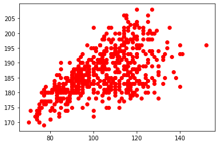
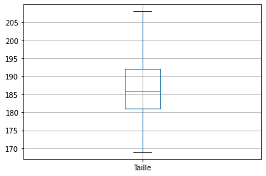

**A lire à 
la première ouverture de ce fichier :**


* Ce fichier est en Lecture seule. Vous ne pouvez pas exécutez les cellules ni le modifier. 

Pour cette raison :   
* Faites-en une copie par Fichier / Enregistrer une copie dans Drive
*   Renommer le fichier en Prenom_Nom_03_Pandas_eleves.ipynb
* Partagez (en haut à droite) ce notebook avec le compte nsi.glassus@gmail.com afin que j'ai une visibilité sur votre travail. Faites bien attention à m'accorder un partage avec droit de modification.
* Vous pouvez maintenant éxecuter, modifier les cellules, répondre aux questions...
* Et je peux moi venir en temps réel voir votre travail et écrire dans vos cellules.


# Utilisation du module Pandas
Le module `csv` utilisé précédemment se contente de lire les données structurées. Il ne fait aucun effort particulier pour analyser les données. Nous nous en sommes aperçus lorsqu'il a fallu convertir par `int()` toutes les valeurs numériques, qui étaient interprétées comme des chaînes de caractères.  
La bibliothèque `pandas` est par contre spécialement conçue pour l'analyse des données (*data analysis*) : elle est donc naturellement bien plus performante.


```python
import pandas as pd #import du module pandas, abrégé classiquement par "pd"
```


```python
df = pd.read_csv('http://glassus1.free.fr/top14.csv', encoding = 'utf-8')
```

La variable est nommée classiquement `df` pour *dataframe* (que l'on peut traduire par *table de données*)


```python
type(df)
```


    pandas.core.frame.DataFrame


## Premiers renseignements sur les fichiers de données

Que contient la variable `df`?


```python
df
```


<div>
<style scoped>
    .dataframe tbody tr th:only-of-type {
        vertical-align: middle;
    }

    .dataframe tbody tr th {
        vertical-align: top;
    }

    .dataframe thead th {
        text-align: right;
    }
</style>
<table border="1" class="dataframe">
  <thead>
    <tr style="text-align: right;">
      <th></th>
      <th>Equipe</th>
      <th>Nom</th>
      <th>Poste</th>
      <th>Date de naissance</th>
      <th>Taille</th>
      <th>Poids</th>
    </tr>
  </thead>
  <tbody>
    <tr>
      <th>0</th>
      <td>Agen</td>
      <td>Anton PEIKRISHVILI</td>
      <td>Pilier</td>
      <td>18/09/1987</td>
      <td>183</td>
      <td>122</td>
    </tr>
    <tr>
      <th>1</th>
      <td>Agen</td>
      <td>Dave RYAN</td>
      <td>Pilier</td>
      <td>21/04/1986</td>
      <td>183</td>
      <td>116</td>
    </tr>
    <tr>
      <th>2</th>
      <td>Agen</td>
      <td>Giorgi TETRASHVILI</td>
      <td>Pilier</td>
      <td>31/08/1993</td>
      <td>177</td>
      <td>112</td>
    </tr>
    <tr>
      <th>3</th>
      <td>Agen</td>
      <td>Kamaliele TUFELE</td>
      <td>Pilier</td>
      <td>11/10/1995</td>
      <td>182</td>
      <td>123</td>
    </tr>
    <tr>
      <th>4</th>
      <td>Agen</td>
      <td>Malino VANAÏ</td>
      <td>Pilier</td>
      <td>04/05/1993</td>
      <td>183</td>
      <td>119</td>
    </tr>
    <tr>
      <th>...</th>
      <td>...</td>
      <td>...</td>
      <td>...</td>
      <td>...</td>
      <td>...</td>
      <td>...</td>
    </tr>
    <tr>
      <th>590</th>
      <td>Toulouse</td>
      <td>Werner KOK</td>
      <td>Ailier</td>
      <td>27/01/1993</td>
      <td>177</td>
      <td>78</td>
    </tr>
    <tr>
      <th>591</th>
      <td>Toulouse</td>
      <td>Yoann HUGET</td>
      <td>Ailier</td>
      <td>02/06/1987</td>
      <td>190</td>
      <td>97</td>
    </tr>
    <tr>
      <th>592</th>
      <td>Toulouse</td>
      <td>Matthis LEBEL</td>
      <td>Arrière</td>
      <td>25/03/1999</td>
      <td>185</td>
      <td>91</td>
    </tr>
    <tr>
      <th>593</th>
      <td>Toulouse</td>
      <td>Maxime MÉDARD</td>
      <td>Arrière</td>
      <td>16/11/1986</td>
      <td>180</td>
      <td>85</td>
    </tr>
    <tr>
      <th>594</th>
      <td>Toulouse</td>
      <td>Thomas RAMOS</td>
      <td>Arrière</td>
      <td>23/07/1995</td>
      <td>178</td>
      <td>86</td>
    </tr>
  </tbody>
</table>
<p>595 rows × 6 columns</p>
</div>


Les données sont présentées dans l'ordre originel du fichier. 
Il est possible d'avoir uniquement les premières lignes du fichier avec la commande `head()` et les dernières du fichier avec la commande `tail()`. Ces commandes peuvent recevoir en paramètre un nombre entier.


```python
df.head()
```


<div>
<style scoped>
    .dataframe tbody tr th:only-of-type {
        vertical-align: middle;
    }

    .dataframe tbody tr th {
        vertical-align: top;
    }

    .dataframe thead th {
        text-align: right;
    }
</style>
<table border="1" class="dataframe">
  <thead>
    <tr style="text-align: right;">
      <th></th>
      <th>Equipe</th>
      <th>Nom</th>
      <th>Poste</th>
      <th>Date de naissance</th>
      <th>Taille</th>
      <th>Poids</th>
    </tr>
  </thead>
  <tbody>
    <tr>
      <th>0</th>
      <td>Agen</td>
      <td>Anton PEIKRISHVILI</td>
      <td>Pilier</td>
      <td>18/09/1987</td>
      <td>183</td>
      <td>122</td>
    </tr>
    <tr>
      <th>1</th>
      <td>Agen</td>
      <td>Dave RYAN</td>
      <td>Pilier</td>
      <td>21/04/1986</td>
      <td>183</td>
      <td>116</td>
    </tr>
    <tr>
      <th>2</th>
      <td>Agen</td>
      <td>Giorgi TETRASHVILI</td>
      <td>Pilier</td>
      <td>31/08/1993</td>
      <td>177</td>
      <td>112</td>
    </tr>
    <tr>
      <th>3</th>
      <td>Agen</td>
      <td>Kamaliele TUFELE</td>
      <td>Pilier</td>
      <td>11/10/1995</td>
      <td>182</td>
      <td>123</td>
    </tr>
    <tr>
      <th>4</th>
      <td>Agen</td>
      <td>Malino VANAÏ</td>
      <td>Pilier</td>
      <td>04/05/1993</td>
      <td>183</td>
      <td>119</td>
    </tr>
  </tbody>
</table>
</div>


```python
df.tail()
```


<div>
<style scoped>
    .dataframe tbody tr th:only-of-type {
        vertical-align: middle;
    }

    .dataframe tbody tr th {
        vertical-align: top;
    }

    .dataframe thead th {
        text-align: right;
    }
</style>
<table border="1" class="dataframe">
  <thead>
    <tr style="text-align: right;">
      <th></th>
      <th>Equipe</th>
      <th>Nom</th>
      <th>Poste</th>
      <th>Date de naissance</th>
      <th>Taille</th>
      <th>Poids</th>
    </tr>
  </thead>
  <tbody>
    <tr>
      <th>590</th>
      <td>Toulouse</td>
      <td>Werner KOK</td>
      <td>Ailier</td>
      <td>27/01/1993</td>
      <td>177</td>
      <td>78</td>
    </tr>
    <tr>
      <th>591</th>
      <td>Toulouse</td>
      <td>Yoann HUGET</td>
      <td>Ailier</td>
      <td>02/06/1987</td>
      <td>190</td>
      <td>97</td>
    </tr>
    <tr>
      <th>592</th>
      <td>Toulouse</td>
      <td>Matthis LEBEL</td>
      <td>Arrière</td>
      <td>25/03/1999</td>
      <td>185</td>
      <td>91</td>
    </tr>
    <tr>
      <th>593</th>
      <td>Toulouse</td>
      <td>Maxime MÉDARD</td>
      <td>Arrière</td>
      <td>16/11/1986</td>
      <td>180</td>
      <td>85</td>
    </tr>
    <tr>
      <th>594</th>
      <td>Toulouse</td>
      <td>Thomas RAMOS</td>
      <td>Arrière</td>
      <td>23/07/1995</td>
      <td>178</td>
      <td>86</td>
    </tr>
  </tbody>
</table>
</div>


```python
df.head(3)
```


<div>
<style scoped>
    .dataframe tbody tr th:only-of-type {
        vertical-align: middle;
    }

    .dataframe tbody tr th {
        vertical-align: top;
    }

    .dataframe thead th {
        text-align: right;
    }
</style>
<table border="1" class="dataframe">
  <thead>
    <tr style="text-align: right;">
      <th></th>
      <th>Equipe</th>
      <th>Nom</th>
      <th>Poste</th>
      <th>Date de naissance</th>
      <th>Taille</th>
      <th>Poids</th>
    </tr>
  </thead>
  <tbody>
    <tr>
      <th>0</th>
      <td>Agen</td>
      <td>Anton PEIKRISHVILI</td>
      <td>Pilier</td>
      <td>18/09/1987</td>
      <td>183</td>
      <td>122</td>
    </tr>
    <tr>
      <th>1</th>
      <td>Agen</td>
      <td>Dave RYAN</td>
      <td>Pilier</td>
      <td>21/04/1986</td>
      <td>183</td>
      <td>116</td>
    </tr>
    <tr>
      <th>2</th>
      <td>Agen</td>
      <td>Giorgi TETRASHVILI</td>
      <td>Pilier</td>
      <td>31/08/1993</td>
      <td>177</td>
      <td>112</td>
    </tr>
  </tbody>
</table>
</div>


Pour avoir des renseignements globaux sur la structure de notre fichier, on peut utiliser la commande `df.info()`


```python
df.info()
```

    <class 'pandas.core.frame.DataFrame'>
    RangeIndex: 595 entries, 0 to 594
    Data columns (total 6 columns):
    Equipe               595 non-null object
    Nom                  595 non-null object
    Poste                595 non-null object
    Date de naissance    595 non-null object
    Taille               595 non-null int64
    Poids                595 non-null int64
    dtypes: int64(2), object(4)
    memory usage: 28.0+ KB


Pour accéder à une fiche particulière de joueur, on peut utiliser la fonction `loc()` :


```python
df.loc[45]
```


    Equipe                             Bayonne
    Nom                  Torsten VAN JAARSVELD
    Poste                            Talonneur
    Date de naissance               30/06/1987
    Taille                                 175
    Poids                                  106
    Name: 45, dtype: object


## Extraction de colonnes, création de graphiques 
Pour créer une liste contenant uniquement les données numériques de la colonne poids, il suffit d'écrire :


```python
poids = df['Poids']
```

Attention, la variable `poids` n'est pas une liste qui contiendrait `[122,116,112,...]` mais un type particulier à `pandas`, appelé "Series".


```python
print(poids)
```

    0      122
    1      116
    2      112
    3      123
    4      119
          ... 
    590     78
    591     97
    592     91
    593     85
    594     86
    Name: Poids, Length: 595, dtype: int64


```python
type(poids)
```


    pandas.core.series.Series


On peut néanmoins s'en servir comme d'une liste classique.


```python
poids[0]
```


    122


On voit donc que les données sont automatiquement traitées comme des nombres. Pas besoin de conversion comme avec le module `csv` !

Pour tracer notre nuage de points poids-taille, le code sera donc simplement :


```python
%matplotlib inline
import matplotlib.pyplot as plt
X = df['Poids']
Y = df['Taille']

plt.plot(X,Y,'ro') # r pour red, o pour un cercle. voir https://matplotlib.org/api/markers_api.html
plt.show()
```


    

    


L'interprétation numérique permet à `pandas` d'analyser automatiquement les données, avec notamment la fonction `describe()`.


```python
df['Taille'].describe()
```


    count    595.000000
    mean     186.559664
    std        7.572615
    min      169.000000
    25%      181.000000
    50%      186.000000
    75%      192.000000
    max      208.000000
    Name: Taille, dtype: float64


On voit donc que les indicateurs statistiques sont proposés automatiquent. 
D'ailleurs, on peut très facilement tracer des boites à moustaches avec `boxplot()`.


```python
df.boxplot("Taille")
```


    <matplotlib.axes._subplots.AxesSubplot at 0x7f28dd7de320>


    

    


Pour les données non-numériques, la commande `describe()` n'est que peu d'utilité. Elle renseigne toutefois la valeur la plus fréquente (en statistiques, le *mode* ou *valeur modale*)


```python
df['Poste'].describe().top
```


    '3ème ligne'


```python

```

Pour connaître par exemple la date de naissance la plus fréquente chez les joueurs du top14, on utilisera simplement :


```python
df['Date de naissance'].describe().top
```


    '07/08/1990'


Qui sont les joueurs nés à cette date ?


```python
print(df['Nom'][df['Date de naissance'] == '23/04/1993'])
```

    157      Rory SCHOLES
    382     Laurent PANIS
    567    Alban PLACINES
    Name: Nom, dtype: object


Beaucoup plus de renseignements sont donnés par la commande `value_counts()`.


```python
df['Taille'].value_counts()
```


    180    52
    183    40
    188    35
    181    31
    185    31
    182    29
    184    25
    187    25
    190    25
    193    24
    186    24
    189    21
    178    20
    177    18
    192    17
    198    17
    195    16
    191    16
    196    15
    194    14
    200    12
    174     9
    175     9
    179     9
    202     9
    176     8
    199     6
    197     6
    201     5
    203     4
    172     4
    204     3
    170     3
    206     3
    171     3
    173     3
    208     2
    205     1
    169     1
    Name: Taille, dtype: int64


## Filtres et recherches
Comment créer une *dataframe* ne contenant que les joueurs de l'UBB ?  

L'idée syntaxique est d'écrire à l'intérieur de `df[]` le test qui permettra le filtrage.


```python
UBB = df[df['Equipe'] == 'Bordeaux']
```


```python
UBB
```


<div>
<style scoped>
    .dataframe tbody tr th:only-of-type {
        vertical-align: middle;
    }

    .dataframe tbody tr th {
        vertical-align: top;
    }

    .dataframe thead th {
        text-align: right;
    }
</style>
<table border="1" class="dataframe">
  <thead>
    <tr style="text-align: right;">
      <th></th>
      <th>Equipe</th>
      <th>Nom</th>
      <th>Poste</th>
      <th>Date de naissance</th>
      <th>Taille</th>
      <th>Poids</th>
    </tr>
  </thead>
  <tbody>
    <tr>
      <th>80</th>
      <td>Bordeaux</td>
      <td>Jefferson POIROT</td>
      <td>Pilier</td>
      <td>01/11/1992</td>
      <td>181</td>
      <td>117</td>
    </tr>
    <tr>
      <th>81</th>
      <td>Bordeaux</td>
      <td>Lasha TABIDZE</td>
      <td>Pilier</td>
      <td>04/07/1997</td>
      <td>185</td>
      <td>117</td>
    </tr>
    <tr>
      <th>82</th>
      <td>Bordeaux</td>
      <td>Laurent DELBOULBÈS</td>
      <td>Pilier</td>
      <td>17/11/1986</td>
      <td>181</td>
      <td>106</td>
    </tr>
    <tr>
      <th>83</th>
      <td>Bordeaux</td>
      <td>Lekso KAULASHVILI</td>
      <td>Pilier</td>
      <td>27/08/1992</td>
      <td>187</td>
      <td>120</td>
    </tr>
    <tr>
      <th>84</th>
      <td>Bordeaux</td>
      <td>Peni RAVAI</td>
      <td>Pilier</td>
      <td>16/06/1990</td>
      <td>185</td>
      <td>119</td>
    </tr>
    <tr>
      <th>85</th>
      <td>Bordeaux</td>
      <td>Thierry PAÏVA</td>
      <td>Pilier</td>
      <td>19/11/1995</td>
      <td>184</td>
      <td>125</td>
    </tr>
    <tr>
      <th>86</th>
      <td>Bordeaux</td>
      <td>Vadim COBILAS</td>
      <td>Pilier</td>
      <td>30/07/1983</td>
      <td>180</td>
      <td>118</td>
    </tr>
    <tr>
      <th>87</th>
      <td>Bordeaux</td>
      <td>Adrien PÉLISSIÉ</td>
      <td>Talonneur</td>
      <td>07/08/1990</td>
      <td>181</td>
      <td>110</td>
    </tr>
    <tr>
      <th>88</th>
      <td>Bordeaux</td>
      <td>Clément MAYNADIER</td>
      <td>Talonneur</td>
      <td>11/10/1988</td>
      <td>187</td>
      <td>100</td>
    </tr>
    <tr>
      <th>89</th>
      <td>Bordeaux</td>
      <td>Alexandre FLANQUART</td>
      <td>2ème ligne</td>
      <td>09/10/1989</td>
      <td>204</td>
      <td>120</td>
    </tr>
    <tr>
      <th>90</th>
      <td>Bordeaux</td>
      <td>Cyril CAZEAUX</td>
      <td>2ème ligne</td>
      <td>10/02/1995</td>
      <td>198</td>
      <td>113</td>
    </tr>
    <tr>
      <th>91</th>
      <td>Bordeaux</td>
      <td>Jandré MARAIS</td>
      <td>2ème ligne</td>
      <td>14/06/1989</td>
      <td>198</td>
      <td>118</td>
    </tr>
    <tr>
      <th>92</th>
      <td>Bordeaux</td>
      <td>Kane DOUGLAS</td>
      <td>2ème ligne</td>
      <td>01/06/1989</td>
      <td>202</td>
      <td>123</td>
    </tr>
    <tr>
      <th>93</th>
      <td>Bordeaux</td>
      <td>Masalosalo TUTAIA</td>
      <td>2ème ligne</td>
      <td>05/06/1984</td>
      <td>204</td>
      <td>125</td>
    </tr>
    <tr>
      <th>94</th>
      <td>Bordeaux</td>
      <td>Afa AMOSA</td>
      <td>3ème ligne</td>
      <td>11/10/1990</td>
      <td>187</td>
      <td>112</td>
    </tr>
    <tr>
      <th>95</th>
      <td>Bordeaux</td>
      <td>Alexandre ROUMAT</td>
      <td>3ème ligne</td>
      <td>27/06/1997</td>
      <td>198</td>
      <td>104</td>
    </tr>
    <tr>
      <th>96</th>
      <td>Bordeaux</td>
      <td>Béka GORGADZE</td>
      <td>3ème ligne</td>
      <td>08/02/1996</td>
      <td>189</td>
      <td>105</td>
    </tr>
    <tr>
      <th>97</th>
      <td>Bordeaux</td>
      <td>Cameron WOKI</td>
      <td>3ème ligne</td>
      <td>07/11/1998</td>
      <td>196</td>
      <td>103</td>
    </tr>
    <tr>
      <th>98</th>
      <td>Bordeaux</td>
      <td>Mahamadou DIABY</td>
      <td>3ème ligne</td>
      <td>15/08/1990</td>
      <td>188</td>
      <td>105</td>
    </tr>
    <tr>
      <th>99</th>
      <td>Bordeaux</td>
      <td>Marco TAULEIGNE</td>
      <td>3ème ligne</td>
      <td>30/08/1993</td>
      <td>191</td>
      <td>115</td>
    </tr>
    <tr>
      <th>100</th>
      <td>Bordeaux</td>
      <td>Scott HIGGINBOTHAM</td>
      <td>3ème ligne</td>
      <td>05/09/1986</td>
      <td>195</td>
      <td>110</td>
    </tr>
    <tr>
      <th>101</th>
      <td>Bordeaux</td>
      <td>Maxime LUCU</td>
      <td>Mêlée</td>
      <td>12/01/1993</td>
      <td>177</td>
      <td>79</td>
    </tr>
    <tr>
      <th>102</th>
      <td>Bordeaux</td>
      <td>Yann LESGOURGUES</td>
      <td>Mêlée</td>
      <td>17/01/1991</td>
      <td>174</td>
      <td>71</td>
    </tr>
    <tr>
      <th>103</th>
      <td>Bordeaux</td>
      <td>Ben BOTICA</td>
      <td>Ouverture</td>
      <td>07/10/1989</td>
      <td>178</td>
      <td>93</td>
    </tr>
    <tr>
      <th>104</th>
      <td>Bordeaux</td>
      <td>Lucas MÉRET</td>
      <td>Ouverture</td>
      <td>30/01/1995</td>
      <td>178</td>
      <td>85</td>
    </tr>
    <tr>
      <th>105</th>
      <td>Bordeaux</td>
      <td>Matthieu JALIBERT</td>
      <td>Ouverture</td>
      <td>06/11/1998</td>
      <td>180</td>
      <td>79</td>
    </tr>
    <tr>
      <th>106</th>
      <td>Bordeaux</td>
      <td>Jean-Baptiste DUBIÉ</td>
      <td>Centre</td>
      <td>16/07/1989</td>
      <td>181</td>
      <td>85</td>
    </tr>
    <tr>
      <th>107</th>
      <td>Bordeaux</td>
      <td>Rémi LAMERAT</td>
      <td>Centre</td>
      <td>14/01/1990</td>
      <td>184</td>
      <td>105</td>
    </tr>
    <tr>
      <th>108</th>
      <td>Bordeaux</td>
      <td>Semi RADRADRA</td>
      <td>Centre</td>
      <td>13/06/1992</td>
      <td>188</td>
      <td>102</td>
    </tr>
    <tr>
      <th>109</th>
      <td>Bordeaux</td>
      <td>Seta TAMANIVALU</td>
      <td>Centre</td>
      <td>23/07/1992</td>
      <td>189</td>
      <td>110</td>
    </tr>
    <tr>
      <th>110</th>
      <td>Bordeaux</td>
      <td>Ulupano SEUTENI</td>
      <td>Centre</td>
      <td>09/12/1993</td>
      <td>185</td>
      <td>95</td>
    </tr>
    <tr>
      <th>111</th>
      <td>Bordeaux</td>
      <td>Blair CONNOR</td>
      <td>Ailier</td>
      <td>29/09/1988</td>
      <td>183</td>
      <td>82</td>
    </tr>
    <tr>
      <th>112</th>
      <td>Bordeaux</td>
      <td>Nicolas PLAZY</td>
      <td>Ailier</td>
      <td>17/05/1994</td>
      <td>188</td>
      <td>85</td>
    </tr>
    <tr>
      <th>113</th>
      <td>Bordeaux</td>
      <td>Santiago CORDERO</td>
      <td>Ailier</td>
      <td>06/12/1993</td>
      <td>177</td>
      <td>83</td>
    </tr>
    <tr>
      <th>114</th>
      <td>Bordeaux</td>
      <td>Geoffrey CROS</td>
      <td>Arrière</td>
      <td>08/03/1997</td>
      <td>185</td>
      <td>85</td>
    </tr>
    <tr>
      <th>115</th>
      <td>Bordeaux</td>
      <td>Nans DUCUING</td>
      <td>Arrière</td>
      <td>06/11/1991</td>
      <td>181</td>
      <td>90</td>
    </tr>
    <tr>
      <th>116</th>
      <td>Bordeaux</td>
      <td>Romain BUROS</td>
      <td>Arrière</td>
      <td>31/07/1997</td>
      <td>187</td>
      <td>91</td>
    </tr>
  </tbody>
</table>
</div>


### Exercice  1

Créer une dataframe `gros` qui contient les joueurs de plus de 135 kg.


```python
gros = df[df['Poids'] > 135] ; gros
```


<div>
<style scoped>
    .dataframe tbody tr th:only-of-type {
        vertical-align: middle;
    }

    .dataframe tbody tr th {
        vertical-align: top;
    }

    .dataframe thead th {
        text-align: right;
    }
</style>
<table border="1" class="dataframe">
  <thead>
    <tr style="text-align: right;">
      <th></th>
      <th>Equipe</th>
      <th>Nom</th>
      <th>Poste</th>
      <th>Date de naissance</th>
      <th>Taille</th>
      <th>Poids</th>
    </tr>
  </thead>
  <tbody>
    <tr>
      <th>48</th>
      <td>Bayonne</td>
      <td>Edwin MAKA</td>
      <td>2ème ligne</td>
      <td>25/01/1993</td>
      <td>196</td>
      <td>140</td>
    </tr>
    <tr>
      <th>167</th>
      <td>Castres</td>
      <td>Tapu FALATEA</td>
      <td>Pilier</td>
      <td>12/12/1988</td>
      <td>187</td>
      <td>137</td>
    </tr>
    <tr>
      <th>253</th>
      <td>La Rochelle</td>
      <td>Uini ATONIO</td>
      <td>Pilier</td>
      <td>26/03/1990</td>
      <td>196</td>
      <td>152</td>
    </tr>
    <tr>
      <th>324</th>
      <td>Montpellier</td>
      <td>Antoine GUILLAMON</td>
      <td>Pilier</td>
      <td>04/06/1991</td>
      <td>192</td>
      <td>136</td>
    </tr>
    <tr>
      <th>373</th>
      <td>Paris</td>
      <td>Christopher VAOTOA</td>
      <td>Pilier</td>
      <td>16/11/1996</td>
      <td>185</td>
      <td>138</td>
    </tr>
    <tr>
      <th>425</th>
      <td>Pau</td>
      <td>Malik HAMADACHE</td>
      <td>Pilier</td>
      <td>17/10/1988</td>
      <td>193</td>
      <td>141</td>
    </tr>
    <tr>
      <th>465</th>
      <td>Racing92</td>
      <td>Ali OZ</td>
      <td>Pilier</td>
      <td>28/05/1995</td>
      <td>193</td>
      <td>140</td>
    </tr>
    <tr>
      <th>466</th>
      <td>Racing92</td>
      <td>Ben TAMEIFUNA</td>
      <td>Pilier</td>
      <td>30/08/1991</td>
      <td>182</td>
      <td>140</td>
    </tr>
  </tbody>
</table>
</div>


### Exercice  2

Créer une dataframe `grand_gros` qui contient les joueurs de plus de 2m et plus de 120 kg.


```python
grand_gros = df[(df['Poids'] > 120) & (df['Taille'] > 200)]
grand_gros
```


<div>
<style scoped>
    .dataframe tbody tr th:only-of-type {
        vertical-align: middle;
    }

    .dataframe tbody tr th {
        vertical-align: top;
    }

    .dataframe thead th {
        text-align: right;
    }
</style>
<table border="1" class="dataframe">
  <thead>
    <tr style="text-align: right;">
      <th></th>
      <th>Equipe</th>
      <th>Nom</th>
      <th>Poste</th>
      <th>Date de naissance</th>
      <th>Taille</th>
      <th>Poids</th>
    </tr>
  </thead>
  <tbody>
    <tr>
      <th>0</th>
      <td>Agen</td>
      <td>Anton PEIKRISHVILI</td>
      <td>Pilier</td>
      <td>18/09/1987</td>
      <td>183</td>
      <td>122</td>
    </tr>
    <tr>
      <th>3</th>
      <td>Agen</td>
      <td>Kamaliele TUFELE</td>
      <td>Pilier</td>
      <td>11/10/1995</td>
      <td>182</td>
      <td>123</td>
    </tr>
    <tr>
      <th>12</th>
      <td>Agen</td>
      <td>Mickaël DE MARCO</td>
      <td>2ème ligne</td>
      <td>22/04/1989</td>
      <td>195</td>
      <td>134</td>
    </tr>
    <tr>
      <th>13</th>
      <td>Agen</td>
      <td>Pierce PHILLIPS</td>
      <td>2ème ligne</td>
      <td>06/10/1992</td>
      <td>203</td>
      <td>119</td>
    </tr>
    <tr>
      <th>35</th>
      <td>Bayonne</td>
      <td>Census JOHNSTON</td>
      <td>Pilier</td>
      <td>06/05/1981</td>
      <td>189</td>
      <td>130</td>
    </tr>
    <tr>
      <th>...</th>
      <td>...</td>
      <td>...</td>
      <td>...</td>
      <td>...</td>
      <td>...</td>
      <td>...</td>
    </tr>
    <tr>
      <th>562</th>
      <td>Toulouse</td>
      <td>Florian VERHAEGHE</td>
      <td>2ème ligne</td>
      <td>27/04/1997</td>
      <td>202</td>
      <td>108</td>
    </tr>
    <tr>
      <th>563</th>
      <td>Toulouse</td>
      <td>Iosefa TEKORI</td>
      <td>2ème ligne</td>
      <td>17/12/1983</td>
      <td>198</td>
      <td>127</td>
    </tr>
    <tr>
      <th>564</th>
      <td>Toulouse</td>
      <td>Richie ARNOLD</td>
      <td>2ème ligne</td>
      <td>01/07/1990</td>
      <td>208</td>
      <td>127</td>
    </tr>
    <tr>
      <th>565</th>
      <td>Toulouse</td>
      <td>Richie GRAY</td>
      <td>2ème ligne</td>
      <td>24/08/1989</td>
      <td>206</td>
      <td>125</td>
    </tr>
    <tr>
      <th>566</th>
      <td>Toulouse</td>
      <td>Rory ARNOLD</td>
      <td>2ème ligne</td>
      <td>01/07/1990</td>
      <td>208</td>
      <td>120</td>
    </tr>
  </tbody>
</table>
<p>96 rows × 6 columns</p>
</div>


### Exercice  3

Trouver en une seule ligne le joueur le plus léger du Top14.


```python
df['Nom'][df['Poids'] == min(df['Poids'])]
print(df['Nom'][df['Poids'].idxmin])

```

    Dylan HAYES


## Tris de données
Le tri se fait par la fonction `sort_values()` :


```python
newdf = df.sort_values(by=['Poids'], ascending = True)
```


```python
newdf.head(10)
```


<div>
<style scoped>
    .dataframe tbody tr th:only-of-type {
        vertical-align: middle;
    }

    .dataframe tbody tr th {
        vertical-align: top;
    }

    .dataframe thead th {
        text-align: right;
    }
</style>
<table border="1" class="dataframe">
  <thead>
    <tr style="text-align: right;">
      <th></th>
      <th>Equipe</th>
      <th>Nom</th>
      <th>Poste</th>
      <th>Date de naissance</th>
      <th>Taille</th>
      <th>Poids</th>
    </tr>
  </thead>
  <tbody>
    <tr>
      <th>491</th>
      <td>Racing92</td>
      <td>Teddy IRIBAREN</td>
      <td>Mêlée</td>
      <td>25/09/1990</td>
      <td>170</td>
      <td>70</td>
    </tr>
    <tr>
      <th>102</th>
      <td>Bordeaux</td>
      <td>Yann LESGOURGUES</td>
      <td>Mêlée</td>
      <td>17/01/1991</td>
      <td>174</td>
      <td>71</td>
    </tr>
    <tr>
      <th>545</th>
      <td>Toulon</td>
      <td>Gervais CORDIN</td>
      <td>Arrière</td>
      <td>10/12/1998</td>
      <td>172</td>
      <td>73</td>
    </tr>
    <tr>
      <th>353</th>
      <td>Montpellier</td>
      <td>Benoît PAILLAUGUE</td>
      <td>Mêlée</td>
      <td>17/11/1987</td>
      <td>172</td>
      <td>74</td>
    </tr>
    <tr>
      <th>143</th>
      <td>Brive</td>
      <td>Quentin DELORD</td>
      <td>Mêlée</td>
      <td>10/02/1999</td>
      <td>171</td>
      <td>74</td>
    </tr>
    <tr>
      <th>578</th>
      <td>Toulouse</td>
      <td>Sébastien BÉZY</td>
      <td>Mêlée</td>
      <td>22/11/1991</td>
      <td>174</td>
      <td>74</td>
    </tr>
    <tr>
      <th>446</th>
      <td>Pau</td>
      <td>Clovis LE BAIL</td>
      <td>Mêlée</td>
      <td>29/11/1995</td>
      <td>173</td>
      <td>74</td>
    </tr>
    <tr>
      <th>64</th>
      <td>Bayonne</td>
      <td>Guillaume ROUET</td>
      <td>Mêlée</td>
      <td>13/08/1988</td>
      <td>170</td>
      <td>75</td>
    </tr>
    <tr>
      <th>364</th>
      <td>Montpellier</td>
      <td>Gabriel N'GANDEBE</td>
      <td>Ailier</td>
      <td>30/03/1997</td>
      <td>174</td>
      <td>75</td>
    </tr>
    <tr>
      <th>283</th>
      <td>La Rochelle</td>
      <td>Marc ANDREU</td>
      <td>Ailier</td>
      <td>27/12/1985</td>
      <td>170</td>
      <td>75</td>
    </tr>
  </tbody>
</table>
</div>


```python

```

## Rajout d'une colonne
Afin de pouvoir trier les joueurs suivant de nouveaux critères, nous allons rajouter un champ pour chaque joueur.
Prenons un exemple stupide : fabriquons un nouveau champ `'Poids après les vacances'` qui contiendra le poids des joueurs augmenté de 8 kg. 
Ceci se fera simplement par :


```python
df['Poids après les vacances'] = df['Poids'] + 8
```


```python
df.head()
```


<div>
<style scoped>
    .dataframe tbody tr th:only-of-type {
        vertical-align: middle;
    }

    .dataframe tbody tr th {
        vertical-align: top;
    }

    .dataframe thead th {
        text-align: right;
    }
</style>
<table border="1" class="dataframe">
  <thead>
    <tr style="text-align: right;">
      <th></th>
      <th>Equipe</th>
      <th>Nom</th>
      <th>Poste</th>
      <th>Date de naissance</th>
      <th>Taille</th>
      <th>Poids</th>
      <th>Poids après les vacances</th>
    </tr>
  </thead>
  <tbody>
    <tr>
      <th>0</th>
      <td>Agen</td>
      <td>Anton PEIKRISHVILI</td>
      <td>Pilier</td>
      <td>18/09/1987</td>
      <td>183</td>
      <td>122</td>
      <td>130</td>
    </tr>
    <tr>
      <th>1</th>
      <td>Agen</td>
      <td>Dave RYAN</td>
      <td>Pilier</td>
      <td>21/04/1986</td>
      <td>183</td>
      <td>116</td>
      <td>124</td>
    </tr>
    <tr>
      <th>2</th>
      <td>Agen</td>
      <td>Giorgi TETRASHVILI</td>
      <td>Pilier</td>
      <td>31/08/1993</td>
      <td>177</td>
      <td>112</td>
      <td>120</td>
    </tr>
    <tr>
      <th>3</th>
      <td>Agen</td>
      <td>Kamaliele TUFELE</td>
      <td>Pilier</td>
      <td>11/10/1995</td>
      <td>182</td>
      <td>123</td>
      <td>131</td>
    </tr>
    <tr>
      <th>4</th>
      <td>Agen</td>
      <td>Malino VANAÏ</td>
      <td>Pilier</td>
      <td>04/05/1993</td>
      <td>183</td>
      <td>119</td>
      <td>127</td>
    </tr>
  </tbody>
</table>
</div>


Pour supprimer cette colonne sans intérêt, faisons :


```python
del df['Poids après les vacances'] 
```


```python
df.head()
```


<div>
<style scoped>
    .dataframe tbody tr th:only-of-type {
        vertical-align: middle;
    }

    .dataframe tbody tr th {
        vertical-align: top;
    }

    .dataframe thead th {
        text-align: right;
    }
</style>
<table border="1" class="dataframe">
  <thead>
    <tr style="text-align: right;">
      <th></th>
      <th>Equipe</th>
      <th>Nom</th>
      <th>Poste</th>
      <th>Date de naissance</th>
      <th>Taille</th>
      <th>Poids</th>
    </tr>
  </thead>
  <tbody>
    <tr>
      <th>0</th>
      <td>Agen</td>
      <td>Anton PEIKRISHVILI</td>
      <td>Pilier</td>
      <td>18/09/1987</td>
      <td>183</td>
      <td>122</td>
    </tr>
    <tr>
      <th>1</th>
      <td>Agen</td>
      <td>Dave RYAN</td>
      <td>Pilier</td>
      <td>21/04/1986</td>
      <td>183</td>
      <td>116</td>
    </tr>
    <tr>
      <th>2</th>
      <td>Agen</td>
      <td>Giorgi TETRASHVILI</td>
      <td>Pilier</td>
      <td>31/08/1993</td>
      <td>177</td>
      <td>112</td>
    </tr>
    <tr>
      <th>3</th>
      <td>Agen</td>
      <td>Kamaliele TUFELE</td>
      <td>Pilier</td>
      <td>11/10/1995</td>
      <td>182</td>
      <td>123</td>
    </tr>
    <tr>
      <th>4</th>
      <td>Agen</td>
      <td>Malino VANAÏ</td>
      <td>Pilier</td>
      <td>04/05/1993</td>
      <td>183</td>
      <td>119</td>
    </tr>
  </tbody>
</table>
</div>


### Exercice  4

1. Créer une colonne contenant l'IMC de chaque joueur
2. Créer une nouvelle dataframe contenant tous les joueurs du top14 classés par ordre d'IMC croissant.


```python
df['IMC'] = df['Poids'] / (df['Taille']/100)**2
df.head()
```


<div>
<style scoped>
    .dataframe tbody tr th:only-of-type {
        vertical-align: middle;
    }

    .dataframe tbody tr th {
        vertical-align: top;
    }

    .dataframe thead th {
        text-align: right;
    }
</style>
<table border="1" class="dataframe">
  <thead>
    <tr style="text-align: right;">
      <th></th>
      <th>Equipe</th>
      <th>Nom</th>
      <th>Poste</th>
      <th>Date de naissance</th>
      <th>Taille</th>
      <th>Poids</th>
      <th>IMC</th>
    </tr>
  </thead>
  <tbody>
    <tr>
      <th>0</th>
      <td>Agen</td>
      <td>Anton PEIKRISHVILI</td>
      <td>Pilier</td>
      <td>18/09/1987</td>
      <td>183</td>
      <td>122</td>
      <td>36.429872</td>
    </tr>
    <tr>
      <th>1</th>
      <td>Agen</td>
      <td>Dave RYAN</td>
      <td>Pilier</td>
      <td>21/04/1986</td>
      <td>183</td>
      <td>116</td>
      <td>34.638239</td>
    </tr>
    <tr>
      <th>2</th>
      <td>Agen</td>
      <td>Giorgi TETRASHVILI</td>
      <td>Pilier</td>
      <td>31/08/1993</td>
      <td>177</td>
      <td>112</td>
      <td>35.749625</td>
    </tr>
    <tr>
      <th>3</th>
      <td>Agen</td>
      <td>Kamaliele TUFELE</td>
      <td>Pilier</td>
      <td>11/10/1995</td>
      <td>182</td>
      <td>123</td>
      <td>37.133196</td>
    </tr>
    <tr>
      <th>4</th>
      <td>Agen</td>
      <td>Malino VANAÏ</td>
      <td>Pilier</td>
      <td>04/05/1993</td>
      <td>183</td>
      <td>119</td>
      <td>35.534056</td>
    </tr>
  </tbody>
</table>
</div>


```python
imcdf = df.sort_values(by=['IMC'], ascending = True)
imcdf
```


<div>
<style scoped>
    .dataframe tbody tr th:only-of-type {
        vertical-align: middle;
    }

    .dataframe tbody tr th {
        vertical-align: top;
    }

    .dataframe thead th {
        text-align: right;
    }
</style>
<table border="1" class="dataframe">
  <thead>
    <tr style="text-align: right;">
      <th></th>
      <th>Equipe</th>
      <th>Nom</th>
      <th>Poste</th>
      <th>Date de naissance</th>
      <th>Taille</th>
      <th>Poids</th>
      <th>IMC</th>
    </tr>
  </thead>
  <tbody>
    <tr>
      <th>102</th>
      <td>Bordeaux</td>
      <td>Yann LESGOURGUES</td>
      <td>Mêlée</td>
      <td>17/01/1991</td>
      <td>174</td>
      <td>71</td>
      <td>23.450918</td>
    </tr>
    <tr>
      <th>77</th>
      <td>Bayonne</td>
      <td>Aymeric LUC</td>
      <td>Arrière</td>
      <td>14/10/1997</td>
      <td>180</td>
      <td>76</td>
      <td>23.456790</td>
    </tr>
    <tr>
      <th>66</th>
      <td>Bayonne</td>
      <td>Brandon FAJARDO</td>
      <td>Ouverture</td>
      <td>25/06/1994</td>
      <td>181</td>
      <td>77</td>
      <td>23.503556</td>
    </tr>
    <tr>
      <th>141</th>
      <td>Brive</td>
      <td>David DELARUE</td>
      <td>Mêlée</td>
      <td>27/10/1996</td>
      <td>190</td>
      <td>85</td>
      <td>23.545706</td>
    </tr>
    <tr>
      <th>200</th>
      <td>Castres</td>
      <td>Martin LAVEAU</td>
      <td>Ailier</td>
      <td>10/09/1996</td>
      <td>182</td>
      <td>78</td>
      <td>23.547881</td>
    </tr>
    <tr>
      <th>...</th>
      <td>...</td>
      <td>...</td>
      <td>...</td>
      <td>...</td>
      <td>...</td>
      <td>...</td>
      <td>...</td>
    </tr>
    <tr>
      <th>376</th>
      <td>Paris</td>
      <td>Paul ALO-EMILE</td>
      <td>Pilier</td>
      <td>22/12/1991</td>
      <td>180</td>
      <td>128</td>
      <td>39.506173</td>
    </tr>
    <tr>
      <th>253</th>
      <td>La Rochelle</td>
      <td>Uini ATONIO</td>
      <td>Pilier</td>
      <td>26/03/1990</td>
      <td>196</td>
      <td>152</td>
      <td>39.566847</td>
    </tr>
    <tr>
      <th>373</th>
      <td>Paris</td>
      <td>Christopher VAOTOA</td>
      <td>Pilier</td>
      <td>16/11/1996</td>
      <td>185</td>
      <td>138</td>
      <td>40.321402</td>
    </tr>
    <tr>
      <th>511</th>
      <td>Toulon</td>
      <td>Sébastien TAOFIFENUA</td>
      <td>Pilier</td>
      <td>21/03/1992</td>
      <td>178</td>
      <td>130</td>
      <td>41.030173</td>
    </tr>
    <tr>
      <th>466</th>
      <td>Racing92</td>
      <td>Ben TAMEIFUNA</td>
      <td>Pilier</td>
      <td>30/08/1991</td>
      <td>182</td>
      <td>140</td>
      <td>42.265427</td>
    </tr>
  </tbody>
</table>
<p>595 rows × 7 columns</p>
</div>


```python

```
