---
#title : Exercice Révision - Codage de caractères
subtitle: Représentation des données
author : M.Meyroneinc-Condy
numbersections: true
fontsize: 11pt
geometry:
- top=12mm
- left=12mm
- right=12mm
- heightrounded    
output:
  pdf_document:
    toc: yes
    toc_depth: 3
    number_sections: yes
    highlight: tango
  blogdown::html_page:
    toc: yes
    toc_depth: 3
    number_sections: yes
    highlight: tango
--- 


<table  style="table-layout: fixed; border:solid;color:black;width:100%;">
        <tr>
            <th colspan=2; style="background-color: #3B444B;color:white;text-align:center;border:none;font-size:12pt;width:100%;">
           Thème 1 : Types de bases
            </th>
        </tr>
</table>

<table  style="table-layout: fixed;border:solid;color:black;width:100%;">
        <tr >
            <th width="30%"; style="background-color: #3B444B;color:white;text-align:center;border:none;font-size:20pt;">
            DS
            </th>
            <th  width="70%"; style="text-align:center;background-color:#99BADD;border:none;font-size:20pt;"> Codage des caractères</th>
        </tr>
</table>


<div style="page-break-after: always;"></div>

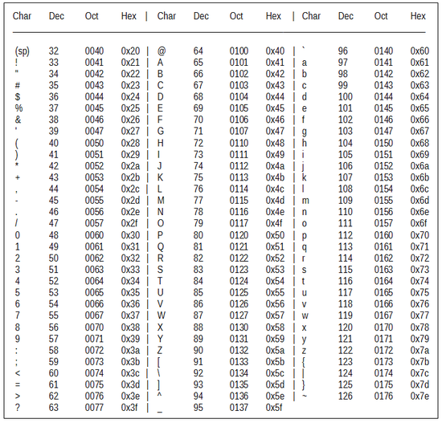{:.center width=75%}  
*Table ASCII*

!!! exo "Exercice 1 :"
   Décoder l'expression suivante, écrite en ASCII :  

    ```01001000 01000001 01010011 01010100 01000001 00100000 01001100 
    01000001 00100000 01010110 01001001 01010011 01010100 01000001 
    00101100 00100000 01000010 01000001 01000010 01011001 00100000 
    00100001 ```

??? tip "Correction"

    HASTA LA VISTA, BABY !


{:.center width=75%}
*Latin-9*

!!! exo "Exercice 2 :"
    **Q.1.** Le mot représenté par les octets ci-dessous est-il codé en ASCII ou en Latin 9 ? Donner ce mot :   
    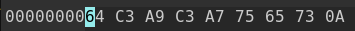{width=250px}  
    **Q.2.** Représenter `goûté` en Latin-9

??? tip "Correction"
    **Q.1.** d&#195;&#169;&#195;§ues

    **Q.2.** goûté : 67 6F FB 74 E9

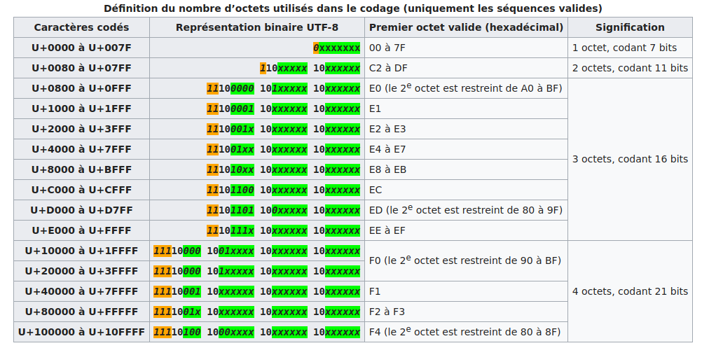{:.center  width=800px}

!!! exo "Exercice 3 : "
    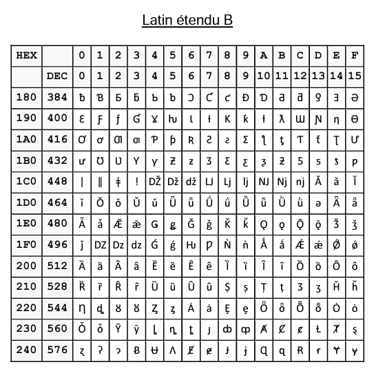{width=300px}  
    Donnée le codage Unicode la lettre &#542; puis son codage en UTF-8

??? tip "Correction"
    &#542;    - -> Unicode : +U021E

     - -> sur 11 bits :  
        - E en binaire -> <span style="color:red">1110</span>   (4 bits)
        - 1 en binaire -> <span style="color:green">0001</span>   (4 bits)
        - 2 en binaire -> <span style="color:blue">010</span>   (3 bits restants)

    - -> on remplie les 2 octects :  
        - 110<span style="color:blue">010</span><span style="color:green">00</span>  
        - 10<span style="color:green">01</span><span style="color:red">1110</span>

    - -> en repassant à l'hexadécimal :  
        - 12 soit C et 8
        - 9 et E

    - donc en UTF-8, on obtient C8 9E

!!! exo "Exercice 4"
    Décoder le message suivant :  
    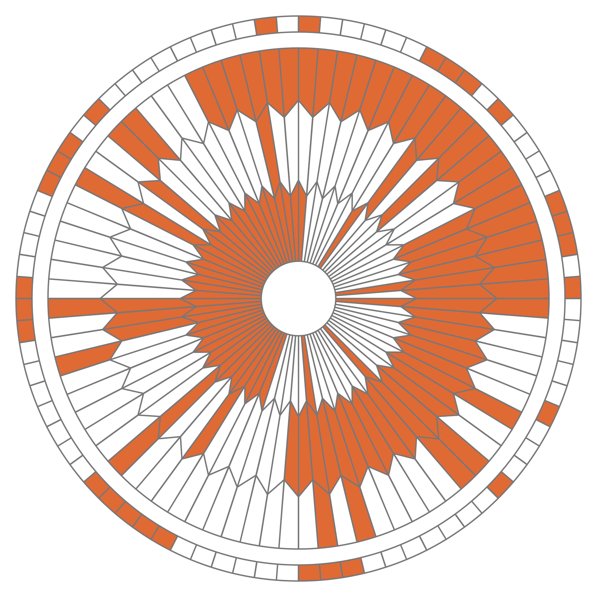{:.center  width=600px}


??? tip "Correction"
    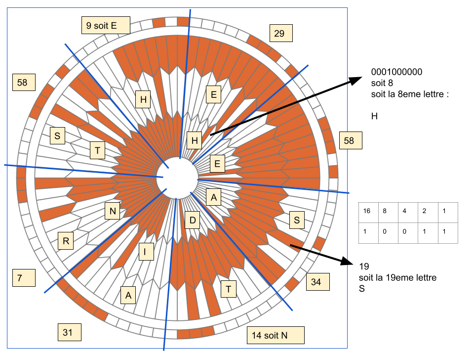
!!! exo "Exercice 5"
    Le défi du cours : codage UTF-8 (Latin-9), décoder le texte ci-dessous :  

    `56 65 72 73 20 6C 27 69 6E 66 69 6E 69 20 65 74 20 6C 27 61 75 2D 64 65 6C C3 A0``

??? tip "Correction"  
    Vers l'infini et l'au-del&#195;  


!!! exo "Exercice 4 :"
    Codage XOR : 

**Q.1.** Le nombre 65, donné ici en écriture décimale, s’écrit 01000001 en notation binaire. En détaillant la méthode utilisée, donner l’écriture binaire du nombre 97.

???tip "Correction"
    97 en binaire : 01100001

**Q.2.** La fonction logique **OU EXCLUSIF**, appelée **XOR** et représentée par le symbole ⊕, fournit une sortie égale à 1 si l’une ou l’autre des deux entrées vaut 1 mais pas les deux. 

On donne ci-dessous la table de vérité de la fonction XOR

|A|B|A XOR B|
|:---:|:---:|:---:|
|0|0|0|
|0|1|1|
|1|0|1|
|1|1|0|

Poser et calculer l’opération : 11011101 ⊕ 01101011

??? tip "Correction"  
      11011101  
    ⊕ 01101011  
    ---  
      10110110  


On donne, ci-dessous, un extrait de la table ASCII qui permet d’encoder les caractères de A à Z.  
On peut alors considérer l’opération XOR entre deux caractères en effectuant le XOR entre les codes ASCII des deux caractères.  
Par exemple : 'F' XOR 'S' sera le résultat de 01000110 ⊕ 01010011.

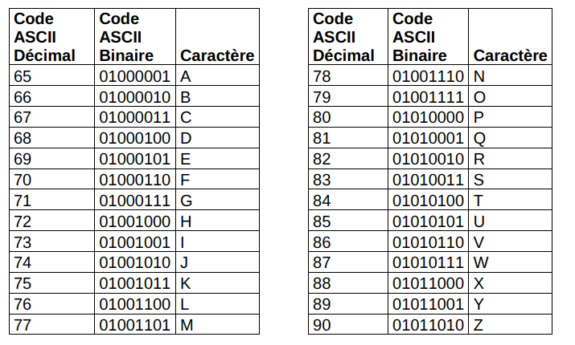{:.center width=350px}  

On souhaite mettre au point une méthode de cryptage à l’aide de la fonction XOR.  
Pour cela, on dispose d’un message à crypter et d’une clé de cryptage de même longueur que ce message. Le message et la clé sont composés uniquement des caractères du tableau ci-dessus et on applique la fonction XOR caractère par caractère entre les lettres du message à crypter et les lettres de la clé de cryptage.

**Question 3.**
Chiffrer **INFORMATIQUE** avec la clé **NSI**. Pour cela recopier et compléter le tableau ci-dessous : 

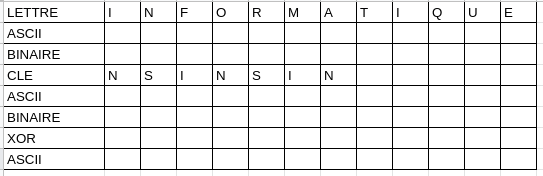

??? tip "Correction"  
    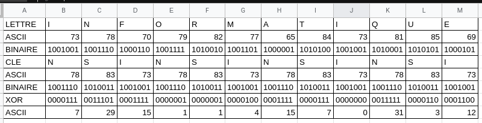
**Q.4.**  
Recopier et compléter la table de vérité de (𝑬𝟏 ⊕ 𝑬𝟐) ⊕ 𝑬𝟐.

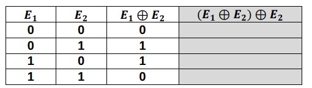{:.center width=300px}  

??? tip "Correction"  
    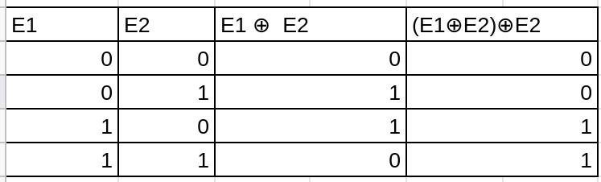{:.center width=300px}  

A l’aide de ce résultat, proposer une démarche pour décrypter un message crypté.

??? tip "Correction"  
    Pour décoder le message, on a juste à refaire la fonction XOR sur le message codé avec la clé.

**Q.5** Décoder le message suivant : 
`12 1 8 24 28 105 15 115 29 1 6 26`

??? tip "Correction"  
    Bravo à tous
