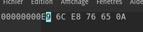
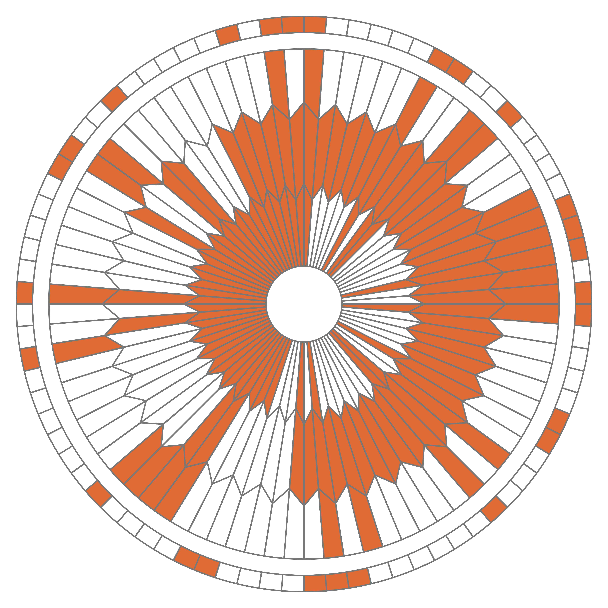

---
#title : Exercice Révision - Codage de caractères
subtitle: Représentation des données
author : M.Meyroneinc-Condy
numbersections: true
fontsize: 11pt
geometry:
- top=12mm
- left=12mm
- right=12mm
- heightrounded    
output:
  pdf_document:
    toc: yes
    toc_depth: 3
    number_sections: yes
    highlight: tango
  blogdown::html_page:
    toc: yes
    toc_depth: 3
    number_sections: yes
    highlight: tango
--- 


<table  style="table-layout: fixed; border:solid;color:black;width:100%;">
        <tr>
            <th colspan=2; style="background-color: #3B444B;color:white;text-align:center;border:none;font-size:12pt;width:100%;">
           Thème 1 : Types de bases
            </th>
        </tr>
</table>

<table  style="table-layout: fixed;border:solid;color:black;width:100%;">
        <tr >
            <th width="30%"; style="background-color: #3B444B;color:white;text-align:center;border:none;font-size:20pt;">
            16 bis
            </th>
            <th  width="70%"; style="text-align:center;background-color:#99BADD;border:none;font-size:20pt;"> Exercices : Codage des caractères</th>
        </tr>
</table>


{:.center width=350px}  
*Table ASCII*

!!! exo "Exercice 1 :"
    **Q.1.** Quel est le code binaire ASCII du « b » minuscule et du « B » majuscule ?  
    **Q.2.** 
    Décoder l'expression suivante, écrite en ASCII :  

    ```01010001 01110101 01100101 00100000 01101100 01100001 00100000 01100110 01101111 01110010 01100011 01100101 00100000 01110011 01101111 01101001 01110100 00100000 01100001 01110110 01100101 01100011 00100000 01101100 01100101 01110011 00100000 01001110 01010011 01001001 ```


{:.center width=300px}
*Latin-9*

!!! exo "Exercice 2 :"
    **Q.1.** Le mot représenté par les octets ci-dessous est-il codé en ASCII ou en Latin 9 ? Donner ce mot :   
    {width=200px}  
    **Q.2.** Représenter `deçà` en Latin-9


{:.center  width=800px}

!!! exo "Exercice 3 : "
    {width=300px}  
    Donnée le codage Unicode la lettre &#569; puis son codage en UTF-8


!!! exo "Exercice 4"
    Décoder le message suivant :  
    {:.center  width=600px}


!!! exo "Exercice 5"
    Le défi du cours : codage UTF-8, décoder le texte ci-dessous :  

    01000010 01101111 01101110 01101010 01101111 01110101 01110010 00100000 11100000 00100000 01110100 01101111 01110101 01110011 00100000 01100101 01110100 00100000 01100010 01101111 01101110 01101110 01100101 00100000 01110010 01100101 01110000 01110010 01101001 01110011 01100101

!!! exo "Exercice 4 :"
    Codage XOR : 

**Q.1.** Le nombre 65, donné ici en écriture décimale, s’écrit 01000001 en notation binaire. En détaillant la méthode utilisée, donner l’écriture binaire du nombre 97.

**Q.2.** La fonction logique **OU EXCLUSIF**, appelée **XOR** et représentée par le symbole ⊕, fournit une sortie égale à 1 si l’une ou l’autre des deux entrées vaut 1 mais pas les deux. 

On donne ci-dessous la table de vérité de la fonction XOR

|A|B|A XOR B|
|:---:|:---:|:---:|
|0|0|0|
|0|1|1|
|1|0|1|
|1|1|0|

Poser et calculer l’opération : 11011101 ⊕ 01101011

On donne, ci-dessous, un extrait de la table ASCII qui permet d’encoder les caractères de A à Z.  
On peut alors considérer l’opération XOR entre deux caractères en effectuant le XOR entre les codes ASCII des deux caractères.  
Par exemple : 'F' XOR 'S' sera le résultat de 01000110 ⊕ 01010011.

{:.center width=350px}  

On souhaite mettre au point une méthode de cryptage à l’aide de la fonction XOR.  
Pour cela, on dispose d’un message à crypter et d’une clé de cryptage de même longueur que ce message. Le message et la clé sont composés uniquement des caractères du tableau ci-dessus et on applique la fonction XOR caractère par caractère entre les lettres du message à crypter et les lettres de la clé de cryptage.

**Question 3.**
Chiffrer **INFORMATIQUE** avec la clé **NSI**. Pour cela recopier et compléter le tableau ci-dessous : 


**Q.4.**  
Recopier et compléter la table de vérité de (𝑬𝟏 ⊕ 𝑬𝟐) ⊕ 𝑬𝟐.

{:.center width=300px}  

A l’aide de ce résultat, proposer une démarche pour décrypter un message crypté.

**Q.5** Décoder le message suivant : 
`12 1 8 24 28 105 15 115 29 1 6 26`
