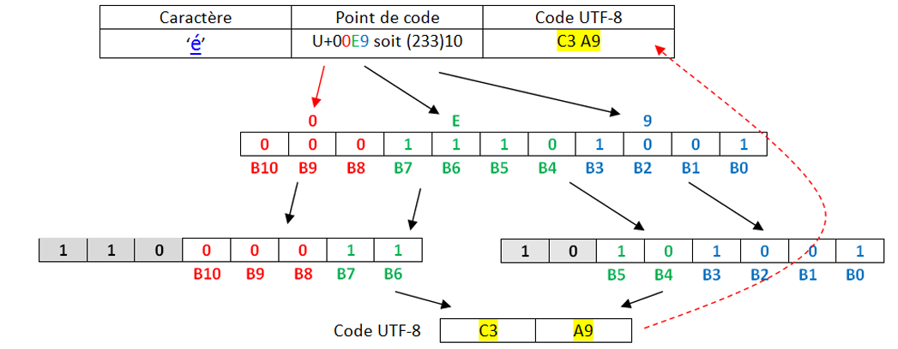

---
Marp:true:
theme: gaia
size: 4:3
marp: true
markdown.marp.enableHtml: true
title: TD - Codage des caractères
---

<style>
    :root {
    --color-background: #101010 !important;
	--color-foreground: #FFFFFF !important;
     font-size: 1.5rem;
    }
blockquote {
  background: #C3B091;
  border-left: 15px solid #CC0000;
  margin: 1.5em 10px;
  color: black;
  padding: 0.5em 10px;
}


</style>

# TD : Codage des caractères

Tout pour comprendre et éviter les erreurs d'encodage

# Au commencement était l'ASCII  

pour *American Standard Code for Information Interchange*, créé en 1960 aux États-Unis.


Dans les années 50, il existait un nombre important d’encodages de caractères dans un ordinateur, les imprimantes ou les lecteurs de carte. Tous ces encodages étaient incompatibles les uns avec les autres, ce qui rendait les échanges particulièrement difficiles car il fallait utiliser des programmes pour convertir les caractères d’un encodage à un autre.  
Pour tenter de mettre un peu d’ordre dans tout ça, en 1960, l’American Standards Association (ASA, aujourd’hui ANSI) décide de mettre un peu d’ordre dans ce bazar en créant la norme ASCII (American Standard Code for Information Interchange).  

---

À chaque caractère est associé un nombre binaire sur 8 bits (1 octet).


---

En faite, seuls 7 bits sont utilisés pour coder un caractère, le 8e bit n’est pas utilisé pour le codage des caractères. Avec 7 bits il est possible de coder jusqu’à 128 caractères ce qui est largement suffisant pour un texte écrit en langue anglaise (pas d’accents et autres lettres particulières).

- Les 32 premiers codes, de 0 à 31, ne sont pas des caractères imprimables mais des caractères "de contrôle". Par exemple le code 13 représente un retour à la ligne, et le code 7 fait produire un bip à certains ordinateurs, ce qui s'avérait utile sur les premiers IBM PC pour signaler une erreur, par exemple.  
- À partir du code 32, suivent des signes de ponctuation et quelques symboles mathématiques comme ! ou + ou /, puis les chiffres arabes de 0 à 9, ainsi que les 26 lettres de l'alphabet latin, en capitales puis en minuscules.

---

> Exercice
Décoder l'expression suivante, écrite en ASCII :  

```1101100 1100101 1110011 100000 1001110 1010011 1001001 100000 1100011 100111 1100101 1110011 1110100 100000 1101100 1100101 1110011 100000 1101101 1100101 1101001 1101100 1101100 1100101 1110101 1110010 1110011 ```

---

Vérification avec un script Python : 

**Aide :**  

- la fonction `split(" ")` permet de décomposer une chaine de caractères en une liste, en se servant de l'espace `" "` comme caractère séparateur.  
- `int("1101100",2)` permet de récupérer facilement la valeur en base 10 du nombre binaire `1101100`.   
- la fonction `chr` renvoie le caractère correspondant à un entier.   

```python
>>> chr(78)
N
```

- La fonction `ord` de Python renvoie le code ASCII correspondant à un caractère. L’entier renvoyé est en base 10 (que l’on peut convertir enhexadécimal avec la fonction hex).

```python
>>> ord('a')
97
>>> hex(ord('a))
'0x61'
```

---

```python
msg = "1101100 1100101 1110011 
100000 1001110 1010011 
1001001 100000 1100011 100111 
1100101 1110011 1110100 100000 
1101100 1100101 1110011 100000 
1101101 1100101 1101001 1101100 
1101100 1100101 1110101 1110010 1110011"
msg = msg.split(' ')
s = ""
for k in msg :
    s += chr(int(k,2))
print(s)
```

---

# Et le reste du monde ?
Lorsque d'autres personnes que des americains ou des anglais ont voulu s'échanger des données faisant intervenir du texte, certains caractères (é, è, à, ñ, Ø, Ö, β, 漢...) étaient manquants. Les 127 caractères de l'ASCII étaient largement insuffisants.   
Il a donc été décidé de passer à... 256 caractères ! Il suffisait pour cela de coder les caractères non plus sur 7 bits mais sur 8 bits.

Ainsi naquît, a norme **ISO-8859-1**, une extension de l’ASCII qui utilise les huit bits de chaque octet pour représenter les caractères.  
Cette norme va être principalement utilisée dans les pays européens puisqu’elle permet d’encoder les caractères utilisés dans les principales langues européennes (la norme ISO-8859-1 est aussi appelée "latin1" car elle permet d’encoder les caractères de l’alphabet dit "latin").  
Pour ajouter à la complexité, la norme ISO-8859 définit pas moins de 15 versions différentes, pour satisfaire à tous les besoins mondiaux.

---

Donc après de nombreuses modifications successives (la dernière en date rajoutant par exemple le symbole €), la célèbre table **ISO 8859-15**, dite aussi **Latin-9** :    


---

## Utilisation :
Les codes sont donnés en hexadécimal :  

- le caractère € correspond au code hexadécimal A4, donc au nombre décimal 164.  
- le caractère A correspond au code hexadécimal 41, donc au nombre décimal 65.  

65... comme en ASCII ! Oui, la (seule) bonne idée aura été d'inclure les caractères ASCII avec leur même code, ce qui rendait cette nouvelle norme rétro-compatible.

---

**Exemple :**  
A l"aide de notepad écrire un texte (Ça marche très bien !).  Enregistrer le avec l'encodage Latin-9.   
Ce fichier est ensuite ouvert avec un éditeur hexadécimal, qui permet d'observer la valeur des octets qui composent le fichier. (Comme le fichier est un .txt, le fichier ne contient que les données et rien d'autre.)  


Parfait, mais comment font les Grecs pour écrire leur alphabet ?   
Pas de problème, il leur suffit d'utiliser... une autre table, appelée ISO-8859-7 :  

---


On retrouve les caractères universels hérités de l'ASCII, puis des caractères spécifiques à la langue grecque... oui mais les Thaïlandais alors ?   

---

Pas de problème, ils ont la ISO-8859-11 :  


---

Évidemment, quand tous ces gens veulent discuter entre eux, les problèmes d'encodage surviennent immédiatement : certains caractères sont remplacés par d'autres.

---

### Que fait un logiciel à l'ouverture d'un fichier texte ?
 
Il essaie de deviner l'encodage utilisé... Parfois cela marche, parfois non.  


---
Normalement, pour un navigateur, une page web correctement codée doit contenir dans une balise `meta` le `charset` utilisé.   


Mais parfois, il n'y a pas d'autre choix pour le logiciel d'essayer de deviner l'encodage qui semble être utilisé.  

---
>  Exercice :
    
Le mot représenté par les octets ci-dessous est-il encodé en ASCII ou en Latin-9 ?


---

# Enfin une normalisation : l'arrivée de l'UTF
En 1996, le [Consortium Unicode](https://home.unicode.org/) décide de normaliser tout cela et de créer un système unique qui contiendra l'intégralité des caractères dont les êtres humains ont besoin pour communiquer entre eux.  


Ils créent l'Universal character set Transformation Format : l'UTF.  
Ou plutôt ils en créent... plusieurs :  

- l'UTF-8 : les caractères sont codés sur 1, 2, 3 ou 4 octets.  
- l'UTF-16 : les caractères sont codés sur 2 ou 4 octets.  
- l'UTF-32 : les caractères sont codés sur 4 octets.  

Pourquoi est-ce encore si compliqué ? En UTF-32, 32 bits sont disponibles, soit $2^{32}=4294967296$ caractères différents encodables. 

C'est largement suffisant, mais c'est surtout très très lourd !   

---

D'autres encodages plus légers, mais plus complexes, sont donc proposés :


Arrêtons-nous sur l'UTF-8 :  


---

Le principe fondateur de l'UTF-8 est qu'il est **adaptatif** : les caracères les plus fréquents sont codés sur un octet, qui est la taille minimale (et qui donne le 8 de "UTF-8"). Les autres caractères peuvent être codés sur 2, 3 ou 4 octets au maximum.

**UTF-8** n’utilise que l’espace dont il a besoin pour un caractère. Cela signifie donc que certains caractères n’utilisent qu’un seul octet, et d’autres deux, trois et même quatre.  
**UTF-8** utilise les mêmes codes qu’**ASCII** pour les 127 premiers caractères, et se sert d’octets additionnels pour représenter des caractères spéciaux comme ’é’.  

Par exemple, le caractère Z serait représenté de la même façon qu’en ASCII : `01011010`  

Toutefois, le caractère ç devra être représenté en deux octets, car il ne fait pas partie des 127 caractères originaux.  

---
L’encodage d’un caractère multi-octet se fait comme suit :

Les premiers bits identifient le nombre d’octets à utiliser. 

- 0xxxxxxx : signifie que le caractère fait 1 octet de long  
- 110xxxxx signifie que le caractère fait 3 octets de long,  
- 1110xxxx signifie 3 octets,  
- 11110xxx 4 octets,  

On note U+XXXX un caractère encodé en UTF8. Les bits restants sont utilisés pour représenter le numéro du caractère.

---
  
> Exemple :  
    A partir  de  l’extrait  de  la  table Unicode(version hexa),  rappelez  le   Point  de  Code du  caractère [Ⱥ](https://fr.wikipedia.org/wiki/%C8%BA) (valeur  numérique).     

---

Le  caractère  appartient  à  l’intervalle U+0080 à U+07FF,  donc les **11 bits** seront répartis sur deux octets en  code  UTF-8.  

- Convertir  le code  en  binaire sur  11  bits  
- 11 bits sur deux octects selon  la disposition  spécifiée  dans  la norme
    
  


--- 

  
> Exercice
    Faire de même avec la lettre é

---
  

---
> Exercice
    Quel est le code binaire de "défi" codé avec UTF-8 ?

---

> Exercice
    Quels mots se cachent sous les codes UTF-8 suivants ? 

    1. `01101000 01100101 01101100
     01101100 01101111`

    2. `01101001 01101110 
    01100110 01101111 
    01110010 01101101 
    01100001 01110100 
    01101001 01110001 
    01110101 01100101`  
    
    3. `01100010 01101001 
    01101110 01100001 
    01101001 01110010 01100101`

---

## Utilisation grandissante de l'encodage UTF-8 
La majorité des sites internet utilisent maintenant l'UTf-8, tout comme les systèmes d'exploitation récents.


