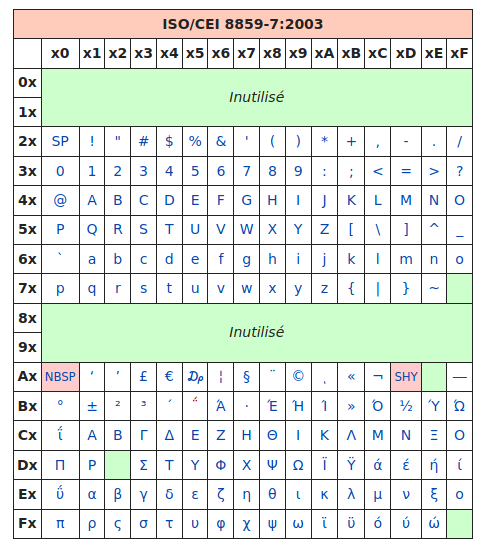
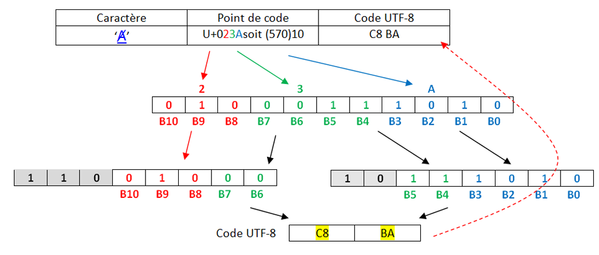
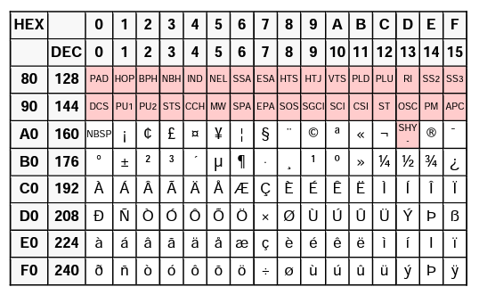
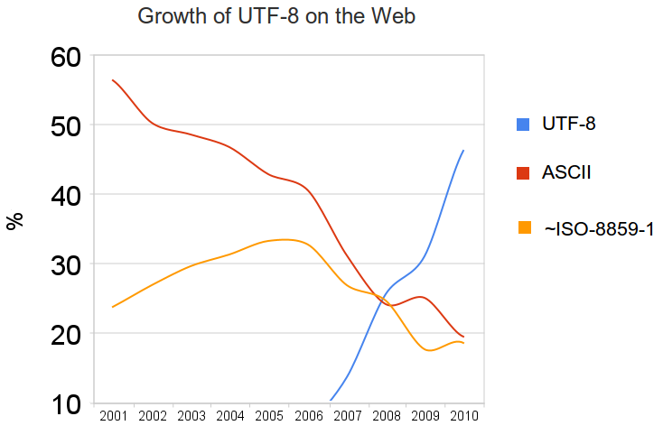

<table  style="table-layout: fixed;background-color:#87A96B; border:solid;color:black;width:100%;">
        <tr>
            <th colspan=2; style="background-color: #3B444B;color:white;text-align:center;border:none;font-size:12pt;">
           Thème 1 : Types de bases
            </th>
        </tr>
</table>

<table  style="table-layout: fixed;background-color:#87A96B; border:solid;color:black;width:100%;">
        <tr >
            <th width="20%"; style="background-color: #3B444B;color:white;text-align:center;border:none;font-size:50pt;">
            16
            </th>
            <th  width="80%"; style="text-align:center;background-color:#99BADD;border:none;font-size:25pt;">TD : Codage des caractères</th>
        </tr>
</table>
Tout pour comprendre et éviter les erreurs d'encodage

# Au commencement était l'ASCII  

pour *American Standard Code for Information Interchange*, créé en 1960 aux États-Unis.


Dans les années 50, il existait un nombre important d’encodages de caractères dans un ordinateur, les imprimantes ou les lecteurs de carte. Tous ces encodages étaient incompatibles les uns avec les autres, ce qui rendait les échanges particulièrement difficiles car il fallait utiliser des programmes pour convertir les caractères d’un encodage à un autre.  
Pour tenter de mettre un peu d’ordre dans tout ça, en 1960, l’American Standards Association (ASA, aujourd’hui ANSI) décide de mettre un peu d’ordre dans ce bazar en créant la norme ASCII (American Standard Code for Information Interchange).  
**À chaque caractère est associé un nombre binaire sur 8 bits (1 octet).**

{:.center}

En faite, **seuls 7 bits sont utilisés** pour coder un caractère, le 8e bit n’est pas utilisé pour le codage des caractères. Avec 7 bits il est possible de coder jusqu’à 128 caractères ce qui est largement suffisant pour un texte écrit en langue anglaise (pas d’accents et autres lettres particulières).

- Les 32 premiers codes, de 0 à 31, ne sont pas des caractères imprimables mais des caractères "de contrôle". Par exemple le code 13 représente un retour à la ligne, et le code 7 fait produire un bip à certains ordinateurs, ce qui s'avérait utile sur les premiers IBM PC pour signaler une erreur, par exemple.  
- À partir du code 32, suivent des signes de ponctuation et quelques symboles mathématiques comme ! ou + ou /, puis les chiffres arabes de 0 à 9, ainsi que les 26 lettres de l'alphabet latin, en capitales puis en minuscules.

!!! exo "Exercice"
    Décoder l'expression suivante, écrite en ASCII :  

    ```1101100 1100101 1110011 100000 1001110 1010011 1001001 100000 1100011 100111 1100101 1110011 1110100 100000 1101100 1100101 1110011 100000 1101101 1100101 1101001 1101100 1101100 1100101 1110101 1110010 1110011 ```

Vérification avec un script Python : 

**Aide :**  

- la fonction `split(" ")` permet de décomposer une chaine de caractères en une liste, en se servant de l'espace `" "` comme caractère séparateur.  
- `int("1101100",2)` permet de récupérer facilement la valeur en base 10 du nombre binaire `1101100`.   
- la fonction `chr` renvoie le caractère correspondant à un entier.   

```python
>>> chr(78)
N
```

- La fonction `ord` de Python renvoie le code ASCII correspondant à un caractère. L’entier renvoyé est en base 10 (que l’on peut convertir enhexadécimal avec la fonction hex).

```python
>>> ord('a')
97
>>> hex(ord('a))
'0x61'
```


```python
msg = "1101100 1100101 1110011 100000 1001110 1010011 1001001 100000 1100011 100111 1100101 1110011 1110100 100000 1101100 1100101 1110011 100000 1101101 1100101 1101001 1101100 1101100 1100101 1110101 1110010 1110011"
msg = msg.split(' ')
s = ""
for k in msg :
    s += chr(int(k,2))
print(s)
```  


# Et le reste du monde ?
Lorsque d'autres personnes que des americains ou des anglais ont voulu s'échanger des données faisant intervenir du texte, certains caractères (é, è, à, ñ, Ø, Ö, β, 漢...) étaient manquants. Les 127 caractères de l'ASCII étaient largement insuffisants.   
Il a donc été décidé de passer à... 256 caractères ! Il suffisait pour cela de coder les caractères non plus sur 7 bits mais sur 8 bits.

Ainsi naquît, a norme **ISO-8859-1**, une extension de l’ASCII qui utilise les huit bits de chaque octet pour représenter les caractères.  
Cette norme va être principalement utilisée dans les pays européens puisqu’elle permet d’encoder les caractères utilisés dans les principales langues européennes (la norme ISO-8859-1 est aussi appelée "latin1" car elle permet d’encoder les caractères de l’alphabet dit "latin").  
Pour ajouter à la complexité, la norme ISO-8859 définit pas moins de 15 versions différentes, pour satisfaire à tous les besoins mondiaux.

Donc après de nombreuses modifications successives (la dernière en date rajoutant par exemple le symbole €), la célèbre table **ISO 8859-15**, dite aussi **Latin-9** :    

{:.center}

## Utilisation :
Les codes sont donnés en hexadécimal :  

- le caractère € correspond au code hexadécimal A4, donc au nombre décimal 164.  
- le caractère A correspond au code hexadécimal 41, donc au nombre décimal 65.  

65... comme en ASCII ! Oui, la (seule) bonne idée aura été d'inclure les caractères ASCII avec leur même code, ce qui rendait cette nouvelle norme rétro-compatible.


**Exemple :**  
A l"aide de notepad écrire un texte (Ça marche très bien !).  Enregistrer le avec l'encodage Latin-9.   
Ce fichier est ensuite ouvert avec un éditeur hexadécimal, qui permet d'observer la valeur des octets qui composent le fichier. (Comme le fichier est un .txt, le fichier ne contient que les données et rien d'autre.)  

{:.center}

Parfait, mais comment font les Grecs pour écrire leur alphabet ?   
Pas de problème, il leur suffit d'utiliser... une autre table, appelée ISO-8859-7 :  

{:.center}

On retrouve les caractères universels hérités de l'ASCII, puis des caractères spécifiques à la langue grecque... oui mais les Thaïlandais alors ?   
Pas de problème, ils ont la ISO-8859-11 :  

{:.center}

Évidemment, quand tous ces gens veulent discuter entre eux, les problèmes d'encodage surviennent immédiatement : certains caractères sont remplacés par d'autres.


### Que fait un logiciel à l'ouverture d'un fichier texte ?
 
Il essaie de deviner l'encodage utilisé... Parfois cela marche, parfois non.  
{:.center width=75%}

Normalement, pour un navigateur, une page web correctement codée doit contenir dans une balise `meta` le `charset` utilisé.   
{:.center}

Mais parfois, il n'y a pas d'autre choix pour le logiciel d'essayer de deviner l'encodage qui semble être utilisé.  

!!! exo "Exercice :"
    Le mot représenté par les octets ci-dessous est-il encodé en ASCII ou en Latin-9 ?
    {:.center}


# Enfin une normalisation : l'arrivée de l'UTF
En 1996, le [Consortium Unicode](https://home.unicode.org/) décide de normaliser tout cela et de créer un système unique qui contiendra l'intégralité des caractères dont les êtres humains ont besoin pour communiquer entre eux.  

{:.center}


Ils créent l'**Universal character set Transformation Format : l'UTF**.  
Ou plutôt ils en créent... plusieurs :  

- **l'UTF-8** : les caractères sont codés sur 1, 2, 3 ou 4 octets.  
- l'UTF-16 : les caractères sont codés sur 2 ou 4 octets.  
- l'UTF-32 : les caractères sont codés sur 4 octets.  

Pourquoi est-ce encore si compliqué ? En UTF-32, 32 bits sont disponibles, soit $2^{32}=4294967296$ caractères différents encodables. 

C'est largement suffisant, mais c'est surtout très très lourd !   
D'autres encodages plus légers, mais plus complexes, sont donc proposés :


&#x27A1;  Arrêtons-nous sur l'UTF-8 :  

{:.center  width=800px}

Le principe fondateur de l'UTF-8 est qu'il est **adaptatif** : les caracères les plus fréquents sont codés sur un octet, qui est la taille minimale (et qui donne le 8 de "UTF-8"). Les autres caractères peuvent être codés sur 2, 3 ou 4 octets au maximum.

**UTF-8** n’utilise que l’espace dont il a besoin pour un caractère. Cela signifie donc que certains caractères n’utilisent qu’un seul octet, et d’autres deux, trois et même quatre.  
**UTF-8** utilise les mêmes codes qu’**ASCII** pour les 127 premiers caractères, et se sert d’octets additionnels pour représenter des caractères spéciaux comme ’é’.  

Par exemple, le caractère Z serait représenté de la même façon qu’en ASCII : `01011010`  

Toutefois, le caractère ç devra être représenté en deux octets, car il ne fait pas partie des 127 caractères originaux.    
L’encodage d’un caractère multi-octet se fait comme suit :

- les premiers bits identifient le nombre d’octets à utiliser. 
 - 0xxxxxxx : signifie que le caractère fait 1 octet de long  
 - 110xxxxx signifie que le caractère fait 3 octets de long,  
 - 1110xxxx signifie 3 octets,  
 - 11110xxx 4 octets,  

On note U+XXXX un caractère encodé en UTF8. Les bits restants sont utilisés pour représenter le numéro du caractère.

!!! example "Exemple :"
      
    A partir  de  l’extrait  de  la  table Unicode(version hexa),  rappelez  le   Point  de  Code du  caractère [Ⱥ](https://fr.wikipedia.org/wiki/%C8%BA) (valeur  numérique).     

    Le  caractère  appartient  à  l’intervalle U+0080 à U+07FF,  donc les **11 bits** seront répartis sur deux octets en  code  UTF-8.  
    - Convertir  le code  en  binaire sur  11  bits  
    - 11 bits sur deux octects selon  la disposition  spécifiée  dans  la norme
    
{:.center width=750px}  

!!! exo "Exercice"  
      
    Faire de même avec la lettre é


!!! exo "Exercice"
    Quel est le code binaire de "défi" codé avec UTF-8 ?


!!! exo "Exercice" 
    Quels mots se cachent sous les codes UTF-8 suivants ? 

    1. `01101000 01100101 01101100 01101100 01101111`
    2. `01101001 01101110 01100110 01101111 01110010 01101101 01100001 01110100 01101001 01110001 01110101 01100101`  
    3. `01100010 01101001 01101110 01100001 01101001 01110010 01100101`

!!! exo "Exercice"
    Le défi du cours : codage UTF-8, décoder le texte ci-dessous :  
    
    - soit en créant une fonction python
    - soit à la main.  

    0101 0110 01101111 01101001 01101100 11000011 10100000 00100000 0011 0001 11100010 10000010 10101100 00101100 00100000 01110101 0110 1110 00100000 11110000 10011111 10011000 10000100 00100000 0110 0101 01110100 00100000 01101101 11000011 10101010 01101101 0110 0101 00100000 11110000 10011101 10000100 10011110 00100001

## Utilisation grandissante de l'encodage UTF-8 

La majorité des sites internet utilisent maintenant l'UTf-8, tout comme les systèmes d'exploitation récents.
{:.center}

# Applications : Codage XOR

## Extrait sujet BAC : Codage XOR

L’objectif de l’exercice est d’étudier une méthode de cryptage d’une chaîne de
caractères à l’aide du codage ASCII et de la fonction logique XOR.

!!! fabquestion 'Question 1"
    1. Le nombre 65, donné ici en écriture décimale, s’écrit 01000001 en notation binaire. En détaillant la méthode utilisée, donner l’écriture binaire du nombre 89.

!!! fabquestion "Question 2"
    La fonction logique **OU EXCLUSIF**, appelée **XOR** et représentée par le symbole ⊕, fournit une sortie égale à 1 si l’une ou l’autre des deux entrées vaut 1 mais pas les deux. 

    On donne ci-dessous la table de vérité de la fonction XOR

    |A|B|A XOR B|
    |:---:|:---:|:---:|
    |0|0|0|
    |0|1|1|
    |1|0|1|
    |1|1|0|

    Poser et calculer l’opération : 11001110 ⊕ 01101011

On donne, ci-dessous, un extrait de la table ASCII qui permet d’encoder les caractères de A à Z.  
On peut alors considérer l’opération XOR entre deux caractères en effectuant le XOR entre les codes ASCII des deux caractères.  
Par exemple : 'F' XOR 'S' sera le résultat de 01000110 ⊕ 01010011.

{:.center}  

Le cryptage XOR est un système de cryptage basique mais pas trop limité. Ainsi, il a beaucoup été utilisé dans les débuts de l'informatique et continue à l'être encore aujourd'hui car il est facile à implémenter, dans toutes sortes de programmes.  

Chaque caractère du message à coder est représenté par un entier, le code ASCII. Ce nombre est lui-même représenté en mémoire comme un nombre binaire à 8 chiffres (les bits). On choisit une clé que l'on place en dessous du message à coder, en la répétant autant de fois que nécessaire.   Le message et la clé étant converti en binaire, on effectue un XOR, bit par bit. Le résultat en binaire peut être reconverti en caractères ASCII et donne alors le message codé.  

!!! fabquestion "Question 3."
    Chiffrer **MESSAGE** avec la clé **CLE**. Pour cela recopier et compléter le tableau ci-dessous : 

<table style="height: 450px;" width="300">
<tbody>
<tr>
<td style="width: 120.125px;">Lettre&nbsp;</td>
<td style="width: 24.9688px;">&nbsp;M</td>
<td style="width: 22.3906px;">E&nbsp;</td>
<td style="width: 22.3906px;">S&nbsp;</td>
<td style="width: 22.3906px;">S&nbsp;</td>
<td style="width: 21.5469px;">A&nbsp;</td>
<td style="width: 24.1094px;">G&nbsp;</td>
<td style="width: 22.3906px;">E&nbsp;</td>
</tr>
<tr>
<td style="width: 120.125px;">Code ASCII</td>
<td style="width: 24.9688px;">&nbsp;</td>
<td style="width: 22.3906px;">&nbsp;</td>
<td style="width: 22.3906px;">&nbsp;</td>
<td style="width: 22.3906px;">&nbsp;</td>
<td style="width: 21.5469px;">&nbsp;</td>
<td style="width: 24.1094px;">&nbsp;</td>
<td style="width: 22.3906px;">&nbsp;</td>
</tr>
<tr>
<td style="width: 120.125px;">Code binaire</td>
<td style="width: 24.9688px;">&nbsp;</td>
<td style="width: 22.3906px;">&nbsp;</td>
<td style="width: 22.3906px;">&nbsp;</td>
<td style="width: 22.3906px;">&nbsp;</td>
<td style="width: 21.5469px;">&nbsp;</td>
<td style="width: 24.1094px;">&nbsp;</td>
<td style="width: 22.3906px;">&nbsp;</td>
</tr>
<tr>
<td style="width: 120.125px;">Cl&eacute;</td>
<td style="width: 24.9688px;">&nbsp;C</td>
<td style="width: 22.3906px;">L&nbsp;</td>
<td style="width: 22.3906px;">E&nbsp;</td>
<td style="width: 22.3906px;">C&nbsp;</td>
<td style="width: 21.5469px;">L&nbsp;</td>
<td style="width: 24.1094px;">E&nbsp;</td>
<td style="width: 22.3906px;">C&nbsp;</td>
</tr>
<tr>
<td style="width: 120.125px;">Code ASCII&nbsp;</td>
<td style="width: 24.9688px;">&nbsp;</td>
<td style="width: 22.3906px;">&nbsp;</td>
<td style="width: 22.3906px;">&nbsp;</td>
<td style="width: 22.3906px;">&nbsp;</td>
<td style="width: 21.5469px;">&nbsp;</td>
<td style="width: 24.1094px;">&nbsp;</td>
<td style="width: 22.3906px;">&nbsp;</td>
</tr>
<tr>
<td style="width: 120.125px;">Cl&eacute; binaire&nbsp;</td>
<td style="width: 24.9688px;">&nbsp;</td>
<td style="width: 22.3906px;">&nbsp;</td>
<td style="width: 22.3906px;">&nbsp;</td>
<td style="width: 22.3906px;">&nbsp;</td>
<td style="width: 21.5469px;">&nbsp;</td>
<td style="width: 24.1094px;">&nbsp;</td>
<td style="width: 22.3906px;">&nbsp;</td>
</tr>
<tr>
<td style="width: 120.125px;">&nbsp;XOR</td>
<td style="width: 24.9688px;">&nbsp;</td>
<td style="width: 22.3906px;">&nbsp;</td>
<td style="width: 22.3906px;">&nbsp;</td>
<td style="width: 22.3906px;">&nbsp;</td>
<td style="width: 21.5469px;">&nbsp;</td>
<td style="width: 24.1094px;">&nbsp;</td>
<td style="width: 22.3906px;">&nbsp;</td>
</tr>
<tr>
<td style="width: 120.125px;">Code ASCII</td>
<td style="width: 24.9688px;">&nbsp;</td>
<td style="width: 22.3906px;">&nbsp;</td>
<td style="width: 22.3906px;">&nbsp;</td>
<td style="width: 22.3906px;">&nbsp;</td>
<td style="width: 21.5469px;">&nbsp;</td>
<td style="width: 24.1094px;">&nbsp;</td>
<td style="width: 22.3906px;">&nbsp;</td>
</tr>
<tr>
<td style="width: 130.125px;">LETTRE Cod&eacute;e</td>
<td style="width: 24.9688px;">&nbsp;</td>
<td style="width: 22.3906px;">&nbsp;</td>
<td style="width: 22.3906px;">&nbsp;</td>
<td style="width: 22.3906px;">&nbsp;</td>
<td style="width: 21.5469px;">&nbsp;</td>
<td style="width: 24.1094px;">&nbsp;</td>
<td style="width: 22.3906px;">&nbsp;</td>
<td style="width: 16.6875px;">&nbsp;</td>
</table>

    A vous avec message = "SPECIALITE NSI"  et clef = "TERM"


!!! fabquestion "Question 4."
    Recopier et compléter la table de vérité de (𝑬𝟏 ⊕ 𝑬𝟐) ⊕ 𝑬𝟐.

    {:.center}  

    A l’aide de ce résultat, proposer une démarche pour décrypter un message crypté.


## Approfondissement : Programmation du chiffremment XOR

Aide :  

- On pourra utiliser la fonction native du langage Python ord(c) qui prend en paramètre un caractère c et qui renvoie un nombre représentant le code ASCII du caractère c  
- `format(14, '08b')` donne l'ecriture binaire de 14 sous la forme '00001110'


!!! fabquestion "Question préliminaire"
    1. Ecrire une fonction `xor(v1,v2)` où v1 et v2 sont soit 0 soit 1.
    2. Ecrire une fonction `xorbinaire(n1,n2)` où n1 et n2 sont nombres binaires, cette fonction doit renoyer le résultat sous forme binaire.

!!! fabquestion "Question 5."
    Ecrire le corps de la fonction `convertit_texte_en_binaire(texte)` qui convertit la chaine de caractères ASCII texte passée en paramètre en une chaine binaire et retourne cette chaine binaire. Chaque caractère sera représenté par son code ASCII en binaire sur un octet.

    Exemple : `convertit_texte_en_binaire("NSI")` doit retourner la chaine :  `010011100101001101001001`

    En effet :

    Le code ASCII de "N" est 78 en décimal = 01001110 en binaire sur un octet
    Le code ASCII de "S" est 83 en décimal = 01010011 en binaire sur un octet
    Le code ASCII de "I" est 73 en décimal = 01001001 en binaire sur un octet
    Et, '01001110' + '01010011' + '01001001' = '010011100101001101001001'

!!! fabquestion "Question 6."
    Ecrire le corps de la fonction `convertit_binaire_vers_entier_base_10(chaine_binaire)` qui convertit la chaine binaire chaine_binaire passée en paramètre en le nombre décimal correspondant et retourne ce nombre décimal.

    Exemple : `convertit_binaire_vers_entier_base_10("01001110")` doit retourner l'entier 78

    En effet : 01001110 en base 2 = 0x1 + 1x2 + 1x4 + 1x8 + 0x16 + 0x32 + 1x64 + 0x128 = 2 + 4 + 8 + 64 = 78

!!! fabquestion "Question 7."
    Compléter la fonction `convertit_binaire_en_texte(chaine_binaire)` qui convertit la chaine chaine_binaire passée en paramètre composée d'octets binaires représentant des caractères codés en ASCII en une chaine de caractères et retourne cette chaine de caractères.

    ```python
    def convertit_binaire_en_texte(chaine_binaire):
    decoupe=[]
    texte=''
    compteur=1
    lettre=''
    for v in chaine_binaire:
        if compteur==...:
            lettre+=...
            decoupe.append(...)
            lettre=...
            compteur=...
        else:
            lettre+=...
            compteur+=...
    for tab in decoupe:
        texte=chr(convertit_binaire_vers_entier_base_10(tab))+texte
    return texte
    ```

    Exemple : `convertit_binaire_en_texte("010011100101001101001001")` doit retourner la chaine : 'NSI'.

    En effet :

    '010011100101001101001001' = '01001110' + '01010011' + '01001001'

    L'octet binaire 01001110 correspond au nombre décimal 78 qui représente en ASCII le caractère "N"  
    L'octet binaire 01010011 correspond au nombre décimal 83 qui représente en ASCII le caractère "S"  
    L'octet binaire 01001001 correspond au nombre décimal 73 qui représente en ASCII le caractère "I"  
    La chaîne retournée est donc bien "NSI".  

!!! fabquestion "Question 8."
    Ecrire une fonction `def reperter_cle(chaine,clef)` permettant de compléter la clé afin d'avoir la même longuer que le message.  
    Exemple : `reperter_cle('message','cle')` doit retourner 'cleclec'

!!! fabquestion "Question 9."
    Ecrire le corps de la fonction `chiffre_xor(chaine,clef)` qui chiffre la chaine `chaine` passée en paramètre avec la clef `clef` passée en paramètre en effectuant l'opération XOR bit à bit entre la chaine binaire et la clef binaire (répétée). La fonction doit retourner la chaine ainsi chiffrée.

    Exemple : Chiffrons la chaine "SPECIALITE NSI" avec la clef "TERM".

    - `convertit_texte_en_binaire("SPECIALITE NSI")`     retourne  `010100110101000001000101010000110100100101000001  
    0100110001001001010101000100010100100000010011100  
    101001101001001`.  
    
    - `convertit_texte_en_binaire("TERM")`  
    retourne `01010100010001010101001001001101`.  
            
    - `chiffre_xor("SPECIALITE NSI" ,'TERM` ) doit retourner  
    `0000011100010101000101110000111000011101000001000001111
    000000100000000000000000001110010000000110000011100001100`.

!!! fabquestion "Question 10."
    Ecrire le corps de la fonction `texte_xor(chaine,clef)` qui doit retourner la chaine ainsi chiffrée sous forme de texte.

