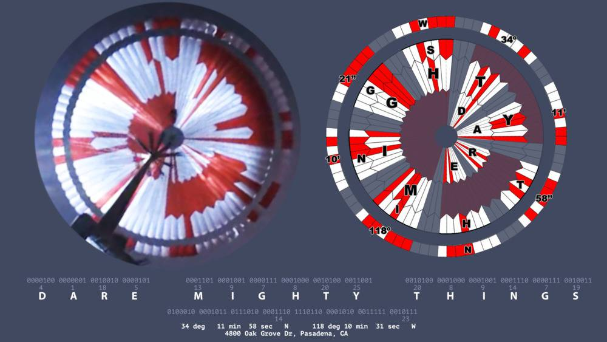

# Cachez ce que je ne saurais voir !

**Un message caché sur le rover Perseverance.**

Ce que le rover cache, ne se trouve pas en dessous mais plutôt au dessus, rires !


Source : ESA


# Plan

* [1. easter egg by NASA](#1.-easter-egg-by-NASA)
   
* [2. Un écho de 1899](#2.-Un-écho-de-1899)


## 1. easter egg by NASA

Vous avez déjà probablement regardé la vidéo vertigineuse de [l’atterrissage](https://youtu.be/4czjS9h4Fpg) du rover Perseverance sur la planète rouge.

Mais avez-vous remarqué le parachute ?

**Sa conception esthétique n’a rien d’anodin :**

un message est encodé dans le motif, il était sous vos yeux durant toute la vidéo.


## Mais comment ce message est-il encodé ?

Si vous observez bien la conception du parachute, vous verrez qu’il est constitué de colonnes verticales, entièrement blanches, entièrement rouges, ou blanches et rouges.


Source : NASA


### Question 1 :

+ Par groupe, essayez de décomposer les zones décrites.
+ Que peuvent représenter les couleurs blanches, rouges ?
+ Les colonnes verticales peuvent être découpées en cercle de diamètres différents. Trouvez en combien de cercles le parachute est constitué.


### Réponse 1 :

C’est un code binaire : le rouge représente 1, le blanc représente 0. Vous remarquerez aussi qu’horizontalement, le parachute est découpé en trois cercles en partant du centre, auxquels s’ajoute un cercle plus extérieur.


Source : NASA

Il faut lire le motif du parachute à partir de ces cercles : le cercle 1 contient un certain nombre de colonnes rouges et de colonnes blanches (et de donc de 1 et de 0), il en va de même pour les autres cercles.


### Question 2 :

+ Avec vos constations, quel est la base de l'encodage ?
+ Sur combien de bits le message est-il encodé ?


### Réponse 2 :

Il s’agit alors d’un encodage 10-bits. Chaque cercle est un mot, car au sein de chaque cercle, des groupes de 10 colonnes désignent la position d’une lettre en code binaire. C’est ainsi que le cercle 1, situé au centre du parachute.


### Question 3 :

+ A partir du shéma ci dessous, Positionnez les valeurs binaires dans chaques des cases du parachute.


Source : Twitter, Adam Steltzner.


### Réponse 3 :

Chaque cercle = 1 mot. Chaque groupe de 10 colonnes dans chaque cercle = position d’une lettre en code binaire (exposant 2, en partant de la droite : le premier chiffre en partant de la droite).


### Question 4 :

A partir d'un programma Python, décodez les valeurs binaires trouvés en valeurs décimales.

Attention : Le bit de poids faible est à droite.


```python
# Votre programme ici
```


```python
# Proposition d'une solution
def convBtoD(binaire:str)->int:
    """ Converti une valeur binaire en décimal"""
    valD = 0
    for i in range(len(binaire)):
        puis = len(binaire)-i-1
        valB = int(binaire[i])*2**puis
        valD = valD + valB
    print(f'({binaire})bin = ({valD})dec')

binaire = "1010101010"
convBtoD(binaire)
```

    (1010101010)bin = (682)dec


### Question 5 :

Pour que le message puisse être entièrement décodé, les valeurs trouvées en décimal vont être maintenant converties en texte par la convertion suivante: 
+ 00 0000 0001 : 'A'
+ 00 0001 1010 : 'Z'

Modifiez votre programme pour convertir la valeur binaire en une lettre de l'alphabet.


```python
# Votre programme ici
```


```python
# Proposition d'une solution
def convBtoD(binaire:str)->int:
    """ Converti une valeur binaire en décimal"""
    valD = 0
    
    for i in range(len(binaire)):
        puis = len(binaire)-i-1
        valB = int(binaire[i])*2**puis
        valD = valD + valB
    valD = valD + 64
    lettre = chr(valD)
        
    print(f"({binaire})bin = ({valD})dec = '{lettre}'")

binaire = "0000000001"
convBtoD(binaire)
```

    (0000000001)bin = (65)dec = 'A'


```python
# Une autre solution plus Pythonesque...

convBtoD2 = lambda x: chr(int(x, 2)+64)

binaire = "0000000001"
convBtoD2(binaire)
```


    'A'


### Question 6 :

Avez vous décodez le message après déchiffrage des cercles 1 à 3 ?

Si oui quel est sa signification ?

### Réponse 6 :

Source : Twitter, [Emily Calandrelli](https://twitter.com/i/status/1364089524922372096)

---
Chaque cercle représente un mot, sauf le 4e cercle qui contient des coordonnées.

En binaire, le rouge = 1 ; le blanc = 0.

Le slogan « Dare Mighty Things » est encodé dans le motif du parachute qui a aidé Perseverance à descendre sur Mars.


**« Dare Mighty Things »**

La Nasa a d’abord annoncé elle-même publiquement, lors du briefing durant lequel la vidéo a été diffusée, qu’il y avait un « message secret » dans le parachute. Il n’aura fallu qu’une dizaine d’heures pour que, sur Twitter, un étudiant en informatique signale avoir identifié trois mots cachés dans le motif du parachute : «  Dare Mighty Things », traduisible par «  oser des choses grandioses ».

Cette phrase est tout simplement le slogan adopté par le Jet Propulsion Laboratory de la Nasa. Plus qu’un slogan, cette phrase est même perçue comme un véritable mantra au sein des équipes de ce laboratoire, qui a piloté la construction du rover Perseverance.


## Vérifiez votre déchiffrage.

Un internaute a rebondi sur l’idée pour mettre en ligne « Msg2Mars » via GitHub, le 23 février : cette page permet à chacune et chacun de concevoir son propre parachute, en y encodant un message.

Il suffit de renseigner les champs à droite du parachute qui s’affiche, et vous verrez le motif évoluer. Une fois le message entré, il est possible de télécharger un visuel du parachute, au format PNG.

https://sjwarner.github.io/perseverance-parachute-generator/


### Question 7 :

Vous avez aussi décodé le 4e cercle (le cercle en périphérie).
Que représente le message sur ce 4e cercle ?


### Réponse 7 :

La bordure extérieure de la toile, elle, présente une autre équation. Selon le Guardian, le langage binaire y recouvre le relevé suivant: 34°11' 58" N 118° 10'31" W, soit la géolocalisation du laboratoire Jet Propulsion de la NASA, maison-mère de Perseverance.

Le 4e cercle qui contient des coordonnées : **34°11' 58" N 118° 10'31" W**




## 2. Un écho de 1899

Avant de savoir comment il est parvenu à trouver le résultat de l'énigme, on remarque que cette phrase a de profondes résonances dans l'histoire aérospatiale américaine, comme l'a détaillé le quotidien britannique The Guardian. Cette phrase, qu'on peut traduire par "Osez le sublime" ("mighty" signifie littéralement "puissant"), est le slogan du laboratoire Jet Propulsion de la NASA, qui a réalisé le gros du travail autour du rover Perseverance.

Elle prend racine dans la mémoire politique états-unienne. Lors d'un discours prononcé en avril 1899 devant le Hamilton Club de Chicago, le président américain, et Prix Nobel de la paix, Theodore Roosevelt avait ainsi lancé:

***"Mieux vaut, et de loin, oser le sublime, remporter de glorieux triomphes, même si nous sommes bousculés par l'échec, que de rentrer dans le rang de ces tristes sires qui n'exultent jamais ni ne souffrent beaucoup car ils vivent dans un crépuscule gris qui ne connaît ni la victoire ni la défaite".***

Le site du quotidien britannique note que le robot dépêché sur Mars est porteur de deux autres signes discrets. D'abord, il comporte des puces contenant 10,9 millions de textes ou propositions de noms envoyées à l'agence au moment où celle-ci cherchait à en choisir un pour son nouveau rover. Se trouve également sur le rover américain une assiette en aluminium où se dessine le caducée du dieu gréco-romain de la médecine Esculape (le même symbole que celui indiquant nos pharmacies) soutenant la Terre. Un hommage à l'action des soignants face aux ravages du Covid-19.

Le centre de recherche n’a pas seulement personnalisé le parachute qui a permis à Perseverance de ralentir sa course vers Mars. Sur le rover lui-même, le JPL a apposé une plaque avec un code Morse signifiant « Explore as One » (« Explorer comme un »), une phrase que la Nasa avait déjà employée auparavant. L’astromobile arbore également un portrait de famille avec plusieurs robots martiens, ainsi qu’un cadran solaire truffé de symboles sur l’histoire du système solaire et de la Terre.

À l’heure qu’il est, le véritable parachute de Perseverance gît à la surface de Mars, là où il est allé finir sa course une fois sa tâche accomplie pendant l’atterrissage. Il sera peu à peu recouvert par la poussière martienne, effaçant ainsi sa trace sur les images des orbiteurs.

# Fin ... 

A bientôt.

Auteurs :
    laura.fleron@ac-reims.fr

Fait le 23/02/2021

Version 2

Source :  Marcus Dupont-Besnard 23 février 2021 - Numérama.


```python

```
