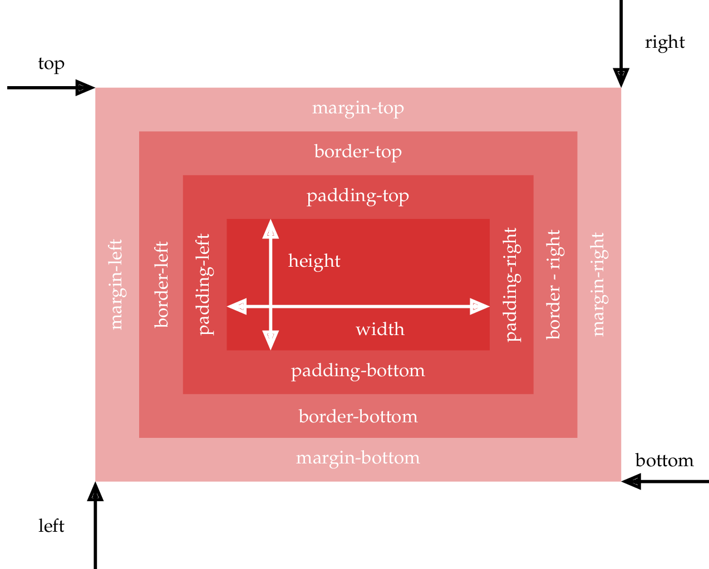
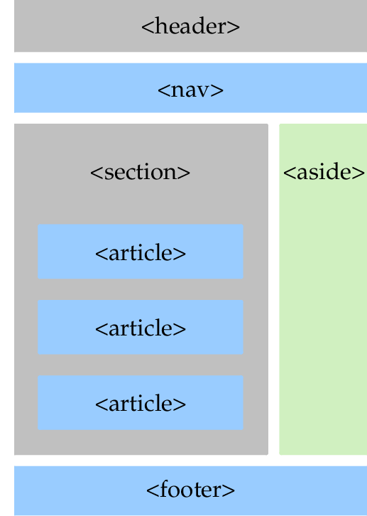

<table  style="background-color:  #66CC33; width:100%;">
    <thead>
        <tr>
            <th style="text-align:center;border:solid;border-width:1px;font-size:20pt;width:70%;">TD n°11 : HTML et CSS</th>
            <th style="text-align:center;border:solid;border-width:1px;font-size:12pt;width:30%">Thème  : INTERACTIONS ENTRE HOMME ET LA MACHINE</th>
        </tr>
                    <tr>
            <th style="text-align:center;border:solid;border-width:1px;font-size:20pt;width:70%;"></th>
            <th style="text-align:center;border:solid;border-width:1px;font-size:12pt;width:30%">COURS</th>
        </tr>
    </thead>
</table>

Les langages informatique HTML et CSS sont les langages des pages Web. Ce sont deux langages complémentaires compris par les navigateurs. Ce ne sont pas des langages de programmation mais des langages de description.

Je vous mets à disposition des vidéos de cours disponible en ligne, ainsi qu'un résumé du cours fait en classe (Les bases de SNT de seconde)

# Une vidéo résumant l'essentiel du html et du css (18min29)

??? video "Vidéo"
    <iframe width="640" height="360" src="https://www.youtube.com/embed/Q-WXtlz_ZHE" title="YouTube video player" frameborder="0" allow="accelerometer; autoplay; clipboard-write; encrypted-media; gyroscope; picture-in-picture" allowfullscreen></iframe>

    **NSI4NOOBS**

# Cours : Apprenez à créer votre site web avec HTML5 et CSS3


[Openclassroom : Apprenez à créer votre site web avec HTML5 et CSS3](https://openclassrooms.com/fr/courses/1603881-apprenez-a-creer-votre-site-web-avec-html5-et-css3){:target="_blank"}

# Cours complet en vidéos du HTML et CSS en 3 parties de Pierre Giraud et son format web :

[Cours html - css de Pierre Giraud](https://www.pierre-giraud.com/html-css-apprendre-coder-cours/){:target="_blank"}

## Partie 1 : (1h23)
??? video "Vidéo Partie 1"
    <iframe width="640" height="360" src="https://www.youtube.com/embed/8FqZZrbnwkM" title="YouTube video player" frameborder="0" allow="accelerometer; autoplay; clipboard-write; encrypted-media; gyroscope; picture-in-picture" allowfullscreen></iframe>

## Partie 2 : (1h15)

??? video "Vidéo partie 2"
    <iframe width="640" height="360" src="https://www.youtube.com/embed/HN4-7k0zC-Y" title="YouTube video player" frameborder="0" allow="accelerometer; autoplay; clipboard-write; encrypted-media; gyroscope; picture-in-picture" allowfullscreen></iframe>

## Partie 3 : (1h42)

??? video "Vidéo partie 3"
    <iframe width="640" height="360" src="https://www.youtube.com/embed/RUFK0mT0q2E" title="YouTube video player" frameborder="0" allow="accelerometer; autoplay; clipboard-write; encrypted-media; gyroscope; picture-in-picture" allowfullscreen></iframe>


# Un site avec toutes les possibilités pour le HTML et le CSS


[Tutoriel HTML](https://www.w3schools.com/html/default.asp){:target="_blank"}

[Tutoriel CSS](https://www.w3schools.com/css/default.asp){:target="_blank"}

# I. Qu'est ce que le HTML ?

Quand on consulte un site web, notre ordinateur se connecte à un serveur distant et celui-ci lui envoie une page web, que le navigateur va pouvoir afficher. En général la page est constituée de plusieurs fichiers :

- un fichier HTML (il existe d’autres formats qui seront étudiés plus tard : php, jsp, asp, ...)
- un fichier CSS
- un fichier JS
- des images, du sons, ...

Le format HTML (de l’anglais HyperText Markup Language, ou « langage de balisage hypertexte ») est un format textuel qui permet de décrire le contenu et la structure d’une page Web.  
Plusieurs versions du langage HTML se sont succédées depuis la première en 1992, celle utilisée actuellement est HTML5.


!!! history "Un peu d’histoire :"
    **TimBerners-Lee** est considéré comme l’inventeur du HTML en1992. C’est un informaticien britannique, qui a aussi inventé le Web (World Wide Web ou WWW) en 1989 lors de ses travaux au CERN. En juillet 2004, il est fait chevalier par la reine Élisa- beth II pour ce travail et son nom officiel devient Sir Timothy John Berners-Lee. Depuis 1994, il préside le World Wide Web Consortium (W3C), organisme qu’il a fondé et qui est en charge de promouvoir la compatibilité des technologies du Web. Il est également lauréat du prix Turing 2016.


 

**Le Langage HTML et CSS**

La description du contenu et de la structure d’une page Cette description se fait en utilisant ce qu’on appelle des balises.  
Ce sont ces balises qui vont indiquer si telle partie du document est un titre, oubien un paragraphe, ou bien une image, ...


!!! abstract "Les balises"
    Une balise est un mot-clef permettant d’indiquer au navigateur ce qu’il doit faire avec le contenu. Les balises contrôlent tout. Elles permettent de gérer la structure, les images, les liens, la police d’affichage utilisée, les titres, ...


On écrit <balise> pour ouvrir une balise (appelée **balise ouvrante**) et </balise> pour la fermer appelée **balisefermante**). De manière générale, toute balise ouverte doit être fermée.


Voici la structure minimale (squelette) de toute page HTML : 
```html
<!DOCTYPE html> <!-- langage utilisé, html pour html5 --> 

<html lang="fr"> <!-- début de la page web --> 

<head> <!-- En tête de la page, la balise n ' est pas affiché, mais elle permet ,! de donner des informations telles que le titre de la page ou la police de ,! caractères utilisée --> 

<title> Le html en 1ère NSI</title> 

<meta charset="utf-8"/> 

</head> 

<body> <!-- Corps de la page, c'est ici que l'on écrit tout ce qui doit être affiché --> 

<h1> COURS de NSI 

</h1> <!-- balise de titre de niveau 1, il y 6 niveaux possibles--> 

<p> 

Bienvenue en cours de NSI. 

</p> </body> 

</html> 
```

On retrouve toujours : 

- une première ligne <code><!DOCTYPE html> </code> qui indique que le fichier texte qui suit et écrit dans le langage HTML 
- La balise `<html> </html>`  , qui est la balise principale du code , elle englobe tout le contenu écrit en HTML du fichier. Dans cette balise, on distingue deux partie différentes : 
    - La balise `<head></head>` qui est la balise d’en-tête du document et qui donne les informations générales sur la page Web : on peut y idiquer son titre, l’encodage des caractères, les mots-clés, son auteur, etc. 
    - La balise `<body></body>` qui est la balise du corps de la page : elle encadre tout le contenu que le navigateur doit affihcer à l’écran. 

Ces balises sont obligatoires dans tout document HTML. 

On peut remarquer que certaines balises particulières ne se ferment pas (comme la balise `<meta/>` ). Dans ce cas il y a un “/” avant le “>”.

!!! abstract "&#x1F58B;   Définition :"
    Le nom d’une balise s’appelle un <strong>élément</strong> (exemple ici body, p ou meta). 
    Certains éléments peuvent avoir des attributs pour définir des paramètres. Dans ce cas les attributs sont toujours donnés entre guillemets " " ou apostrophes ‘ ’.   

    De plus des balises peuvent être imbriquées les une dans les autres mais pas se chevaucher ! 


** &#x27A1; Remarque** 

Les commentaires sont délimités par les caractères <!-- et --> , ils ne sont pas interprétés par le navigateur et servent à l’auteur pour écrire des notes (destinées à lui-même ou à d’autres personnes). 


!!! bug "**Exemple :**"
    ```html
    <p>

    Bienvenue en <em> cours </em> de NSI.<br/>

    Ici les balises sont correctement imbriquées </p>
    ```

    ```html
    <p>

    Bienvenue en <em> cours de NSI.<br/>


    Problème, la balise em est fermé après la balise p !! </p></em>
    ```

# III. Block / Inline

Voici les éléments les plus courants mais il en existe d’autres. Ils peuvent être regroupées en deux catégories :  

- les éléments de bloc (**block** en anglais) qui s’affichent comme un bloc ( saut de ligne avant et après automatiquement),
- les éléments en ligne (**inline** en anglais) qui s’affichent dans la ligne courante. Un élément inline doit obligatoirement être à l’intérieur d’un bloc.


**&#x25B6; Balises de type block** :

```html

<body>

<p>

Un paragraphe

</p>

<h1>

Un titre de premier niveau

</h1>

<h2> Un titre de niveau 2

</h2>

<ul> <!-- une liste à puce (Unordered List) -->

<li> Premier élément de la liste à puce </li>

<li> Deuxième élément de la liste à puce </li> </ul>

<ol> <!-- une liste numérotée (Ordered List) --> <li> Premier élément de la liste numérotée </li>

<li> Deuxième élément de la liste numérotée </li> </ol>

<div>

Un bloc quelconque, utile pour la mise en forme

</div> </body> </html>
```

 **&#x25B6; Balises type inline** :


|Balise|Fonction|Attributs utiles|
| - | - | - |
|`<br/>`|Retour à la ligne||
|``|Permet d’insérer une image|<p>- src = ’emplacement de l’image’</p><p>- alt = ’texte à afficher si problème’</p>|
|`<a>`|Ancre, permet de créer un lien|<p>- name = ’nom de l’ancre’</p><p>&emsp;- href = ’lien’</p>|

!!! example "**Exemple :**"
    ```html
    <body>

    <h1>

    Un exemple avec des éléments inline

    </h1>

    <p>

    Voici un paragraphe. Pas d'élément br donc pas de retour à la ligne.<br/>

    Après la balise une nouvelle ligne commence.<br/>

    Une ligne avec une image : <br/>


    Et maintenant un lien vers un autre site : <a href= ' url souhaitée ' > Le site du prof ! </a>
    </p>

    </body>

    </html>
    ```

# IV. Et le CSS alors ?

!!! abstract "&#x1F58B;   Langage CSS"
    Le format CSS (de l’anglais Cascading Style Sheets,ou «feuilles de styles en cascade») est un format textuel qui permet de décrire la mise en forme des documents HTML (et XML). La première version du langage CSS date de 1996. Celui-ci est pris en charge par tous les navigateurs depuis les années 2000. La version utilisée actuellement est CSS3.


!!! abstract "&#x1F58B;  Un langage de style"
     Le langage CSS permet de définir les propriétés graphiques des éléments HTML constituant une page Web : les polices utilisées, leurs tailles, les couleurs utilisées, la position des éléments dans la page, etc. Ce langage permet de séparer le contenu (décrit en HTML) de la forme (décrit en CSS) d’une page Web. En pratique, le fichier CSS sera associé au fichier HTML et le navigateur pourra alors savoir comment il doit mettre en forme le contenu de la page Web.


Le fichier ‘.css’ (cascading style sheet) qui accompagne souvent une page html sert à définir tout ce qui concernelaformedudocument(là où la partie HTML s’occupe plutôt du contenu). Il gère donc la taille de la police, la couleur, le positionnement des blocs, des images, ...


!!! example "Exemple d'utilisation"
    Exemple de page internet [sans CSS](https://jsfiddle.net/meyroneinc/skp8c3u5/2/){:target="_blank"} et [avec CSS.](https://jsfiddle.net/meyroneinc/dkswnha8/1/){:target="_blank"}

Un fichier contenant du code CSS permet de donner des informations sur la forme que doit avoir une page internet (couleur de la police, position et taille des images, fond de page, menus, ...). Ce fichier peutavoirlenomquel’onsouhaite(onutiliseranéanmoinspréféremmentl’extension.css). Dansnotre exemple ce fichier s’appellera “style.css”.

!!! warning  "**&#x1F58B; Ce qu’il faut retenir**"
    **Modifications à apporter dans le fichier HTML :**  
    - il faut donner le nom (et le chemin si nécessaire) du(des) fichier(s) CSS à utiliser. Cela se fait à l’aide de la balise suivante dans l’en-tête :  <link href="style.css" rel="stylesheet" type="text/css">`  

    - on peut maintenant utiliser 2 nouveaux attributs dans les balises HTML,  

    - `id="nomUnique"` : permet de donner un nom unique à un élément pour lui appliquer un style particulier,  

    - `class="nom"` : permet de donner le même nom à un ensemble d’éléments auxquels on veut appliquer le même style.
    

Dans le fichier CSS on peut maintenant créer un ensemble de règles à appliquer. Une règle est composée d’un sélecteur (l’objet auquel la règle doit s’appliquer) et de déclarations de propriétés. Les déclarations se trouvent entre accolades et les propriétés sont séparées par des points-virgules.


Il y a beaucoup de sélecteurs différents, les plus courants sont :  

* le nom d’un type d’éléments (ex: html, p, body, h1, img, ... ): la règle s’applique à tous les éléments de la page de ce type,
* le nom d’un id précédé d’un # : la règle s’applique au seul élément ayant cet id, 
* le nom d’une classe précédé d’un point : la règle s’applique à tous les éléments ayant cette classe, qu’importe le type.

On peut mélanger plusieurs sélecteurs pour une même règle.

Il existe une très grande variété de propriétés, la liste dépendant du sélecteur choisi ! 

!!! example "**Exemple :**"

    **fichier HTML**  
    ```html
    <!DOCTYPE html> <!-- langage utilisé, html pour html5 -->

    <html lang="fr"> <!-- début de la page web -->

    <head> <!-- En tête de la page, la balise n ' est pas affiché, mais ,! elle permet de donner des informations telles que le titre de la page ou ,! la police de caractères utilisée -->

    <title> Le CSS en 1ère NSI</title>

    <meta charset="utf-8"/>

    <link rel="stylesheet" href="style.css"> <!-- import le CSS de la page cible -->

    </head>

    <body>

    <h1>Un joli titre centrée, en rouge et en italique.</h1>

    <p>

    Un beau paragraphe générique.

    </p>

    <p class="important">

    Un paragraphe de la classe "important" que je vais faire apparaitre en gras.

    ,!

    </p>

    <p>

    Un paragraphe normal dans lequel <a href="adresse de la page web" class="important"> le ,! lien est important </a>.

    </p>

    <p id="fin">

    Un paragraphe unique avec le texte en bleu.

    </p>

    

    </body>

    </html>
    ```

    **fichier CSS**

    ```css
    body{

    font-family: helvetica, arial, sans-serif; margin: 2em;

    background-color: beige;

    }

    h1{ /* tous les titres h1 */

    font-style: italic;

    text-align: center;

    color: red;

    }

    p{ /* tous les paragraphes */

    margin-left: 280px;

    }

    #fin{ /* l ' unique élément d ' id fin */

    color: darkblue;

    }

    .important{ /* tous les éléments de la classe important */

    font-weight: bold;

    }

    img#logo{ /* élément img avec l ' id logo */

    display: block;

    border-radius: 20px;

    width: 150px;

    margin-left: auto;

    left: 20px;

    top: 20px;

    position: fixed;

    }
    ```

Rendu des pages [sans CSS](https://jsfiddle.net/meyroneinc/a2tgu8bo/){:target="_blank"} et [avec CSS](https://jsfiddle.net/meyroneinc/9z86kprh/1/){:target="_blank"}

# V. CSS et les boites

Tous les éléments HTML de type block sont manipulés en tant que boites par CSS. Il existe une propriété display en CSS pour transformer n’importe quel élément en type block (ou autre) si on le souhaite.

Voici les différentes propriétés d’une boite en CSS : 




La zone centrale représente le contenu, le **padding** est l’écart entre le contenu et la bordure, le **margin** est l’écart avec le bord extérieur de la boite. 

La position d’un élément peut être définie avec la propriété position. Elle peut être relative à la place de l’élément dans le flux de la page ou absolute,c’est
à dire définie directement par rapport au bord de la fenêtre. 

L’ensemble de ces propriétés, associées aux éléments div, header, nav, section, article, aside et footer permet de construire une belle mise en page en HTML.

Voici un exemple avec un entête de page, une barre de navigation, un pied de page et une colonne de menus (à droite de la page dans cet exemple). 




!!! example "**Exemple :**"

    Une version sans la barre de navigation :

    **le code CSS associé :**
    ```css
    html {
    height: 100%;
    box-sizing: border-box;
    }

    body {
    box-sizing: border-box;
    font-family: helvetica, arial, sans-serif;
    margin: 0em;
    background-color: beige; 
    min-height: 100%;
    padding-bottom: 30px;
    }

    section { 
    padding: 20px;
    height: auto;
    float: left;
    width: 85%;
    }

    header {
    height : 5%;
    padding: 20px;
    text-align: center;
    background-color: grey;
    }

    footer {
    height : 30px;
    padding: 10px;
    text-align: center;
    background-color: grey;
    position : absolute;
    left: : 0;
    right : 0;
    bottom: 0;
    clear: both;
    }

    aside { 
    padding 10 px;
    float: right
    width: 10%;
    }

    h4 {
    text-align: center;
    }
    ```

    **Et le code HTML associé** 

    ```html
    <!DOCTYPE html>

    <html lang="fr">

    <<head>

    <link rel="stylesheet" href="style.css"/>
    <meta charset="utf-8">
    </head>

    <body>

    <header>
    Une jolie bannière, un menu, ...
    </header>
    <section>
        <article>
        <h1>Contenu 1</h1>
            Voici le contenu de la page, on peut le faire changer grâce aux liens par exemple.
        </article>
        <article>
            <h1>Contenu 2</h1>
            Il peut y a voir plusieurs articles
        </article>
        <article>
            <h1>Contenu 3</h1> 
            L' informaticien logiciel et programmation.<br/>
            Le travail d'un ... <br>
            Il propose également des ... <br />
            Source : wikipédia
        </article>
    </section>
    <aside>
        <h4>Un menu</h4>
        <ul>
            <li><a href="">Page 1</a></li> 
            <li><a href="">Page 2</a></li>
            <li><a href="">Page 3</a></li>
        </ul>
    </aside>

    <footer>
    Un pied de page ...
    </footer>
    </body>
    </html>
    ```


!!! example "Exercice :"

