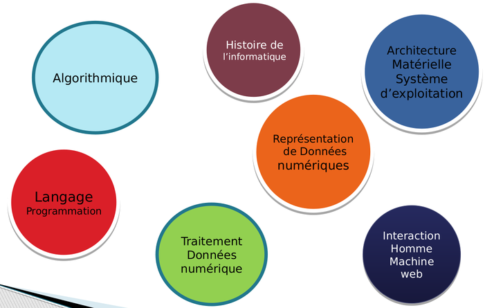
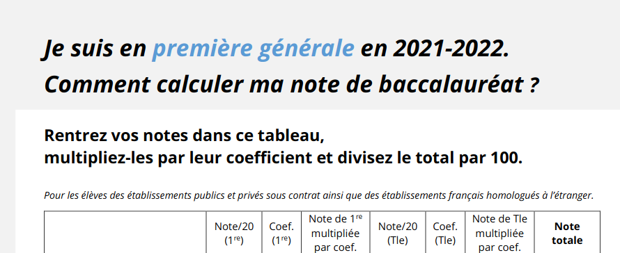
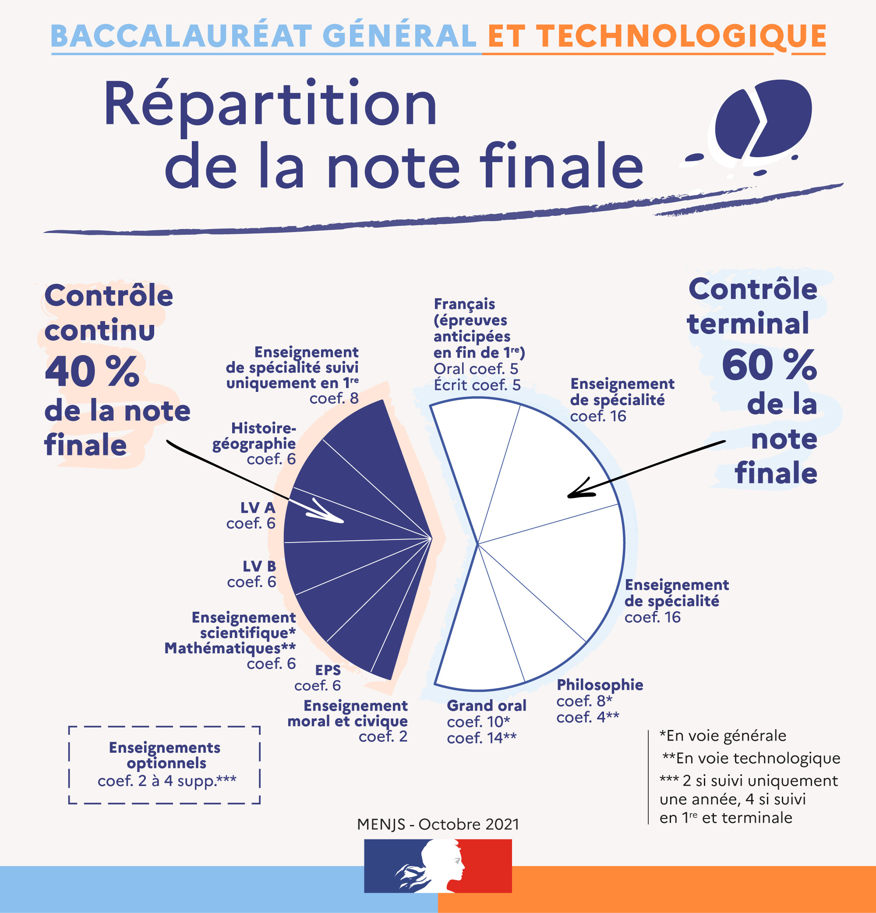

Cours Première NSI - M.Meyroneinc
===

Ce site est à destination des élèves de première NSI du Lycée Murat d'Issoire. 
Il permettra de **retrouver les cours, TP et TD traités en classes**. 
Ces **TD sont corrigés** dans la mesure du possible (soit directement sur le site soit dans Capytale).

{{ affiche_projet("premiere") }}

??? video  "Vidéo de présentation :" 

    

<iframe frameborder="0" width="1200" height="675" style="position: absolute; top: 0; left: 0; width: 100%; height: 100%;" src="https://view.genial.ly/622b74508c4c780013c4e08f" type="text/html" allowscriptaccess="always" allowfullscreen="true" scrolling="yes" allownetworking="all"></iframe> 
 

## Les thèmes du programme

{:.center}

## Programme
!!! abstract "Programme"
    Nous traiterons les différentes entrées du programme dans les chapitres suivants :
    
    === "T1 Rep. des données"
        **Thème  :  Types et valeurs de base**  

        - 🗹 Codage des entiers
        - 🗹 Codage des non-entiers
        - 🗹 Bases
        - □ Codage des caractères
        - □ Booléens

    === "T2 Types construits"

        **Thème 2 :  Types construits**  

        - 🗹 Listes - Tableaux 
        - 🗹 Tuples    
        - 🗹 Tuples    
        - □ Dictionnaires  

    === "T3 Tables"
        **Thème 3 : Traitements de données en tables**

        - 🗹 Recherche dans une table
        - □ Tri d'une table
        - □ Fusion de tables
    
    === "T4 IHM"
        **Thème 3 : Interactions entre l'homme et la machine sur le web**

        - 🗹 Modalités de l'interaction entre l'homme et la machine
        - 🗹 Interaction 

    === "T5 Arch. matérielle"
        **Thème 5 : Architecture matérielle**

        - □ Architecture Von Neumann
        - □ Architecture réseau
        - □ Protocoles de communication dans un réseau
        - □ Découverte des commandes Linux

    === "T6 Python"
        **Thème 6 : Langages et programmation - Python**

        - 🗹 Variables
        - 🗹 Boucle For
        - 🗹 Boucle While
        - 🗹 Instruction conditionnelle If
        - 🗹 Fonctions

    === "T7 Algo."
        **Thème 7 : Algorithmique**

        - 🗹 Extremums et moyennes
        - □ Tri par insertion - Tri par sélection
        - □ Dichotomie
        - □ Algorithmes gloutons
        - □ Algorithme KNN

## Comment calculer sa note au BAC 2023 et Répartition des notes :

[Fiche pour calculer sa note au BAC 2023](Divers/data/el-ve-de-premiere-comment-calculer-note-bac-2022-94490.pdf){:target="_blank"} 

{:.center width=75%}